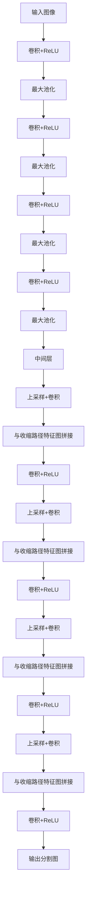

# UNet的伦理思考：技术发展，责任先行

## 1. 背景介绍

### 1.1 人工智能的兴起

人工智能(Artificial Intelligence, AI)技术在过去几十年里取得了长足的进步,逐渐渗透到我们生活的方方面面。从语音助手到自动驾驶,从医疗诊断到金融风险评估,AI系统正在改变着我们与世界互动的方式。在这一进程中,深度学习(Deep Learning)作为AI的核心技术之一,发挥着至关重要的作用。

### 1.2 UNet的重要性

UNet是一种经典的全卷积神经网络架构,最初被设计用于生物医学图像分割任务。自2015年被提出以来,UNet及其变体模型已被广泛应用于多个领域,如遥感图像分析、自动驾驶、机器人视觉等。它的卓越性能和通用性使其成为图像分割领域的事实标准模型之一。

### 1.3 伦理挑战

然而,就像任何其他强大的技术一样,UNet及基于它的AI系统也面临着一些重大的伦理挑战。随着这些系统在越来越多的高风险领域得到应用,我们必须审慎考虑它们可能带来的影响,并采取适当的措施来确保它们的安全、公平和问责制。

## 2. 核心概念与联系

### 2.1 UNet架构

为了更好地理解UNet模型的伦理影响,我们有必要先简要介绍一下它的核心架构。UNet由一个收缩路径(contracting path)和一个扩张路径(expansive path)组成,如下图所示:

收缩路径由一系列卷积和最大池化操作组成,用于提取输入图像的特征。扩张路径则通过上采样和特征图拼接,将低分辨率特征图逐步恢复到原始分辨率,最终输出与输入图像等大小的分割图。

### 2.2 UNet在各领域的应用

UNet模型最初被设计用于生物医学图像分割,但由于其优秀的性能和灵活性,很快就被推广应用到其他领域。以下是一些典型的应用场景:

- **医疗影像分析**: 用于自动分割CT、MRI等医学影像中的器官、肿瘤等目标结构,辅助医生诊断和治疗规划。
- **遥感图像处理**: 用于从卫星或无人机获取的遥感图像中提取建筑物、道路、植被等目标,用于城市规划、环境监测等。
- **自动驾驶**: 用于从车载相机获取的图像中分割出行人、车辆、道路标志等目标,为自动驾驶决策提供关键信息。
- **机器人视觉**: 用于从机器人相机获取的图像中分割出物体、障碍物等,为机器人导航和操作提供视觉信息。

由此可见,UNet模型及其变体已经广泛渗透到我们生活和工作的各个领域,对我们的生活产生了深远的影响。

### 2.3 伦理影响

虽然UNet等AI技术为我们带来了诸多便利,但它们同时也引发了一些值得关注的伦理问题,例如:

- **数据隐私**: 训练UNet模型需要大量的图像数据,这些数据可能包含个人隐私信息(如医疗影像)。如何妥善处理这些数据,保护个人隐私?
- **公平性**: UNet模型的性能很大程度上取决于训练数据的质量和多样性。如果训练数据存在偏差,模型的预测结果可能会对某些群体产生不公平的影响。
- **可解释性**: 深度神经网络模型通常被视为"黑箱",很难解释它们的内部决策过程。对于一些高风险应用场景(如医疗诊断),模型的可解释性至关重要。
- **安全性**: UNet模型可能会受到对抗性攻击,导致错误的预测结果。这在一些安全敏感的领域(如自动驾驶)可能会造成严重后果。

这些问题凸显了我们在推进技术发展的同时,必须谨慎考虑其伦理影响,并采取适当的措施来应对潜在的风险。

## 3. 核心算法原理具体操作步骤

### 3.1 UNet的前向传播过程

为了更好地理解UNet的工作原理,让我们逐步分析一下它的前向传播过程。假设输入是一个宽高分别为$W$和$H$的RGB图像,输入通道数为3。

1. **收缩路径(Contracting Path)**

    - 第一层: 对输入图像进行两次$3\times3$卷积,每次卷积后应用ReLU激活函数,输出通道数为64。
    - 第二层: 对上一层的输出进行$2\times2$最大池化,输出尺寸缩小一半,即$W/2 \times H/2$。然后进行两次$3\times3$卷积,输出通道数为128。
    - 第三层: 重复上一层的操作,输出尺寸为$W/4 \times H/4$,通道数为256。
    - 第四层: 重复上一层的操作,输出尺寸为$W/8 \times H/8$,通道数为512。

2. **中间层(Bottleneck)**

    在收缩路径的最后,执行两次$3\times3$卷积,通道数为1024,输出尺寸保持为$W/8 \times H/8$。这就是所谓的"瓶颈"层。

3. **扩张路径(Expansive Path)**

    - 第一层: 对瓶颈层的输出进行$2\times2$上采样(例如使用转置卷积),输出尺寸变为$W/4 \times H/4$。然后将上采样输出与收缩路径对应层的输出(尺寸也是$W/4 \times H/4$,通道数为256)在通道维度上拼接。最后进行两次$3\times3$卷积,输出通道数为256。
    - 第二层: 重复上一层的操作,输出尺寸变为$W/2 \times H/2$,通道数为128,并与收缩路径对应层的输出拼接。
    - 第三层: 重复上一层的操作,输出尺寸变为$W \times H$,通道数为64,并与收缩路径对应层的输出拼接。
    - 第四层: 执行两次$3\times3$卷积,输出通道数为2(对应二值分割任务)。

最终输出是与输入图像等大小的二维特征图,每个像素值对应该像素点属于目标对象的概率。通过设置合适的阈值,我们可以得到最终的二值分割图。

### 3.2 损失函数和优化

在训练UNet模型时,我们需要定义一个合适的损失函数来衡量模型预测与Ground Truth之间的差异。对于二值分割任务,常用的损失函数包括:

- 交叉熵损失(Cross Entropy Loss): $\mathcal{L}_{CE} = -\sum_{i=1}^{N}y_i\log\hat{y}_i + (1-y_i)\log(1-\hat{y}_i)$
- Dice损失(Dice Loss): $\mathcal{L}_{Dice} = 1 - \frac{2\sum_{i=1}^{N}y_i\hat{y}_i}{\sum_{i=1}^{N}y_i + \sum_{i=1}^{N}\hat{y}_i}$
- Focal Loss: $\mathcal{L}_{Focal} = -\sum_{i=1}^{N}(1-\hat{y}_i)^{\gamma}\log\hat{y}_i$

其中$y_i$是Ground Truth中第$i$个像素的标签(0或1),$\hat{y}_i$是模型预测的该像素属于目标的概率,$\gamma$是一个调节参数,用于降低易分类样本的权重。

在训练过程中,我们使用随机梯度下降(SGD)或其变体(如Adam)等优化算法,通过反向传播来更新模型参数,使损失函数最小化。

### 3.3 数据增强

由于医学影像等数据的获取往往成本较高,我们通常无法获得足够多的训练数据。为了增加训练数据的多样性,提高模型的泛化能力,我们可以采用一些数据增强(Data Augmentation)技术,例如:

- 翻转(Flipping): 将图像沿水平或垂直方向翻转。
- 旋转(Rotation): 将图像按某个角度旋转。
- 缩放(Scaling): 放大或缩小图像。
- 平移(Translation): 沿水平或垂直方向平移图像。
- 噪声(Noise): 在图像上添加高斯噪声或椒盐噪声。
- 变形(Deformation): 对图像进行非刚性变形。

通过对原始训练数据进行上述变换,我们可以生成更多的"虚拟"训练样本,从而增强模型对各种变化的鲁棒性。

## 4. 数学模型和公式详细讲解举例说明

### 4.1 卷积运算

卷积运算是构建UNet等卷积神经网络的基础。给定一个二维输入特征图$X$和一个二维卷积核$K$,卷积运算可以表示为:

$$
Y[m,n] = \sum_{i=-\infty}^{\infty}\sum_{j=-\infty}^{\infty}X[m+i,n+j]K[i,j]
$$

其中$Y$是输出特征图。卷积核$K$在整个输入特征图$X$上滑动,在每个位置计算加权和,得到输出特征图上对应位置的值。

在实践中,我们通常使用有限大小的卷积核(如$3\times3$或$5\times5$),并在特征图边界处添加零填充,以确保输入输出特征图的空间维度一致。

### 4.2 池化运算

池化运算用于降低特征图的分辨率,从而减少计算量和参数数量,并提高模型的泛化能力。最常用的池化方式是最大池化(Max Pooling),其运算过程可以表示为:

$$
Y[m,n] = \max_{(i,j) \in R}X[m+i,n+j]
$$

其中$R$是一个矩形区域,通常大小为$2\times2$。也就是说,输出特征图上的每个值是输入特征图上对应$2\times2$区域内的最大值。

除了最大池化,我们还可以使用平均池化(Average Pooling)或其他变体,不过最大池化通常能获得更好的性能。

### 4.3 上采样运算

在UNet的扩张路径中,我们需要将低分辨率的特征图恢复到原始分辨率。一种常用的上采样方式是转置卷积(Transposed Convolution),也称为分数步长卷积(Fractionally-strided Convolution)。

转置卷积的运算过程可以表示为:

$$
Y[m,n] = \sum_{i=-\infty}^{\infty}\sum_{j=-\infty}^{\infty}X\left[\left\lfloor\frac{m-i}{s}\right\rfloor,\left\lfloor\frac{n-j}{s}\right\rfloor\right]K[i,j]
$$

其中$s$是步长(stride),通常取2。可以看出,转置卷积是在原始输入特征图上插入$(s-1)$个零,然后进行卷积运算,