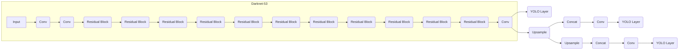

## 1. 背景介绍

### 1.1 目标检测的意义

目标检测是计算机视觉领域中一项重要的任务，其目的是识别图像或视频中存在的物体，并确定它们的位置和类别。这项技术在许多领域都有着广泛的应用，例如：

* **自动驾驶**:  识别道路上的车辆、行人、交通信号灯等，为车辆提供安全驾驶的保障。
* **安防监控**:  识别监控视频中的人员、车辆、可疑物品等，及时发现安全隐患。
* **医疗影像分析**:  识别医学影像中的病灶、器官等，辅助医生进行诊断和治疗。
* **机器人视觉**:  识别机器人周围的环境和物体，帮助机器人完成导航、抓取等任务。

### 1.2 目标检测算法的发展历程

目标检测算法的发展经历了漫长的过程，从早期的基于特征的传统方法，到基于深度学习的现代方法，算法的精度和效率都得到了显著提升。一些经典的目标检测算法包括：

* **Viola-Jones**: 基于Haar特征和Adaboost算法的人脸检测器，以其高效性和鲁棒性著称。
* **HOG+SVM**: 使用方向梯度直方图(HOG)特征和支持向量机(SVM)进行目标分类和定位。
* **DPM**: 可变形部件模型(DPM)，通过将物体分解成多个部件进行建模，能够识别复杂姿态的物体。

近年来，深度学习技术的快速发展为目标检测带来了革命性的变化，基于深度学习的目标检测算法在精度和速度上都取得了突破性进展。一些代表性的算法包括：

* **R-CNN系列**:  通过区域建议网络(RPN)生成候选区域，然后使用卷积神经网络(CNN)进行分类和回归，显著提高了目标检测的精度。
* **YOLO系列**:  将目标检测视为一个回归问题，直接预测物体的位置和类别，以其快速和高效著称。
* **SSD**:  单次多框检测器(SSD)，通过在不同尺度的特征图上进行预测，能够检测不同大小的物体。

### 1.3 YOLOv3的优势

YOLOv3是YOLO系列的第三个版本，相比于之前的版本，YOLOv3在以下方面进行了改进：

* **更深的网络结构**:  YOLOv3使用了Darknet-53作为特征提取网络，网络层数更深，特征提取能力更强。
* **多尺度预测**:  YOLOv3在三个不同尺度的特征图上进行预测，能够更好地检测不同大小的物体。
* **更好的分类器**:  YOLOv3使用了逻辑回归代替softmax进行分类，提高了小物体的检测精度。

## 2. 核心概念与联系

### 2.1 边界框(Bounding Box)

边界框是目标检测中用于表示物体位置的矩形框，通常由四个参数表示：

*  $x$:  边界框中心点的横坐标
*  $y$:  边界框中心点的纵坐标
*  $w$:  边界框的宽度
*  $h$:  边界框的高度

### 2.2  锚框(Anchor Box)

锚框是预定义的边界框，用于辅助模型预测物体的位置。YOLOv3使用了9种不同尺度的锚框，分别在三个不同尺度的特征图上进行预测。

### 2.3  置信度(Confidence Score)

置信度表示模型对预测结果的信心程度，取值范围为0到1。置信度越高，表示模型对预测结果越有信心。

### 2.4  类别概率(Class Probability)

类别概率表示模型预测物体属于各个类别的概率。

### 2.5  非极大值抑制(Non-Maximum Suppression)

非极大值抑制是一种用于去除重复边界框的后处理方法。其原理是保留置信度最高的边界框，并抑制与其重叠度较高的其他边界框。

## 3. 核心算法原理具体操作步骤

### 3.1  网络结构

YOLOv3的网络结构如下图所示：



*  **Darknet-53**:  YOLOv3的特征提取网络，使用了53个卷积层，网络结构类似于ResNet，具有较强的特征提取能力。
*  **YOLO Layer**:  用于预测物体的位置、置信度和类别概率。YOLOv3在三个不同尺度的特征图上分别使用了一个YOLO Layer进行预测。
*  **Upsample**:  用于将特征图的尺寸放大，以便与其他尺度的特征图进行融合。
*  **Concat**:  用于将不同尺度的特征图进行拼接，以便进行多尺度预测。

### 3.2  预测过程

YOLOv3的预测过程如下：

1. 将输入图像送入Darknet-53网络进行特征提取。
2. 在三个不同尺度的特征图上分别使用一个YOLO Layer进行预测，每个YOLO Layer预测三个边界框。
3. 对预测结果进行解码，得到边界框的位置、置信度和类别概率。
4. 使用非极大值抑制去除重复的边界框。

### 3.3  损失函数

YOLOv3的损失函数由三个部分组成：

* **边界框回归损失**:  用于衡量预测边界框与真实边界框之间的差距。
* **置信度损失**:  用于衡量预测置信度与真实置信度之间的差距。
* **分类损失**:  用于衡量预测类别概率与真实类别概率之间的差距。

## 4. 数学模型和公式详细讲解举例说明

### 4.1  边界框回归

YOLOv3使用如下公式进行边界框回归：

$$
\begin{aligned}
b_x &= \sigma(t_x) + c_x \\
b_y &= \sigma(t_y) + c_y \\
b_w &= p_w e^{t_w} \\
b_h &= p_h e^{t_h}
\end{aligned}
$$

其中：

*  $b_x$, $b_y$, $b_w$, $b_h$ 分别表示预测边界框的中心点坐标、宽度和高度。
*  $t_x$, $t_y$, $t_w$, $t_h$ 分别表示模型预测的边界框偏移量。
*  $c_x$, $c_y$ 分别表示对应网格单元左上角的坐标。
*  $p_w$, $p_h$ 分别表示对应锚框的宽度和高度。
*  $\sigma$ 表示 sigmoid 函数。

### 4.2  置信度计算

YOLOv3使用如下公式计算置信度：

$$
Confidence = Pr(Object) * IOU
$$

其中：

*  $Pr(Object)$ 表示网格单元中是否存在物体的概率。
*  $IOU$ 表示预测边界框与真实边界框之间的交并比。

### 4.3  类别概率计算

YOLOv3使用逻辑回归计算类别概率：

$$
Pr(Class_i | Object) = \frac{e^{s_i}}{\sum_{j=1}^{C} e^{s_j}}
$$

其中：

*  $s_i$ 表示模型预测的类别 $i$ 的得分。
*  $C$ 表示类别数量。

## 5. 项目实践：代码实例和详细解释说明

### 5.1  环境配置

* Python 3.6+
* TensorFlow 2.0+
* OpenCV 4.0+

### 5.2  代码实例

```python
import tensorflow as tf
import cv2

# 加载 YOLOv3 模型
model = tf.keras.models.load_model('yolov3.h5')

# 加载图像
image = cv2.imread('image.jpg')

# 预处理图像
image = cv2.resize(image, (416, 416))
image = image / 255.0

# 进行预测
predictions = model.predict(tf.expand_dims(image, axis=0))

# 解码预测结果
boxes, scores, classes = decode_predictions(predictions)

# 绘制边界框
for box, score, class_id in zip(boxes, scores, classes):
    x1, y1, x2, y2 = box
    cv2.rectangle(image, (x1, y1), (x2, y2), (0, 255, 0), 2)
    cv2.putText(image, f'{class_id}: {score:.2f}', (x1, y1 - 10), cv2.FONT_HERSHEY_SIMPLEX, 0.5, (0, 255, 0), 2)

# 显示结果
cv2.imshow('YOLOv3 Detection', image)
cv2.waitKey(0)
```

### 5.3  代码解释

*  `tf.keras.models.load_model` 用于加载 YOLOv3 模型。
*  `cv2.imread` 用于加载图像。
*  `cv2.resize` 用于将图像 resize 到模型输入大小。
*  `model.predict` 用于进行预测。
*  `decode_predictions` 用于解码预测结果，得到边界框、置信度和类别。
*  `cv2.rectangle` 用于绘制边界框。
*  `cv2.putText` 用于绘制类别和置信度信息。

## 6. 实际应用场景

### 6.1  自动驾驶

YOLOv3可以用于自动驾驶系统中，识别道路上的车辆、行人、交通信号灯等，为车辆提供安全驾驶的保障。

### 6.2  安防监控

YOLOv3可以用于安防监控系统中，识别监控视频中的人员、车辆、可疑物品等，及时发现安全隐患。

### 6.3  医疗影像分析

YOLOv3可以用于医疗影像分析中，识别医学影像中的病灶、器官等，辅助医生进行诊断和治疗。

### 6.4  机器人视觉

YOLOv3可以用于机器人视觉中，识别机器人周围的环境和物体，帮助机器人完成导航、抓取等任务。


## 7. 总结：未来发展趋势与挑战

### 7.1  未来发展趋势

* **轻量化模型**:  随着移动设备和嵌入式设备的普及，轻量化模型的需求越来越大。未来的目标检测算法将会更加注重模型的效率和速度，以便在资源受限的设备上运行。
* **小目标检测**:  小目标检测一直是目标检测领域的难点。未来的目标检测算法将会更加注重小目标的检测精度，例如通过多尺度特征融合、注意力机制等方法提高小目标的检测能力。
* **视频目标检测**:  视频目标检测需要考虑目标在时间维度上的运动信息。未来的目标检测算法将会更加注重视频目标检测的精度和效率，例如通过目标跟踪、时序建模等方法提高视频目标检测的性能。

### 7.2  挑战

* **数据标注**:  目标检测算法的训练需要大量的标注数据，而数据标注是一项费时费力的工作。未来的目标检测算法需要探索更加高效的数据标注方法，例如弱监督学习、半监督学习等。
* **模型泛化能力**:  目标检测算法需要在不同的场景和环境下都具有良好的泛化能力。未来的目标检测算法需要探索更加鲁棒的模型训练方法，例如数据增强、对抗训练等。
* **实时性**:  许多应用场景对目标检测算法的实时性要求很高。未来的目标检测算法需要探索更加高效的模型推理方法，例如模型压缩、硬件加速等。

## 8. 附录：常见问题与解答

### 8.1  YOLOv3与其他目标检测算法的比较

* **YOLOv3 vs. Faster R-CNN**:  YOLOv3的速度比Faster R-CNN快，但精度略低。
* **YOLOv3 vs. SSD**:  YOLOv3的精度比SSD高，但速度略慢。

### 8.2  如何提高YOLOv3的检测精度

* **增加训练数据**:  使用更多的数据训练模型可以提高模型的泛化能力和精度。
* **调整模型参数**:  调整模型的超参数，例如学习率、批大小等，可以优化模型的性能。
* **使用预训练模型**:  使用在大型数据集上预训练的模型可以加速模型的收敛速度和提高精度。

### 8.3  YOLOv3的应用局限性

* **对小目标检测效果不佳**:  YOLOv3对小目标的检测效果不如大目标。
* **对遮挡目标检测效果不佳**:  YOLOv3对遮挡目标的检测效果不如未遮挡目标。
* **对旋转目标检测效果不佳**:  YOLOv3对旋转目标的检测效果不如水平目标。
