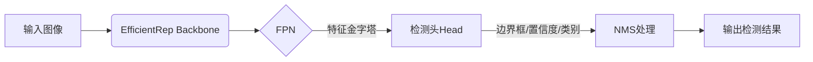
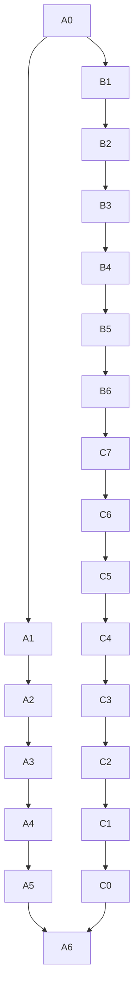

# YOLOv7原理与代码实例讲解

## 1. 背景介绍

### 1.1 目标检测任务概述

目标检测是计算机视觉领域的一个核心任务,旨在从给定的图像或视频中找出感兴趣的目标实例,并给出目标的精确位置和类别信息。它广泛应用于安防监控、自动驾驶、人脸识别、行为分析等多个领域。

### 1.2 目标检测发展历程

早期的目标检测算法主要基于传统的机器学习方法,如Viola-Jones、HOG+SVM等,需要人工设计特征。近年来,随着深度学习的兴起,基于深度卷积神经网络(CNN)的目标检测算法取得了长足的进展,可以自动学习特征表示,性能大幅提升。

### 1.3 YOLO系列算法简介

YOLO(You Only Look Once)是一种基于深度学习的目标检测系统,最早由Joseph Redmon等人于2016年提出。它的核心思想是将目标检测任务看作一个回归问题,直接从全图回归出目标边界框和类别概率,无需传统方法中的先生成候选框、再识别的复杂流程,从而极大提高了检测速度。YOLO系列经过多年发展,已经推出了YOLOv7等多个版本,在检测精度和速度上都有较大提升。

## 2. 核心概念与联系

### 2.1 基本概念

- 边界框(Bounding Box)
  - 目标检测任务的最终输出,用一个矩形框来描述目标在图像中的位置和大小。
- 先验框(Prior Box)
  - 一组预先定义好的,具有不同形状和大小的锚框,用于初始化预测。
- 置信度(Confidence)
  - 对于某个预测的边界框,模型预测它包含目标的置信程度。
- 交并比(IoU)
  - 预测框与真实框的交集和并集的比值,用于衡量预测的精确度。

### 2.2 损失函数

YOLO的损失函数由三部分组成:

1) 边界框回归损失 $L_{bbox}$
2) 置信度损失 $L_{conf}$  
3) 分类损失 $L_{cls}$

总损失函数为:

$$L = L_{bbox} + L_{conf} + L_{cls}$$

### 2.3 非极大值抑制(NMS)

对于同一个目标可能存在多个重叠的预测框,NMS用于去除这些冗余的预测框,只保留分数最高的那个作为最终输出。

## 3. 核心算法原理具体操作步骤 

### 3.1 网络架构

YOLOv7的主干网络采用的是EfficientRep Backbone,整体框架如下所示:



### 3.2 特征金字塔(FPN)

FPN可以利用不同尺度的特征进行目标检测,提高了小目标和大目标的检测精度。

### 3.3 锚框与预测

YOLOv7在每个尺度的特征图上均匀分布一组先验锚框(Anchor Boxes),对每个锚框预测:
1) 边界框坐标偏移量
2) 目标置信度
3) 类别概率

### 3.4 模型训练

1) 先初始化网络权重
2) 选取一个batch的图像和真实标注
3) 前向传播计算损失
4) 反向传播更新权重
5) 重复2-4直到收敛

### 3.5 模型推理

1) 读取一张图像
2) 前向传播计算预测
3) 进行NMS处理
4) 输出检测结果

## 4. 数学模型和公式详细讲解举例说明

### 4.1 边界框回归公式

YOLOv7采用的是基于IoU的边界框回归损失函数,公式如下:

$$L_{bbox} = 1 - IoU$$

其中IoU为预测框和真实框的交并比:

$$IoU = \frac{area(b_p \cap b_t)}{area(b_p \cup b_t)}$$

$b_p$和$b_t$分别表示预测框和真实框。

### 4.2 置信度损失函数

置信度损失函数用于评估预测框包含目标的置信程度是否准确,公式为:

$$L_{conf} = \sum_{i=0}^{B} \sum_{j=0}^{B} \mathbb{1}_{ij}^{obj} \cdot (C_i - \hat{C}_i)^2 + \lambda_{noobj} \sum_{i=0}^{B} \sum_{j=0}^{B} \mathbb{1}_{ij}^{noobj} \cdot (C_i - \hat{C}_i)^2$$

其中:
- $B$为一个图像划分的网格数
- $\mathbb{1}_{ij}^{obj}$为当前网格是否有目标的指示器
- $C_i$为预测的置信度
- $\hat{C}_i$为真实置信度(0或1)
- $\lambda_{noobj}$为不含目标网格的损失权重

### 4.3 分类损失函数

分类损失函数用于评估对目标类别的预测是否准确,公式为:

$$L_{cls} = \sum_{i=0}^{B} \mathbb{1}_{ij}^{obj} \sum_{c \in classes} (p_i(c) - \hat{p}_i(c))^2$$

其中:
- $p_i(c)$为预测的第c类概率
- $\hat{p}_i(c)$为真实的one-hot编码

### 4.4 实例解释

假设有一个包含行人和车辆的图像,YOLOv7将图像划分为$7\times 7$的网格:



如果第(2,3)个网格中存在一个行人目标,那么预测输出为:
- 边界框坐标偏移量(tx, ty, tw, th)
- 目标置信度 $C_i$
- 行人类别概率 $p_i(person)$

这些预测值将通过与真实标注的比较,计算相应的损失函数,并通过反向传播来优化网络权重。

## 4. 项目实践:代码实例和详细解释说明

以下是基于PyTorch实现的YOLOv7目标检测代码示例,并对关键部分进行了详细注释说明。

### 4.1 模型定义

```python
import torch
import torch.nn as nn

# 定义卷积模块
def conv_bn(in_channels, out_channels, kernel_size, stride, padding, groups=1):
    return nn.Sequential(
        nn.Conv2d(in_channels, out_channels, kernel_size, stride, padding, groups=groups, bias=False),
        nn.BatchNorm2d(out_channels),
        nn.SiLU()
    )

# 定义ResUnit
class ResUnit(nn.Module):
    def __init__(self, in_channels, out_channels, stride):
        # ...

    def forward(self, x):
        # ...
        return x

# 定义EfficientRep Backbone
class EfficientRep(nn.Module):
    def __init__(self, num_classes):
        # ...

    def forward(self, x):
        # ...
        return outputs

# 定义YOLOv7模型
class YOLOv7(nn.Module):
    def __init__(self, num_classes):
        super().__init__()
        self.backbone = EfficientRep(num_classes)
        self.fpn = FPN(...)
        self.head = YOLOXHead(...)

    def forward(self, x):
        fpn_feats = self.backbone(x) 
        outputs = self.head(self.fpn(fpn_feats))
        return outputs
```

上面的代码定义了YOLOv7模型的主要组件,包括:

- `conv_bn`函数定义了卷积+BN+激活函数组合层
- `ResUnit`定义了Res块结构
- `EfficientRep`定义了主干网络
- `YOLOv7`是最终的模型类,集成了主干网络、FPN和检测头

### 4.2 数据预处理

```python
import albumentations as A
from albumentations.pytorch import ToTensorV2

# 定义数据转换
data_transform = A.Compose([
    A.Resize(height=640, width=640),
    A.Normalize(),
    ToTensorV2(),
], bbox_params=A.BboxParams(format='yolo', label_fields=['class_labels']))

# 定义数据集
dataset = YOLODataset(
    images_dir='images/',
    labels_dir='labels/',
    transform=data_transform
)
```

上面代码使用了Albumentations库进行数据增强和预处理,包括调整图像大小、归一化等操作。`YOLODataset`是自定义的数据集类,用于读取图像和标注文件。

### 4.3 模型训练

```python
import torch.optim as optim

# 定义损失函数
criterion = YOLOLoss(...)

# 定义优化器
optimizer = optim.SGD(model.parameters(), lr=0.001, momentum=0.9)

# 模型训练循环
for epoch in range(num_epochs):
    for images, targets in dataloader:
        optimizer.zero_grad()
        outputs = model(images)
        loss = criterion(outputs, targets)
        loss.backward()
        optimizer.step()
```

上面代码定义了YOLOv7的损失函数`YOLOLoss`和优化器。在训练循环中,对每个batch的图像和标注进行前向传播计算损失,然后反向传播更新网络权重。

### 4.4 模型推理

```python
import cv2

# 加载模型权重
model.load_state_dict(torch.load('yolov7.pth'))
model.eval()

# 读取图像
image = cv2.imread('test.jpg')

# 预处理
image = data_transform(image=image)['image'].unsqueeze(0)

# 模型推理
with torch.no_grad():
    outputs = model(image)

# 后处理和NMS
boxes, scores, labels = postprocess(outputs)

# 在图像上绘制检测结果
for box, score, label in zip(boxes, scores, labels):
    x1, y1, x2, y2 = [int(x) for x in box]
    cv2.rectangle(image, (x1, y1), (x2, y2), (0, 255, 0), 2)
    cv2.putText(image, f'{label}: {score:.2f}', (x1, y1 - 10), cv2.FONT_HERSHEY_SIMPLEX, 0.5, (36,255,12), 2)

# 显示结果
cv2.imshow('YOLOv7 Detection', image)
cv2.waitKey(0)
cv2.destroyAllWindows()
```

上面代码展示了如何使用训练好的YOLOv7模型进行目标检测推理。首先加载模型权重,然后读取测试图像并进行预处理。接着,使用`model.eval()`将模型切换到评估模式,前向传播计算输出。最后,使用自定义的`postprocess`函数对结果进行解码和NMS处理,并在原始图像上绘制检测结果。

## 5. 实际应用场景

YOLOv7作为一种高效的实时目标检测系统,可广泛应用于以下场景:

1. **安防监控**
   - 对视频流中的人员、车辆、包裹等目标进行实时检测和跟踪。

2. **智能交通**
   - 车辆检测与计数、违章检测、交通流量监控等。

3. **机器人视觉**
   - 机器人抓取、智能装配等需要精确检测物体位置的场景。

4. **人脸识别**
   - 先使用YOLOv7定位人脸区域,再送入人脸识别模型进行身份识别。

5. **无人机/无人车**
   - 对路况、行人、障碍物进行实时检测,确保行驶安全。

6. **视频分析**
   - 对视频中的人物行为、运动类型等目标进行检测与识别。

7. **医疗影像分析**
   - 检测CT/MRI等医学影像中的病灶、肿瘤等异常区域。

8. **农业遥感**
   - 基于无人机/卫星遥感图像,检测农作物生长情况、病虫害等。

## 6. 工具和资源推荐

1. **YOLO系列代码库**
   - [https://github.com/ultralytics/yolov5](https://github.com/ultralytics/yolov5)
   