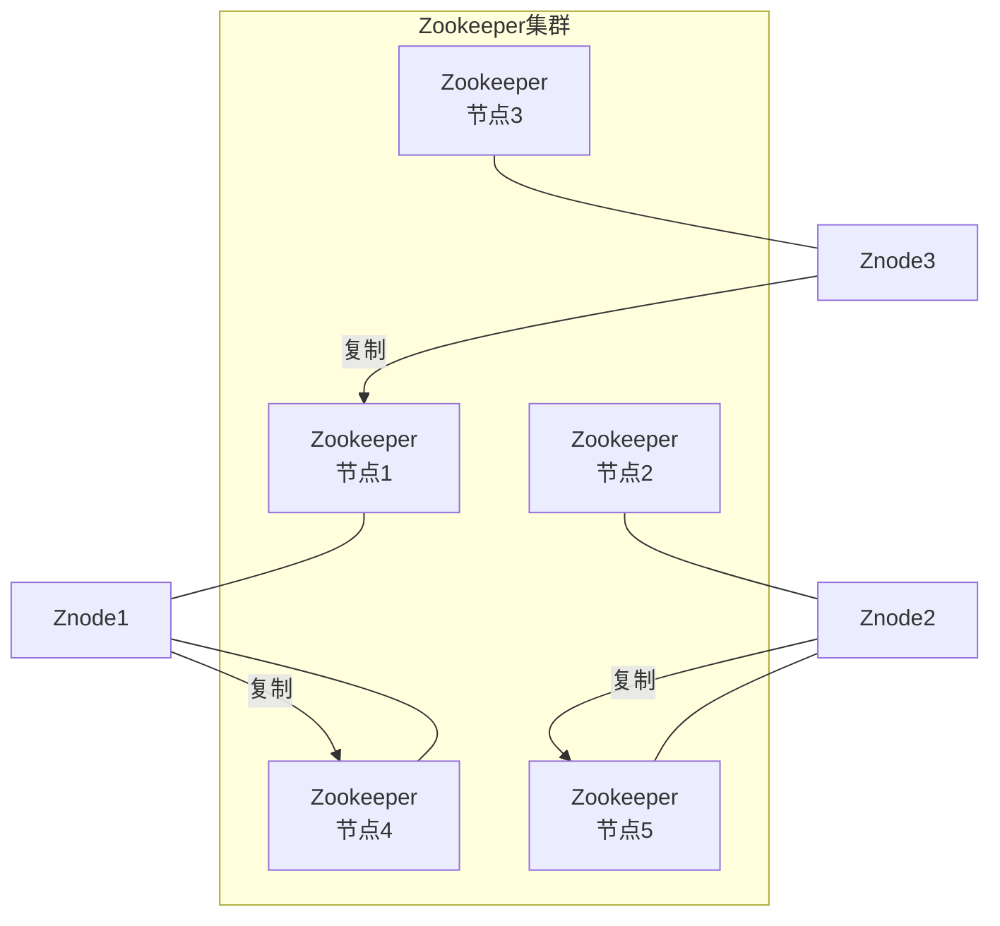
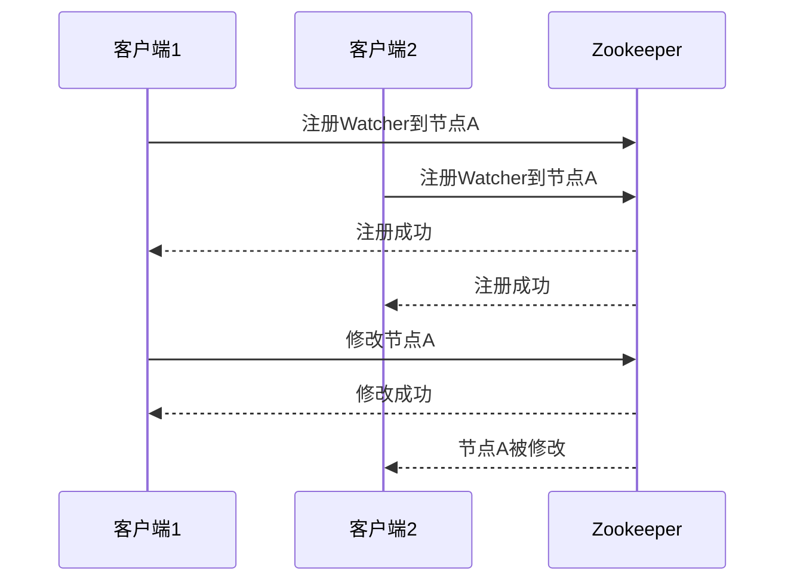
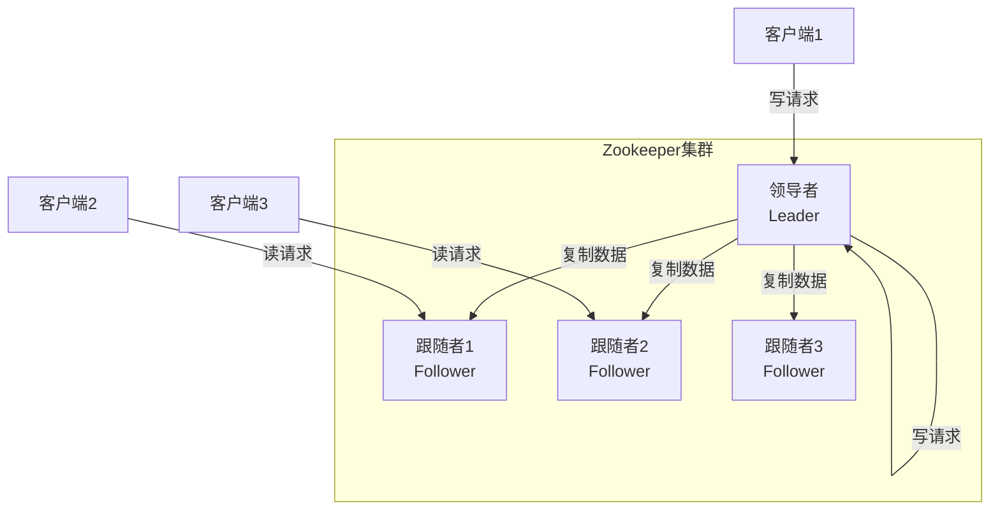
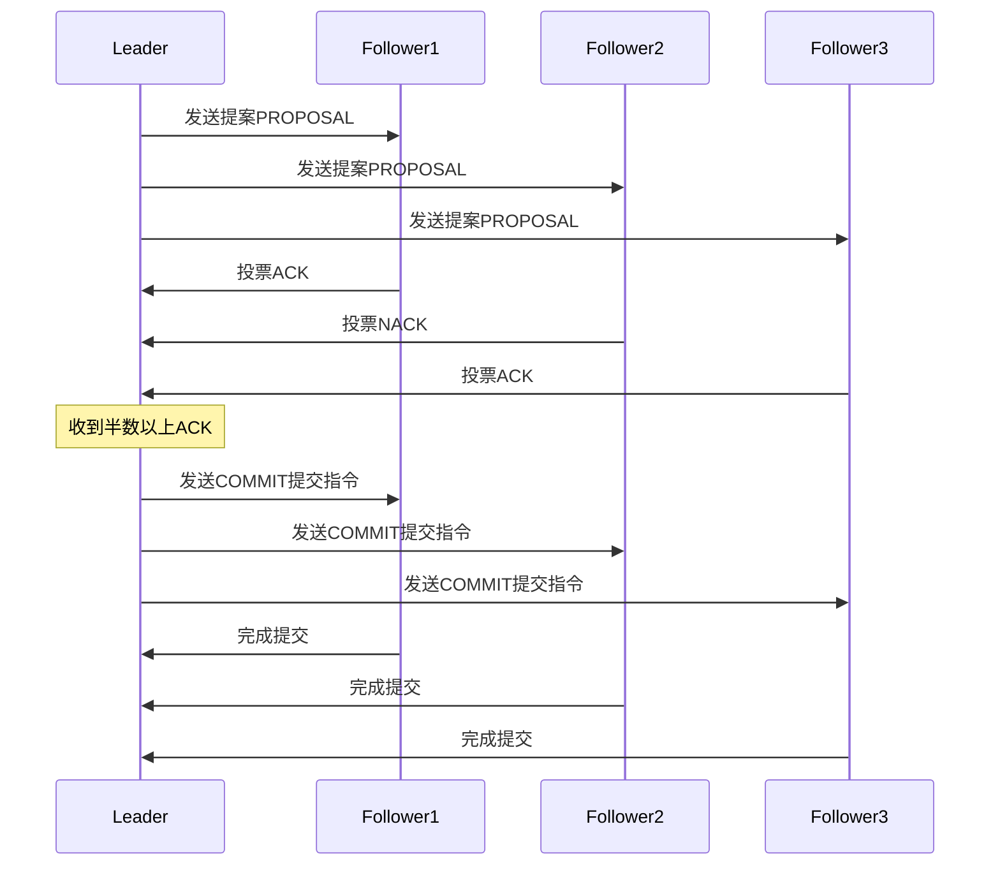

# Zookeeper分布式协调服务原理与代码实例讲解

## 1.背景介绍

### 1.1 什么是分布式系统?

在当今快速发展的数字时代,分布式系统已经无处不在。分布式系统是指多个独立的计算机通过网络协同工作,共同完成某个复杂的任务或者提供某种服务。与传统的单机系统相比,分布式系统具有高可靠性、高可扩展性、高性能等优点。

### 1.2 分布式系统面临的挑战

然而,构建一个健壮的分布式系统并非一蹴而就。由于涉及多个独立的计算机节点,分布式系统需要解决诸如数据一致性、节点故障、网络分区等一系列棘手的问题。此外,分布式环境下的并发操作、死锁检测等也是需要重点考虑的问题。

### 1.3 Zookeeper的作用

为了有效解决分布式系统中的协调问题,Apache开源社区推出了Zookeeper项目。Zookeeper是一个分布式协调服务,为分布式应用提供高性能的分布式服务。它主要用于解决分布式应用中数据管理、应用程序之间的协调、命名服务、配置管理和分布式锁等问题。

## 2.核心概念与联系

### 2.1 Zookeeper的设计理念

Zookeeper借鉴了Google的Chubby项目,其设计理念是将一组服务器组成一个集群,集群中的每台服务器都保存有内存状态视图和事务日志文件。只要集群中有大多数(超过一半)的服务器运行正常,整个Zookeeper集群就可以正常对外提供服务。



### 2.2 Znode和数据模型

Zookeeper采用了类似于文件系统的多层次命名空间的数据模型,来组织存储数据。在这个模型中,每个数据节点被称为Znode,就像文件系统中的文件和目录一样。Znode可以包含数据,也可以作为目录来容纳子节点。

Znode分为四种类型:

- 持久(PERSISTENT)节点: 一旦创建就一直存在,直到主动删除
- 临时(EPHEMERAL)节点: 生存期与客户端会话绑定,会话结束则节点自动删除
- 持久顺序(PERSISTENT_SEQUENTIAL)节点: 基于持久节点,节点名会自动追加顺序编号
- 临时顺序(EPHEMERAL_SEQUENTIAL)节点: 基于临时节点,节点名会自动追加顺序编号

### 2.3 Watcher事件监听机制

Zookeeper支持Watcher机制,客户端可以在指定节点注册Watcher监听,一旦该节点发生变化,会通知所有注册在该节点上的Watcher。这种机制可以让Zookeeper实现配置中心、分布式锁、领导选举等功能。



### 2.4 会话和ACL访问控制

Zookeeper为每个客户端分配一个会话ID,客户端与服务端通过心跳检测来保持会话的存活状态。会话过期后,与该会话相关的临时节点和Watcher都会被移除。

Zookeeper还支持ACL(Access Control Lists)访问控制机制,可以针对节点设置不同的权限:创建(CREATE)、删除(DELETE)、读取(READ)、写入(WRITE)和管理(ADMIN)。这样可以加强数据的安全性。

## 3.核心算法原理具体操作步骤

### 3.1 Zookeeper的架构

Zookeeper采用了主从模式的架构,由一个领导者(Leader)和多个跟随者(Follower)组成。所有的写请求都需要由领导者处理,然后将数据复制到跟随者。只要有大多数节点正常运行,整个集群就能正常对外提供服务。



### 3.2 Zookeeper的选主过程

当Zookeeper集群启动或者Leader宕机时,就需要进行新Leader的选举。Zookeeper采用了Zab协议(Zookeeper Atomic Broadcast)来实现选主和数据同步。

1. 每个Follower节点给自己投票,生成初始投票信息(INIT)
2. 收集所有节点的投票,计算出最大的事务ID(ZXID)
3. 更新投票信息为ZXID最大的节点(UPTODATE)
4. 统计UPTODATE投票信息,如果有过半机器投给同一个节点,该节点就是新的Leader
5. Leader向所有节点发出上任通知(NEWLEADER)

```mermaid
sequenceDiagram
    participant F1 as Follower1
    participant F2 as Follower2
    participant F3 as Follower3
    participant F4 as Follower4

    F1->>F1: 生成初始投票INIT
    F2->>F2: 生成初始投票INIT 
    F3->>F3: 生成初始投票INIT
    F4->>F4: 生成初始投票INIT

    F1->>F2: 发送投票
    F1->>F3: 发送投票
    F1->>F4: 发送投票

    F2->>F1: 发送投票
    F2->>F3: 发送投票 
    F2->>F4: 发送投票

    F3->>F1: 发送投票
    F3->>F2: 发送投票
    F3->>F4: 发送投票

    F4->>F1: 发送投票
    F4->>F2: 发送投票
    F4->>F3: 发送投票

    F1->>F1: 计算最大ZXID
    F2->>F2: 计算最大ZXID
    F3->>F3: 计算最大ZXID
    F4->>F4: 计算最大ZXID

    F1->>F2: 更新投票UPTODATE
    F1->>F3: 更新投票UPTODATE
    F1->>F4: 更新投票UPTODATE

    F2->>F1: 更新投票UPTODATE
    F2->>F3: 更新投票UPTODATE
    F2->>F4: 更新投票UPTODATE
    
    F3->>F1: 更新投票UPTODATE
    F3->>F2: 更新投票UPTODATE
    F3->>F4: 更新投票UPTODATE
    
    F4->>F1: 更新投票UPTODATE
    F4->>F2: 更新投票UPTODATE
    F4->>F3: 更新投票UPTODATE

    F1->>F1: 统计UPTODATE投票
    F2->>F2: 统计UPTODATE投票
    F3->>F3: 统计UPTODATE投票
    F4->>F4: 统计UPTODATE投票

    Note over F1,F2,F3,F4: 假设F1获得大多数投票
    F1->>F2: 发送NEWLEADER通知
    F1->>F3: 发送NEWLEADER通知 
    F1->>F4: 发送NEWLEADER通知
```

### 3.3 Zookeeper的数据同步

一旦选举出新的Leader,其余Follower需要与Leader进行数据同步。Zookeeper使用了两阶段提交协议,以保证数据的一致性。

1. Leader生成一个新的提案(PROPOSAL),并将提案发送给所有Follower
2. Follower收到提案后,会对提案进行投票(ACK/NACK)
3. Leader收到半数以上Follower的ACK投票,则提交该提案(COMMIT)
4. Leader通知所有Follower提交已经通过的提案
5. Follower收到通知后,完成提案的提交



## 4.数学模型和公式详细讲解举例说明

在Zookeeper中,使用了Zab原子广播协议来保证分布式系统中数据的一致性。Zab协议基于Paxos协议,并针对Zookeeper集群环境进行了优化。

### 4.1 Paxos算法

Paxos算法是一种解决分布式系统一致性问题的算法,由莱斯利·兰伯特在1998年提出。它主要分为两阶段:

1. 选举Proposer阶段
2. 接受Proposal阶段

Paxos算法的核心思想是通过多数节点的投票来达成一致。在选举Proposer阶段,所有节点进行投票选举出一个Proposer。然后在接受Proposal阶段,Proposer向所有节点发送提案,只有获得多数节点的批准,该提案才会被执行。

Paxos算法可以形式化描述如下:

已知集群中有 $N$ 个节点,其中 $W_m$ 表示多数节点集合,满足 $|W_m| > N/2$。

令 $V$ 表示一个值(提案),则Paxos算法需要满足以下两个条件:

1. 只有一个值 $V$ 被选中
2. 如果 $V$ 被选中,则 $V$ 属于初始值集合

用数学语言表示为:

$$
\begin{align*}
&\exists W_v \subseteq W_m: \forall w \in W_v: \text{chose}(w, v) \\
&\forall W_u \subseteq W_m: \text{chose}(W_u, u) \Rightarrow u \in \mathcal{V}_0
\end{align*}
$$

其中 $\mathcal{V}_0$ 表示初始值集合。

可以证明,如果满足上述两个条件,那么Paxos算法就可以保证在任何情况下都能达成一致。

### 4.2 Zab协议

Zab协议是在Paxos算法的基础上,针对Zookeeper集群环境做了优化和改进。

在Zab协议中,引入了两个重要概念:

- 事务ID(ZXID): 一个64位的数字,高32位是自增的epoch值,用于标识Leader的任期;低32位是个自增的计数器,用于标识事务先后顺序。
- 历史事务日志(HISTORY): 记录所有已经被集群达成一致的事务。

Zab协议的核心流程如下:

1. Leader选举
    - 所有Follower给自己投票,选举出一个ZXID最大的Leader
2. 原子广播
    - Leader为每个写请求分配一个新的ZXID
    - Leader将写请求以提案的形式发送给所有Follower
    - Leader等待超过半数Follower投票通