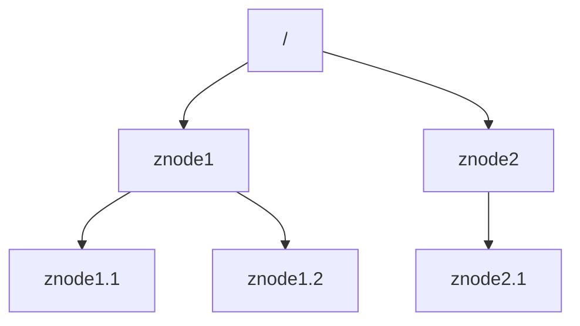

# Zookeeper原理与代码实例讲解

## 1.背景介绍

### 1.1 什么是Zookeeper?

Apache ZooKeeper是一个开源的分布式协调服务,为分布式应用程序提供高可用的服务,用于确保数据一致性和集群管理。它最初是由Yahoo研究院的员工开发的,后来捐赠给了Apache软件基金会。ZooKeeper使用Java语言编写,它的设计目标是为分布式应用程序提供一个高性能、高可用性和严格有序的访问控制的开放源代码的分布式协调服务。

### 1.2 Zookeeper的作用

Zookeeper在分布式系统中扮演着非常重要的角色,主要用途包括:

- **配置管理**: 分布式系统中的配置信息可以存储在Zookeeper中,并且可以实时地更新到各个服务器上,从而实现动态配置管理。

- **命名服务**: 可以使用Zookeeper来进行分布式命名服务,即为分布式应用程序中的资源分配全局唯一的名称。

- **分布式锁**: Zookeeper可以实现分布式锁,不同的客户端可以通过Zookeeper获取分布式锁,从而实现对共享资源的互斥访问。

- **集群管理**: Zookeeper可以实现集群管理,比如负载均衡、主备切换等。

### 1.3 Zookeeper的特点

Zookeeper作为一个分布式协调服务,具有以下特点:

- **顺序一致性**: 从同一个客户端发起的操作请求会按顺序执行。

- **原子性**: 所有的读写操作在Zookeeper上都是原子性的,要么成功执行,要么失败不执行。

- **单一系统映像**: 无论连接到哪一个Zookeeper服务器,客户端所看到的服务视图都是一致的。

- **实时性**: Zookeeper保证客户端将在系统状态发生变化之后,在一个很小的时间间隔内得到通知。

- **可靠性**: 一旦服务器成功地应用了一个事务,那么服务器将永久地记录下这个事务,直到客户端重新发起新的事务。

## 2.核心概念与联系

在深入了解Zookeeper的原理和实现之前,我们需要先掌握一些核心概念。这些概念为我们理解Zookeeper的运行机制奠定了基础。

### 2.1 数据模型

Zookeeper的命名空间被组织成一个层次化的数据模型,类似于标准的文件系统。它由一系列被称为`znode`的数据节点组成,并且每个`znode`都可以存储数据和子节点,如下图所示:

每个`znode`都有以下几个特征:

- **数据**:与每个`znode`相关联的数据,最大可存储1MB的数据。
- **节点类型**:分为`持久节点`(PERSISTENT)和`临时节点`(EPHEMERAL)。
- **版本号**:每个`znode`都有一个版本号,每当数据发生变化时,版本号会自动递增。
- **访问控制列表(ACL)**:用于控制`znode`的访问权限。
- **时间戳**:记录`znode`最后一次被修改的时间。

### 2.2 会话(Session)

Zookeeper为客户端和服务器之间的连接维护一个叫做`会话(Session)`的概念。当客户端第一次连接到Zookeeper服务器时,将建立一个会话,同时服务器也会为该会话分配一个会话ID。会话的存在是为了跟踪客户端在Zookeeper集群中的状态,并协调服务器和客户端之间的通信。会话有以下特点:

- **会话ID**:每个会话都有一个唯一的会话ID,用于标识会话。
- **超时时间**:客户端在会话建立时指定的超时时间,一旦超过该时间没有收到客户端的消息,服务器将认为该会话已经失效。
- **事件监听**:客户端可以在`znode`上设置监听器,一旦`znode`发生变化,服务器会向客户端发送事件通知。

### 2.3 Watcher(事件监听器)

Watcher是Zookeeper中一个很重要的特性,它允许客户端在指定的`znode`上注册监听器,当`znode`发生变化时(如数据变更、节点删除等),Zookeeper会通知客户端。这种通知机制是Zookeeper实现分布式数据发布/订阅的重要手段。

Watcher有以下几种类型:

- **数据变更Watcher**:监听`znode`数据的变更。
- **子节点变更Watcher**:监听`znode`子节点的变更。
- **持久会话Watcher**:监听客户端与服务器之间的连接状态。

Watcher是一次性的,一旦被触发后,就会从Zookeeper中移除。如果需要再次监听,必须重新注册一个新的Watcher。

### 2.4 ACL(访问控制列表)

Zookeeper采用ACL(Access Control List)来控制对每个`znode`的访问权限。ACL规则由以下几个部分组成:

- **scheme**:用于识别采用何种权限策略。
- **id**:表示允许或拒绝访问的用户。
- **permission**:权限位,包括CREATE、READ、WRITE、DELETE、ADMIN等。

ACL可以在创建`znode`时指定,也可以在后期进行修改。Zookeeper提供了一些预定义的ACL策略,如`world`(所有人可访问)、`auth`(认证用户可访问)等。

## 3.核心算法原理具体操作步骤

要理解Zookeeper的核心算法原理,我们需要先了解一些基本概念,如`Zab协议`、`Leader选举`以及`原子广播`等。

### 3.1 Zab协议

Zab(ZooKeeper Atomic Broadcast)协议是Zookeeper使用的一种原子消息广播协议,用于在Zookeeper集群中进行数据同步。它保证了以下三个特性:

1. **可靠性**: 只要消息被一台服务器成功接收,那么它最终将被所有的服务器接收。
2. **原子性**: 消息要么被所有服务器接收,要么没有被任何服务器接收。
3. **总序**: 所有消息被接收的顺序是一致的。

Zab协议由两种基本模式组成:`崩溃恢复模式`和`消息广播模式`。

#### 3.1.1 崩溃恢复模式

当Zookeeper集群中的一个服务器重启或者加入集群时,会进入`崩溃恢复模式`。在这个模式下,服务器会从Leader服务器那里获取最新的数据状态,并且将自身的状态与Leader服务器的状态进行同步。

崩溃恢复的具体步骤如下:

1. 服务器启动时,向Leader发送`TRUNC`请求,Leader会根据最新的ZXID(ZooKeeper Transaction Id)进行响应。
2. 服务器收到ZXID后,会将本地所有比ZXID大的事务删除。
3. 服务器向Leader发送`DIFF`请求,Leader会根据ZXID值计算出与服务器之间数据的差异。
4. Leader将差异数据发送给服务器,服务器将差异数据写入本地磁盘。
5. 服务器向Leader发送`NEWEPOCH`请求,加入集群。

#### 3.1.2 消息广播模式

`消息广播模式`是Zab协议的核心部分,用于在Zookeeper集群中原子性地传播写请求。这个过程由Leader服务器发起,将写请求以`提案(Proposal)`的形式发送给所有的Follower服务器。

消息广播的具体步骤如下:

1. Leader为每个事务请求生成一个唯一的ZXID,并将其以`提案`形式发送给所有Follower。
2. Follower收到`提案`后,会先将其写入本地磁盘,然后发送`ACK`给Leader。
3. Leader收到半数以上Follower的`ACK`后,会再次向所有Follower发送`COMMIT`请求。
4. Follower收到`COMMIT`请求后,会将提案提交,并向Leader发送`ACK`响应。
5. Leader收到半数以上Follower的`ACK`后,会将提案应用到内存中,并向客户端返回结果。

这种二阶段提交过程保证了写请求的原子性,只有当大多数服务器都成功应用了请求,该请求才会被提交。

### 3.2 Leader选举

在Zookeeper集群中,通常会有一个服务器作为Leader,其他服务器作为Follower。Leader服务器负责处理写请求,并将数据同步到Follower服务器。当Leader服务器出现故障时,Zookeeper会自动选举出一个新的Leader。

Leader选举的过程如下:

1. 每个服务器启动时,会为自己投票,并将投票信息发送给其他服务器。
2. 收到投票的服务器会对投票信息进行处理,并将结果回复给发送者。
3. 如果一个服务器收到了超过半数的投票,那么它就会成为新的Leader。
4. Leader将自己的地址发送给所有Follower,Follower与Leader建立连接。

Leader选举遵循以下几个规则:

- **投票规则**: 服务器只会对更大的服务器ID投票。
- **领导权规则**: 如果有过半的服务器投票给了某个服务器,那么这个服务器就会成为新的Leader。
- **磁盘规则**: 只有数据目录中保存了最新数据的服务器,才有资格参与投票。

Leader选举的目的是保证Zookeeper集群中只有一个Leader,并且Leader是最新数据的拥有者。这样可以避免数据不一致的情况发生。

### 3.3 原子广播

在Zookeeper中,所有的写请求都需要通过原子广播的方式在集群中进行传播。原子广播过程如下:

1. 客户端将写请求发送给Leader服务器。
2. Leader为该请求生成一个全局唯一的ZXID。
3. Leader将该请求(ZXID、数据内容)以`提案(Proposal)`的形式发送给所有Follower。
4. Follower收到`提案`后,会先将其写入本地磁盘,然后发送`ACK`给Leader。
5. Leader收到半数以上Follower的`ACK`后,会再次向所有Follower发送`COMMIT`请求。
6. Follower收到`COMMIT`请求后,会将提案提交,并向Leader发送`ACK`响应。
7. Leader收到半数以上Follower的`ACK`后,会将提案应用到内存中,并向客户端返回结果。

这种二阶段提交过程保证了写请求的原子性,只有当大多数服务器都成功应用了请求,该请求才会被提交。这样可以避免数据不一致的情况发生。

## 4.数学模型和公式详细讲解举例说明

在Zookeeper中,有一些重要的数学模型和公式,对于理解其工作原理非常重要。

### 4.1 Zookeeper集群中的服务器角色

在Zookeeper集群中,服务器可以分为以下三种角色:

- **Leader服务器**: 负责处理写请求,并将数据同步到Follower服务器。
- **Follower服务器**: 接收并应用Leader服务器发来的数据更新。
- **Observer服务器**: 接收Leader服务器的数据更新,但不参与Leader选举和写请求的处理。

我们用$N$表示集群中服务器的总数,用$N_s$表示投票服务器(Leader和Follower)的数量,用$N_o$表示Observer服务器的数量,那么有:

$$
N = N_s + N_o
$$

### 4.2 Leader选举

在Leader选举过程中,我们定义了一个概念叫做`Zxid`(ZooKeeper Transaction Id),用于标识每个事务的唯一性。每个服务器在启动时会自动为自己生成一个`Myid`值,用于标识自己在集群中的身份。

在Leader选举时,每个服务器会将自己的`(Myid, Zxid)`作为投票信息发送给其他服务器。接收到投票信息的服务器会根据以下规则进行处理:

- 如果接收到的`Zxid`大于自己的`Zxid`,则更新自己的`Zxid`并投票给该服务器。
- 如果接收到的`Zxid`等于自己的`Zxid`,但`Myid`比自己的小,则投