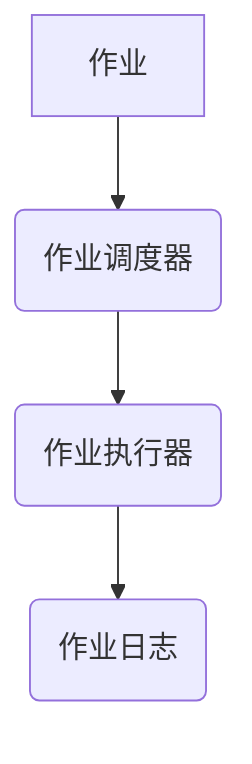

## 1. 背景介绍

### 1.1 作业管理系统的需求背景

随着互联网技术的快速发展和企业信息化程度的不断提高，企业内部的业务系统日益复杂，各种定时任务、批量处理任务、异步通知任务等需求也越来越多。传统的作业调度方式往往依赖于crontab、Windows计划任务等工具，存在着管理分散、监控困难、扩展性差等问题。为了解决这些问题，企业迫切需要一个集中化、可视化、易于管理的作业管理系统。

### 1.2 Spring Boot框架的优势

Spring Boot 是 Spring 框架的子项目，致力于简化 Spring 应用的初始搭建以及开发过程。它遵循“约定大于配置”的原则，通过自动配置和起步依赖等方式，极大地简化了 Spring 应用的开发流程。Spring Boot 具有以下优势：

* 简化配置：Spring Boot 通过自动配置和起步依赖等方式，极大地简化了 Spring 应用的配置过程。
* 内嵌服务器：Spring Boot 内嵌了 Tomcat、Jetty、Undertow 等服务器，无需单独部署服务器。
* 独立运行：Spring Boot 应用可以打包成可执行的 JAR 文件，独立运行，无需依赖外部容器。
* 易于监控：Spring Boot 提供了 Actuator 模块，可以方便地监控应用的运行状态。

### 1.3 Spring Boot作业管理系统的意义

基于 Spring Boot 框架构建作业管理系统，可以充分利用 Spring Boot 的优势，快速搭建一个功能完善、易于维护的作业管理平台，从而提高企业作业管理的效率和可靠性。

## 2. 核心概念与联系

### 2.1 作业

作业是指需要定时执行、批量处理或异步通知的任务。作业可以是简单的 shell 脚本，也可以是复杂的 Java 程序。

### 2.2 作业调度器

作业调度器负责管理和调度作业的执行。它根据作业的配置信息，定时触发作业的执行，并监控作业的运行状态。

### 2.3 作业执行器

作业执行器负责实际执行作业。它接收作业调度器的指令，执行具体的作业任务。

### 2.4 作业日志

作业日志记录了作业的执行过程和结果。通过查看作业日志，可以了解作业的执行情况，排查作业执行过程中遇到的问题。

### 2.5 概念联系图



## 3. 核心算法原理具体操作步骤

### 3.1 作业调度算法

作业调度算法是指作业调度器用于决定何时触发作业执行的算法。常见的作业调度算法有：

* **固定时间间隔调度**：按照固定的时间间隔触发作业执行，例如每隔 5 分钟执行一次。
* **Cron 表达式调度**：使用 Cron 表达式定义作业的执行时间，例如每天凌晨 2 点执行一次。
* **固定延迟调度**：在上一次作业执行完成后的固定时间后触发下一次作业执行，例如每次作业执行完成后延迟 10 秒执行下一次。

### 3.2 作业执行流程

作业执行流程是指作业从触发到完成的整个过程。具体步骤如下：

1. 作业调度器根据作业的调度配置，决定何时触发作业执行。
2. 作业调度器触发作业执行器执行作业。
3. 作业执行器执行具体的作业任务。
4. 作业执行器将作业的执行结果写入作业日志。
5. 作业调度器监控作业的执行状态，并在作业执行完成后更新作业状态。

### 3.3 操作步骤

1. 创建作业：定义作业的名称、描述、执行脚本、调度配置等信息。
2. 配置作业调度器：选择合适的作业调度算法，配置作业调度器的参数。
3. 启动作业调度器：启动作业调度器，开始调度作业的执行。
4. 监控作业执行：查看作业日志，监控作业的执行状态。

## 4. 数学模型和公式详细讲解举例说明

### 4.1 Cron 表达式

Cron 表达式是一种用于定义定时任务执行时间的字符串表达式。它由 6 个字段组成，分别表示秒、分钟、小时、日、月、周。每个字段可以使用以下符号：

* `*`：表示所有值。
* `?`：表示不指定值。
* `-`：表示一个范围。
* `,`：表示多个值。
* `/`：表示增量。

例如，Cron 表达式 `0 0 2 * * ?` 表示每天凌晨 2 点执行一次。

### 4.2 举例说明

假设有一个作业需要每隔 5 分钟执行一次，可以使用固定时间间隔调度算法，将时间间隔设置为 5 分钟。

如果有一个作业需要每天凌晨 2 点执行一次，可以使用 Cron 表达式调度算法，将 Cron 表达式设置为 `0 0 2 * * ?`。

## 5. 项目实践：代码实例和详细解释说明

### 5.1 项目结构

```
├── src
│   ├── main
│   │   ├── java
│   │   │   └── com
│   │   │       └── example
│   │   │           └── job
│   │   │               ├── JobApplication.java
│   │   │               ├── controller
│   │   │               │   └── JobController.java
│   │   │               ├── service
│   │   │               │   └── JobService.java
│   │   │               └── repository
│   │   │                   └── JobRepository.java
│   │   └── resources
│   │       ├── application.properties
│   │       └── static
│   │           └── index.html
│   └── test
│       └── java
│           └── com
│               └── example
│                   └── job
│                       └── JobApplicationTests.java
└── pom.xml
```

### 5.2 代码实例

#### 5.2.1 Job 实体类

```java
package com.example.job.entity;

import javax.persistence.Entity;
import javax.persistence.GeneratedValue;
import javax.persistence.GenerationType;
import javax.persistence.Id;

@Entity
public class Job {

    @Id
    @GeneratedValue(strategy = GenerationType.IDENTITY)
    private Long id;

    private String name;

    private String description;

    private String script;

    private String cronExpression;

    // getters and setters
}
```

#### 5.2.2 JobController

```java
package com.example.job.controller;

import com.example.job.entity.Job;
import com.example.job.service.JobService;
import org.springframework.beans.factory.annotation.Autowired;
import org.springframework.web.bind.annotation.*;

import java.util.List;

@RestController
@RequestMapping("/jobs")
public class JobController {

    @Autowired
    private JobService jobService;

    @GetMapping
    public List<Job> getAllJobs() {
        return jobService.getAllJobs();
    }

    @PostMapping
    public Job createJob(@RequestBody Job job) {
        return jobService.createJob(job);
    }

    @PutMapping("/{id}")
    public Job updateJob(@PathVariable Long id, @RequestBody Job job) {
        return jobService.updateJob(id, job);
    }

    @DeleteMapping("/{id}")
    public void deleteJob(@PathVariable Long id) {
        jobService.deleteJob(id);
    }
}
```

#### 5.2.3 JobService

```java
package com.example.job.service;

import com.example.job.entity.Job;
import com.example.job.repository.JobRepository;
import org.springframework.beans.factory.annotation.Autowired;
import org.springframework.stereotype.Service;

import java.util.List;

@Service
public class JobService {

    @Autowired
    private JobRepository jobRepository;

    public List<Job> getAllJobs() {
        return jobRepository.findAll();
    }

    public Job createJob(Job job) {
        return jobRepository.save(job);
    }

    public Job updateJob(Long id, Job job) {
        Job existingJob = jobRepository.findById(id).orElseThrow(() -> new IllegalArgumentException("Job not found"));
        existingJob.setName(job.getName());
        existingJob.setDescription(job.getDescription());
        existingJob.setScript(job.getScript());
        existingJob.setCronExpression(job.getCronExpression());
        return jobRepository.save(existingJob);
    }

    public void deleteJob(Long id) {
        jobRepository.deleteById(id);
    }
}
```

### 5.3 详细解释说明

* `Job` 实体类表示一个作业，包含作业的名称、描述、执行脚本、Cron 表达式等信息。
* `JobController` 提供 RESTful API 接口，用于管理作业。
* `JobService` 提供作业管理的业务逻辑，包括获取所有作业、创建作业、更新作业、删除作业等操作。

## 6. 实际应用场景

### 6.1 定时数据备份

企业可以使用 Spring Boot 作业管理系统定时备份数据库、文件系统等数据，确保数据的安全性。

### 6.2 批量数据处理

企业可以使用 Spring Boot 作业管理系统批量处理数据，例如批量导入数据、批量发送邮件等。

### 6.3 异步通知

企业可以使用 Spring Boot 作业管理系统实现异步通知功能，例如用户注册成功后发送邮件通知。

## 7. 工具和资源推荐

### 7.1 Spring Boot

* 官方网站：https://spring.io/projects/spring-boot
* 文档：https://docs.spring.io/spring-boot/docs/current/reference/html/

### 7.2 Quartz

* 官方网站：http://www.quartz-scheduler.org/
* 文档：http://www.quartz-scheduler.org/documentation/

### 7.3 Spring Batch

* 官方网站：https://spring.io/projects/spring-batch
* 文档：https://docs.spring.io/spring-batch/docs/current/reference/html/

## 8. 总结：未来发展趋势与挑战

### 8.1 未来发展趋势

* **云原生化**：随着云计算技术的普及，作业管理系统将逐步迁移到云平台，实现云原生化部署和管理。
* **智能化**：人工智能技术将被应用于作业管理系统，例如智能调度、智能监控等。
* **Serverless**：Serverless 架构将为作业管理系统带来更高的灵活性和可扩展性。

### 8.2 挑战

* **安全性**：作业管理系统需要保证作业执行的安全性，防止恶意代码的注入和执行。
* **可靠性**：作业管理系统需要保证作业的可靠执行，避免作业执行失败或数据丢失。
* **可维护性**：作业管理系统需要易于维护和管理，方便管理员进行操作和监控。

## 9. 附录：常见问题与解答

### 9.1 如何配置 Cron 表达式？

可以使用在线 Cron 表达式生成器生成 Cron 表达式，例如：https://crontab.guru/

### 9.2 如何监控作业执行状态？

可以通过查看作业日志监控作业执行状态。

### 9.3 如何处理作业执行失败？

可以配置作业重试机制，在作业执行失败时自动重试。