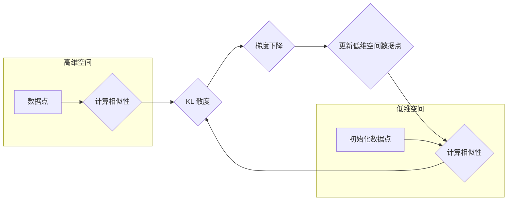

# t-SNE：可视化高维数据的利器

作者：禅与计算机程序设计艺术

## 1. 背景介绍

### 1.1 高维数据的可视化难题

在机器学习、数据挖掘、生物信息学等领域，我们经常需要处理高维数据。高维数据是指数据样本包含大量特征（变量）的数据集。例如，一张图片可以包含数百万个像素，每个像素代表一个特征；一个基因表达谱可以包含数万个基因，每个基因代表一个特征。

高维数据给数据分析带来了巨大挑战，其中一个难题就是数据的可视化。人类天生习惯于在二维或三维空间中观察和理解事物，而高维数据无法直接用肉眼观察。因此，我们需要找到有效的方法将高维数据映射到低维空间，以便于观察数据的结构和模式。

### 1.2 降维方法概述

为了解决高维数据的可视化难题，人们发展了许多降维方法，其主要目标是将高维数据映射到低维空间，同时保留数据的重要结构信息。常见的降维方法包括：

* **主成分分析 (PCA)**：一种线性降维方法，通过找到数据方差最大的方向（主成分）来降维。
* **线性判别分析 (LDA)**：一种有监督的线性降维方法，旨在找到最优的线性投影，使得不同类别的数据点在低维空间中尽可能分开。
* **多维尺度变换 (MDS)**：一种非线性降维方法，通过保留数据点之间的距离关系来降维。
* **t-SNE (t-distributed Stochastic Neighbor Embedding)**：一种非线性降维方法，旨在将高维数据点之间的相似性关系保留在低维空间中。

### 1.3 t-SNE 的优势

t-SNE 是一种强大的非线性降维方法，它在可视化高维数据方面具有以下优势：

* **保留局部结构**:  t-SNE 擅长在低维空间中保留高维数据中的局部结构，例如簇、流形等。
* **揭示数据中的非线性关系**:  t-SNE 可以有效地处理数据中的非线性关系，这使得它比线性降维方法更适用于复杂数据集。
* **广泛的应用领域**: t-SNE 已成功应用于各种领域，包括图像识别、自然语言处理、生物信息学等。

## 2. 核心概念与联系

### 2.1 相似性度量

t-SNE 的核心思想是将高维数据点之间的相似性关系保留在低维空间中。为了衡量数据点之间的相似性，t-SNE 使用高斯核函数计算数据点之间的条件概率：

$$
p_{j|i} = \frac{\exp(-\|x_i - x_j\|^2 / 2\sigma_i^2)}{\sum_{k \neq i} \exp(-\|x_i - x_k\|^2 / 2\sigma_i^2)}
$$

其中，$x_i$ 和 $x_j$ 分别表示高维空间中的两个数据点，$\sigma_i$ 是控制高斯核函数宽度的参数。$p_{j|i}$ 表示以 $x_i$ 为中心的高斯分布下，$x_j$ 的概率密度。

### 2.2 t-分布

在低维空间中，t-SNE 使用 t-分布来衡量数据点之间的相似性。t-分布是一种重尾分布，它比高斯分布更能捕捉到数据中的异常值。t-SNE 使用自由度为 1 的 t-分布：

$$
q_{ij} = \frac{(1 + \|y_i - y_j\|^2)^{-1}}{\sum_{k \neq l} (1 + \|y_k - y_l\|^2)^{-1}}
$$

其中，$y_i$ 和 $y_j$ 分别表示低维空间中的两个数据点。

### 2.3 KL 散度

t-SNE 的目标是找到低维空间中的数据点分布，使得 $q_{ij}$ 尽可能接近 $p_{j|i}$。为了衡量两个分布之间的差异，t-SNE 使用 Kullback-Leibler (KL) 散度：

$$
C = KL(P||Q) = \sum_{i} \sum_{j \neq i} p_{j|i} \log \frac{p_{j|i}}{q_{ij}}
$$

t-SNE 通过最小化 KL 散度来找到最优的低维空间数据点分布。

## 3. 核心算法原理具体操作步骤

### 3.1 算法流程图



### 3.2 算法步骤

t-SNE 算法的具体步骤如下：

1. **初始化**: 在低维空间中随机初始化数据点的位置。
2. **计算高维空间中的相似性**: 使用高斯核函数计算高维空间中数据点之间的相似性 $p_{j|i}$。
3. **计算低维空间中的相似性**: 使用 t-分布计算低维空间中数据点之间的相似性 $q_{ij}$。
4. **计算 KL 散度**: 计算 $p_{j|i}$ 和 $q_{ij}$ 之间的 KL 散度。
5. **梯度下降**: 使用梯度下降法最小化 KL 散度。
6. **更新低维空间数据点**: 根据梯度下降的结果更新低维空间中数据点的位置。
7. **重复步骤 2-6**: 重复上述步骤，直到 KL 散度收敛或达到最大迭代次数。

## 4. 数学模型和公式详细讲解举例说明

### 4.1 高斯核函数

高斯核函数是一种常用的相似性度量方法。它定义为：

$$
K(x, y) = \exp(-\frac{\|x - y\|^2}{2\sigma^2})
$$

其中，$x$ 和 $y$ 是两个数据点，$\sigma$ 是控制高斯核函数宽度的参数。高斯核函数的值随着 $x$ 和 $y$ 之间距离的增加而减小。

**举例说明**:

假设有两个数据点 $x = [1, 2]$ 和 $y = [3, 4]$，$\sigma = 1$。则高斯核函数的值为：

$$
K(x, y) = \exp(-\frac{\|(1, 2) - (3, 4)\|^2}{2 \cdot 1^2}) = \exp(-4) \approx 0.018
$$

### 4.2 t-分布

t-分布是一种重尾分布，它的概率密度函数为：

$$
f(x; \nu) = \frac{\Gamma(\frac{\nu + 1}{2})}{\sqrt{\nu\pi}\Gamma(\frac{\nu}{2})} (1 + \frac{x^2}{\nu})^{-\frac{\nu + 1}{2}}
$$

其中，$\nu$ 是自由度。t-分布的尾部比高斯分布更厚，这意味着 t-分布更能捕捉到数据中的异常值。

**举例说明**:

假设自由度 $\nu = 1$，则 t-分布的概率密度函数为：

$$
f(x; 1) = \frac{1}{\pi(1 + x^2)}
$$

### 4.3 KL 散度

KL 散度是一种衡量两个概率分布之间差异的指标。它定义为：

$$
KL(P||Q) = \sum_i P(i) \log \frac{P(i)}{Q(i)}
$$

其中，$P$ 和 $Q$ 是两个概率分布。KL 散度是非负的，当 $P$ 和 $Q$ 相等时，KL 散度为 0。

**举例说明**:

假设有两个概率分布 $P = [0.2, 0.8]$ 和 $Q = [0.5, 0.5]$，则 KL 散度为：

$$
KL(P||Q) = 0.2 \log \frac{0.2}{0.5} + 0.8 \log \frac{0.8}{0.5} \approx 0.223
$$

## 5. 项目实践：代码实例和详细解释说明

### 5.1 Python 代码实例

```python
from sklearn.manifold import TSNE
import matplotlib.pyplot as plt

# 加载数据
X = ...

# 创建 t-SNE 模型
tsne = TSNE(n_components=2, perplexity=30, random_state=0)

# 降维
X_tsne = tsne.fit_transform(X)

# 可视化
plt.scatter(X_tsne[:, 0], X_tsne[:, 1])
plt.show()
```

### 5.2 代码解释

* `TSNE(n_components=2, perplexity=30, random_state=0)`: 创建 t-SNE 模型，参数解释如下：
    * `n_components`: 降维后的维度，这里设置为 2。
    * `perplexity`: 控制局部邻域大小的参数，通常设置为 5 到 50 之间。
    * `random_state`: 随机数种子，用于保证结果的可重复性。
* `tsne.fit_transform(X)`: 对数据进行降维。
* `plt.scatter(X_tsne[:, 0], X_tsne[:, 1])`: 将降维后的数据可视化。

## 6. 实际应用场景

### 6.1 图像识别

t-SNE 可以用于可视化图像特征，例如卷积神经网络 (CNN) 提取的特征。通过将图像特征降维到二维空间，我们可以观察图像特征的分布，并识别不同类别图像之间的差异。

### 6.2 自然语言处理

t-SNE 可以用于可视化文本数据，例如词向量。通过将词向量降维到二维空间，我们可以观察词语之间的语义关系，并识别不同主题或领域的词语。

### 6.3 生物信息学

t-SNE 可以用于可视化基因表达数据。通过将基因表达数据降维到二维空间，我们可以观察不同基因之间的表达模式，并识别与特定疾病或生物过程相关的基因。

## 7. 总结：未来发展趋势与挑战

### 7.1 未来发展趋势

* **大规模数据集**: 随着数据量的不断增加，t-SNE 需要更高效的算法来处理大规模数据集。
* **高维数据**: t-SNE 需要改进算法来处理更高维的数据，例如包含数百万个特征的数据集。
* **动态数据**: t-SNE 需要适应动态数据，例如随着时间变化的数据流。

### 7.2 挑战

* **参数选择**: t-SNE 的性能对参数选择非常敏感，例如 perplexity。
* **可解释性**: t-SNE 是一种非线性降维方法，其结果的可解释性不如线性降维方法。
* **计算复杂度**: t-SNE 的计算复杂度较高，尤其是在处理大规模数据集时。

## 8. 附录：常见问题与解答

### 8.1 如何选择 perplexity 参数？

perplexity 参数控制 t-SNE 算法中局部邻域的大小。较小的 perplexity 值会导致更局部化的结果，而较大的 perplexity 值会导致更全局化的结果。通常建议将 perplexity 设置为 5 到 50 之间，并根据数据集的大小和复杂性进行调整。

### 8.2 t-SNE 的结果是否稳定？

t-SNE 的结果可能会受到随机初始化的影响。为了获得稳定的结果，建议多次运行 t-SNE 算法，并使用平均结果。

### 8.3 如何评估 t-SNE 的结果？

评估 t-SNE 的结果是一个开放性问题。一种方法是将 t-SNE 的结果与其他降维方法的结果进行比较，例如 PCA 和 MDS。另一种方法是使用领域知识来评估 t-SNE 的结果是否符合预期。