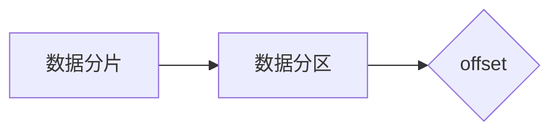

# 【AI大数据计算原理与代码实例讲解】offset

作者：禅与计算机程序设计艺术

## 1. 背景介绍

### 1.1 大数据时代的计算挑战

随着互联网、物联网、移动互联网的快速发展，全球数据量呈爆炸式增长，大数据时代已经到来。大数据的规模庞大、种类繁多、价值密度低、处理速度要求高等特点，给传统的计算模式带来了巨大挑战。

### 1.2 分布式计算的兴起

为了应对大数据带来的计算挑战，分布式计算应运而生。分布式计算将大规模的数据集分割成多个小块，由多台计算机并行处理，最终将结果汇总，从而实现高效的数据处理。

### 1.3 offset 在大数据计算中的作用

在分布式计算中，为了保证数据处理的效率和准确性，需要对数据进行分片和分区。offset 是一种常用的数据分区方式，它可以将数据按照一定的规则分配到不同的计算节点上，从而实现负载均衡和数据局部性。

## 2. 核心概念与联系

### 2.1 数据分片

数据分片是指将大数据集分割成多个小块，每个小块称为一个分片。分片的目的是为了将数据分散到不同的计算节点上，从而实现并行处理。

### 2.2 数据分区

数据分区是指将数据按照一定的规则分配到不同的计算节点上。分区的方式有很多种，例如哈希分区、范围分区、随机分区等。

### 2.3 offset

offset 是一种基于位置的数据分区方式，它将数据按照其在数据集中的位置进行分配。例如，如果将数据集分成 10 个分片，每个分片包含 100 条数据，那么 offset 为 50 的数据将被分配到第 5 个分片上。

### 2.4 关系图



## 3. 核心算法原理具体操作步骤

### 3.1 计算 offset

offset 的计算公式如下：

```
offset = 数据在数据集中的位置 % 分片数量
```

例如，如果数据在数据集中的位置为 150，分片数量为 10，那么 offset 为 0。

### 3.2 数据分配

根据计算得到的 offset，将数据分配到对应的分片上。

### 3.3 操作步骤

1. 确定数据分片数量。
2. 计算数据的 offset。
3. 根据 offset 将数据分配到对应的分片上。

## 4. 数学模型和公式详细讲解举例说明

### 4.1 数学模型

offset 的数学模型可以表示为：

```
offset = f(x) = x % n
```

其中：

* x 表示数据在数据集中的位置
* n 表示分片数量
* f(x) 表示 offset

### 4.2 举例说明

假设有一个数据集包含 1000 条数据，需要将其分成 10 个分片。那么：

* 分片数量 n = 10
* 数据在数据集中的位置 x = 0, 1, 2, ..., 999

根据 offset 的计算公式，可以得到每个数据的 offset：

```
offset(0) = 0 % 10 = 0
offset(1) = 1 % 10 = 1
offset(2) = 2 % 10 = 2
...
offset(999) = 999 % 10 = 9
```

因此，数据 0 将被分配到第 0 个分片上，数据 1 将被分配到第 1 个分片上，以此类推。

## 5. 项目实践：代码实例和详细解释说明

### 5.1 Python 代码实例

```python
def calculate_offset(data_index, num_partitions):
  """
  计算数据的 offset。

  Args:
    data_index: 数据在数据集中的位置。
    num_partitions: 分片数量。

  Returns:
    数据的 offset。
  """

  return data_index % num_partitions


# 示例用法
data_index = 150
num_partitions = 10
offset = calculate_offset(data_index, num_partitions)
print(f"数据 {data_index} 的 offset 为 {offset}")
```

### 5.2 代码解释

* `calculate_offset()` 函数用于计算数据的 offset。
* `data_index` 参数表示数据在数据集中的位置。
* `num_partitions` 参数表示分片数量。
* 函数返回数据的 offset。

### 5.3 运行结果

```
数据 150 的 offset 为 0
```

## 6. 实际应用场景

### 6.1 分布式数据库

在分布式数据库中，offset 可以用于数据分片和分区，从而实现负载均衡和数据局部性。

### 6.2 大数据处理框架

在大数据处理框架（例如 Hadoop、Spark）中，offset 可以用于数据分区，从而将数据分配到不同的计算节点上进行并行处理。

### 6.3 消息队列

在消息队列中，offset 可以用于标识消息在队列中的位置，从而保证消息的顺序消费。

## 7. 工具和资源推荐

### 7.1 Apache Kafka

Apache Kafka 是一款高吞吐量的分布式发布-订阅消息系统，它使用 offset 来标识消息在分区中的位置。

### 7.2 Apache Hadoop

Apache Hadoop 是一款开源的分布式计算框架，它支持使用 offset 进行数据分区。

### 7.3 Apache Spark

Apache Spark 是一款快速、通用的集群计算系统，它也支持使用 offset 进行数据分区。

## 8. 总结：未来发展趋势与挑战

### 8.1 未来发展趋势

随着大数据技术的不断发展，offset 将在更多领域得到应用，例如云计算、人工智能、物联网等。

### 8.2 挑战

* 数据量不断增长，对 offset 的计算效率提出了更高的要求。
* 数据类型的多样化，需要设计更加灵活的 offset 计算方法。
* 数据安全和隐私保护，需要在 offset 计算过程中考虑数据安全问题。

## 9. 附录：常见问题与解答

### 9.1 offset 和 partition 的区别是什么？

offset 表示数据在分区中的位置，而 partition 表示数据被分配到的计算节点。

### 9.2 如何选择合适的 offset 计算方法？

选择 offset 计算方法需要考虑数据量、数据类型、计算效率等因素。

### 9.3 如何保证 offset 计算的准确性？

需要对 offset 计算方法进行测试和验证，确保其准确性。
