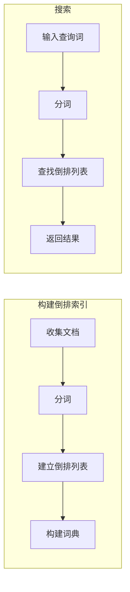

# 【AI大数据计算原理与代码实例讲解】倒排索引

作者：禅与计算机程序设计艺术

## 1. 背景介绍

在信息爆炸的时代，搜索引擎已经成为人们获取信息最重要的工具之一。每天，数以亿计的用户在 Google、Bing、百度等搜索引擎上输入关键词，查找自己需要的信息。为了满足用户日益增长的搜索需求，搜索引擎公司投入了大量的资源来提升搜索效率和结果质量。其中，倒排索引（Inverted Index）作为搜索引擎的核心数据结构，扮演着至关重要的角色。

### 1.1 搜索引擎的挑战

搜索引擎面临着诸多挑战，例如：

* **海量数据**: 互联网上的信息量巨大，如何高效地存储和检索这些数据是一个巨大的挑战。
* **快速响应**: 用户期望搜索引擎能够快速返回结果，即使面对海量数据，也需要保证毫秒级的响应速度。
* **结果相关性**: 搜索引擎需要返回与用户查询词高度相关的结果，避免无关信息的干扰。

### 1.2 倒排索引的优势

倒排索引是一种有效解决上述挑战的数据结构。它通过建立关键词到文档的映射关系，能够快速定位包含特定关键词的文档，从而实现高效的全文检索。相比传统的顺序扫描方式，倒排索引具有以下优势：

* **检索速度快**: 倒排索引能够快速定位包含特定关键词的文档，避免了顺序扫描所有文档的耗时操作。
* **存储空间小**: 倒排索引只存储关键词和文档ID之间的映射关系，相比存储完整的文档内容，占用的存储空间更小。
* **可扩展性强**: 倒排索引可以方便地扩展到更大的数据集，支持海量数据的检索。

## 2. 核心概念与联系

### 2.1 倒排索引的定义

倒排索引是一种数据结构，它将关键词映射到包含该关键词的文档列表。简单来说，它记录了每个关键词出现在哪些文档中。

### 2.2 倒排索引的结构

倒排索引通常由两个部分组成：

* **词典**: 存储所有关键词，并记录每个关键词对应的倒排列表的指针。
* **倒排列表**: 存储包含特定关键词的文档列表，通常按照文档ID排序。

### 2.3 倒排索引的构建过程

构建倒排索引的过程可以概括为以下步骤：

1. **收集文档**: 从互联网或其他数据源收集需要建立索引的文档。
2. **分词**: 对文档进行分词，将文档拆分成一个个关键词。
3. **建立倒排列表**: 对于每个关键词，建立一个倒排列表，记录包含该关键词的文档ID。
4. **构建词典**: 将所有关键词及其对应的倒排列表指针存储到词典中。

## 3. 核心算法原理具体操作步骤

### 3.1 分词算法

分词是构建倒排索引的第一步，它的目的是将文档拆分成一个个关键词。常用的分词算法包括：

* **基于词典的分词**: 将文档与预先定义的词典进行匹配，将匹配到的词语作为关键词。
* **基于统计的分词**: 根据词语在文档中出现的频率和上下文信息，将高频词语和具有语义联系的词语作为关键词。
* **基于机器学习的分词**: 利用机器学习算法，学习词语之间的语义关系，从而实现更准确的分词。

### 3.2 倒排列表构建算法

构建倒排列表的核心操作是记录每个关键词出现在哪些文档中。常用的构建算法包括：

* **排序法**: 对于每个关键词，遍历所有文档，记录包含该关键词的文档ID，并将这些文档ID排序后存储到倒排列表中。
* **哈希法**: 对于每个关键词，计算其哈希值，并根据哈希值将包含该关键词的文档ID存储到对应的哈希桶中。

### 3.3 词典构建算法

词典构建算法的目的是将所有关键词及其对应的倒排列表指针存储到词典中。常用的构建算法包括：

* **树形结构**: 将所有关键词存储到树形结构中，例如 Trie树或 B+树，叶子节点存储关键词对应的倒排列表指针。
* **哈希表**: 将所有关键词存储到哈希表中，哈希值作为键，倒排列表指针作为值。

## 4. 数学模型和公式详细讲解举例说明

### 4.1 TF-IDF模型

TF-IDF（Term Frequency-Inverse Document Frequency）是一种常用的关键词权重计算模型，它用于衡量关键词在文档中的重要程度。

**TF**:  Term Frequency，词频，指的是关键词在文档中出现的频率。

$$
TF = \frac{关键词在文档中出现的次数}{文档中所有关键词的总数}
$$

**IDF**: Inverse Document Frequency，逆文档频率，指的是包含关键词的文档数量的倒数的对数。

$$
IDF = log(\frac{文档总数}{包含关键词的文档数量 + 1})
$$

**TF-IDF**: 关键词的权重等于词频乘以逆文档频率。

$$
TF-IDF = TF * IDF
$$

**举例说明**:

假设有以下三个文档：

* 文档1: "人工智能 自然语言处理"
* 文档2: "机器学习 深度学习"
* 文档3: "人工智能 深度学习"

关键词 "人工智能" 的 TF-IDF 计算过程如下：

* **文档1**: TF = 1/3， IDF = log(3/2) = 0.176， TF-IDF = 0.059
* **文档2**: TF = 0/3， IDF = log(3/2) = 0.176， TF-IDF = 0
* **文档3**: TF = 1/3， IDF = log(3/2) = 0.176， TF-IDF = 0.059

### 4.2 BM25模型

BM25 (Best Match 25) 是一种常用的关键词权重计算模型，它在 TF-IDF 的基础上引入了文档长度和平均文档长度的影响。

$$
BM25 = IDF * \frac{TF * (k_1 + 1)}{TF + k_1 * (1 - b + b * \frac{dl}{avdl})}
$$

其中：

* $k_1$ 和 $b$ 是调节参数，通常取值为 1.2 和 0.75。
* $dl$ 是文档长度。
* $avdl$ 是所有文档的平均长度。

**举例说明**:

假设有以下三个文档：

* 文档1: "人工智能 自然语言处理" (长度为 4)
* 文档2: "机器学习 深度学习" (长度为 4)
* 文档3: "人工智能 深度学习" (长度为 3)

所有文档的平均长度为 (4 + 4 + 3) / 3 = 3.67。

关键词 "人工智能" 的 BM25 计算过程如下：

* **文档1**: TF = 1/4， IDF = log(3/2) = 0.176， BM25 = 0.176 * (1/4 * (1.2 + 1)) / (1/4 + 1.2 * (1 - 0.75 + 0.75 * 4 / 3.67)) = 0.073
* **文档2**: TF = 0/4， IDF = log(3/2) = 0.176， BM25 = 0
* **文档3**: TF = 1/3， IDF = log(3/2) = 0.176， BM25 = 0.176 * (1/3 * (1.2 + 1)) / (1/3 + 1.2 * (1 - 0.75 + 0.75 * 3 / 3.67)) = 0.089

## 5. 项目实践：代码实例和详细解释说明

### 5.1 Python代码实现

```python
import math

class InvertedIndex:
    def __init__(self):
        self.dictionary = {}
        self.documents = []

    def add_document(self, document_id, document_content):
        self.documents.append((document_id, document_content))

    def build_index(self):
        for document_id, document_content in self.documents:
            terms = document_content.split()
            for term in terms:
                if term not in self.dictionary:
                    self.dictionary[term] = []
                self.dictionary[term].append(document_id)

    def search(self, query):
        query_terms = query.split()
        result_set = set()
        for term in query_terms:
            if term in self.dictionary:
                result_set.update(self.dictionary[term])
        return result_set

    def calculate_tf_idf(self, term, document_id):
        document_content = self.documents[document_id][1]
        terms = document_content.split()
        tf = terms.count(term) / len(terms)
        idf = math.log(len(self.documents) / (len(self.dictionary[term]) + 1))
        return tf * idf

    def calculate_bm25(self, term, document_id, k1=1.2, b=0.75):
        document_content = self.documents[document_id][1]
        terms = document_content.split()
        tf = terms.count(term)
        idf = math.log(len(self.documents) / (len(self.dictionary[term]) + 1))
        dl = len(terms)
        avdl = sum([len(doc[1].split()) for doc in self.documents]) / len(self.documents)
        return idf * (tf * (k1 + 1)) / (tf + k1 * (1 - b + b * dl / avdl))
```

### 5.2 代码解释

* `InvertedIndex` 类表示倒排索引。
* `add_document` 方法用于添加文档到索引中。
* `build_index` 方法用于构建倒排索引。
* `search` 方法用于搜索包含特定关键词的文档。
* `calculate_tf_idf` 方法用于计算关键词的 TF-IDF 值。
* `calculate_bm25` 方法用于计算关键词的 BM25 值。

### 5.3 使用示例

```python
# 创建倒排索引
index = InvertedIndex()

# 添加文档
index.add_document(0, "人工智能 自然语言处理")
index.add_document(1, "机器学习 深度学习")
index.add_document(2, "人工智能 深度学习")

# 构建索引
index.build_index()

# 搜索包含 "人工智能" 的文档
result = index.search("人工智能")
print(result)  # 输出: {0, 2}

# 计算 "人工智能" 在文档 0 中的 TF-IDF 值
tf_idf = index.calculate_tf_idf("人工智能", 0)
print(tf_idf)  # 输出: 0.0588...

# 计算 "人工智能" 在文档 0 中的 BM25 值
bm25 = index.calculate_bm25("人工智能", 0)
print(bm25)  # 输出: 0.0732...
```

## 6. 实际应用场景

倒排索引被广泛应用于各种搜索引擎和信息检索系统中，例如：

* **Web 搜索引擎**: Google、Bing、百度等搜索引擎都使用倒排索引来存储和检索网页数据。
* **电商平台**: Amazon、淘宝等电商平台使用倒排索引来实现商品搜索功能。
* **社交媒体**: Twitter、Facebook 等社交媒体平台使用倒排索引来实现用户搜索和信息检索功能。
* **企业内部搜索**: 许多企业使用倒排索引来构建内部文档搜索引擎，方便员工查找公司内部信息。

## 7. 工具和资源推荐

* **Lucene**: Apache Lucene 是一个开源的全文检索库，它提供了丰富的 API 用于构建和使用倒排索引。
* **Elasticsearch**: Elasticsearch 是一个基于 Lucene 的分布式搜索引擎，它提供了强大的搜索功能和易于使用的 RESTful API。
* **Solr**: Apache Solr 是另一个基于 Lucene 的企业级搜索引擎，它提供了高性能、可扩展性和容错能力。

## 8. 总结：未来发展趋势与挑战

随着数据量的不断增长和用户对搜索效率和结果质量的要求越来越高，倒排索引技术也在不断发展和完善。未来，倒排索引技术将朝着以下方向发展：

* **分布式倒排索引**: 为了处理海量数据，需要将倒排索引分布式存储在多台服务器上，并实现高效的分布式检索。
* **实时倒排索引**: 为了满足用户对实时搜索的需求，需要实现实时更新倒排索引，保证搜索结果的时效性。
* **语义搜索**: 传统的倒排索引主要基于关键词匹配，未来需要结合语义分析技术，实现更智能的语义搜索。

## 9. 附录：常见问题与解答

### 9.1 如何处理同义词和多义词？

同义词和多义词会影响搜索结果的准确性。为了解决这个问题，可以采用以下方法：

* **同义词扩展**: 在构建倒排索引时，将同义词加入到倒排列表中，例如 "汽车" 和 "车辆" 可以加入到同一个倒排列表中。
* **词义消歧**: 利用上下文信息或其他技术手段，判断关键词的具体含义，例如 "苹果" 可以表示水果或公司名称。

### 9.2 如何提高倒排索引的检索效率？

为了提高倒排索引的检索效率，可以采用以下方法：

* **缓存**: 将 frequently accessed 的倒排列表缓存到内存中，减少磁盘 I/O 操作。
* **压缩**: 对倒排列表进行压缩，减少存储空间和 I/O 传输量。
* **分布式检索**: 将检索任务分配到多台服务器上并行执行，提高检索速度。

### 9.3 如何评估倒排索引的性能？

常用的倒排索引性能评估指标包括：

* **检索速度**: 衡量搜索引擎返回结果的速度。
* **召回率**: 衡量搜索引擎能够返回多少相关文档的比例。
* **精确率**: 衡量搜索引擎返回的文档中有多少是相关文档的比例。

## 10. Mermaid流程图

