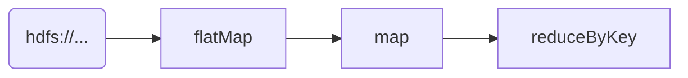

# 【AI大数据计算原理与代码实例讲解】批处理

## 1.背景介绍

### 1.1 什么是批处理

批处理(Batch Processing)是一种将大量数据集中起来进行处理的计算模式。与之相对的是流处理(Stream Processing),后者侧重于实时地处理持续到来的数据流。批处理主要用于离线的大规模数据分析任务,如日志分析、网页排名等,能够高效地利用计算资源对大量积累的历史数据进行处理。

### 1.2 批处理的应用场景

批处理在诸多大数据应用中扮演着重要角色:

- **数据仓库(Data Warehousing)**: 从运营数据库中提取、转换和加载(ETL)数据到数据仓库,用于商业智能分析。
- **机器学习训练**: 利用历史数据训练机器学习模型,如推荐系统、自然语言处理等。
- **网页排名**: 搜索引擎会周期性地抓取和分析网页内容,为其计算权重值。
- **日志分析**: 对服务器、应用程序等产生的日志进行统一处理和分析。

### 1.3 批处理与流处理

批处理和流处理有着明显的差异:

- **延迟**: 批处理具有较高的延迟,因为需要等待数据积累。流处理则侧重实时性。
- **吞吐量**: 批处理一次可处理大量数据,吞吐量高。流处理处理单个数据记录。
- **容错性**: 批处理可重复执行,容错性好。流处理需更复杂的容错机制。
- **代码复用**: 批处理代码可跨越多个作业复用。流处理代码通常是定制的。

总的来说,批处理更适合离线计算,而流处理则侧重实时计算。在现代数据系统中,两者常常结合使用。

## 2.核心概念与联系

### 2.1 MapReduce编程模型

MapReduce是一种分布式计算模型,由Google提出,用于在大型集群上并行处理大规模数据集。它将计算过程分为两个阶段:Map(映射)和Reduce(归约)。

**Map阶段**:输入数据被分割为多个数据块,并行传递给Mapper进行处理,生成键值对形式的中间结果。
```python
def map(key, value):
    # 处理键值对
    ...
    emit(k2, v2)
```

**Reduce阶段**:框架收集并合并具有相同键的所有中间值,传递给Reducer进行处理,得到最终结果。
```python 
def reduce(key, values):
    # 累积values
    ...
    emit(k3, v3)
```

MapReduce可自动实现数据分布、容错、负载均衡等,简化了并行计算的编程复杂度。开发者只需关注Map和Reduce函数的实现。

### 2.2 批处理工具生态

目前流行的批处理工具主要有:

- **Hadoop MapReduce**: Apache开源的分布式计算框架,实现了Google的MapReduce编程模型。
- **Apache Spark**: 基于内存计算的统一分析引擎,支持批处理、流处理、机器学习等多种工作负载。
- **Apache Flink**: 同时支持批处理和流处理的分布式数据处理引擎。
- **Apache Hive**: 基于Hadoop的数据仓库基础设施,支持用类SQL语言进行批处理。

这些工具通常与分布式文件系统(HDFS)、资源管理框架(YARN)等组件协同工作,构建了完整的大数据处理生态系统。

### 2.3 Spark批处理基础

Apache Spark是当前最流行的大数据处理引擎之一。它基于RDD(Resilient Distributed Dataset)数据抽象,支持批处理、流处理、机器学习等多种计算范式。

**RDD**:代表一个不可变、可分区、里面的元素能并行计算的数据集,是Spark最基础的数据结构。

**Transformation**:对RDD进行转换操作,生成新的RDD,如map、filter、join等。

**Action**:触发RDD上的计算,如count、collect、save等。

Spark采用了"延迟计算"策略,只有Action操作触发时,才会真正执行计算。这种惰性求值模式,允许Spark构建更优化的执行计划。

```python
# 创建RDD
rdd = sc.textFile("hdfs://...")

# Transformation
words = rdd.flatMap(lambda line: line.split(" "))
pairs = words.map(lambda word: (word, 1))
counts = pairs.reduceByKey(lambda a, b: a + b)

# Action
counts.saveAsTextFile("hdfs://...")
```

上例展示了用Spark实现单词计数的批处理作业。后续将详细介绍Spark批处理的核心原理和实践。

## 3.核心算法原理具体操作步骤

### 3.1 Spark批处理作业执行流程

一个Spark批处理作业的执行流程大致如下:

1. **创建SparkContext**
2. **构建RDD血统(Lineage)**
   - 通过一系列Transformation操作构建逻辑计划
3. **生成物理执行计划**
   - 当Action触发时,优化器根据RDD的Lineage生成物理执行计划
4. **任务调度与执行**
   - 将计划分解为多个Task,分发到Executor上并行执行
5. **收集结果**


接下来对关键步骤进行详细介绍。

### 3.2 RDD血统(Lineage)

Spark之所以高效,很大程度归功于其基于RDD的血统记录(Lineage)。

每个RDD都记录了其从哪些父RDD转换而来的信息,形成一个有向无环图结构。当RDD的分区数据出错或丢失时,可根据血统进行重新计算而不是从头开始,大大提高了容错能力。

下图展示了WordCount例子中RDD的血统关系:



Spark依赖RDD的血统信息,对计算逻辑进行优化,生成高效的执行计划。

### 3.3 Task调度与执行

Spark将RDD划分为多个分区(Partition),每个分区对应一个Task执行单元。

1. **TaskScheduler**将Task按照指定策略分发到Executor上执行。
2. **TaskSetManager**监控Task的执行状态,对失败任务进行重试。
3. **Executor**是Task真正运行的地方,负责从外部存储读取数据,反序列化、计算并持久化结果。

Spark会尽量将计算任务分发到离数据最近的节点上执行,以减少数据传输开销,这就是**数据本地性(Data Locality)**优化策略。

### 3.4 Shuffle过程

Shuffle过程是批处理中至关重要的一个步骤,如reduceByKey等操作都会触发Shuffle。

1. **计算Shuffle键值对**
   - Mapper阶段,并行计算每个RDD分区的键值对
2. **分区(Partitioning)**
   - 根据分区函数,将键值对分配到不同的分区桶中
3. **Spill磁盘**
   - 分区数据写入到磁盘文件(spill)中,防止OOM
4. **Fetch输出文件**
   - Reducer远程获取输出文件,并合并得到最终结果

Shuffle过程涉及大量磁盘IO和数据传输,是影响Spark性能的关键因素。Spark提供了诸多优化机制,如高效的数据传输格式、基于Sort的散列聚合等。

## 4.数学模型和公式详细讲解举例说明

在批处理中,常常需要利用数学模型和算法对大量数据进行处理和分析。下面以协同过滤算法为例,介绍相关数学原理。

### 4.1 协同过滤算法

协同过滤(Collaborative Filtering)是构建推荐系统的常用技术之一,通过分析用户对物品的偏好,发现具有相似兴趣的用户群体,从而实现个性化推荐。

假设有 $m$ 个用户, $n$ 个物品,用 $r_{ui}$ 表示用户 $u$ 对物品 $i$ 的评分。我们的目标是预测用户对未评分物品的可能评分 $\hat{r}_{ui}$。

### 4.2 基于用户的协同过滤

基于用户的协同过滤算法的核心思想是,找到与目标用户 $u$ 兴趣相似的 $k$ 个邻居用户,然后根据这些邻居用户对物品 $i$ 的评分,预测 $u$ 对 $i$ 的评分。

具体来说,我们需要先计算用户 $u$ 与其他用户 $v$ 的相似度 $s_{uv}$,常用的相似度计算方法有:

- **欧几里得距离**:

$$s_{uv} = 1 - \sqrt{\sum_{i \in I}(r_{ui} - r_{vi})^2}$$

- **余弦相似度**:

$$s_{uv} = \frac{\sum_{i \in I}r_{ui}r_{vi}}{\sqrt{\sum_{i \in I}r_{ui}^2}\sqrt{\sum_{i \in I}r_{vi}^2}}$$

其中 $I$ 表示用户 $u$ 和 $v$ 都评分过的物品集合。

接下来,我们找到与 $u$ 最相似的 $k$ 个邻居用户集合 $N_k(u)$,预测评分就可以用加权平均的方式计算:

$$\hat{r}_{ui} = \overline{r}_u + \frac{\sum_{v \in N_k(u)}s_{uv}(r_{vi} - \overline{r}_v)}{\sum_{v \in N_k(u)}|s_{uv}|}$$

其中 $\overline{r}_u$ 和 $\overline{r}_v$ 分别表示用户 $u$ 和 $v$ 的平均评分。

### 4.3 基于物品的协同过滤

除了基于用户的方法,我们还可以基于物品的相似度进行预测。具体做法是:

1. 计算物品 $i$ 和 $j$ 的相似度 $s_{ij}$,方法类似于计算用户相似度。
2. 找到与目标物品 $i$ 最相似的 $k$ 个物品集合 $N_k(i)$。
3. 预测评分:

$$\hat{r}_{ui} = \overline{r}_i + \frac{\sum_{j \in N_k(i)}s_{ij}(r_{uj} - \overline{r}_j)}{\sum_{j \in N_k(i)}|s_{ij}|}$$

其中 $\overline{r}_i$ 和 $\overline{r}_j$ 分别表示物品 $i$ 和 $j$ 的平均评分。

### 4.4 实现细节

上述协同过滤算法的关键步骤是计算用户(或物品)之间的相似度,以及根据相似度进行加权平均。这些计算都可以使用Spark的RDD操作高效实现。

例如计算用户相似度的伪代码如下:

```python
# 加载评分数据
ratings = spark.read.text("ratings.data")

# 计算每个(user, item)对的评分
entries = ratings.map(lambda l: l.split(','))
                .map(lambda x: (int(x[0]), int(x[1]), float(x[2])))

# 给每个(user, item)对打上行号                
entries = entries.map(lambda x: (x[0], x[1], x[2], 1.0))

# 转换为(user, item), rating的格式
entries = entries.flatMap(lambda x: [(x[0], (x[1], x[2], x[3])),
                                     (x[1], (x[0], x[2], x[3]))])
                  
# 计算用户余弦相似度
similarities = entries.reduceByKey(lambda x, y: sim(x, y))
                      .filter(lambda x: x[0] < x[1][0][0])
```

这里用到了Spark的flatMap等转换操作,以及reduceByKey进行分组计算。其中sim函数用于计算两个用户评分向量的余弦相似度。

完整的协同过滤推荐系统实现还需要处理数据缺失、冷启动等实际问题,这里不再赘述。总的来说,利用Spark进行矩阵分解、迭代计算等复杂的数据挖掘任务都是可行的。

## 5.项目实践:代码实例和详细解释说明

下面通过一个电影评分数据的实例,演示如何使用Spark进行批处理分析。

### 5.1 数据集介绍

我们使用MovieLens数据集,包含来自真实用户对电影的评分数据。具体格式如下:

```
用户ID,电影ID,评分(1-5分),时间戳
```

一个