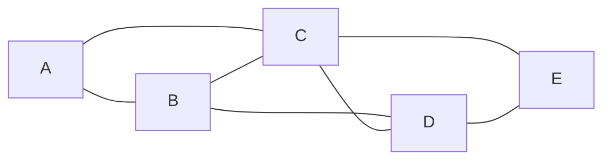

# 【AI大数据计算原理与代码实例讲解】社区发现

作者：禅与计算机程序设计艺术

## 1. 背景介绍

### 1.1 社区发现的概念

在社交网络、生物网络、信息网络等复杂网络中，社区结构是一种普遍存在的现象。社区是指网络中节点连接较为紧密的子图，同一社区内的节点相互连接的概率很高，而不同社区之间的连接则相对稀疏。社区发现（Community Detection）旨在识别网络中的这些社区结构，将网络划分为多个子图，每个子图代表一个社区。

### 1.2 社区发现的意义

社区发现具有重要的理论意义和应用价值：

* **理解网络结构:** 社区结构揭示了网络内部的组织形式和节点之间的关系模式，有助于理解网络的拓扑结构和功能特征。
* **信息推荐和搜索:** 社区发现可以用于个性化推荐系统，根据用户所属的社区，推荐相关的信息和服务。
* **生物医学研究:** 在蛋白质相互作用网络中，社区发现可以识别功能模块，帮助理解蛋白质的功能和相互作用机制。
* **市场分析和客户关系管理:** 社区发现可以用于识别客户群体，分析客户行为，制定精准的营销策略。

### 1.3 社区发现的挑战

社区发现面临着一些挑战：

* **网络规模:** 现实世界中的网络规模巨大，节点数量和边数量都非常庞大，对算法的效率提出了很高的要求。
* **社区结构的复杂性:** 社区结构可能存在重叠、层次结构等复杂情况，传统的算法难以有效处理。
* **评价指标:** 社区发现的结果需要进行评估，但目前还没有统一的、公认的评价指标。

## 2. 核心概念与联系

### 2.1 图论基础

社区发现的核心概念是基于图论的。图是由节点和边组成的，节点代表网络中的个体，边代表个体之间的关系。社区发现可以看作是将图划分为多个子图的问题。

### 2.2 模块度

模块度（Modularity）是衡量社区划分质量的一个重要指标。它反映了社区内部连接的紧密程度与随机情况下连接的差异。模块度的取值范围为 $[-0.5, 1]$，值越高表示社区划分越好。

### 2.3 邻接矩阵

邻接矩阵（Adjacency Matrix）是表示图的一种常用方式。矩阵的元素 $A_{ij}$ 表示节点 $i$ 和节点 $j$ 之间是否存在边。

### 2.4 度

节点的度（Degree）是指与该节点相连的边的数量。

## 3. 核心算法原理具体操作步骤

### 3.1 Louvain算法

Louvain算法是一种基于模块度的贪婪算法，其操作步骤如下：

1. **初始化:** 将每个节点视为一个独立的社区。
2. **迭代优化:** 
    * 对于每个节点，计算将其移动到相邻社区后的模块度增益。
    * 将节点移动到模块度增益最大的社区。
    * 重复以上步骤，直到模块度不再增加。
3. **社区合并:** 将所有节点合并到同一个社区，形成一个新的网络。
4. **重复步骤2和3:** 对新的网络重复进行社区发现，直到模块度不再增加。

### 3.2 Girvan-Newman算法

Girvan-Newman算法是一种基于边介数（Edge Betweenness）的算法，其操作步骤如下：

1. **计算边介数:** 对于每条边，计算其在所有最短路径上的出现次数。
2. **移除边:** 移除边介数最高的边。
3. **重复步骤1和2:** 重复计算边介数并移除边，直到网络被划分为多个连通分量。

## 4. 数学模型和公式详细讲解举例说明

### 4.1 模块度计算公式

模块度 $Q$ 的计算公式如下：

$$
Q = \frac{1}{2m} \sum_{ij} \left( A_{ij} - \frac{k_i k_j}{2m} \right) \delta(c_i, c_j)
$$

其中：

* $m$ 是网络中边的数量。
* $A_{ij}$ 是邻接矩阵的元素，表示节点 $i$ 和节点 $j$ 之间是否存在边。
* $k_i$ 是节点 $i$ 的度。
* $c_i$ 是节点 $i$ 所属的社区。
* $\delta(c_i, c_j)$ 是克罗内克函数，当 $c_i = c_j$ 时，其值为 1，否则为 0。

### 4.2 Louvain算法模块度增益计算公式

Louvain算法中，将节点 $i$ 从社区 $C_i$ 移动到社区 $C_j$ 后，模块度增益 $\Delta Q$ 的计算公式如下：

$$
\Delta Q = \frac{1}{2m} \left[ \sum_{k \in C_j} (A_{ik} - \frac{k_i k_k}{2m}) + \sum_{k \in C_i} (-A_{ik} + \frac{k_i k_k}{2m}) \right]
$$

### 4.3 举例说明

假设有一个如下图所示的网络：



该网络的邻接矩阵为：

```
[[0, 1, 1, 0, 0],
 [1, 0, 1, 1, 0],
 [1, 1, 0, 1, 1],
 [0, 1, 1, 0, 1],
 [0, 0, 1, 1, 0]]
```

假设初始时将每个节点视为一个独立的社区，则模块度为 0。

将节点 C 从社区 {C} 移动到社区 {B, D} 后，模块度增益为：

$$
\Delta Q = \frac{1}{10} \left[ (1 - \frac{3 \times 2}{10}) + (1 - \frac{3 \times 2}{10}) + (-1 + \frac{3 \times 2}{10}) + (-1 + \frac{3 \times 2}{10}) \right] = 0.12
$$

因此，将节点 C 移动到社区 {B, D} 后，模块度增加到 0.12。

## 5. 项目实践：代码实例和详细解释说明

### 5.1 Python NetworkX库

NetworkX是一个用于创建、操作和研究复杂网络的 Python 库。它提供了丰富的图算法，包括社区发现算法。

### 5.2 代码实例

```python
import networkx as nx

# 创建一个图
G = nx.Graph()
G.add_edges_from([(1, 2), (1, 3), (2, 3), (2, 4), (3, 4), (3, 5), (4, 5)])

# 使用Louvain算法进行社区发现
communities = list(nx.community.greedy_modularity_communities(G))

# 打印社区结构
print(communities)

# 绘制网络图
nx.draw(G, with_labels=True)
plt.show()
```

### 5.3 代码解释

* `nx.Graph()` 创建一个无向图。
* `G.add_edges_from()` 添加边到图中。
* `nx.community.greedy_modularity_communities()` 使用Louvain算法进行社区发现。
* `communities` 是一个列表，包含了所有社区。
* `nx.draw()` 绘制网络图。

## 6. 实际应用场景

### 6.1 社交网络分析

社区发现可以用于分析社交网络中的用户群体，识别意见领袖，预测用户行为。

### 6.2 生物网络分析

社区发现可以用于分析蛋白质相互作用网络，识别功能模块，研究疾病的发生机制。

### 6.3 信息推荐

社区发现可以用于构建个性化推荐系统，根据用户所属的社区，推荐相关的信息和服务。

## 7. 总结：未来发展趋势与挑战

### 7.1 未来发展趋势

* **算法优化:** 研究更高效、更精确的社区发现算法。
* **动态网络社区发现:** 研究动态网络中的社区发现问题，例如随着时间的推移，社区结构的变化。
* **多层网络社区发现:** 研究多层网络中的社区发现问题，例如社交网络和信息网络的融合。

### 7.2 挑战

* **大规模网络:** 现实世界中的网络规模巨大，对算法的效率提出了很高的要求。
* **社区结构的复杂性:** 社区结构可能存在重叠、层次结构等复杂情况，传统的算法难以有效处理。
* **评价指标:** 社区发现的结果需要进行评估，但目前还没有统一的、公认的评价指标。

## 8. 附录：常见问题与解答

### 8.1 什么是模块度？

模块度是衡量社区划分质量的一个重要指标。它反映了社区内部连接的紧密程度与随机情况下连接的差异。

### 8.2 Louvain算法和Girvan-Newman算法有什么区别？

Louvain算法是一种基于模块度的贪婪算法，而Girvan-Newman算法是一种基于边介数的算法。Louvain算法的效率更高，而Girvan-Newman算法的结果更精确。

### 8.3 社区发现有哪些应用场景？

社区发现可以应用于社交网络分析、生物网络分析、信息推荐等领域。
