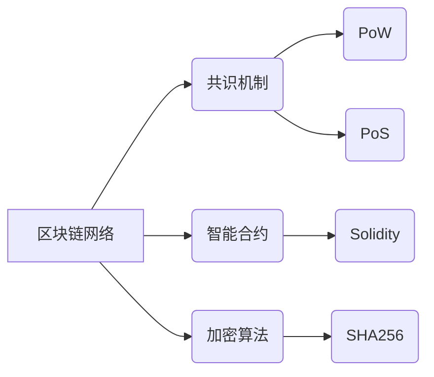

## 一个基于区块链技术的应用系统原型设计与实现

作者：禅与计算机程序设计艺术

## 1. 背景介绍

### 1.1 区块链技术的兴起与发展

近年来，区块链技术作为一种颠覆性的技术，正在改变着各行各业的运作模式。其去中心化、安全透明、不可篡改等特性，为解决传统行业中的信任问题、数据安全问题等提供了新的思路。区块链技术最初应用于数字货币领域，如比特币，随后逐渐扩展到金融、供应链、医疗、教育等各个领域，展现出巨大的应用潜力。

### 1.2 区块链应用系统面临的挑战

尽管区块链技术发展迅速，但其应用系统的设计与实现仍然面临着诸多挑战：

* **性能瓶颈:** 区块链系统的交易速度和吞吐量仍然有限，难以满足大规模商业应用的需求。
* **安全性问题:**  智能合约漏洞、私钥管理不当等问题，可能导致资产损失或数据泄露。
* **易用性不足:**  区块链技术门槛较高，开发者需要掌握复杂的密码学、分布式系统等知识，增加了应用开发的难度。
* **监管合规:**  区块链技术的去中心化特性，对现有的法律法规和监管体系提出了新的挑战。

### 1.3 本文研究目标

本文旨在设计并实现一个基于区块链技术的应用系统原型，探讨如何利用区块链技术解决实际问题。通过原型系统的开发，深入研究区块链技术的核心概念、算法原理、应用场景，并总结区块链应用系统设计与实现的最佳实践。

## 2. 核心概念与联系

### 2.1 区块链基本概念

* **区块:**  包含一定数量交易信息的记录单元，按照时间顺序链接成链状结构。
* **交易:**  指在区块链网络中进行价值转移的行为，例如转账、数据交换等。
* **哈希函数:**  一种将任意长度的数据映射成固定长度字符串的算法，用于保证数据的完整性和不可篡改性。
* **共识机制:**  指区块链网络中节点就交易达成一致的算法，例如工作量证明（PoW）、权益证明（PoS）等。
* **智能合约:**  存储在区块链上的代码程序，可以自动执行预设的规则，例如自动支付、数据验证等。

### 2.2 区块链核心技术架构



## 3. 核心算法原理具体操作步骤

### 3.1 工作量证明（PoW）

PoW共识机制要求节点通过计算复杂的数学问题来获得记账权，第一个解决问题的节点将获得奖励，并将包含最新交易信息的区块添加到区块链中。

**操作步骤:**

1. 节点收集待处理的交易信息。
2. 节点将交易信息打包成一个区块。
3. 节点不断尝试不同的随机数，计算区块的哈希值，直到找到满足特定条件的哈希值。
4. 找到满足条件的哈希值的节点将区块广播到整个网络。
5. 其他节点验证区块的有效性，并将其添加到自己的区块链副本中。

### 3.2 权益证明（PoS）

PoS共识机制根据节点持有的代币数量来分配记账权，持币数量越多的节点获得记账权的概率越高。

**操作步骤:**

1. 节点根据其持有的代币数量获得投票权。
2. 节点对候选区块进行投票。
3. 获得最多投票的区块被添加到区块链中。
4. 参与投票的节点获得代币奖励。

## 4. 数学模型和公式详细讲解举例说明

### 4.1 哈希函数

哈希函数是一种将任意长度的数据映射成固定长度字符串的算法，其具有以下特性：

* **单向性:**  无法通过哈希值反推出原始数据。
* **抗碰撞性:**  找到两个不同的数据产生相同的哈希值非常困难。

例如，SHA256哈希函数可以将任意长度的数据转换成256位的哈希值。

**示例:**

```
SHA256("Hello World") = 
a591a6d40df42040aa01d7c7f6986e83f5f1453d7d371242f09d7a0111f5f0de
```

### 4.2 Merkle树

Merkle树是一种树形数据结构，用于高效地验证大量数据的完整性。每个叶节点存储数据的哈希值，非叶节点存储其子节点哈希值的哈希值。

**示例:**

假设有4个数据块A、B、C、D，其哈希值分别为H(A)、H(B)、H(C)、H(D)。构建Merkle树的步骤如下:

1. 计算A和B的哈希值H(AB) = H(H(A) + H(B))。
2. 计算C和D的哈希值H(CD) = H(H(C) + H(D))。
3. 计算H(AB)和H(CD)的哈希值H(ABCD) = H(H(AB) + H(CD))。

最终得到的H(ABCD)就是Merkle树的根节点，它代表了所有数据块的哈希值。

## 5. 项目实践：代码实例和详细解释说明

### 5.1 开发环境搭建

* **操作系统:** Ubuntu 20.04
* **编程语言:**  Go
* **区块链平台:**  Hyperledger Fabric
* **开发工具:**  Visual Studio Code

### 5.2 智能合约编写

```go
package main

import (
	"fmt"

	"github.com/hyperledger/fabric-contract-api-go/contractapi"
)

// SmartContract ...
type SmartContract struct {
	contractapi.Contract
}

// Asset ...
type Asset struct {
	ID      string `json:"ID"`
	Name    string `json:"name"`
	Owner   string `json:"owner"`
	Value   int    `json:"value"`
}

// CreateAsset ...
func (s *SmartContract) CreateAsset(ctx contractapi.TransactionContextInterface, id string, name string, owner string, value int) error {
	asset := Asset{
		ID:      id,
		Name:    name,
		Owner:   owner,
		Value:   value,
	}

	assetJSON, err := json.Marshal(asset)
	if err != nil {
		return err
	}

	return ctx.GetStub().PutState(id, assetJSON)
}

// ReadAsset ...
func (s *SmartContract) ReadAsset(ctx contractapi.TransactionContextInterface, id string) (*Asset, error) {
	assetJSON, err := ctx.GetStub().GetState(id)
	if err != nil {
		return nil, fmt.Errorf("failed to read from world state. %s", err.Error())
	}
	if assetJSON == nil {
		return nil, fmt.Errorf("the asset %s does not exist", id)
	}

	var asset Asset
	err = json.Unmarshal(assetJSON, &asset)
	if err != nil {
		return nil, err
	}

	return &asset, nil
}

// UpdateAsset ...
func (s *SmartContract) UpdateAsset(ctx contractapi.TransactionContextInterface, id string, name string, owner string, value int) error {
	asset, err := s.ReadAsset(ctx, id)
	if err != nil {
		return err
	}

	asset.Name = name
	asset.Owner = owner
	asset.Value = value

	assetJSON, err := json.Marshal(asset)
	if err != nil {
		return err
	}

	return ctx.GetStub().PutState(id, assetJSON)
}

// DeleteAsset ...
func (s *SmartContract) DeleteAsset(ctx contractapi.TransactionContextInterface, id string) error {
	return ctx.GetStub().DelState(id)
}

func main() {
	chaincode, err := contractapi.NewChaincode(new(SmartContract))
	if err != nil {
		fmt.Printf("Error create chaincode: %s", err.Error())
		return
	}

	if err := chaincode.Start(); err != nil {
		fmt.Printf("Error starting chaincode: %s", err.Error())
	}
}
```

### 5.3 应用系统开发

* **前端开发:**  使用 React 框架开发用户界面，与区块链网络交互。
* **后端开发:**  使用 Node.js 开发 RESTful API，连接前端与智能合约。

## 6. 实际应用场景

### 6.1 供应链管理

* 利用区块链技术追踪商品的生产、运输、销售全过程，实现供应链透明化、可追溯。
* 提高供应链效率，降低成本，防止假冒伪劣产品。

### 6.2 数字身份认证

* 利用区块链技术构建安全的数字身份认证系统，保障用户身份信息的真实性和安全性。
* 简化身份验证流程，提高效率，降低成本。

### 6.3 医疗数据共享

* 利用区块链技术实现医疗数据的安全共享，促进医疗机构之间的数据互通。
* 提高医疗数据安全性和隐私保护，促进医疗研究和创新。

## 7. 工具和资源推荐

### 7.1 区块链平台

* **Hyperledger Fabric:**  企业级区块链平台，提供高性能、可扩展性、安全性。
* **Ethereum:**  开源的区块链平台，支持智能合约开发和去中心化应用。

### 7.2 开发工具

* **Truffle:**  以太坊智能合约开发框架，提供编译、测试、部署等功能。
* **Remix:**  基于浏览器的 Solidity 智能合约开发 IDE，方便快捷。

## 8. 总结：未来发展趋势与挑战

### 8.1 未来发展趋势

* **跨链互操作性:**  实现不同区块链网络之间的数据互通，打破数据孤岛。
* **隐私保护:**  探索更有效的隐私保护技术，保障用户数据安全和隐私。
* **性能提升:**  研究更高效的共识机制和扩展方案，提高区块链系统的性能。

### 8.2 面临的挑战

* **技术标准化:**  制定统一的区块链技术标准，促进技术发展和应用落地。
* **法律法规:**  完善区块链技术相关的法律法规，规范市场秩序，保障用户权益。
* **人才培养:**  加强区块链技术人才培养，满足行业发展需求。

## 9. 附录：常见问题与解答

### 9.1 区块链技术与传统数据库的区别？

区块链技术是一种分布式账本技术，数据存储在多个节点上，具有去中心化、不可篡改等特性。传统数据库通常采用集中式架构，数据存储在单个服务器上，安全性较低。

### 9.2 智能合约是什么？

智能合约是存储在区块链上的代码程序，可以自动执行预设的规则，例如自动支付、数据验证等。

### 9.3 区块链技术的应用场景有哪些？

区块链技术的应用场景非常广泛，包括供应链管理、数字身份认证、医疗数据共享、金融服务、物联网等。