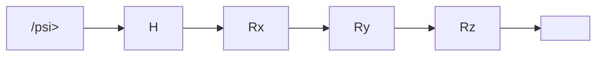
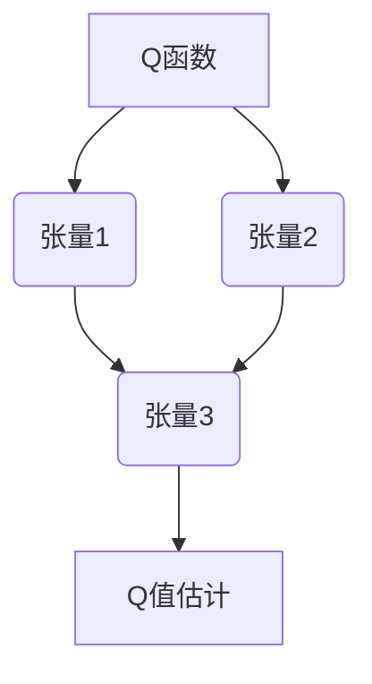

# 一切皆是映射：AI Q-learning在量子计算中的探索

## 1.背景介绍

### 1.1 量子计算的兴起

量子计算是一种全新的计算范式,利用量子力学的原理来执行计算操作。相比传统的经典计算机,量子计算机具有并行处理、快速搜索和高效模拟等优势,在解决某些复杂问题时有着巨大的潜力。随着量子计算技术的不断进步,人们对于量子算法的研究越来越深入,期望能在量子计算机上实现各种高效的算法。

### 1.2 强化学习与Q-learning

强化学习(Reinforcement Learning)是机器学习的一个重要分支,它通过与环境的交互来学习如何进行最优决策,以最大化预期的累积奖励。Q-learning是强化学习中最著名和最成功的算法之一,它通过估计状态-动作对的价值函数(Q函数),从而找到最优策略。

### 1.3 将Q-learning应用于量子计算

尽管Q-learning最初是为经典计算环境设计的,但近年来研究人员开始探索将其应用于量子计算环境。量子计算机的独特性质为Q-learning算法带来了新的挑战和机遇。通过将Q-learning与量子计算相结合,我们可以利用量子并行性来加速学习过程,并探索量子态的特殊性质来设计更有效的强化学习算法。

## 2.核心概念与联系  

### 2.1 量子计算基础

#### 2.1.1 量子比特(Qubit)

在经典计算中,信息单元是二进制位(bit),只能取0或1两种状态。而在量子计算中,信息单元是量子比特(qubit),它可以处于0和1的叠加态,即同时拥有0和1两种状态的概率分布。这种叠加态可以用一个复数来表示,其模长的平方给出了相应状态的概率。

$$
|\psi\rangle = \alpha|0\rangle + \beta|1\rangle
$$

其中$\alpha$和$\beta$是复数,满足$|\alpha|^2 + |\beta|^2 = 1$的归一化条件。

#### 2.1.2 量子门

与经典计算中使用逻辑门一样,量子计算也需要量子门来执行操作。量子门是一种单一量子态到另一个量子态的可逆转换,可以通过矩阵运算来实现。例如,NOT门可以用下面的矩阵表示:

$$
X = \begin{pmatrix}
0 & 1 \\
1 & 0
\end{pmatrix}
$$

#### 2.1.3 量子线路

量子线路是量子算法的基本表示形式,它由一系列量子门按照特定顺序排列而成。量子线路可以用一个量子电路图来可视化表示,其中每一行代表一个量子比特,每一个节点代表一个量子门操作。

上图展示了一个简单的量子线路,包含了Hadamard门(H)和一系列旋转门(Rx, Ry, Rz),将初始态$|\psi\rangle$转换为最终态$|\psi'\rangle$。

### 2.2 Q-learning基础

#### 2.2.1 马尔可夫决策过程(MDP)

Q-learning是一种解决马尔可夫决策过程(Markov Decision Process, MDP)的强化学习算法。MDP由以下几个要素组成:

- 状态集合 $\mathcal{S}$
- 动作集合 $\mathcal{A}$
- 转移概率 $\mathcal{P}_{ss'}^a = \Pr(s'|s, a)$,表示在状态$s$执行动作$a$后转移到状态$s'$的概率
- 奖励函数 $\mathcal{R}_s^a$,表示在状态$s$执行动作$a$获得的即时奖励

目标是找到一个策略$\pi: \mathcal{S} \rightarrow \mathcal{A}$,使得期望的累积奖励最大化。

#### 2.2.2 Q函数与Bellman方程

Q-learning的核心思想是估计状态-动作对的价值函数Q(s,a),也称为Q函数。Q(s,a)表示在状态s执行动作a,之后按照最优策略行动所能获得的期望累积奖励。Q函数满足以下Bellman方程:

$$
Q(s, a) = \mathbb{E}_{s'}\left[R_s^a + \gamma \max_{a'} Q(s', a')\right]
$$

其中$\gamma$是折扣因子,用于权衡即时奖励和长期奖励的权重。

#### 2.2.3 Q-learning算法

Q-learning算法通过与环境交互来逐步更新Q函数的估计值,直到收敛到最优Q函数。更新规则如下:

$$
Q(s, a) \leftarrow Q(s, a) + \alpha\left(R_s^a + \gamma \max_{a'} Q(s', a') - Q(s, a)\right)
$$

其中$\alpha$是学习率,控制着每次更新的幅度。

### 2.3 量子Q-learning

将Q-learning应用于量子计算环境时,需要考虑以下几个核心概念:

#### 2.3.1 量子环境

在量子Q-learning中,环境被建模为一个量子系统,其状态由一个量子态表示。代理与环境的交互也是量子化的,即代理对环境施加一系列单门或多门操作。

#### 2.3.2 量子Q函数

与经典Q函数类似,量子Q函数也是对状态-动作对的价值进行估计。但不同的是,量子Q函数是一个量子态,其中编码了所有状态-动作对的Q值信息。

#### 2.3.3 量子Q-learning算法

量子Q-learning算法的目标是通过与量子环境交互,逐步更新量子Q函数,直到收敛到最优策略。算法的具体实现方式因具体的量子环境和量子Q函数表示而有所不同,但核心思想是利用量子并行性来加速学习过程。

## 3.核心算法原理具体操作步骤

### 3.1 量子Q-learning算法流程

量子Q-learning算法的基本流程如下:

1. 初始化量子Q函数$|\Phi_0\rangle$,可以是任意初始态。
2. 对于每个时间步$t$:
    a) 从环境中获取当前状态$|s_t\rangle$
    b) 将$|s_t\rangle$与$|\Phi_{t-1}\rangle$耦合,得到联合态$|s_t\rangle \otimes |\Phi_{t-1}\rangle$
    c) 对联合态应用量子Q函数估计电路$U_Q$,得到$U_Q(|s_t\rangle \otimes |\Phi_{t-1}\rangle)$
    d) 测量$U_Q(|s_t\rangle \otimes |\Phi_{t-1}\rangle)$,获得估计的Q值$\{Q(s_t, a)\}$
    e) 根据$\{Q(s_t, a)\}$选择动作$a_t$,并将其应用于环境
    f) 获取即时奖励$r_t$和新状态$|s_{t+1}\rangle$
    g) 更新量子Q函数$|\Phi_t\rangle$,使其更接近最优Q函数

3. 重复步骤2,直到收敛或达到最大迭代次数。

上述流程中,关键步骤是量子Q函数估计电路$U_Q$的设计,以及量子Q函数更新规则的确定。不同的算法在这两个方面有所不同,我们将在后续章节中介绍几种典型的量子Q-learning算法。

### 3.2 量子Q函数表示

量子Q函数的表示方式对于算法的实现和性能至关重要。常见的表示方式包括:

#### 3.2.1 基于振幅编码

在这种表示中,量子Q函数$|\Phi\rangle$是一个量子态,其中每个基矢$|s, a\rangle$对应于一个状态-动作对,振幅的模值平方$|\langle s, a|\Phi\rangle|^2$就是该状态-动作对的Q值估计。

$$
|\Phi\rangle = \sum_{s, a} \langle s, a|\Phi\rangle|s, a\rangle
$$

这种表示的优点是可以利用量子并行性来同时估计所有状态-动作对的Q值。但是,随着状态和动作空间的增大,所需的量子比特数也会迅速增加,导致实现复杂度上升。

#### 3.2.2 基于量子张量网络

量子张量网络(Quantum Tensor Network, QTN)是一种用于高效表示和操作量子态的方法。在QTN中,量子Q函数被表示为一个张量网络,其中每个张量对应于一个局部结构,而整个网络则描述了整个量子态。

使用QTN表示量子Q函数可以减少所需的量子比特数,并提高计算效率。但是,构建和优化QTN本身就是一个挑战,需要设计合适的网络结构和张量分解方法。

### 3.3 量子Q函数更新

更新量子Q函数是量子Q-learning算法的核心步骤,其目标是使量子Q函数逐渐逼近最优Q函数。常见的更新方法包括:

#### 3.3.1 基于梯度下降的更新

类似于经典Q-learning中的更新规则,我们可以定义一个损失函数,表示量子Q函数与目标Q函数之间的差异。然后,通过梯度下降法对量子Q函数进行优化,使损失函数最小化。

$$
\mathcal{L}(|\Phi\rangle) = \sum_{s, a} \left(\langle s, a|\Phi\rangle - Q(s, a)\right)^2
$$

其中$Q(s, a)$是目标Q函数,可以根据Bellman方程计算得到。梯度下降更新规则为:

$$
|\Phi\rangle \leftarrow |\Phi\rangle - \eta \frac{\partial \mathcal{L}}{\partial |\Phi\rangle}
$$

这种方法的优点是直观和易于实现,但需要计算梯度,并且可能存在局部最优的问题。

#### 3.3.2 基于量子主题算法的更新

量子主题算法(Quantum Metropolis Sampling)是一种基于马尔可夫链蒙特卡罗(MCMC)方法的量子算法,可以用于采样目标分布。我们可以将目标Q函数视为一个分布,并使用量子主题算法来逐步更新量子Q函数,使其逼近目标分布。

具体步骤如下:

1. 初始化一个试探态$|\Psi_0\rangle$,通常与初始量子Q函数$|\Phi_0\rangle$相同。
2. 对于每个时间步$t$:
    a) 从当前试探态$|\Psi_{t-1}\rangle$出发,通过应用一个扰动算子$U_P$生成一个新的试探态$|\Psi_t'\rangle = U_P|\Psi_{t-1}\rangle$。
    b) 计算新试探态与目标Q函数之间的比值$r = \frac{P(|\Psi_t'\rangle)}{P(|\Psi_{t-1}\rangle)}$,其中$P$是目标分布。
    c) 以概率$\min(1, r)$接受新试探态$|\Psi_t\rangle = |\Psi_t'\rangle$,否则保持原试探态$|\Psi_t\rangle = |\Psi_{t-1}\rangle$。

3. 重复步骤2,直到收敛或达到最大迭代次数。

这种方法的优点是可以有效避免陷入局部最优,但需要设计合适的扰动算子$U_P$,并且收敛速度可能较慢。

## 4.数学模型和公式详细讲解举例说明

在本节中,我们将详细讨论量子Q-learning算法中涉及的一些重要数学模型和公式,并给出具体的例子和说明。

### 4.1 量子态表示

#### 4.1.1 计算基矢表示

在量子计算中,我们通常使用计算基矢$|i\rangle$来表示量子态,其中$i$是一个二进制字符串,对应于量子比特的0/1配置。例如,对于两个量子比特,我们有四个计算基矢:

$$
|00\rangle, |01\rangle, |10\rangle,