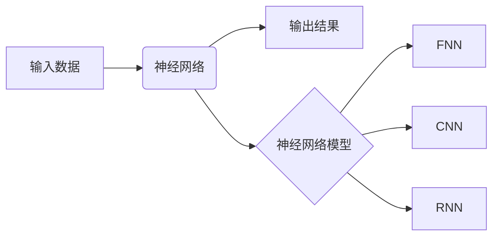

## 一切皆是映射：天气预测中的神经网络模型应用

作者：禅与计算机程序设计艺术

## 1. 背景介绍

### 1.1 天气预测的挑战

天气预报，这一关乎民生福祉的重要领域，始终面临着巨大的挑战。大气的混沌特性、复杂多变的气象因素以及海量数据的处理需求，使得传统的天气预测方法难以满足日益增长的精度和时效性要求。

### 1.2 神经网络的崛起

近年来，随着人工智能技术的飞速发展，神经网络以其强大的非线性映射能力和自适应学习能力，为天气预测带来了新的希望。神经网络能够从海量气象数据中学习复杂的模式和规律，从而实现对未来天气的精准预测。

### 1.3 本文目的

本文旨在探讨神经网络在天气预测中的应用，深入剖析其核心原理、算法步骤、数学模型以及项目实践，并展望其未来发展趋势和挑战。

## 2. 核心概念与联系

### 2.1 人工神经网络

人工神经网络 (Artificial Neural Network, ANN) 是一种模拟人脑神经元结构和功能的计算模型，由大量 interconnected nodes (neurons) 组成，每个节点代表一个特定 function，节点之间通过 weighted connections 相互连接。

### 2.2 神经网络与映射

神经网络本质上是一种复杂的非线性映射函数，它能够将输入数据映射到输出结果。在天气预测中，输入数据可以是历史气象数据、地理信息等，输出结果则是对未来天气的预测。

### 2.3 常见神经网络模型

#### 2.3.1 前馈神经网络 (Feedforward Neural Network, FNN)

FNN是最基本的神经网络结构，信息单向流动，从输入层经过隐藏层最终到达输出层。

#### 2.3.2 卷积神经网络 (Convolutional Neural Network, CNN)

CNN擅长处理图像数据，通过卷积操作提取图像特征，在天气预测中可用于分析卫星云图等。

#### 2.3.3 循环神经网络 (Recurrent Neural Network, RNN)

RNN能够处理序列数据，具有记忆功能，适用于分析时间序列气象数据。

### 2.4 核心概念联系图



## 3. 核心算法原理具体操作步骤

### 3.1 数据预处理

#### 3.1.1 数据清洗

去除异常值、缺失值，保证数据质量。

#### 3.1.2 数据归一化

将数据缩放到特定范围，提高模型训练效率。

#### 3.1.3 数据集划分

将数据集划分为训练集、验证集和测试集。

### 3.2 模型构建

#### 3.2.1 选择网络结构

根据数据特点和预测目标选择合适的网络结构，如 FNN、CNN、RNN 等。

#### 3.2.2 确定网络参数

设置网络层数、节点数、激活函数等参数。

### 3.3 模型训练

#### 3.3.1 损失函数

定义模型预测值与真实值之间的差距，如均方误差 (Mean Squared Error, MSE)。

#### 3.3.2 优化算法

采用优化算法 (如梯度下降) 调整网络参数，最小化损失函数。

#### 3.3.3 迭代训练

反复迭代训练模型，直到达到预设精度或迭代次数。

### 3.4 模型评估

#### 3.4.1 预测精度

使用测试集评估模型预测精度，如准确率、召回率等。

#### 3.4.2 模型泛化能力

评估模型对新数据的预测能力，避免过拟合。

## 4. 数学模型和公式详细讲解举例说明

### 4.1 前馈神经网络

#### 4.1.1 单层感知机

$$
y = f(w^Tx + b)
$$

其中：

*  $y$ 为输出
*  $x$ 为输入向量
*  $w$ 为权重向量
*  $b$ 为偏置
*  $f$ 为激活函数

#### 4.1.2 多层感知机

$$
y = f_n(...f_2(f_1(w_1^Tx + b_1)w_2 + b_2)...w_n + b_n)
$$

其中：

*  $n$ 为网络层数
*  $f_i$ 为第 $i$ 层的激活函数
*  $w_i$ 为第 $i$ 层的权重矩阵
*  $b_i$ 为第 $i$ 层的偏置向量

### 4.2 卷积神经网络

#### 4.2.1 卷积操作

$$
S(i,j) = (I * K)(i,j) = \sum_m \sum_n I(m,n)K(i-m, j-n)
$$

其中：

*  $S$ 为卷积后的特征图
*  $I$ 为输入图像
*  $K$ 为卷积核

#### 4.2.2 池化操作

池化操作用于降低特征图维度，如最大池化：

$$
P(i,j) = max(S(i,j), S(i+1,j), S(i,j+1), S(i+1,j+1))
$$

### 4.3 循环神经网络

#### 4.3.1 循环单元

$$
h_t = f(W_{xh}x_t + W_{hh}h_{t-1} + b_h)
$$

其中：

*  $h_t$ 为当前时刻的隐藏状态
*  $x_t$ 为当前时刻的输入
*  $h_{t-1}$ 为上一时刻的隐藏状态
*  $W_{xh}$ 为输入到隐藏状态的权重矩阵
*  $W_{hh}$ 为隐藏状态到隐藏状态的权重矩阵
*  $b_h$ 为偏置向量

## 5. 项目实践：代码实例和详细解释说明

### 5.1 数据集

使用历史气象数据，包括温度、湿度、气压、风速等，以及地理信息数据。

### 5.2 代码实例

```python
import tensorflow as tf

# 定义模型
model = tf.keras.models.Sequential([
  tf.keras.layers.Dense(64, activation='relu', input_shape=(input_dim,)),
  tf.keras.layers.Dense(32, activation='relu'),
  tf.keras.layers.Dense(output_dim)
])

# 编译模型
model.compile(optimizer='adam', loss='mse')

# 训练模型
model.fit(X_train, y_train, epochs=100, validation_data=(X_val, y_val))

# 评估模型
loss, accuracy = model.evaluate(X_test, y_test)

# 预测未来天气
predictions = model.predict(X_new)
```

### 5.3 代码解释

*  使用 TensorFlow 构建神经网络模型。
*  定义模型结构，包括输入层、隐藏层和输出层。
*  使用 ReLU 作为激活函数。
*  使用 Adam 优化器和 MSE 损失函数。
*  训练模型并评估其性能。
*  使用训练好的模型预测未来天气。

## 6. 实际应用场景

### 6.1 短期天气预报

利用神经网络预测未来几小时或几天的天气状况，为公众出行、农业生产等提供参考。

### 6.2 极端天气预警

预测暴雨、台风、干旱等极端天气事件，为灾害防治提供决策支持。

### 6.3 气候变化研究

分析长期气象数据，预测未来气候变化趋势，为环境保护和可持续发展提供科学依据。

## 7. 工具和资源推荐

### 7.1 TensorFlow

深度学习框架，提供丰富的 API 和工具，方便构建和训练神经网络模型。

### 7.2 Keras

高级神经网络 API，简化模型构建和训练过程，易于上手。

### 7.3 PyTorch

另一个流行的深度学习框架，灵活易用，支持动态计算图。

### 7.4 气象数据源

*  国家气象信息中心：http://data.cma.cn/
*  美国国家海洋和大气管理局 (NOAA)：https://www.noaa.gov/
*  欧洲中期天气预报中心 (ECMWF)：https://www.ecmwf.int/

## 8. 总结：未来发展趋势与挑战

### 8.1 趋势

*  更精确的预测：随着模型和算法的不断改进，天气预报精度将进一步提高。
*  更精细的预测：神经网络能够实现对更小区域、更短时间尺度的精细化天气预报。
*  更智能的预测：结合其他人工智能技术，如专家系统、知识图谱等，实现更智能的天气预测。

### 8.2 挑战

*  数据质量：气象数据的准确性和完整性对预测精度至关重要。
*  模型解释性：神经网络模型的决策过程难以解释，需要开发更具解释性的模型。
*  计算资源：训练和运行复杂的神经网络模型需要大量的计算资源。

## 9. 附录：常见问题与解答

### 9.1 为什么神经网络能够用于天气预测？

神经网络具有强大的非线性映射能力，能够从海量气象数据中学习复杂的模式和规律，从而实现对未来天气的精准预测。

### 9.2 天气预测中常用的神经网络模型有哪些？

常用的模型包括前馈神经网络 (FNN)、卷积神经网络 (CNN) 和循环神经网络 (RNN)。

### 9.3 神经网络天气预测的未来发展趋势是什么？

未来将朝着更精确、更精细、更智能的方向发展。

### 9.4 如何提高神经网络天气预测的精度？

可以通过改进数据质量、优化模型结构、采用更先进的算法等方法提高预测精度。
