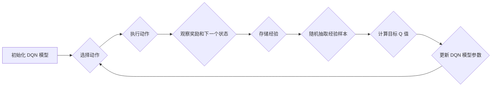

# 一切皆是映射：构建你的第一个DQN模型：步骤和实践

作者：禅与计算机程序设计艺术

## 1. 背景介绍

### 1.1 强化学习的崛起

近年来，强化学习 (Reinforcement Learning, RL) 作为机器学习的一个重要分支，在游戏、机器人控制、自动驾驶等领域取得了瞩目的成就。强化学习的核心思想是让智能体 (Agent) 通过与环境的交互，不断学习和改进自身的策略，以获得最大化的累积奖励。

### 1.2 深度强化学习：DQN 的诞生

深度强化学习 (Deep Reinforcement Learning, DRL) 将深度学习的强大表征能力与强化学习的决策能力相结合，使得智能体能够在更加复杂的环境中学习和执行任务。Deep Q-Network (DQN) 是一种经典的深度强化学习算法，它利用深度神经网络来近似 Q 函数，并通过经验回放 (Experience Replay) 和目标网络 (Target Network) 等技术来提高学习的稳定性和效率。

### 1.3 本文的意义：构建你的第一个 DQN 模型

本文旨在为初学者提供一个清晰、易懂的 DQN 模型构建指南。我们将从基础概念出发，逐步讲解 DQN 算法的原理、操作步骤以及代码实现，并通过一个简单的游戏实例来演示 DQN 模型的训练和应用。

## 2. 核心概念与联系

### 2.1 强化学习的基本要素

强化学习系统通常由以下几个核心要素组成：

* **智能体 (Agent)**:  学习者和决策者，它与环境交互并根据环境的反馈调整自身的行为。
* **环境 (Environment)**: 智能体所处的外部世界，它包含状态、动作以及奖励等信息。
* **状态 (State)**: 描述环境当前情况的信息，例如游戏中的玩家位置、得分等。
* **动作 (Action)**: 智能体可以采取的行为，例如游戏中的移动、攻击等。
* **奖励 (Reward)**: 环境对智能体行为的反馈，通常是一个数值，用于激励智能体学习最优策略。

### 2.2 Q 学习：基于价值的学习方法

Q 学习是一种基于价值的强化学习方法，它的目标是学习一个 Q 函数，该函数可以预测在给定状态下采取某个动作的预期累积奖励。Q 函数的更新规则如下：

$$Q(s,a) \leftarrow Q(s,a) + \alpha [r + \gamma \max_{a'} Q(s',a') - Q(s,a)]$$

其中：

* $s$ 为当前状态
* $a$ 为当前动作
* $r$ 为采取动作 $a$ 后获得的奖励
* $s'$ 为下一个状态
* $a'$ 为下一个状态下可采取的动作
* $\alpha$ 为学习率
* $\gamma$ 为折扣因子

### 2.3 DQN：深度神经网络与 Q 学习的结合

DQN 算法使用深度神经网络来近似 Q 函数，并通过以下技术来提高学习的稳定性和效率：

* **经验回放 (Experience Replay)**: 将智能体与环境交互的经验 (状态、动作、奖励、下一个状态) 存储在一个经验池中，并从中随机抽取样本进行训练，以打破数据之间的相关性，提高学习的稳定性。
* **目标网络 (Target Network)**: 使用一个独立的网络来计算目标 Q 值，并周期性地将主网络的参数复制到目标网络，以减少目标 Q 值的波动，提高学习的效率。

## 3. 核心算法原理具体操作步骤

### 3.1 算法流程图



### 3.2 算法步骤详解

1. **初始化 DQN 模型**: 创建一个深度神经网络，用于近似 Q 函数。
2. **选择动作**: 根据当前状态，使用 ε-greedy 策略选择动作。ε-greedy 策略以概率 ε 选择随机动作，以概率 1-ε 选择 Q 值最大的动作。
3. **执行动作**: 在环境中执行选择的动作。
4. **观察奖励和下一个状态**: 观察执行动作后获得的奖励和环境的下一个状态。
5. **存储经验**: 将当前状态、动作、奖励、下一个状态存储在经验池中。
6. **随机抽取经验样本**: 从经验池中随机抽取一批经验样本。
7. **计算目标 Q 值**: 使用目标网络计算目标 Q 值：

   $$y_i = r_i + \gamma \max_{a'} Q(s'_{i},a';\theta^{-})$$

   其中：

   * $y_i$ 为目标 Q 值
   * $r_i$ 为第 $i$ 个样本的奖励
   * $s'_i$ 为第 $i$ 个样本的下一个状态
   * $\theta^{-}$ 为目标网络的参数

8. **更新 DQN 模型参数**: 使用梯度下降法更新 DQN 模型的参数，以最小化目标 Q 值与预测 Q 值之间的均方误差。

## 4. 数学模型和公式详细讲解举例说明

### 4.1 Q 函数的数学模型

Q 函数的数学模型可以表示为：

$$Q(s,a;\theta) = f(s,a;\theta)$$

其中：

* $s$ 为状态
* $a$ 为动作
* $\theta$ 为神经网络的参数
* $f$ 为神经网络函数

### 4.2 均方误差损失函数

DQN 算法使用均方误差 (Mean Squared Error, MSE) 损失函数来衡量目标 Q 值与预测 Q 值之间的差异：

$$L(\theta) = \frac{1}{N} \sum_{i=1}^{N} (y_i - Q(s_i,a_i;\theta))^2$$

其中：

* $N$ 为样本数量
* $y_i$ 为第 $i$ 个样本的目标 Q 值
* $s_i$ 为第 $i$ 个样本的状态
* $a_i$ 为第 $i$ 个样本的动作

### 4.3 梯度下降法更新参数

DQN 算法使用梯度下降法来更新神经网络的参数：

$$\theta \leftarrow \theta - \alpha \nabla_{\theta} L(\theta)$$

其中：

* $\alpha$ 为学习率
* $\nabla_{\theta} L(\theta)$ 为损失函数对参数 $\theta$ 的梯度

## 5. 项目实践：代码实例和详细解释说明

### 5.1 CartPole 游戏环境

我们将使用 OpenAI Gym 中的 CartPole 游戏环境来演示 DQN 模型的训练和应用。CartPole 游戏的目标是控制一根杆子使其立起来，并防止它倒下。

### 5.2 代码实例

```python
import gym
import tensorflow as tf
import numpy as np

# 创建 CartPole 游戏环境
env = gym.make('CartPole-v1')

# 定义 DQN 模型
class DQN(tf.keras.Model):
    def __init__(self, num_actions):
        super(DQN, self).__init__()
        self.dense1 = tf.keras.layers.Dense(128, activation='relu')
        self.dense2 = tf.keras.layers.Dense(num_actions)

    def call(self, state):
        x = self.dense1(state)
        return self.dense2(x)

# 定义经验池
class ReplayBuffer:
    def __init__(self, capacity):
        self.buffer = []
        self.capacity = capacity

    def add(self, experience):
        if len(self.buffer) >= self.capacity:
            self.buffer.pop(0)
        self.buffer.append(experience)

    def sample(self, batch_size):
        indices = np.random.choice(len(self.buffer), batch_size)
        return [self.buffer[i] for i in indices]

# 定义训练参数
num_episodes = 1000
batch_size = 32
gamma = 0.99
epsilon = 1.0
epsilon_decay = 0.995
epsilon_min = 0.01
learning_rate = 1e-3

# 创建 DQN 模型、目标网络和经验池
num_actions = env.action_space.n
model = DQN(num_actions)
target_model = DQN(num_actions)
target_model.set_weights(model.get_weights())
replay_buffer = ReplayBuffer(10000)

# 定义优化器
optimizer = tf.keras.optimizers.Adam(learning_rate=learning_rate)

# 训练 DQN 模型
for episode in range(num_episodes):
    state = env.reset()
    done = False
    total_reward = 0
    while not done:
        # 选择动作
        if np.random.rand() < epsilon:
            action = env.action_space.sample()
        else:
            q_values = model(np.expand_dims(state, axis=0))
            action = np.argmax(q_values)

        # 执行动作
        next_state, reward, done, _ = env.step(action)

        # 存储经验
        replay_buffer.add((state, action, reward, next_state, done))

        # 更新状态和总奖励
        state = next_state
        total_reward += reward

        # 训练模型
        if len(replay_buffer.buffer) > batch_size:
            # 随机抽取经验样本
            batch = replay_buffer.sample(batch_size)
            states, actions, rewards, next_states, dones = zip(*batch)

            # 计算目标 Q 值
            q_values_next = target_model(np.array(next_states))
            target_q_values = rewards + gamma * np.max(q_values_next, axis=1) * (1 - np.array(dones))

            # 计算预测 Q 值
            with tf.GradientTape() as tape:
                q_values = model(np.array(states))
                action_masks = tf.one_hot(actions, num_actions)
                predicted_q_values = tf.reduce_sum(q_values * action_masks, axis=1)

                # 计算损失
                loss = tf.reduce_mean(tf.square(target_q_values - predicted_q_values))

            # 更新模型参数
            gradients = tape.gradient(loss, model.trainable_variables)
            optimizer.apply_gradients(zip(gradients, model.trainable_variables))

    # 更新目标网络
    if episode % 10 == 0:
        target_model.set_weights(model.get_weights())

    # 衰减 epsilon
    epsilon = max(epsilon * epsilon_decay, epsilon_min)

    # 打印训练结果
    print(f"Episode: {episode}, Total Reward: {total_reward}")

# 测试 DQN 模型
state = env.reset()
done = False
total_reward = 0
while not done:
    # 选择动作
    q_values = model(np.expand_dims(state, axis=0))
    action = np.argmax(q_values)

    # 执行动作
    next_state, reward, done, _ = env.step(action)

    # 更新状态和总奖励
    state = next_state
    total_reward += reward

# 打印测试结果
print(f"Total Reward: {total_reward}")
```

### 5.3 代码解释

* 首先，我们创建 CartPole 游戏环境，并定义 DQN 模型、目标网络和经验池。
* 然后，我们定义训练参数，包括 episode 数量、batch 大小、折扣因子、epsilon 初始值、epsilon 衰减率、epsilon 最小值以及学习率。
* 在训练循环中，我们使用 ε-greedy 策略选择动作，执行动作，观察奖励和下一个状态，并将经验存储在经验池中。
* 当经验池中的样本数量足够多时，我们随机抽取一批经验样本，计算目标 Q 值和预测 Q 值，并使用梯度下降法更新 DQN 模型的参数。
* 我们周期性地将主网络的参数复制到目标网络，以减少目标 Q 值的波动，提高学习的效率。
* 最后，我们测试训练好的 DQN 模型，并打印测试结果。

## 6. 实际应用场景

### 6.1 游戏 AI

DQN 算法在游戏 AI 领域有着广泛的应用，例如：

* **Atari 游戏**: DQN 算法在 Atari 2600 游戏中取得了超越人类水平的成绩。
* **围棋**: AlphaGo 和 AlphaZero 等围棋 AI 程序也使用了 DQN 算法。

### 6.2 机器人控制

DQN 算法可以用于机器人控制，例如：

* **机械臂控制**: DQN 算法可以训练机械臂完成抓取、放置等任务。
* **移动机器人导航**: DQN 算法可以训练移动机器人避开障碍物，到达目标位置。

### 6.3 自动驾驶

DQN 算法可以用于自动驾驶，例如：

* **路径规划**: DQN 算法可以训练自动驾驶汽车规划最优路径。
* **交通信号灯识别**: DQN 算法可以训练自动驾驶汽车识别交通信号灯。

## 7. 工具和资源推荐

### 7.1 OpenAI Gym

OpenAI Gym 是一个用于开发和比较强化学习算法的工具包，它提供了各种各样的游戏环境和机器人模拟器。

### 7.2 TensorFlow

TensorFlow 是一个开源的机器学习平台，它提供了丰富的 API 用于构建和训练深度学习模型。

### 7.3 Keras

Keras 是一个高级神经网络 API，它运行在 TensorFlow 之上，提供了更加简洁易用的 API 用于构建和训练深度学习模型。

## 8. 总结：未来发展趋势与挑战

### 8.1 未来发展趋势

* **更强大的深度学习模型**: 随着深度学习技术的不断发展，我们可以构建更加强大的深度学习模型来近似 Q 函数，以提高 DQN 算法的性能。
* **更有效的探索策略**: ε-greedy 策略是一种简单的探索策略，未来我们可以探索更加有效的探索策略，以提高 DQN 算法的学习效率。
* **多智能体强化学习**: DQN 算法可以扩展到多智能体强化学习场景，以解决更加复杂的任务。

### 8.2 挑战

* **样本效率**: DQN 算法需要大量的训练样本才能收敛，提高样本效率是一个重要的挑战。
* **泛化能力**: DQN 算法的泛化能力有限，如何提高 DQN 模型的泛化能力是一个挑战。
* **可解释性**: DQN 模型的决策过程难以解释，提高 DQN 模型的可解释性是一个挑战。

## 9. 附录：常见问题与解答

### 9.1 什么是 Q 函数？

Q 函数是一个函数，它接受状态和动作作为输入，并输出在该状态下采取该动作的预期累积奖励。

### 9.2 什么是经验回放？

经验回放是一种技术，它将智能体与环境交互的经验存储在一个经验池中，并从中随机抽取样本进行训练，以打破数据之间的相关性，提高学习的稳定性。

### 9.3 什么是目标网络？

目标网络是一个独立的网络，它用于计算目标 Q 值，并周期性地将主网络的参数复制到目标网络，以减少目标 Q 值的波动，提高学习的效率。
