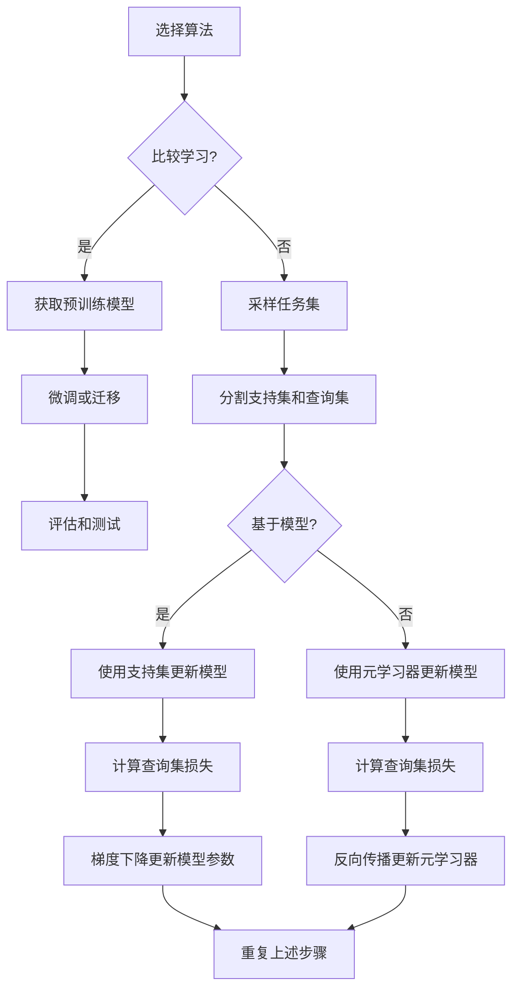

# 一切皆是映射：比较学习与元学习在自然语言处理中的应用

## 1.背景介绍

### 1.1 自然语言处理的挑战

自然语言处理(NLP)是人工智能领域中最具挑战性的任务之一。语言的复杂性和多样性带来了诸多困难,例如词义消歧、语义理解和上下文依赖性等。传统的机器学习方法往往需要大量的人工标注数据和特征工程,而这些都是昂贵和耗时的过程。

### 1.2 深度学习的兴起

近年来,深度学习技术在NLP领域取得了巨大成功,特别是transformer模型的出现极大地推动了这一进程。然而,这些模型需要大量的计算资源和海量的数据进行预训练,并且在面对新的领域或任务时往往需要从头开始训练,这无疑是一种资源的浪费。

### 1.3 比较学习与元学习的契机

为了解决上述问题,比较学习(transfer learning)和元学习(meta-learning)应运而生。这两种范式都旨在利用已有的知识来加速新任务的学习,从而提高数据效率和计算效率。比较学习关注如何将预训练模型中的知识迁移到新任务上,而元学习则着眼于从多个任务中学习一种通用的学习策略。

## 2.核心概念与联系

### 2.1 比较学习

比较学习的核心思想是利用在源领域学习到的知识来帮助目标领域的学习。在NLP中,常见的做法是使用大规模预训练语言模型(如BERT、GPT等)作为起点,然后在特定任务上进行微调(fine-tuning)。这种方法已经在多个NLP任务上取得了显著的成果。

### 2.2 元学习

元学习则是在更高的层次上进行学习,目标是学习一种通用的学习策略,使得在面对新的任务时,模型能够快速适应并取得良好的性能。常见的元学习方法包括基于模型的方法(如MAML、Reptile等)和基于优化的方法(如LSTM元学习器等)。

### 2.3 两者的联系与区别

比较学习和元学习都旨在提高数据和计算效率,但它们的侧重点不同。比较学习关注如何有效地迁移知识,而元学习则致力于学习一种通用的学习策略。两者并不是互相排斥的,事实上,它们可以很好地结合起来,形成一种更加强大的框架。

例如,我们可以首先使用比较学习的方法获得一个强大的初始模型,然后再使用元学习算法对其进行优化,使其能够快速适应新的任务。这种组合不仅能够利用预训练模型中的知识,同时也能够学习到一种高效的学习策略。

## 3.核心算法原理具体操作步骤

在这一部分,我们将详细介绍几种常见的比较学习和元学习算法的原理和操作步骤。

### 3.1 比较学习算法

#### 3.1.1 BERT微调

BERT(Bidirectional Encoder Representations from Transformers)是一种基于transformer的预训练语言模型,它通过掩蔽语言模型(Masked Language Model)和下一句预测(Next Sentence Prediction)两个预训练任务,学习到了丰富的语义和上下文信息。

BERT微调的步骤如下:

1. 获取预训练好的BERT模型权重
2. 在目标任务的数据集上,将输入文本映射为BERT的输入表示
3. 将BERT的输出层接上一个针对目标任务的输出层(如分类层或序列标注层)
4. 在目标任务的训练集上微调整个模型的参数
5. 在验证集上评估模型性能,选择最优模型
6. 在测试集上测试模型的泛化能力

#### 3.1.2 GPT微调

GPT(Generative Pre-trained Transformer)是一种基于transformer的生成式预训练语言模型,它通过掩蔽语言模型的预训练任务,学习到了丰富的语言生成能力。

GPT微调的步骤与BERT类似,不同之处在于:

1. 获取预训练好的GPT模型权重
2. 在目标任务的数据集上,将输入文本映射为GPT的输入表示
3. 将GPT的输出层接上一个针对目标任务的输出层(如序列生成层)
4. 在目标任务的训练集上微调整个模型的参数
5. 在验证集上评估模型性能,选择最优模型
6. 在测试集上测试模型的生成能力

#### 3.1.3 EFL (Embedding from Language)

EFL是一种简单而有效的比较学习方法,它利用预训练语言模型学习到的词向量作为初始化向量,然后在目标任务上进行微调。具体步骤如下:

1. 获取预训练语言模型(如BERT、GPT等)的词嵌入矩阵
2. 将目标任务的输入文本映射为词向量序列
3. 将词向量序列输入到一个浅层神经网络中(如CNN或LSTM)
4. 在目标任务的训练集上训练浅层网络的参数
5. 在验证集上评估模型性能,选择最优模型
6. 在测试集上测试模型的泛化能力

### 3.2 元学习算法

#### 3.2.1 MAML (Model-Agnostic Meta-Learning)

MAML是一种基于模型的元学习算法,它的目标是学习一个可以快速适应新任务的初始模型参数。算法步骤如下:

1. 从任务分布$p(\mathcal{T})$中采样一批任务$\{\mathcal{T}_i\}$
2. 对于每个任务$\mathcal{T}_i$:
    - 将数据分为支持集(support set)$\mathcal{D}_i^{tr}$和查询集(query set)$\mathcal{D}_i^{val}$
    - 使用支持集$\mathcal{D}_i^{tr}$对模型参数$\theta$进行一或几步梯度更新,得到适应当前任务的参数$\theta_i^{'} = u(\theta, \mathcal{D}_i^{tr})$
    - 在查询集$\mathcal{D}_i^{val}$上计算损失$\mathcal{L}_i(\theta_i^{'})$
3. 计算所有任务的损失之和$\sum_i \mathcal{L}_i(\theta_i^{'})$,并对原始参数$\theta$进行梯度下降更新

其中,梯度更新步骤由下式给出:

$$
\theta \leftarrow \theta - \alpha \nabla_\theta \sum_i \mathcal{L}_i(u(\theta, \mathcal{D}_i^{tr}))
$$

其中$\alpha$是学习率。通过这种方式,MAML能够找到一个好的初始参数$\theta$,使得在新的任务上只需少量数据和少量梯度步骤,就能够获得良好的性能。

#### 3.2.2 Reptile

Reptile是另一种基于模型的元学习算法,它的思路更加简单直接。算法步骤如下:

1. 初始化模型参数$\theta$
2. 重复以下步骤:
    - 从任务分布$p(\mathcal{T})$中采样一批任务$\{\mathcal{T}_i\}$
    - 对于每个任务$\mathcal{T}_i$:
        - 将数据分为支持集(support set)$\mathcal{D}_i^{tr}$和查询集(query set)$\mathcal{D}_i^{val}$
        - 使用支持集$\mathcal{D}_i^{tr}$对模型参数$\theta$进行几步梯度更新,得到适应当前任务的参数$\phi_i$
    - 计算所有任务的参数中心$\phi = \frac{1}{N}\sum_i \phi_i$
    - 将模型参数$\theta$向参数中心$\phi$移动一小步:$\theta \leftarrow \theta + \beta(\phi - \theta)$
    
其中$\beta$是一个小的步长参数。Reptile算法的思路是:先让模型在每个任务上进行适应,然后将所有适应后的模型参数取平均,作为一个中心点,再将原始模型参数向这个中心点移动一小步。通过这种方式,Reptile能够找到一个能够快速适应新任务的初始参数。

#### 3.2.3 优化器元学习

除了基于模型的方法,还有一类基于优化器的元学习方法。这种方法的思路是:使用一个元学习器(如LSTM等循环神经网络)来学习一个好的优化器,使得这个优化器能够在新的任务上快速找到好的解。

具体来说,我们将任务数据$\mathcal{D}_i$分为支持集$\mathcal{D}_i^{tr}$和查询集$\mathcal{D}_i^{val}$。元学习器将会根据支持集数据,输出一个用于更新模型参数的向量$\phi_i$。我们使用$\phi_i$对模型参数$\theta$进行更新,得到新的参数$\theta_i^{'}$。然后,我们在查询集$\mathcal{D}_i^{val}$上计算损失$\mathcal{L}_i(\theta_i^{'})$,并将其反向传播,更新元学习器的参数。通过这种方式,元学习器就能够学习到一种好的优化策略,使得在新的任务上只需少量数据,就能够快速找到好的解。

### 3.3 算法步骤总结

为了更好地理解上述算法,我们用一个流程图来总结一下它们的工作步骤:

可以看到,无论是比较学习还是元学习,它们都是在已有的知识或经验的基础上,通过一些聚类或优化的方式,来加速新任务的学习过程。

## 4.数学模型和公式详细讲解举例说明

在上一节中,我们介绍了几种常见的比较学习和元学习算法,其中也涉及到了一些数学公式。在这一节,我们将进一步详细地讲解其中的数学模型和公式。

### 4.1 MAML算法中的梯度更新公式

在MAML算法中,我们需要计算以下梯度:

$$
\theta \leftarrow \theta - \alpha \nabla_\theta \sum_i \mathcal{L}_i(u(\theta, \mathcal{D}_i^{tr}))
$$

这个公式的含义是:我们要更新初始参数$\theta$,使得在所有任务$\{\mathcal{T}_i\}$上,经过一步或几步梯度更新得到的适应性参数$\theta_i^{'}$,在对应的查询集$\mathcal{D}_i^{val}$上的损失之和最小。

为了更好地理解这个公式,我们先来看一个简单的例子。假设我们有一个二分类任务,使用逻辑回归模型,参数为$\theta = (w, b)$。对于一个数据点$(x, y)$,模型的预测为$\hat{y} = \sigma(w^Tx + b)$,其中$\sigma$是sigmoid函数。损失函数为交叉熵损失:

$$
\mathcal{L}(\theta; x, y) = -y\log\hat{y} - (1-y)\log(1-\hat{y})
$$

现在,我们有一个支持集$\mathcal{D}^{tr} = \{(x_1, y_1), (x_2, y_2), \dots, (x_n, y_n)\}$,我们使用梯度下降对$\theta$进行一步更新:

$$
\theta' = \theta - \alpha \nabla_\theta \sum_{i=1}^n \mathcal{L}(\theta; x_i, y_i)
$$

其中,梯度为:

$$
\begin{aligned}
\nabla_w \mathcal{L}(\theta; x, y) &= (\sigma(w^Tx + b) - y)x \\
\nabla_b \mathcal{L}(\theta; x, y) &= \sigma(w^Tx + b) - y
\end{aligned