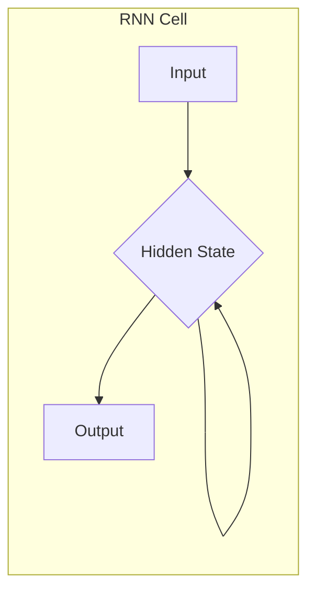

# 一切皆是映射：递归神经网络(RNN)和时间序列数据

作者：禅与计算机程序设计艺术

## 1. 背景介绍

### 1.1 时间序列数据的本质

时间序列数据是指按时间顺序排列的一系列数据点。 这些数据点可以是各种类型，例如股票价格、气温、语音信号、文本数据等。与静态数据不同，时间序列数据具有时间依赖性，即数据点之间存在着某种联系，这种联系可以是线性的，也可以是非线性的。

### 1.2 传统方法的局限性

传统机器学习方法，如线性回归、支持向量机等，在处理时间序列数据时存在一些局限性。 这些方法通常假设数据点之间是独立的，忽略了时间依赖性。 此外，这些方法难以捕捉数据中的非线性模式。

### 1.3 递归神经网络的优势

递归神经网络 (RNN) 是一种专门设计用于处理时间序列数据的深度学习模型。 RNN 的核心在于其循环结构，允许信息在网络中循环流动，从而捕捉时间依赖性。 与传统方法相比，RNN 具有以下优势：

* **捕捉时间依赖性:** RNN 可以通过循环结构学习数据点之间的联系，从而捕捉时间依赖性。
* **处理非线性模式:** RNN 可以通过非线性激活函数学习数据中的非线性模式。
* **灵活性和可扩展性:** RNN 可以处理各种类型的时间序列数据，并且可以根据需要调整网络结构。

## 2. 核心概念与联系

### 2.1 循环结构

RNN 的核心在于其循环结构，如下图所示。 循环结构允许信息在网络中循环流动，从而捕捉时间依赖性。 

* **输入:** RNN 接收一系列输入数据点，每个数据点对应一个时间步。
* **隐藏状态:** 隐藏状态存储了网络对过去信息的记忆。 在每个时间步，RNN 都会更新隐藏状态，以反映新的输入信息。
* **输出:** RNN 在每个时间步都会产生一个输出，输出可以是预测值、分类标签等。

### 2.2 权重共享

RNN 中的权重是共享的，这意味着所有时间步都使用相同的权重。 权重共享可以减少需要学习的参数数量，并提高模型的泛化能力。

### 2.3 不同类型的 RNN

根据网络结构的不同，RNN 可以分为以下几种类型:

* **简单 RNN:** 最基本的 RNN 结构，只有一个隐藏层。
* **LSTM (长短期记忆网络):**  LSTM 是一种特殊的 RNN 结构，可以解决简单 RNN 中的梯度消失问题，从而更好地捕捉长期依赖性。
* **GRU (门控循环单元):** GRU 是 LSTM 的一种简化版本，具有更少的参数，但性能与 LSTM 相当。

## 3. 核心算法原理具体操作步骤

### 3.1 前向传播

RNN 的前向传播过程如下:

1. 初始化隐藏状态 $h_0$。
2. 对于每个时间步 $t$，执行以下操作:
    * 计算隐藏状态 $h_t = f(W_{xh}x_t + W_{hh}h_{t-1} + b_h)$，其中 $f$ 是激活函数，$W_{xh}$、$W_{hh}$ 和 $b_h$ 是模型参数。
    * 计算输出 $y_t = g(W_{hy}h_t + b_y)$，其中 $g$ 是输出函数，$W_{hy}$ 和 $b_y$ 是模型参数。

### 3.2 反向传播

RNN 的反向传播过程使用**基于时间的反向传播算法 (BPTT)**。 BPTT 算法通过将 RNN 展开成一个深层网络，然后使用标准的反向传播算法来计算梯度。

### 3.3 梯度消失和梯度爆炸

在训练 RNN 时，可能会遇到梯度消失和梯度爆炸问题。 梯度消失是指梯度在反向传播过程中逐渐减小，导致模型难以学习长期依赖性。 梯度爆炸是指梯度在反向传播过程中逐渐增大，导致模型训练不稳定。

### 3.4 解决梯度消失和梯度爆炸

LSTM 和 GRU 通过引入门控机制来解决梯度消失和梯度爆炸问题。 门控机制可以控制信息的流动，从而更好地捕捉长期依赖性。

## 4. 数学模型和公式详细讲解举例说明

### 4.1 简单 RNN

简单 RNN 的数学模型如下:

$$
\begin{aligned}
h_t &= \tanh(W_{xh}x_t + W_{hh}h_{t-1} + b_h) \\
y_t &= \sigma(W_{hy}h_t + b_y)
\end{aligned}
$$

其中:

* $x_t$ 是时间步 $t$ 的输入向量。
* $h_t$ 是时间步 $t$ 的隐藏状态向量。
* $y_t$ 是时间步 $t$ 的输出向量。
* $W_{xh}$、$W_{hh}$ 和 $W_{hy}$ 是权重矩阵。
* $b_h$ 和 $b_y$ 是偏置向量。
* $\tanh$ 是双曲正切激活函数。
* $\sigma$ 是 sigmoid 激活函数。

### 4.2 LSTM

LSTM 的数学模型如下:

$$
\begin{aligned}
i_t &= \sigma(W_{xi}x_t + W_{hi}h_{t-1} + b_i) \\
f_t &= \sigma(W_{xf}x_t + W_{hf}h_{t-1} + b_f) \\
o_t &= \sigma(W_{xo}x_t + W_{ho}h_{t-1} + b_o) \\
