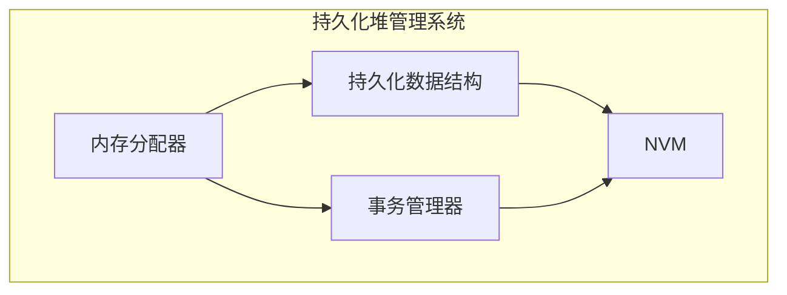

# 一种面向非易失内存的持久化堆管理系统设计与实现

作者：禅与计算机程序设计艺术

## 1. 背景介绍

### 1.1 非易失内存技术的兴起

近年来，非易失内存（Non-Volatile Memory，NVM）技术发展迅速，其具备高密度、低延迟、字节寻址等特性，被视为下一代存储技术的革命性突破。与传统 DRAM 相比，NVM 具有持久化特性，即使断电数据也不会丢失，这为构建高性能、持久化的数据管理系统提供了新的机遇。

### 1.2 持久化堆管理系统的需求

传统堆管理系统通常基于 DRAM 设计，数据易失性是其一大缺陷。当系统意外崩溃或断电时，堆中的数据将会丢失，导致数据一致性和程序状态难以恢复。为了解决这一问题，持久化堆管理系统应运而生。这类系统将堆数据存储在 NVM 中，保证数据持久化，即使系统发生故障，也能快速恢复数据和程序状态。

### 1.3 设计目标

面向 NVM 的持久化堆管理系统设计需满足以下目标：

* **高性能**:  最大程度发挥 NVM 的性能优势，提供高效的内存分配和回收机制。
* **持久化**:  确保堆数据持久化存储，即使系统崩溃也能恢复数据。
* **并发**:  支持多线程并发访问堆内存，保证数据一致性和并发效率。
* **可扩展**:  能够适应不同规模的 NVM 设备和应用场景。


## 2. 核心概念与联系

### 2.1 持久化堆

持久化堆是指将堆数据存储在 NVM 中，并提供持久化保证的堆管理系统。与传统堆不同，持久化堆中的数据即使在系统崩溃或断电后仍然存在，可用于恢复程序状态和数据一致性。

### 2.2 内存分配器

内存分配器是堆管理系统的核心组件，负责管理堆内存的分配和回收。在持久化堆中，内存分配器需要考虑 NVM 的特性，例如持久化、字节寻址等，设计高效的分配和回收策略。

### 2.3 持久化数据结构

为了实现持久化，堆管理系统需要使用持久化数据结构来存储堆数据。持久化数据结构是指其数据结构和操作都支持持久化的数据结构，例如持久化树、持久化链表等。

### 2.4 事务机制

事务机制用于保证堆操作的原子性和持久性。在持久化堆中，每个堆操作都需要作为一个事务进行处理，以确保操作的完整性和数据一致性。

## 3. 核心算法原理具体操作步骤

### 3.1 内存分配算法

#### 3.1.1 Buddy System

Buddy System 是一种经典的内存分配算法，其将内存空间划分为大小为 2 的幂次的块，并使用伙伴关系来管理空闲块。当需要分配内存时，系统会找到满足需求的最小的空闲块，并将其分割成两个大小相等的块，其中一个分配给用户，另一个保留为空闲块。

#### 3.1.2 Slab Allocation

Slab Allocation 是一种面向对象的内存分配算法，其将内存空间划分为固定大小的块，称为 Slab，每个 Slab 存储相同类型的对象。当需要分配内存时，系统会找到一个包含空闲对象的 Slab，并将该对象分配给用户。

#### 3.1.3 持久化内存分配

为了实现持久化，内存分配算法需要考虑 NVM 的特性。例如，可以使用持久化数据结构来存储空闲块信息，并使用事务机制来保证分配操作的原子性和持久性。

### 3.2 内存回收算法

#### 3.2.1 Reference Counting

Reference Counting 是一种基于引用计数的内存回收算法，其为每个对象维护一个引用计数，记录该对象被引用的次数。当对象的引用计数为 0 时，该对象将被回收。

#### 3.2.2 Mark-and-Sweep

Mark-and-Sweep 是一种基于标记-清除的内存回收算法，其分为两个阶段：标记阶段和清除阶段。在标记阶段，系统会遍历所有可达对象，并将其标记为存活对象。在清除阶段，系统会回收所有未被标记的对象。

#### 3.2.3 持久化内存回收

为了实现持久化，内存回收算法需要考虑 NVM 的特性。例如，可以使用持久化数据结构来存储对象的引用计数或标记信息，并使用事务机制来保证回收操作的原子性和持久性。

## 4. 数学模型和公式详细讲解举例说明

### 4.1 内存碎片率

内存碎片率是指内存空间中未被使用的内存占总内存空间的比例。内存碎片率过高会导致内存利用率降低，影响系统性能。

**公式:**

```
内存碎片率 = 未使用内存空间 / 总内存空间
```

**举例:**

假设一个堆管理系统管理 1GB 的内存空间，其中 200MB 的内存空间未被使用，则内存碎片率为 20%。

### 4.2 内存分配效率

内存分配效率是指内存分配操作的平均时间复杂度。内存分配效率越高，内存分配操作的耗时越短，系统性能越好。

**公式:**

```
内存分配效率 = 内存分配操作的平均时间复杂度
```

**举例:**

假设一个堆管理系统的内存分配操作的时间复杂度为 O(1)，则内存分配效率为 O(1)。

## 5. 项目实践：代码实例和详细解释说明

### 5.1 持久化堆管理系统架构



### 5.2 代码实例

```c++
// 持久化内存分配器
class PersistentAllocator {
public:
    // 分配内存
    void* allocate(size_t size);
    // 释放内存
    void deallocate(void* ptr);
private:
    // 持久化数据结构
    PersistentTree* free_list;
    // 事务管理器
    TransactionManager* txn_mgr;
};

// 持久化树
class PersistentTree {
public:
    // 插入节点
    void insert(void* ptr, size_t size);
    // 删除节点
    void remove(void* ptr);
    // 查找节点
    Node* find(size_t size);
private:
    // 根节点
    Node* root;
};

// 事务管理器
class TransactionManager {
public:
    // 开始事务
    void begin_transaction();
    // 提交事务
    void commit_transaction();
    // 回滚事务
    void rollback_transaction();
};