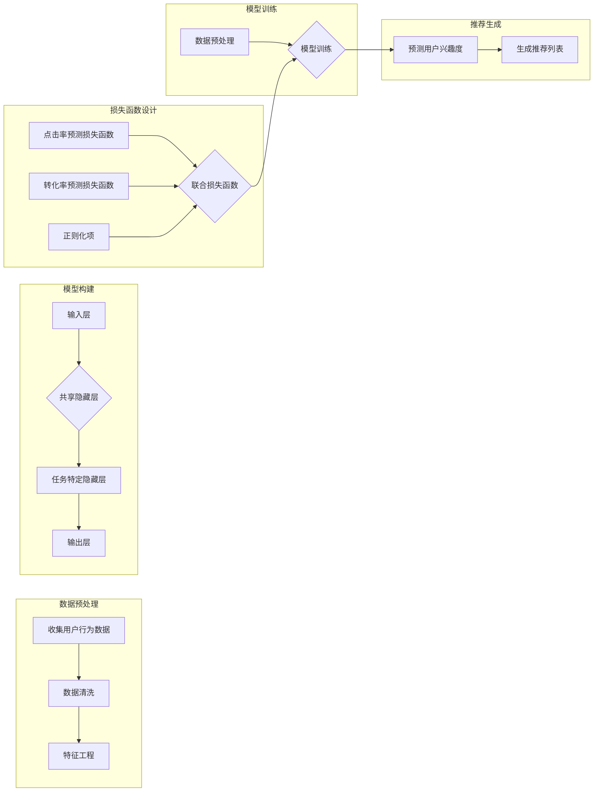

## 1. 背景介绍

### 1.1 信息过载与个性化需求

互联网的快速发展带来了信息爆炸式的增长，用户面临着信息过载的困境。如何在海量信息中找到自己真正感兴趣的内容成为一大难题。个性化推荐系统应运而生，旨在根据用户的兴趣和需求，为其提供“私人定制”的信息服务。

### 1.2 传统推荐系统的局限性

传统的推荐系统主要基于协同过滤、内容过滤等技术，存在以下局限性：

* **数据稀疏性:** 用户-物品交互数据通常非常稀疏，难以准确捕捉用户兴趣。
* **冷启动问题:** 新用户或新物品缺乏历史数据，难以进行有效推荐。
* **可解释性差:**  推荐结果缺乏透明度，用户难以理解推荐的依据。

### 1.3 多任务学习的优势

多任务学习 (Multi-Task Learning, MTL)  通过同时学习多个相关任务，可以有效克服传统推荐系统的局限性。其优势在于：

* **信息共享:**  不同任务之间可以共享信息，缓解数据稀疏性问题。
* **正则化:**  多个任务共同训练可以起到正则化作用，提高模型泛化能力。
* **协同优化:**  多个任务协同优化，可以提升整体性能。

## 2. 核心概念与联系

### 2.1 多任务学习

多任务学习是指同时学习多个相关任务，通过任务之间的信息共享和协同优化，提升整体学习效果。

### 2.2  推荐系统

推荐系统是指根据用户的兴趣和需求，为其推荐相关物品的系统。

### 2.3 个性化推荐

个性化推荐是指根据用户的个人特征和历史行为，为其提供“私人定制”的推荐服务。

## 3. 核心算法原理具体操作步骤

### 3.1 多任务学习框架

多任务学习框架通常包含以下步骤：

1. **任务定义:**  定义多个相关的推荐任务，例如点击率预测、转化率预测、用户评分预测等。
2. **模型构建:**  构建共享参数的多任务学习模型，例如多层感知机 (MLP)、深度神经网络 (DNN) 等。
3. **损失函数设计:**  设计多任务联合损失函数，例如加权求和、共享层参数正则化等。
4. **模型训练:**  利用多任务数据集联合训练模型，优化联合损失函数。

### 3.2 具体操作步骤

以下以基于深度神经网络的多任务学习框架为例，介绍个性化推荐的具体操作步骤：

1. **数据预处理:** 收集用户行为数据、物品信息等，进行数据清洗、特征工程等预处理操作。
2. **模型构建:**  构建深度神经网络模型，包含输入层、共享隐藏层、任务特定隐藏层和输出层。
3. **损失函数设计:**  设计多任务联合损失函数，例如：

$$
L = \sum_{i=1}^{n} w_i L_i + \lambda ||\theta||^2
$$

其中，$L_i$ 表示第 $i$ 个任务的损失函数，$w_i$ 表示任务权重，$\lambda$ 表示正则化系数，$\theta$ 表示共享层参数。

4. **模型训练:**  利用多任务数据集联合训练模型，采用随机梯度下降等优化算法更新模型参数。
5. **推荐生成:**  利用训练好的模型，根据用户的特征信息，预测其对不同物品的兴趣度，生成个性化推荐列表。

## 4. 数学模型和公式详细讲解举例说明

### 4.1 多任务学习模型

以基于深度神经网络的多任务学习模型为例，其数学模型可以表示为：

$$
f(x) = g(h(x))
$$

其中，$x$ 表示输入特征向量，$h(x)$ 表示共享隐藏层输出，$g(h(x))$ 表示任务特定隐藏层和输出层输出。

### 4.2 损失函数

多任务联合损失函数可以表示为：

$$
L = \sum_{i=1}^{n} w_i L_i + \lambda ||\theta||^2
$$

其中，$L_i$ 表示第 $i$ 个任务的损失函数，例如：

* **点击率预测:**  交叉熵损失函数
* **转化率预测:**  平方损失函数
* **用户评分预测:**  均方误差损失函数

$w_i$ 表示任务权重，可以根据任务重要性进行设置。

$\lambda$ 表示正则化系数，用于控制模型复杂度，防止过拟合。

$\theta$ 表示共享层参数，例如神经网络的权重和偏置。

### 4.3 举例说明

假设我们希望构建一个多任务学习模型，同时预测用户的点击率和转化率。我们可以使用深度神经网络作为模型，并采用以下损失函数：

$$
L = w_1 L_{click} + w_2 L_{conversion} + \lambda ||\theta||^2
$$

其中，$L_{click}$ 表示点击率预测的交叉熵损失函数，$L_{conversion}$ 表示转化率预测的平方损失函数，$w_1$ 和 $w_2$ 分别表示点击率预测和转化率预测的任务权重。

## 5. 项目实践：代码实例和详细解释说明

### 5.1 代码实例

以下是一个基于 TensorFlow 的多任务学习代码示例：

```python
import tensorflow as tf

# 定义输入特征
input_features = tf.keras.Input(shape=(num_features,))

# 共享隐藏层
shared_hidden = tf.keras.layers.Dense(units=128, activation='relu')(input_features)

# 任务特定隐藏层
click_hidden = tf.keras.layers.Dense(units=64, activation='relu')(shared_hidden)
conversion_hidden = tf.keras.layers.Dense(units=64, activation='relu')(shared_hidden)

# 输出层
click_output = tf.keras.layers.Dense(units=1, activation='sigmoid', name='click')(click_hidden)
conversion_output = tf.keras.layers.Dense(units=1, activation='linear', name='conversion')(conversion_hidden)

# 构建多任务学习模型
model = tf.keras.Model(inputs=input_features, outputs=[click_output, conversion_output])

# 定义损失函数
losses = {
    'click': tf.keras.losses.BinaryCrossentropy(),
    'conversion': tf.keras.losses.MeanSquaredError()
}

# 定义任务权重
loss_weights = {
    'click': 0.8,
    'conversion': 0.2
}

# 编译模型
model.compile(optimizer='adam', loss=losses, loss_weights=loss_weights, metrics=['accuracy'])

# 训练模型
model.fit(x_train, {'click': y_click_train, 'conversion': y_conversion_train}, epochs=10)

# 预测
predictions = model.predict(x_test)
```

### 5.2 代码解释

* `input_features` 定义输入特征，`num_features` 表示特征数量。
* `shared_hidden` 定义共享隐藏层，包含 128 个神经元，激活函数为 ReLU。
* `click_hidden` 和 `conversion_hidden` 定义任务特定隐藏层，包含 64 个神经元，激活函数为 ReLU。
* `click_output` 和 `conversion_output` 定义输出层，分别用于预测点击率和转化率。
* `model` 构建多任务学习模型，输入为 `input_features`，输出为 `click_output` 和 `conversion_output`。
* `losses` 定义损失函数，`click` 使用二元交叉熵损失函数，`conversion` 使用均方误差损失函数。
* `loss_weights` 定义任务权重，`click` 的权重为 0.8，`conversion` 的权重为 0.2。
* `model.compile` 编译模型，优化器为 Adam，损失函数为 `losses`，损失权重为 `loss_weights`，评估指标为准确率。
* `model.fit` 训练模型，训练数据为 `x_train`，标签为 `y_click_train` 和 `y_conversion_train`，训练 10 个 epoch。
* `model.predict` 利用训练好的模型进行预测，预测数据为 `x_test`。

## 6. 实际应用场景

### 6.1 电商平台

电商平台可以使用多任务学习模型，同时预测用户的点击率、购买率、评分等多个指标，为用户提供更精准的商品推荐服务。

### 6.2 社交网络

社交网络可以使用多任务学习模型，同时预测用户的关注关系、转发行为、评论内容等多个指标，为用户推荐更感兴趣的内容和用户。

### 6.3 在线广告

在线广告可以使用多任务学习模型，同时预测用户的点击率、转化率、广告收入等多个指标，优化广告投放策略，提升广告效果。

## 7. 工具和资源推荐

### 7.1 TensorFlow

TensorFlow 是 Google 开源的深度学习框架，提供了丰富的多任务学习 API，方便用户构建和训练多任务学习模型。

### 7.2 PyTorch

PyTorch 是 Facebook 开源的深度学习框架，也提供了多任务学习相关的 API，用户可以根据自己的需求选择合适的框架。

### 7.3 MMoE

MMoE (Multi-gate Mixture-of-Experts) 是一种常用的多任务学习模型，在多个领域取得了不错的效果。

## 8. 总结：未来发展趋势与挑战

### 8.1 未来发展趋势

* **更精细化的个性化推荐:**  随着用户需求的多样化，未来个性化推荐将更加精细化，例如基于用户情感、场景等因素的推荐。
* **多模态信息融合:**  未来推荐系统将融合文本、图像、视频等多模态信息，提供更全面、更丰富的推荐服务。
* **强化学习与推荐系统结合:**  强化学习可以用于动态优化推荐策略，提升推荐系统的实时性和自适应性。

### 8.2  挑战

* **数据安全和隐私保护:**  个性化推荐需要收集用户的个人数据，如何保障数据安全和用户隐私是一个重要挑战。
* **模型可解释性:**  多任务学习模型通常比较复杂，如何提高模型的可解释性，使用户理解推荐结果的依据是一个挑战。
* **冷启动问题:**  新用户或新物品缺乏历史数据，如何解决冷启动问题仍然是一个挑战。


## 9. 附录：常见问题与解答

### 9.1 多任务学习与迁移学习的区别是什么？

**迁移学习**是指将一个任务上训练好的模型迁移到另一个相关任务上，例如将图像分类模型迁移到物体检测任务上。**多任务学习**是指同时学习多个相关任务，通过任务之间的信息共享和协同优化，提升整体学习效果。

### 9.2 多任务学习模型的评估指标有哪些？

多任务学习模型的评估指标可以根据具体任务进行选择，例如：

* **点击率预测:**  AUC、LogLoss
* **转化率预测:**  MSE、RMSE
* **用户评分预测:**  MAE、RMSE

### 9.3 如何选择合适的任务权重？

任务权重的选择可以根据任务重要性进行设置，例如，如果点击率预测比转化率预测更重要，可以为点击率预测设置更高的权重。

### 9.4 如何解决多任务学习模型的过拟合问题？

可以通过以下方法解决多任务学习模型的过拟合问题：

* **正则化:**  在损失函数中添加正则化项，例如 L1 正则化、L2 正则化。
* **Dropout:**  在神经网络中随机丢弃一些神经元，防止模型过度依赖于某些特征。
* **数据增强:**  通过对训练数据进行增强，例如旋转、缩放、裁剪等操作，增加数据的多样性。


### 9.5 如何提高多任务学习模型的可解释性？

可以通过以下方法提高多任务学习模型的可解释性：

* **注意力机制:**  使用注意力机制可以突出模型关注的重要特征，提高模型的可解释性。
* **特征重要性分析:**  通过分析模型参数或梯度信息，可以识别对预测结果影响最大的特征。
* **模型可视化:**  将模型结构和参数可视化，可以帮助用户理解模型的内部机制。

## 10. Mermaid 流程图

