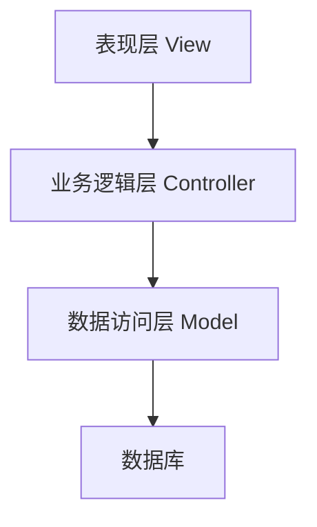

# 中学网站建设系统详细设计与具体代码实现

## 1. 背景介绍

### 1.1 中学网站的重要性

在当今信息时代,中学网站已经成为学校与外界沟通、展示形象、传播信息的重要窗口。一个设计合理、功能完善的中学网站,不仅可以为师生提供丰富的教学资源和便利的网上办公环境,还能为家长和社会公众提供及时的校园动态和相关信息,树立学校良好的社会形象。因此,建设一个优秀的中学网站,对于提高学校的办学水平和社会知名度至关重要。

### 1.2 中学网站建设的现状和挑战

目前,许多中学的网站建设仍存在诸多不足,例如界面设计单一乏味、内容更新滞后、功能缺乏完备性等。这些问题严重影响了网站的实用性和吸引力。同时,随着移动互联网的迅猛发展,构建移动适配的响应式网站也成为一个新的挑战。此外,如何规范网站的建设流程,实现高效协作开发,也是亟待解决的问题。

## 2. 核心概念与联系

### 2.1 系统架构

中学网站建设系统采用经典的三层架构模式:表现层(View)、业务逻辑层(Controller)和数据访问层(Model)。这种模式有利于系统各个模块的高内聚低耦合,便于后期的维护和扩展。



### 2.2 核心功能模块

中学网站系统的核心功能模块包括:

1. **内容管理模块**:用于管理网站的各类内容信息,如新闻资讯、通知公告、课程介绍等。
2. **栏目管理模块**:用于管理网站的栏目结构和导航菜单。
3. **用户管理模块**:用于管理网站的各类用户,包括管理员、教师、学生和家长等。
4. **权限管理模块**:用于控制不同用户对网站内容的访问权限。
5. **互动交流模块**:包括留言板、在线咨询、投票调查等,便于师生家长之间的互动交流。
6. **系统管理模块**:用于管理整个网站系统的基本配置、日志记录、数据备份等。

这些模块有机地结合在一起,共同构建了一个完整的中学网站系统。

## 3. 核心算法原理具体操作步骤

### 3.1 内容管理算法

内容管理是中学网站系统的核心功能之一。下面将详细介绍其工作原理和实现步骤:

1. **内容分类**:根据内容的类型(如新闻、通知、课程等)对内容进行合理分类,方便管理和检索。可以采用树形结构对分类进行组织。
2. **内容审核**:新增或修改的内容需要经过审核流程,由管理员进行审批。可以采用状态机模型来管理内容的生命周期。
3. **内容索引**:为提高检索效率,需要对内容进行关键词提取和索引构建。可以采用分词算法和倒排索引技术。
4. **内容缓存**:热点内容可以进行缓存,以提高访问速度。可以采用Redis等内存数据库作为缓存中间件。

算法伪代码:

```python
# 内容分类
class Category:
    def __init__(self, name, parent=None):
        self.name = name
        self.parent = parent
        self.children = []
        if parent:
            parent.children.append(self)

# 内容状态机
class ContentStatus:
    DRAFT = 0  # 草稿
    PENDING = 1 # 待审核
    PUBLISHED = 2 # 已发布

# 内容管理
class ContentManager:
    def __init__(self, db):
        self.db = db
        self.categories = self.load_categories()

    def add_content(self, title, body, category, author):
        content = Content(title, body, category, author, ContentStatus.DRAFT)
        self.db.insert(content)
        return content

    def update_content(self, content_id, title, body, category):
        content = self.db.get(content_id)
        content.title = title
        content.body = body
        content.category = category
        content.status = ContentStatus.PENDING
        self.db.update(content)

    def approve_content(self, content_id):
        content = self.db.get(content_id)
        content.status = ContentStatus.PUBLISHED
        self.db.update(content)
        self.index_content(content)  # 索引内容

    def search_content(self, query):
        # 使用索引进行搜索
        ...
```

### 3.2 权限管理算法

权限管理是确保网站系统安全运行的关键。下面介绍其核心算法原理:

1. **基于角色的访问控制(RBAC)**:将用户与权限进行解耦,用户通过被分配的角色获得相应的权限。
2. **权限继承**:角色可以继承其他角色的权限,形成权限的层级关系。
3. **动态权限分配**:管理员可以动态地为用户分配角色,从而控制其访问权限。

算法伪代码:

```python
# 权限
class Permission:
    def __init__(self, name, desc):
        self.name = name
        self.desc = desc

# 角色
class Role:
    def __init__(self, name):
        self.name = name
        self.permissions = []

    def grant_permission(self, permission):
        self.permissions.append(permission)

    def revoke_permission(self, permission):
        self.permissions.remove(permission)

# 用户
class User:
    def __init__(self, username):
        self.username = username
        self.roles = []

    def grant_role(self, role):
        self.roles.append(role)

    def revoke_role(self, role):
        self.roles.remove(role)

    def has_permission(self, permission):
        for role in self.roles:
            if permission in role.permissions:
                return True
        return False

# 权限管理器
class AccessController:
    def __init__(self):
        self.permissions = []
        self.roles = []
        self.users = []

    def create_permission(self, name, desc):
        permission = Permission(name, desc)
        self.permissions.append(permission)
        return permission

    def create_role(self, name):
        role = Role(name)
        self.roles.append(role)
        return role

    def create_user(self, username):
        user = User(username)
        self.users.append(user)
        return user
```

## 4. 数学模型和公式详细讲解举例说明

在中学网站建设系统中,数学模型和公式主要应用于以下几个方面:

### 4.1 内容相似度计算

为了实现内容推荐和相关内容关联等功能,需要计算内容之间的相似度。常用的相似度计算模型有:

1. **余弦相似度**

   余弦相似度用于计算两个向量之间的夹角余弦值,常用于文本相似度计算。公式如下:

   $$\text{sim}(A, B) = \cos(\theta) = \frac{A \cdot B}{\|A\| \|B\|} = \frac{\sum_{i=1}^{n}A_iB_i}{\sqrt{\sum_{i=1}^{n}A_i^2}\sqrt{\sum_{i=1}^{n}B_i^2}}$$

   其中$A$和$B$分别表示文本的词向量。

2. **编辑距离**

   编辑距离用于计算两个字符串之间的相似程度,可用于检测拼写错误或计算短语相似度。常用的编辑距离算法有Levenshtein距离、Damerau-Levenshtein距离等。

   Levenshtein距离的公式为:

   $$\text{lev}_{a,b}(i,j) = \begin{cases}
   \max(i,j) & \text{if $\min(i,j)=0$} \\
   \min \begin{cases}
   \text{lev}_{a,b}(i-1,j)+1 \\
   \text{lev}_{a,b}(i,j-1)+1 \\
   \text{lev}_{a,b}(i-1,j-1)+1_{(a_i \neq b_j)}
   \end{cases} & \text{otherwise}
   \end{cases}$$

   其中$a$和$b$分别表示两个字符串,$a_i$和$b_j$分别表示第$i$和第$j$个字符。

### 4.2 网页布局优化

为了实现网页的合理布局,提高用户体验,需要应用一些数学模型和算法,如:

1. **均分算法**

   均分算法用于将一个矩形区域均匀分割成多个子矩形,以实现网格布局。具体步骤如下:

   - 计算矩形的长宽比$r = \frac{w}{h}$
   - 根据$r$的值,确定分割方向(横向或纵向)和分割线数量$n$
   - 将矩形等分为$n$个子矩形

2. **黄金分割**

   黄金分割是一种常见的视觉美学布局方式,可用于网页元素的位置安排。公式如下:

   $$\phi = \frac{1 + \sqrt{5}}{2} \approx 1.618$$

   其中$\phi$被称为黄金分割比例。将页面的长宽按此比例分割,可以获得视觉上的平衡和谐感。

### 4.3 网页访问统计

为了分析网站的访问情况,需要对访问数据进行统计和建模,常用的统计模型有:

1. **页面查看次数(PV)** 

   PV(Page View)是指网页被访问的总次数,可以反映网页的受欢迎程度。

2. **独立访客数(UV)**

   UV(Unique Visitor)是指访问网站的不同客户端数量,可以反映网站的用户规模。

3. **跳出率**

   跳出率是指访问者只浏览了一个页面就离开的比例,可以反映网页的吸引力和粘性。

   跳出率的公式为:
   
   $$\text{跳出率} = \frac{\text{只访问一个页面的访客数}}{\text{所有访客数}}$$

4. **平均访问时长**

   平均访问时长是指所有访客在网站的平均停留时间,可以反映网站内容的吸引力。

   平均访问时长的公式为:

   $$\overline{t} = \frac{\sum_{i=1}^{n}t_i}{n}$$

   其中$t_i$表示第$i$个访客的访问时长,$n$表示总访客数。

## 4. 项目实践:代码实例和详细解释说明

接下来,我们将通过一个实际的项目案例,来详细说明中学网站建设系统的具体实现过程。

本项目采用Python的Django框架进行开发,使用MySQL作为后端数据库。

### 4.1 系统架构

如前所述,本系统采用经典的三层架构模式,具体的项目结构如下:

```
school_website/
├── school_website/
│   ├── __init__.py
│   ├── settings.py
│   ├── urls.py
│   ├── wsgi.py
├── cms/
│   ├── __init__.py
│   ├── models.py
│   ├── views.py
│   ├── urls.py
│   ├── forms.py
│   ├── admin.py
├── templates/
│   ├── base.html
│   ├── index.html
│   ├── news.html
│   ├── ...
├── static/
│   ├── css/
│   ├── js/
│   ├── images/
├── db.sqlite3
├── manage.py
```

- `school_website`目录是整个Django项目的根目录
- `cms`是网站内容管理系统的应用目录,包含模型、视图、URL路由等
- `templates`目录存放HTML模板文件
- `static`目录存放CSS、JavaScript和图片等静态文件
- `db.sqlite3`是Django默认的SQLite数据库文件

### 4.2 模型设计

我们首先在`cms/models.py`中定义数据模型:

```python
from django.db import models
from django.contrib.auth.models import User

class Category(models.Model):
    name = models.CharField(max_length=100)
    parent = models.ForeignKey('self', on_delete=models.SET_NULL, null=True, blank=True)

    def __str__(self):
        return self.name

class Content(models.Model):
    STATUS_CHOICES = (
        (0, '草稿'),
        (1, '待审核'),
        (2, '已发布'),
    )

    title = models.CharField(max_length=200)
    body = models.TextField()
    pub_date = models.DateTimeField('发布日期', auto_now_add=True)
    category = models.ForeignKey(Category, on_delete=models.CASCADE)
    author = models.ForeignKey(User, on_delete=models.CASCADE)
    status = models.IntegerField(choices=STATUS_CHOICES, default=0)

    def __str__(self):
        return self.title
```