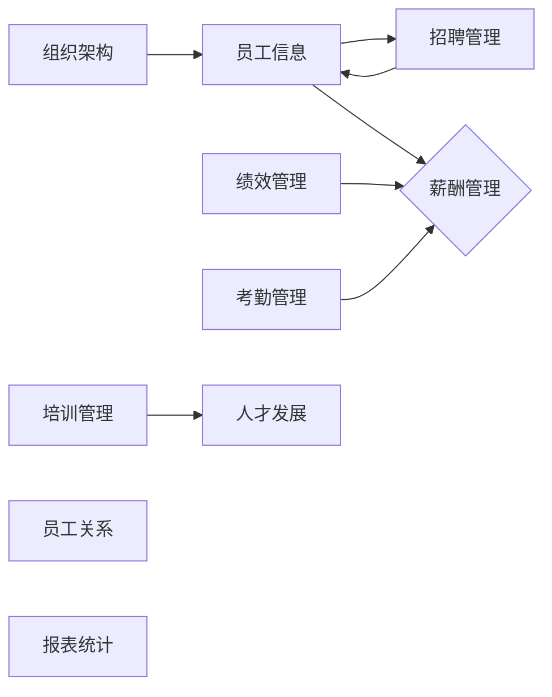

## 1. 背景介绍

### 1.1 人力资源管理的演变

人力资源管理 (HRM)  作为企业管理的核心职能之一，经历了从传统的人事管理到现代人力资源管理的演变。传统的人事管理主要关注员工的招聘、薪酬和考勤等基本事务，而现代人力资源管理则更注重员工的绩效管理、人才发展、员工关系和企业文化建设等方面。

### 1.2 人事管理系统的价值

人事管理系统 (HRMS) 是为了满足现代人力资源管理需求而发展起来的软件系统。它通过自动化和信息化手段，帮助企业高效地管理员工信息、简化人事流程、提高工作效率、降低管理成本，并为企业决策提供数据支持。

### 1.3 人事管理系统的发展趋势

随着信息技术的不断发展，人事管理系统也在不断进化。云计算、大数据、人工智能等新技术的应用，为人事管理系统带来了新的发展机遇和挑战。未来的人事管理系统将更加智能化、个性化和数据驱动，为企业提供更全面、更精准的人力资源管理解决方案。

## 2. 核心概念与联系

### 2.1 核心概念

人事管理系统涉及众多核心概念，包括：

* **员工信息:** 员工的基本信息、教育背景、工作经历、技能证书等。
* **组织架构:** 企业的部门设置、职位体系、汇报关系等。
* **招聘管理:** 招聘需求发布、简历筛选、面试安排、录用审批等。
* **薪酬管理:** 薪酬体系设计、工资计算、绩效奖金发放等。
* **考勤管理:** 员工出勤记录、加班审批、休假管理等。
* **绩效管理:** 绩效目标设定、绩效考核、绩效反馈等。
* **培训管理:**  培训需求分析、培训计划制定、培训实施和评估等。
* **人才发展:** 员工职业生涯规划、人才梯队建设、领导力发展等。
* **员工关系:** 员工沟通、员工福利、员工关系维护等。
* **报表统计:**  各种人事数据的统计分析，为企业决策提供支持。

### 2.2 概念联系

这些核心概念之间存在着紧密的联系，例如：

* **组织架构**是其他模块的基础，它定义了企业的组织结构和职位体系。
* **员工信息**是人事管理系统的核心数据，其他模块都需要用到员工信息。
* **招聘管理**负责为企业招募新员工，新员工的信息会添加到员工信息模块中。
* **薪酬管理**根据员工的职位、绩效等信息计算工资。
* **绩效管理**的结果会影响员工的薪酬和晋升。

### 2.3 Mermaid 流程图



## 3. 核心算法原理具体操作步骤

### 3.1 薪酬计算算法

薪酬计算是人事管理系统中一个重要的功能模块，其算法原理如下：

1. **确定薪酬结构:** 首先需要确定企业的薪酬结构，包括基本工资、绩效工资、津贴补贴等组成部分。
2. **收集员工信息:**  收集员工的职位、职级、工作年限、绩效考核结果等信息。
3. **计算各项工资:** 根据薪酬结构和员工信息，计算员工的基本工资、绩效工资、津贴补贴等。
4. **扣除五险一金:**  根据国家规定，从员工工资中扣除五险一金。
5. **计算税后工资:**  根据个人所得税法，计算员工的税后工资。

### 3.2 绩效考核算法

绩效考核是人事管理系统中另一个重要的功能模块，其算法原理如下:

1. **设定绩效目标:**  根据企业的战略目标和部门工作计划，设定员工的绩效目标。
2. **选择考核方法:**  选择合适的绩效考核方法，例如 KPI 考核、360 度评估等。
3. **实施绩效考核:**  定期对员工进行绩效考核，收集考核数据。
4. **绩效结果评估:**  根据考核数据，评估员工的绩效表现，并给出绩效等级。
5. **绩效反馈与改进:**  将绩效考核结果反馈给员工，并制定绩效改进计划。

## 4. 数学模型和公式详细讲解举例说明

### 4.1 薪酬计算模型

假设某企业的薪酬结构如下：

* 基本工资：根据职位和职级确定
* 绩效工资：根据绩效考核结果确定
* 津贴补贴：根据岗位性质和工作环境确定

则员工的税前工资计算公式如下：

$$ 税前工资 = 基本工资 + 绩效工资 + 津贴补贴 $$

### 4.2 绩效考核模型

假设某企业采用 KPI 考核方法，每个 KPI 的权重和目标值如下表所示：

| KPI | 权重 | 目标值 |
|---|---|---|
| 销售额 | 50% | 100 万元 |
| 客户满意度 | 30% | 90% |
| 成本控制 | 20% | 95% |

则员工的绩效得分计算公式如下：

$$ 绩效得分 = \sum_{i=1}^{n} (KPI_i 实际值 / KPI_i 目标值) \times KPI_i 权重 $$

其中，n 表示 KPI 的数量。

## 5. 项目实践：代码实例和详细解释说明

### 5.1 技术选型

* **后端:** Spring Boot
* **前端:**  React
* **数据库:** MySQL
* **缓存:**  Redis

### 5.2 代码实例

**员工信息管理模块**

```java
@RestController
@RequestMapping("/api/employees")
public class EmployeeController {

    @Autowired
    private EmployeeService employeeService;

    @PostMapping
    public Employee createEmployee(@RequestBody Employee employee) {
        return employeeService.createEmployee(employee);
    }

    @GetMapping("/{id}")
    public Employee getEmployeeById(@PathVariable Long id) {
        return employeeService.getEmployeeById(id);
    }

    @PutMapping("/{id}")
    public Employee updateEmployee(@PathVariable Long id, @RequestBody Employee employee) {
        return employeeService.updateEmployee(id, employee);
    }

    @DeleteMapping("/{id}")
    public void deleteEmployee(@PathVariable Long id) {
        employeeService.deleteEmployee(id);
    }
}
```

**薪酬计算模块**

```java
@Service
public class SalaryCalculator {

    @Autowired
    private EmployeeRepository employeeRepository;

    public BigDecimal calculateSalary(Long employeeId) {
        Employee employee = employeeRepository.findById(employeeId)
                .orElseThrow(() -> new NotFoundException("Employee not found"));

        // 根据职位和职级确定基本工资
        BigDecimal baseSalary = getSalaryByPositionAndLevel(employee.getPosition(), employee.getLevel());

        // 根据绩效考核结果确定绩效工资
        BigDecimal performanceSalary = getPerformanceSalary(employee.getPerformanceScore());

        // 根据岗位性质和工作环境确定津贴补贴
        BigDecimal allowance = getAllowanceByPosition(employee.getPosition());

        // 计算税前工资
        BigDecimal grossSalary = baseSalary.add(performanceSalary).add(allowance);

        // 扣除五险一金
        BigDecimal socialInsurance = calculateSocialInsurance(grossSalary);

        // 计算税后工资
        BigDecimal netSalary = calculateNetSalary(grossSalary, socialInsurance);

        return netSalary;
    }

    // ...
}
```

## 6. 实际应用场景

### 6.1 企业人力资源管理

人事管理系统可以应用于各种类型的企业，帮助企业实现人力资源管理的信息化和自动化，提高人力资源管理效率，降低管理成本。

### 6.2 政府机构人事管理

政府机构也可以使用人事管理系统来管理公务员的信息、薪酬、考勤、绩效等，提高政府机构的管理效率和服务水平。

### 6.3 教育机构人事管理

学校、培训机构等教育机构可以使用人事管理系统来管理教师、学生的信息，以及招生、教学、科研等工作，提高教育机构的管理水平和教学质量。

## 7. 总结：未来发展趋势与挑战

### 7.1 未来发展趋势

* **智能化:** 人工智能技术将越来越多地应用于人事管理系统，例如智能招聘、智能绩效考核、智能人才推荐等。
* **个性化:** 人事管理系统将更加注重员工的个性化需求，提供更加个性化的服务，例如个性化培训推荐、个性化职业发展规划等。
* **数据驱动:**  人事管理系统将更加注重数据分析和应用，利用大数据技术分析员工的行为数据、绩效数据等，为企业决策提供更加精准的数据支持。

### 7.2 面临的挑战

* **数据安全:**  人事管理系统存储了大量的员工敏感信息，如何保障数据的安全是一个重要挑战。
* **系统集成:**  人事管理系统需要与其他企业信息系统集成，例如财务系统、OA 系统等，如何实现 seamless 集成是一个挑战。
* **用户体验:**  人事管理系统需要提供良好的用户体验，方便用户使用，如何提升用户体验是一个挑战。

## 8. 附录：常见问题与解答

### 8.1 如何选择合适的人事管理系统？

选择人事管理系统需要考虑企业的规模、行业特点、预算等因素，并进行充分的市场调研，选择功能完善、性能稳定、服务优质的系统。

### 8.2 如何实施人事管理系统？

实施人事管理系统需要进行需求调研、系统选型、系统部署、数据迁移、用户培训等工作，并制定完善的实施计划，确保系统实施的顺利进行。

### 8.3 如何维护人事管理系统？

维护人事管理系统需要定期进行系统更新、数据备份、安全防护等工作，并建立完善的维护机制，确保系统的稳定运行。
