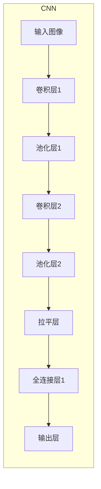

# 人工智能在农业中的伦理应用:从精准农业到食品安全

## 1.背景介绍

### 1.1 农业的重要性

农业是人类赖以生存的基础产业。它不仅为我们提供食物,也是许多国家经济的支柱。随着全球人口不断增长,确保粮食安全和可持续发展对于满足日益增长的需求至关重要。

### 1.2 农业面临的挑战

然而,农业正面临诸多挑战,如气候变化、土地degradation、水资源短缺、病虫害等。这些问题威胁着农业生产,并对环境和粮食安全构成潜在风险。

### 1.3 人工智能(AI)的兴起

近年来,人工智能技术飞速发展,为解决农业挑战提供了新的途径。AI系统能够处理大量数据、发现模式并做出智能决策,在提高农业效率、可持续性和食品安全方面大有可为。

## 2.核心概念与联系  

### 2.1 精准农业

精准农业是利用现代信息技术(如遥感、物联网、大数据等)对农场进行精细化管理的一种农业模式。它的目标是提高投入产出比、降低环境影响并确保可持续性。

精准农业与人工智能技术密切相关,AI可以:

- 分析遥感数据,监测作物生长状况
- 基于环境和历史数据预测病虫害发生
- 优化农资使用,实现精准施肥、施药
- 规划最佳的耕作时机和方式

### 2.2 食品安全

食品安全是指食品在预期用途时不会对消费者的健康构成危害。确保食品安全对于公众健康至关重要。

人工智能可以在食品安全领域发挥作用:

- 追踪食品来源和加工过程
- 检测食品中的污染物和有害物质 
- 预测食源性疾病的风险
- 优化食品加工工艺,提高卫生标准

### 2.3 人工智能与农业伦理

人工智能在提高农业效率和食品安全的同时,也带来了一些伦理问题,如:

- 数据隐私:农场数据的收集和使用是否侵犯了隐私权?
- 公平性:AI系统是否存在偏见,导致不公平对待?
- 责任归属:AI做出错误决策时,责任如何归属?
- 技术鸿沟:先进技术是否会加剧农村与城市的差距?

我们需要建立适当的伦理框架,规范AI在农业中的应用,使其真正造福人类。

## 3.核心算法原理具体操作步骤

人工智能在农业中的应用涉及多种算法和技术,下面将介绍其中的几个核心算法。

### 3.1 机器学习算法

机器学习是人工智能的一个重要分支,能从数据中自动分析、建模和学习。在农业中,常用的机器学习算法包括:

#### 3.1.1 监督学习

监督学习是从标注好的训练数据中学习的过程,可用于分类和回归任务。例如:

- 基于图像识别病虫害种类(分类)
- 根据环境因素预测作物产量(回归)

##### 操作步骤:
1) **收集并准备训练数据**
2) **选择合适的算法(如支持向量机、随机森林等)** 
3) **训练模型**
4) **评估模型性能**
5) **模型优化(特征工程、超参数调优等)**
6) **应用模型进行预测**

#### 3.1.2 无监督学习

无监督学习则是从未标注的数据中发现内在模式,可用于聚类分析。例如:

- 根据土壤特征将农田分为不同类别
- 基于作物表现将种植区域划分为不同群组

#### 3.1.3 强化学习

强化学习是一种基于反馈来学习的范式,可用于优化决策序列。在农业中可应用于:

- 确定最优的灌溉策略
- 规划作物种植方案以最大化收益

### 3.2 计算机视觉

计算机视觉技术能够从图像或视频中提取有用信息,在农业生产监控方面有重要应用:

- 无人机/卫星遥感监测作物生长状况
- 通过图像识别检测病虫害
- 利用3D建模优化农机操作

#### 操作步骤:

1) **获取图像/视频数据**
2) **预处理(去噪、增强等)**
3) **使用算法(如卷积神经网络)提取特征**
4) **应用分类/检测/分割等任务**
5) **后处理(结果优化等)**
6) **可视化输出结果**

### 3.3 自然语言处理

自然语言处理(NLP)使计算机能够理解和生成人类语言,在农业领域也有应用:

- 分析农业政策文件,提取关键信息
- 从农民论坛中挖掘常见问题和建议 
- 构建智能农业助手,提供咨询服务

#### 操作步骤:

1) **收集语料(如文本、语音等)** 
2) **文本预处理(分词、去停用词等)**
3) **特征提取(TF-IDF、Word2Vec等)** 
4) **构建NLP模型(如情感分析、命名实体识别等)**
5) **模型训练与评估**
6) **将模型应用于实际任务**

## 4.数学模型和公式详细讲解举例说明

人工智能算法通常依赖于数学模型来表示和解决问题。以下是一些在农业AI应用中常见的数学模型:

### 4.1 线性回归模型

线性回归是一种常用的监督学习模型,可用于预测连续型变量。在农业中,它可用于作物产量估计等任务。

线性回归模型的表达式为:

$$y = \theta_0 + \theta_1x_1 + \theta_2x_2 + ... + \theta_nx_n$$

其中:
- $y$是预测目标变量
- $x_1, x_2, ..., x_n$是输入特征变量 
- $\theta_0, \theta_1, ..., \theta_n$是模型参数

模型训练的目标是找到使预测值与真实值之差最小的参数$\theta$。常用的损失函数是平方误差:

$$J(\theta) = \frac{1}{2m}\sum_{i=1}^m(h_\theta(x^{(i)}) - y^{(i)})^2$$

其中$m$是训练样本数量。

通过梯度下降等优化算法可以求解最优参数$\theta$。

#### 例子:基于气象和土壤数据预测小麦产量

假设我们有以下特征变量:
- $x_1$:年平均温度
- $x_2$:年降雨量 
- $x_3$:土壤有机质含量

我们可以构建线性回归模型:

$$\text{小麦产量} = \theta_0 + \theta_1 \times \text{温度} + \theta_2 \times \text{降雨量} + \theta_3 \times \text{有机质}$$

通过训练获得最优参数后,就可以对新的气象和土壤数据进行小麦产量预测。

### 4.2 逻辑回归模型 

逻辑回归是一种用于分类任务的模型。在农业中,它可用于病虫害检测、土地分类等。

对于二分类问题,逻辑回归模型的表达式为:

$$h_\theta(x) = g(\theta^Tx) = \frac{1}{1 + e^{-\theta^Tx}}$$

其中:
- $x$是输入特征向量
- $\theta$是模型参数向量
- $g(z)$是Sigmoid函数,将线性判别值$\theta^Tx$映射到$(0,1)$区间

我们可以设置一个阈值(通常为0.5),当$h_\theta(x) \geq 0.5$时,预测为正例;否则为负例。

模型训练时的目标是最大化似然函数:

$$l(\theta) = \prod_{i=1}^m [h_\theta(x^{(i)})]^{y^{(i)}}[1-h_\theta(x^{(i)})]^{1-y^{(i)}}$$

可通过梯度上升等优化算法求解最优参数$\theta$。

#### 例子:基于叶片图像检测植物病害

假设我们提取了以下特征:
- $x_1$:叶片颜色分量 
- $x_2$:叶片纹理特征
- $x_3$:叶片形状特征

我们可以构建逻辑回归模型:

$$P(\text{病害}) = \frac{1}{1+e^{-(\theta_0 + \theta_1x_1 + \theta_2x_2 + \theta_3x_3)}}$$

对新的叶片图像,提取相应特征后代入模型,即可判断是否存在病害。

### 4.3 卷积神经网络

卷积神经网络(CNN)是一种常用的深度学习模型,广泛应用于计算机视觉任务。在农业领域中,CNN可用于:

- 通过遥感图像监测作物生长情况
- 基于叶片/果实图像检测病虫害
- 识别农机部件等

CNN模型的核心思想是局部连接和权值共享,可以有效地捕获图像的局部模式。下图展示了一个典型的CNN结构:

- 卷积层: 通过滤波器对图像进行卷积操作,提取局部特征
- 池化层: 对特征图进行下采样,减少数据量并实现平移不变性
- 全连接层: 将特征向量映射到输出空间

CNN的训练过程中,需要优化卷积核参数和全连接层权重,使损失函数(如交叉熵)最小化。反向传播算法可用于计算参数梯度。

#### 例子:基于遥感图像监测作物生长情况

假设我们收集了一些遥感影像数据和对应的作物生长状态标签(健康、受损等)。我们可以构建一个CNN模型对新的遥感图像进行分类:

1. 输入遥感图像 
2. 卷积层提取特征(如植被指数、纹理等)
3. 池化层降采样,实现平移不变性
4. 全连接层融合特征
5. 输出层对作物状态进行分类

通过大量训练数据训练该CNN模型,就可以对新的遥感影像评估作物生长情况。

### 4.4 时间序列模型

在农业生产中,许多变量(如温度、土壤湿度等)都是按时间变化的时间序列数据。时间序列模型可用于对这些数据进行预测和建模。

#### 4.4.1 ARIMA模型

ARIMA(Auto-Regressive Integrated Moving Average)模型是一种广泛使用的统计时间序列预测模型,由三个部分组成:

- AR(p): 自回归模型,用当前值和过去p个值之间的关系进行预测
- I(d): 差分阶数,使时间序列保持平稳性 
- MA(q): 滑动平均模型,利用过去q个残差值进行预测

ARIMA模型的表达式为:

$$y_t = c + \phi_1y_{t-1} + ... + \phi_py_{t-p} - \theta_1\epsilon_{t-1} - ... - \theta_q\epsilon_{t-q} + \epsilon_t$$

其中:
- $y_t$是时间t时的观测值
- $\phi_i(i=1,...,p)$是自回归系数
- $\theta_j(j=1,...,q)$是滑动平均系数
- $\epsilon_t$是时间t时的残差

ARIMA模型适用于具有一定周期性和趋势性的时间序列数据,如气温、降雨量等。

#### 4.4.2 递归神经网络(RNN)

RNN是一种处理序列数据的深度学习模型,能够很好地捕捉时间序列中的动态行为。

RNN的核心思想是将当前时刻的隐藏状态与前一时刻的隐藏状态和当前输入进行计算,从而建模序列数据。公式如下:

$$h_t = f_W(h_{t-1}, x_t)$$

其中:
- $h