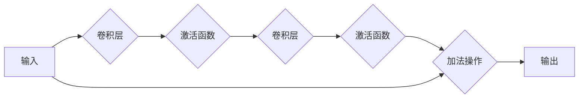

# 从零开始大模型开发与微调：ResNet残差模块的实现

作者：禅与计算机程序设计艺术

## 1. 背景介绍

### 1.1 深度学习的挑战

深度学习近年来取得了令人瞩目的成就，尤其是在计算机视觉领域。然而，随着网络深度的增加，训练深度神经网络也面临着越来越大的挑战：

- **梯度消失/爆炸问题:** 由于网络层数的增加，梯度在反向传播过程中可能会变得非常小或非常大，导致训练难以收敛。
- **网络退化问题:** 随着网络深度的增加，网络性能可能会下降，即使添加更多的层也无济于事。

### 1.2 ResNet的突破

为了解决这些问题，微软亚洲研究院的研究员何恺明等人于2015年提出了深度残差网络（ResNet）。ResNet的核心思想是引入残差模块（Residual Block），通过跳跃连接（Skip Connection）来缓解梯度消失/爆炸问题，并有效地解决了网络退化问题。ResNet在ImageNet图像分类挑战赛中取得了惊人的成绩，并迅速成为深度学习领域最具影响力的网络架构之一。

## 2. 核心概念与联系

### 2.1 残差模块

残差模块是ResNet的核心组件，其结构如下图所示：



残差模块包含两个主要分支：

- **主分支:** 包含两个或多个卷积层和激活函数，用于提取特征。
- **跳跃连接:** 直接将输入信号传递到输出，与主分支的输出相加。

跳跃连接使得网络可以学习残差函数，即输入与输出之间的差异。这种结构允许网络更容易地学习恒等映射，从而有效地缓解了梯度消失/爆炸问题。

### 2.2 跳跃连接

跳跃连接是残差模块的关键，它允许梯度直接从较深的层流向较浅的层，从而避免了梯度消失。跳跃连接还可以帮助网络学习恒等映射，这意味着即使添加更多的层，网络性能也不会下降。

### 2.3 残差学习

残差学习是指网络学习输入与输出之间的差异，而不是直接学习目标函数。这种方法可以简化学习过程，并提高网络的泛化能力。

## 3. 核心算法原理具体操作步骤

### 3.1 残差模块的构建

残差模块的构建非常简单，只需按照以下步骤进行操作：

1. **定义主分支:** 包含两个或多个卷积层和激活函数。
2. **添加跳跃连接:** 将输入信号直接传递到输出，与主分支的输出相加。

### 3.2 ResNet的构建

ResNet由多个残差模块堆叠而成，通常包含数十甚至数百个层。构建ResNet的步骤如下：

1. **定义输入层:** 用于接收输入数据。
2. **堆叠多个残差模块:** 每个残差模块包含两个或多个卷积层和激活函数。
3. **添加输出层:** 用于生成最终的预测结果。

## 4. 数学模型和公式详细讲解举例说明

### 4.1 残差函数

残差模块的数学表达式如下：

$$
F(x) = H(x) + x
$$

其中：

- $x$ 表示输入信号。
- $H(x)$ 表示主分支的输出。
- $F(x)$ 表示残差模块的输出。

### 4.2 梯度反向传播

在反向传播过程中，梯度可以通过跳跃连接直接传递到较浅的层，从而避免了梯度消失。

### 4.3 举例说明

假设我们有一个包含两个残差模块的ResNet，每个残差模块包含两个卷积层。输入信号为 $x$，第一个残差模块的输出为 $F_1(x)$，第二个残差模块的输出为 $F_2(F_1(x))$。

根据残差函数的定义，我们可以得到：

$$
F_1(x) = H_1(x) + x
$$

$$
F_2(F_1(x)) = H_2(F_1(x)) + F_1(x)
$$

将 $F_1(x)$ 代入第二个等式，我们可以得到：

$$
F_2(F_1(x)) = H_2(H_1(x) + x) + H_1(x) + x
$$

从这个等式可以看出，梯度可以通过跳跃连接直接传递到第一个残差模块，从而避免了梯度消失。

## 5. 项目实践：代码实例和详细解释说明

### 5.1 Python代码实现

```python
import torch
import torch.nn as nn

class ResidualBlock(nn.Module):
    def __init__(self, in_channels, out_channels, stride