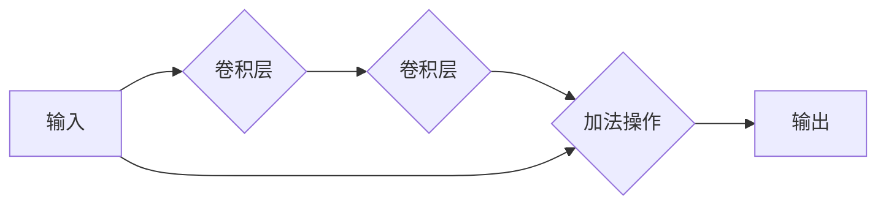

##  1. 背景介绍

### 1.1 深度学习的兴起与挑战

深度学习近年来取得了举世瞩目的成就，在图像识别、语音识别、自然语言处理等领域都实现了突破性的进展。然而，随着模型深度的不断增加，训练难度也随之加大。

**1.1.1 梯度消失/爆炸问题**

深度神经网络训练过程中，梯度会随着层数的增加而逐渐减弱或放大，导致模型难以有效地学习。

**1.1.2 过拟合问题**

复杂的深度神经网络容易过拟合训练数据，导致泛化能力下降。

### 1.2  ResNet的诞生

为了解决深度神经网络训练中的难题，微软亚洲研究院的何恺明等人于2015年提出了ResNet（Residual Network，残差网络）。ResNet的核心思想是引入残差连接，通过跳跃连接的方式缓解梯度消失/爆炸问题，并有效地抑制过拟合，使得训练更深的神经网络成为可能。

## 2. 核心概念与联系

### 2.1 残差块（Residual Block）

残差块是ResNet的基本组成单元，其核心结构如下图所示：



残差块包含两个卷积层和一个跳跃连接，跳跃连接将输入直接加到第二个卷积层的输出上。这种结构允许网络学习输入的残差，而不是直接学习完整的特征映射，从而缓解了梯度消失/爆炸问题。

### 2.2 跳跃连接（Skip Connection）

跳跃连接是ResNet的关键所在，它允许梯度直接从后一层传递到前一层，从而避免了梯度消失问题。此外，跳跃连接也使得网络可以学习更复杂的特征表示。

### 2.3 深度残差网络（Deep Residual Network）

ResNet通过堆叠多个残差块来构建深度残差网络，从而实现更深层次的特征提取。

## 3. 核心算法原理具体操作步骤

### 3.1 残差块的前向传播

残差块的前向传播过程如下：

1. 输入数据经过第一个卷积层进行特征提取。
2. 提取的特征经过第二个卷积层进行进一步的特征提取。
3. 将第二个卷积层的输出与原始输入相加，得到残差块的输出。

### 3.2 残差块的反向传播

残差块的反向传播过程如下：

1. 计算损失函数对输出的梯度。
2. 将梯度传递给第二个卷积层。
3. 将梯度传递给第一个卷积层。
4. 将梯度传递给跳跃连接，并直接传递给输入。

由于跳跃连接的存在，梯度可以直接传递到前一层，避免了梯度消失问题。

## 4. 数学模型和公式详细讲解举例说明

### 4.1 残差块的数学表达式

残差块的数学表达式可以表示为：

$$
y = F(x) + x
$$

其中，$x$ 表示输入，$F(x)$ 表示残差函数，$y$ 表示输出。

### 4.2 举例说明

假设输入 $x$ 为一个 $3 \times 3$ 的矩阵：

$$
x = \begin{bmatrix}
1 & 2 & 3 \\
4 & 5 & 6 \\
7 & 8 & 9
\end{bmatrix}
$$

残差函数 $F(x)$ 为两个卷积层，第一个卷积层使用 $1 \times 1$ 的卷积核，第二个卷积层使用 $3 \times 3$ 的卷积核。

经过残差块的前向传播，输出 $y$ 为：

$$
y = F(x) + x = \begin{bmatrix}
10 & 11 & 12 \\
13 & 14 & 15 \\
16 & 17 & 18
\end{bmatrix}
$$

## 5. 项目实践：代码实例和详细解释说明

### 5.1  使用PyTorch实现ResNet

```python
import torch
import torch.nn as nn

class ResidualBlock(nn.Module):
    def __init__(self, in_channels, out_channels, stride=1):
        super(ResidualBlock, self).__init__()
        self.conv1 = nn.Conv2d(in_