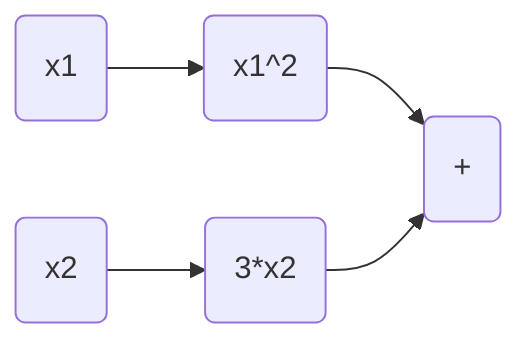
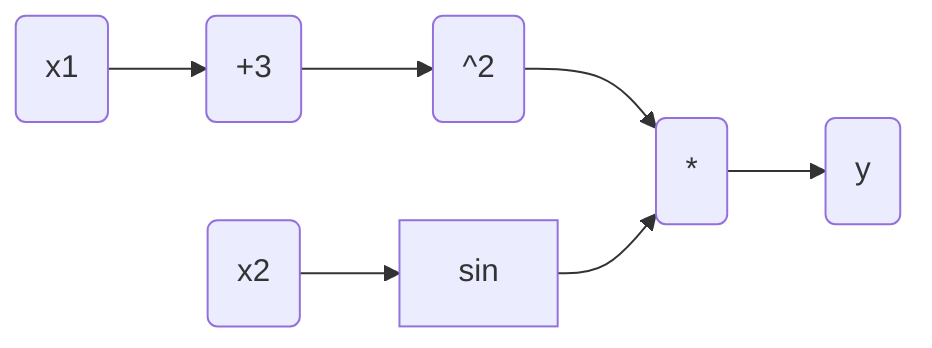
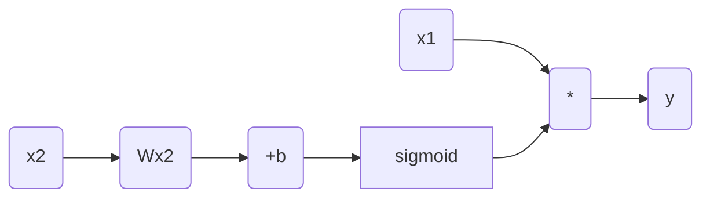

# 从零开始大模型开发与微调：链式求导法则

## 1.背景介绍

### 1.1 大规模语言模型的兴起

近年来,大规模语言模型在自然语言处理(NLP)领域取得了令人瞩目的成就。这些模型通过在大量文本数据上进行预训练,学习了丰富的语言知识和上下文表示,为下游任务提供了强大的基础模型。

GPT(Generative Pre-trained Transformer)、BERT(Bidirectional Encoder Representations from Transformers)、XLNet等模型在机器翻译、文本生成、问答系统等任务中展现出卓越的性能。特别是GPT-3这种超大规模的语言模型,其惊人的泛化能力引发了学术界和工业界的广泛关注。

### 1.2 大模型的挑战

然而,训练和优化这些大规模模型面临着诸多挑战:

- 计算资源需求巨大
- 模型参数规模庞大,优化复杂
- 存在梯度消失/爆炸的问题
- 需要大量标注数据进行监督微调

其中,高效、稳定的优化算法是关键。传统的随机梯度下降(SGD)等优化方法在处理大规模模型时往往效率低下,收敛慢。因此,需要探索更先进的优化技术。

### 1.3 链式求导法则

链式求导法则(Chain Rule)是解决这一优化难题的有力工具。它提供了一种优雅而高效的方式,用于计算复杂模型中的梯度,是训练深度神经网络不可或缺的基础。

本文将深入探讨链式求导法则在大规模语言模型训练中的应用,介绍其原理、实现细节以及相关的优化技术。我们将学习如何利用链式求导高效计算梯度,加速模型收敛,同时避免数值不稳定性。

## 2.核心概念与联系

### 2.1 计算图

为了理解链式求导法则,我们首先需要了解计算图(Computational Graph)的概念。计算图是一种用于表示数学运算的有向无环图,其中节点代表标量值或张量,边表示对节点进行的数学运算。

例如,给定函数 $y=f(x_1,x_2)=x_1^2+3x_2$,其计算图如下所示:



在训练神经网络时,我们需要计算损失函数(Loss Function)相对于模型参数的梯度。而计算图为我们提供了一种高效、通用的方式来表示这些复杂的数学运算,并通过链式求导法则自动计算梯度。

### 2.2 自动微分

自动微分(Automatic Differentiation)是一种高效计算导数的技术,它通过应用链式求导法则在计算图上传播梯度,避免了数值微分带来的精度问题和解析微分的复杂性。

在深度学习框架(如PyTorch、TensorFlow)中,自动微分已被广泛应用,极大地简化了模型训练的编程过程。开发者只需定义前向传播的计算过程,框架会自动构建计算图并应用反向传播算法计算梯度。

### 2.3 反向传播算法

反向传播算法(Backpropagation)是基于链式求导法则的一种高效计算梯度的算法,它在神经网络训练中扮演着关键角色。

该算法分为两个阶段:

1. 前向传播(Forward Propagation):计算模型的输出,构建计算图。
2. 反向传播(Backward Propagation):从损失函数开始,沿着计算图反向传播,应用链式求导法则计算每个节点相对于损失函数的梯度。

通过反向传播,我们可以高效地获得模型参数的梯度,用于参数更新和模型优化。

## 3.核心算法原理具体操作步骤

### 3.1 标量值函数的链式求导

对于标量值函数 $y=f(x_1,x_2,...,x_n)$,我们可以应用链式求导法则计算其梯度:

$$\frac{\partial y}{\partial x_i} = \sum_j \frac{\partial y}{\partial x_j} \cdot \frac{\partial x_j}{\partial x_i}$$

其中 $\frac{\partial x_j}{\partial x_i}$ 是一个雅可比矩阵(Jacobian Matrix),描述了 $x_j$ 相对于 $x_i$ 的变化率。

在计算图中,我们从输出节点开始,沿着反向传播路径,依次计算每个节点相对于损失函数的梯度,直至达到输入节点。

### 3.2 张量函数的链式求导

对于张量函数 $\mathbf{y}=f(\mathbf{x}_1,\mathbf{x}_2,...,\mathbf{x}_n)$,我们需要计算 $\mathbf{y}$ 相对于每个输入张量 $\mathbf{x}_i$ 的梯度 $\frac{\partial \mathbf{y}}{\partial \mathbf{x}_i}$。

根据链式求导法则,我们有:

$$\frac{\partial \mathbf{y}}{\partial \mathbf{x}_i} = \sum_j \frac{\partial \mathbf{y}}{\partial \mathbf{x}_j} \cdot \frac{\partial \mathbf{x}_j}{\partial \mathbf{x}_i}$$

其中 $\frac{\partial \mathbf{x}_j}{\partial \mathbf{x}_i}$ 是一个雅可比矩阵,描述了 $\mathbf{x}_j$ 相对于 $\mathbf{x}_i$ 的变化率。

在实践中,我们通常采用张量的元素乘法和求和运算来高效计算梯度。

### 3.3 反向传播算法步骤

反向传播算法可以概括为以下步骤:

1. 前向传播:计算模型输出,构建计算图。
2. 初始化输出节点梯度:将输出节点相对于损失函数的梯度设置为1。
3. 反向传播:
   - 对于每个节点,计算其相对于输入节点的梯度。
   - 将梯度值存储在节点中,用于后续计算。
   - 沿着计算图反向传播,直至达到输入节点。
4. 更新模型参数:使用计算得到的梯度,通过优化算法(如SGD)更新模型参数。

通过反复执行这个过程,模型可以不断优化,最小化损失函数。

## 4.数学模型和公式详细讲解举例说明

### 4.1 标量值函数示例

让我们以一个简单的标量值函数为例,了解链式求导法则的具体应用。

给定函数 $y=f(x_1,x_2)=(x_1+3)^2 \cdot \sin(x_2)$,我们需要计算 $\frac{\partial y}{\partial x_1}$ 和 $\frac{\partial y}{\partial x_2}$。

首先,我们构建计算图:



然后,我们从输出节点 $y$ 开始反向传播:

1. $\frac{\partial y}{\partial y} = 1$
2. $\frac{\partial y}{\partial \text{mul1}} = \frac{\partial y}{\partial y} \cdot \frac{\partial y}{\partial \text{mul1}} = 1 \cdot 1 = 1$
3. $\frac{\partial y}{\partial \text{pow1}} = \frac{\partial y}{\partial \text{mul1}} \cdot \frac{\partial \text{mul1}}{\partial \text{pow1}} = 1 \cdot \sin(x_2)$
4. $\frac{\partial y}{\partial x_1} = \frac{\partial y}{\partial \text{pow1}} \cdot \frac{\partial \text{pow1}}{\partial x_1} = \sin(x_2) \cdot 2(x_1+3)$
5. $\frac{\partial y}{\partial \sin} = \frac{\partial y}{\partial \text{mul1}} \cdot \frac{\partial \text{mul1}}{\partial \sin} = 1 \cdot (x_1+3)^2$
6. $\frac{\partial y}{\partial x_2} = \frac{\partial y}{\partial \sin} \cdot \frac{\partial \sin}{\partial x_2} = (x_1+3)^2 \cdot \cos(x_2)$

通过这个示例,我们可以看到链式求导法则如何帮助我们系统地计算复杂函数的梯度。

### 4.2 张量函数示例

现在,让我们来看一个张量函数的示例,了解如何计算张量梯度。

给定函数 $\mathbf{y}=f(\mathbf{x}_1,\mathbf{x}_2)=\mathbf{x}_1 \odot \sigma(\mathbf{W}\mathbf{x}_2+\mathbf{b})$,其中 $\odot$ 表示元素乘积,$ \sigma $ 是 Sigmoid 激活函数, $ \mathbf{W} $ 和 $ \mathbf{b} $ 是可训练参数。我们需要计算 $\frac{\partial \mathbf{y}}{\partial \mathbf{x}_1}$ 和 $\frac{\partial \mathbf{y}}{\partial \mathbf{x}_2}$。

首先,我们构建计算图:



然后,我们从输出节点 $\mathbf{y}$ 开始反向传播:

1. $\frac{\partial \mathbf{y}}{\partial \mathbf{y}} = \mathbf{1}$
2. $\frac{\partial \mathbf{y}}{\partial \text{mul1}} = \frac{\partial \mathbf{y}}{\partial \mathbf{y}} \odot \frac{\partial \mathbf{y}}{\partial \text{mul1}} = \mathbf{1} \odot \mathbf{1} = \mathbf{1}$
3. $\frac{\partial \mathbf{y}}{\partial \mathbf{x}_1} = \frac{\partial \mathbf{y}}{\partial \text{mul1}} \odot \frac{\partial \text{mul1}}{\partial \mathbf{x}_1} = \mathbf{1} \odot \sigma(\mathbf{W}\mathbf{x}_2+\mathbf{b})$
4. $\frac{\partial \mathbf{y}}{\partial \sigma} = \frac{\partial \mathbf{y}}{\partial \text{mul1}} \odot \frac{\partial \text{mul1}}{\partial \sigma} = \mathbf{1} \odot \mathbf{x}_1$
5. $\frac{\partial \mathbf{y}}{\partial \text{add1}} = \frac{\partial \mathbf{y}}{\partial \sigma} \odot \sigma'(\mathbf{W}\mathbf{x}_2+\mathbf{b})$
6. $\frac{\partial \mathbf{y}}{\partial \mathbf{W}} = \frac{\partial \mathbf{y}}{\partial \text{add1}} \odot \frac{\partial \text{add1}}{\partial \mathbf{W}} = \frac{\partial \mathbf{y}}{\partial \text{add1}} \odot \mathbf{x}_2^T$
7. $\frac{\partial \mathbf{y}}{\partial \mathbf{x}_2} = \frac{\partial \mathbf{y}}{\partial \text{add1}} \odot \frac{\partial \text{add1}}{\partial \mathbf{x}_2} = \frac{\partial \mathbf{y}}{\partial \text{add1}} \odot \mathbf{W}^T$

通过这个示例,我们可以看到如何使用张量的元素乘积和求和运算来高效计算梯度。

## 4.项目实践:代码实例和详细解释说明

在本节中,我们将使用 PyTorch 框架,通过一个实际的项目实践,演示如何应用链式求导法则训练深度神经网络。

我们将构建一个简单的全连接神经网络,对 MNIST 手写数字数据集进行分类。该模型由一个输入层、一个隐藏层和一个输出层组成。

### 4.1 导入所需库

```python
import torch
import torch.nn as nn
import torchvision
import torchvision.transforms as transforms
```

### 4.2 加载数据集

```python
# 下载并加载 MNIST 数据集
transform = transforms.Compose([transforms.ToTensor(), transforms.Normalize((0.5,), (0.5,))])
trainset = torchvision.datasets.MNIST(root='./data', train=True, download=True, transform=transform)
trainloader = torch.utils.data.DataLoader(trainset, batch_size=64, shuffle=True)
testset = torchvision.