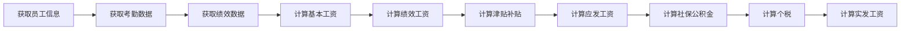

## 1. 背景介绍

### 1.1 人事工资管理的必要性

在现代企业管理中，人事工资管理是至关重要的一环。它涉及到员工的薪酬计算、社保缴纳、个税申报等方面，直接关系到企业的运营成本和员工的切身利益。传统的工资管理方式效率低下、容易出错，难以满足现代企业的需求。因此，开发一套高效、准确、易用的企业人事工资管理系统势在必行。

### 1.2 系统目标

本系统旨在为企业提供一套完整的工资管理解决方案，实现以下目标：

* **自动化工资计算:**  根据员工的考勤、绩效等数据自动计算工资，减少人工操作，提高效率和准确性。
* **规范化管理流程:**  将工资管理流程标准化，避免人为因素干扰，确保公平公正。
* **实时数据分析:**  提供丰富的报表和数据分析功能，帮助企业了解员工薪酬状况，优化人力资源管理。

## 2. 核心概念与联系

### 2.1 核心概念

* **员工信息:** 包括员工的基本信息、部门、职位、薪资等。
* **考勤数据:** 记录员工的出勤情况，包括上班时间、下班时间、加班时间等。
* **绩效数据:** 反映员工的工作表现，包括工作量、工作质量、工作态度等。
* **薪资结构:** 定义工资的构成，包括基本工资、绩效工资、津贴补贴等。
* **社保公积金:** 按照国家规定缴纳的社会保险和住房公积金。
* **个税:**  根据员工的收入情况计算个人所得税。

### 2.2 概念间联系

* 员工信息是基础数据，是其他模块的基础。
* 考勤数据和绩效数据是工资计算的依据。
* 薪资结构定义了工资的构成，决定了工资的计算方式。
* 社保公积金和个税是工资的扣除项，影响员工的实际收入。

## 3. 核心算法原理具体操作步骤

### 3.1 工资计算算法

工资计算算法是系统的核心，它根据员工的考勤数据、绩效数据和薪资结构，自动计算员工的工资。具体的计算步骤如下:

1. **获取员工信息:** 从数据库中读取员工的基本信息、部门、职位、薪资等数据。
2. **获取考勤数据:**  从考勤系统中获取员工的考勤数据，包括上班时间、下班时间、加班时间等。
3. **获取绩效数据:**  从绩效考核系统中获取员工的绩效数据，包括工作量、工作质量、工作态度等。
4. **计算基本工资:**  根据员工的职位和薪资等级，计算基本工资。
5. **计算绩效工资:**  根据员工的绩效数据和绩效工资计算规则，计算绩效工资。
6. **计算津贴补贴:**  根据员工的职位和公司政策，计算津贴补贴。
7. **计算应发工资:**  将基本工资、绩效工资、津贴补贴加总，得到应发工资。
8. **计算社保公积金:**  根据国家规定和员工的薪资水平，计算社保公积金。
9. **计算个税:**  根据员工的应发工资和个税起征点，计算个人所得税。
10. **计算实发工资:**  从应发工资中扣除社保公积金和个税，得到实发工资。

### 3.2 流程图



## 4. 数学模型和公式详细讲解举例说明

### 4.1 绩效工资计算模型

绩效工资的计算可以使用多种模型，例如：

* **线性模型:** 绩效工资 = 基本工资 * 绩效系数
* **分段线性模型:** 
    * 当绩效系数 < 0.8 时，绩效工资 = 0
    * 当 0.8 <= 绩效系数 < 1 时，绩效工资 = 基本工资 * (绩效系数 - 0.8) / 0.2
    * 当 绩效系数 >= 1 时，绩效工资 = 基本工资 

### 4.2 个税计算公式

$$
个税 = (应纳税所得额 - 个税起征点) * 适用税率 - 速算扣除数
$$

其中：

* 应纳税所得额 = 应发工资 - 五险一金 - 专项扣除
* 个税起征点 = 5000 元/月
* 适用税率和速算扣除数根据应纳税所得额确定

### 4.3 举例说明

假设员工张三的基本工资为 10000 元，绩效系数为 0.9，社保公积金为 2000 元，专项扣除为 1000 元。

* **绩效工资:** 
    * 使用线性模型：绩效工资 = 10000 * 0.9 = 9000 元
* **应纳税所得额:** 应纳税所得额 = 10000 + 9000 - 2000 - 1000 = 16000 元
* **个税:** 
    * 适用税率为 3%，速算扣除数为 0 元
    * 个税 = (16000 - 5000) * 0.03 - 0 = 330 元
* **实发工资:** 实发工资 = 10000 + 9000 - 2000 - 330 = 16670 元

## 5. 项目实践：代码实例和详细解释说明

### 5.1 开发环境

* 操作系统: Windows 10
* 开发语言: Python 3.8
* 数据库: MySQL 8.0
* Web框架: Django 3.2

### 5.2 代码实例

```python
# models.py

from django.db import models

class Employee(models.Model):
    name = models.CharField(max_length=50)
    department = models.CharField(max_length=50)
    position = models.CharField(max_length=50)
    salary = models.DecimalField(max_digits=10, decimal_places=2)

class Attendance(models.Model):
    employee = models.ForeignKey(Employee, on_delete=models.CASCADE)
    date = models.DateField()
    start_time = models.TimeField()
    end_time = models.TimeField()
    overtime = models.DecimalField(max_digits=5, decimal_places=2)

class Performance(models.Model):
    employee = models.ForeignKey(Employee, on_delete=models.CASCADE)
    date = models.DateField()
    score = models.DecimalField(max_digits=5, decimal_places=2)

# views.py

from django.shortcuts import render
from .models import Employee, Attendance, Performance

def calculate_salary(request):
    # 获取员工信息
    employees = Employee.objects.all()

    # 循环计算每个员工的工资
    for employee in employees:
        # 获取考勤数据
        attendances = Attendance.objects.filter(employee=employee)

        # 获取绩效数据
        performances = Performance.objects.filter(employee=employee)

        # 计算工资
        salary = employee.salary
        for attendance in attendances:
            salary += attendance.overtime * employee.salary / 8
        for performance in performances:
            salary += performance.score * employee.salary / 10

        # 保存工资数据
        # ...

    return render(request, 'salary.html', {'employees': employees})
```

### 5.3 代码解释

* `models.py` 定义了数据模型，包括员工信息、考勤数据和绩效数据。
* `views.py` 定义了计算工资的视图函数 `calculate_salary`。
* `calculate_salary` 函数首先获取所有员工信息，然后循环计算每个员工的工资。
* 对于每个员工，函数首先获取考勤数据和绩效数据，然后根据考勤数据和绩效数据计算工资。
* 最后，函数将计算结果保存到数据库中，并渲染 `salary.html` 模板，将工资数据展示给用户。

## 6. 实际应用场景

企业人事工资管理系统可以应用于各种类型的企业，例如：

* **制造业:**  计算生产线工人的计件工资。
* **服务业:**  计算服务人员的服务费和提成。
* **互联网行业:**  计算程序员的项目奖金和年终奖。
* **政府机关:**  计算公务员的工资和津贴补贴。

## 7. 工具和资源推荐

### 7.1 开发工具

* **PyCharm:** Python 集成开发环境
* **Visual Studio Code:**  轻量级代码编辑器
* **MySQL Workbench:** MySQL 数据库管理工具

### 7.2 学习资源

* **Django 官方文档:** https://docs.djangoproject.com/
* **Python 官方文档:** https://docs.python.org/
* **MySQL 官方文档:** https://dev.mysql.com/doc/

## 8. 总结：未来发展趋势与挑战

### 8.1 未来发展趋势

* **智能化:**  利用人工智能技术，实现更精准的工资计算和更智能的工资管理。
* **移动化:**  开发移动端应用，方便员工随时随地查看工资信息。
* **云计算:**  将系统部署到云平台，提高系统的可靠性和安全性。

### 8.2 面临的挑战

* **数据安全:**  工资数据属于敏感信息，需要采取严格的安全措施，防止数据泄露。
* **系统性能:**  随着企业规模的扩大，系统需要处理的数据量越来越大，需要不断优化系统性能。
* **法律法规:**  工资管理需要遵守国家相关法律法规，需要及时更新系统功能，适应法律法规的变化。

## 9. 附录：常见问题与解答

### 9.1 如何处理员工的请假和加班？

* 请假：在考勤数据中记录员工的请假时间，并在工资计算时扣除相应的工资。
* 加班：在考勤数据中记录员工的加班时间，并在工资计算时支付相应的加班费。

### 9.2 如何处理员工的奖金和补贴？

* 奖金和补贴：在薪资结构中定义奖金和补贴的计算规则，并在工资计算时根据规则计算相应的金额。

### 9.3 如何处理员工的个税申报？

* 个税申报：系统可以自动生成个税申报表，并提供在线申报功能，方便员工进行个税申报。
