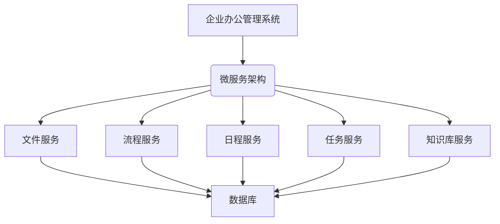
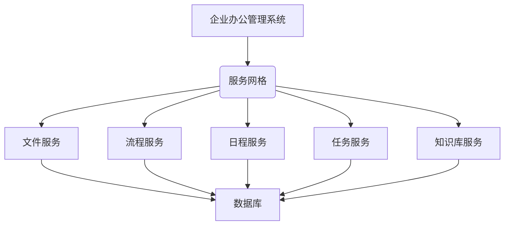
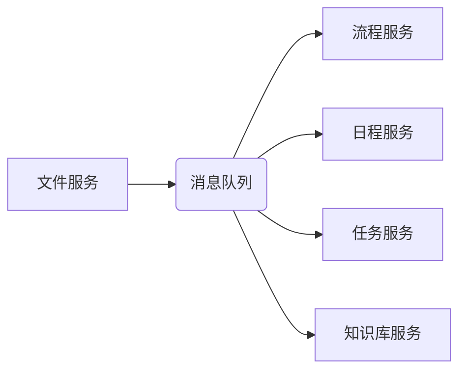

# 企业及其分支机构内部办公管理系统详细设计与具体代码实现

## 1.背景介绍

### 1.1 企业办公管理系统的重要性

在当今快节奏的商业环境中，企业需要高效协作和有效管理来保持竞争力。企业办公管理系统作为一种集成化的软件解决方案,旨在优化企业的日常运营、提高工作效率、降低运营成本、加强内部沟通和协作。它涵盖了多个功能模块,如文件管理、流程审批、日程安排、任务分派、知识库等,为企业提供了一个统一的平台,实现了信息的集中化管理和共享。

### 1.2 传统办公管理系统的缺陷

虽然市面上存在许多成熟的办公管理系统,但它们通常面临以下挑战:

- **缺乏灵活性和可扩展性**:大多数现有系统都是通用解决方案,难以满足企业特定的业务需求,定制和扩展功能的成本较高。
- **数据孤岛效应**:不同系统之间的数据集成度较低,导致数据存在孤岛,无法实现高效共享和协作。
- **用户体验不佳**:界面设计陈旧,操作流程复杂,给用户带来不便。
- **安全性和可靠性有待加强**:一些系统在数据安全、访问控制和容错能力方面存在缺陷。

### 1.3 分布式架构的优势

为了解决上述问题,本文提出了一种基于分布式架构的企业办公管理系统。该系统具有以下优势:

- **高度可扩展**:通过模块化设计和服务化部署,系统能够根据需求轻松扩展新功能。
- **数据集成**:采用统一的数据模型和消息总线,实现跨系统的数据共享和业务协同。
- **高可用性**:基于分布式集群部署,单点故障对系统影响较小,能够提供稳定可靠的服务。
- **灵活部署**:支持公有云、私有云和混合云部署模式,满足不同企业的需求。

## 2.核心概念与联系

### 2.1 微服务架构

微服务架构是本系统的核心设计理念。它将整个应用程序划分为一组小型、自治且高度解耦的服务。每个服务负责实现一个单一的业务能力,通过轻量级的通信机制相互协作,共同构建了一个完整的应用程序。

### 2.2 服务网格

为了简化微服务之间的通信,并提供一致的可观测性、安全性和可靠性保证,本系统采用了服务网格(Service Mesh)技术。服务网格通过将网络功能从应用程序代码中分离出来,形成一个专用的基础设施层,从而降低了微服务的复杂性。

### 2.3 消息队列

为了实现异步通信和解耦,本系统引入了消息队列。当一个服务需要与另一个服务交互时,它只需将消息发送到队列中,而不需要直接调用目标服务。这种通信模式可以提高系统的可靠性和灵活性,同时也有利于实现事件驱动架构。

### 2.4 DevOps 和持续交付

为了加快系统的交付速度和提高质量,本系统采用了 DevOps 实践和持续交付流程。通过自动化构建、测试和部署,能够快速将新功能安全地推送到生产环境,同时也降低了人为错误的风险。

## 3.核心算法原理具体操作步骤

### 3.1 文件服务

文件服务是本系统的核心组件之一,它负责管理企业内部的各种文件,包括文档、表格、幻灯片等。以下是文件服务的主要功能和算法原理:

#### 3.1.1 文件上传

1. 客户端通过 HTTP 请求将文件上传到文件服务器。
2. 服务器对文件进行virus扫描和格式验证。
3. 如果验证通过,服务器将文件存储到对象存储系统(如 Amazon S3、Azure Blob Storage 或自建对象存储)中。
4. 服务器将文件元数据(如文件名、大小、上传时间等)存储到数据库中。
5. 服务器返回文件 ID 给客户端,供后续操作使用。

#### 3.1.2 文件下载

1. 客户端向文件服务器发送下载请求,包含文件 ID。
2. 服务器从数据库中查询文件元数据,获取文件在对象存储中的位置。
3. 服务器从对象存储中读取文件内容。
4. 服务器将文件内容通过 HTTP 响应发送给客户端。

#### 3.1.3 文件版本控制

为了追踪文件的变更历史,文件服务实现了版本控制功能:

1. 每次上传新版本的文件时,服务器将新版本存储到对象存储中,并更新数据库中的版本信息。
2. 用户可以查看文件的所有版本,并选择下载或恢复到特定版本。
3. 服务器使用 Diff 算法计算不同版本之间的差异,以节省存储空间。

#### 3.1.4 文件协作

文件服务支持多人实时协作编辑同一文件:

1. 当用户开始编辑文件时,服务器为该文件创建一个协作会话。
2. 用户的编辑操作通过 WebSocket 连接实时发送到服务器。
3. 服务器将编辑操作广播给其他协作者,使他们能够看到实时更新。
4. 使用操作变换(Operational Transformation)算法解决并发编辑冲突。

### 3.2 流程服务

流程服务用于管理企业内部的各种审批流程,如请假申请、采购审批、报销审核等。以下是流程服务的核心算法:

#### 3.2.1 流程定义

1. 使用基于状态机的建模语言(如 BPMN)定义流程,包括参与者、任务、条件分支等。
2. 将流程定义解析为内部表示,如工作流网络或有向无环图。
3. 将解析后的流程定义存储到数据库中,供流程执行引擎使用。

#### 3.2.2 流程执行

1. 用户发起一个新的流程实例。
2. 流程执行引擎从数据库中读取流程定义,并创建一个新的流程实例。
3. 根据流程定义,执行引擎按顺序执行各个任务,包括自动任务和人工任务。
4. 对于人工任务,执行引擎将任务分配给相应的参与者。
5. 参与者完成任务后,执行引擎继续执行后续任务,直到流程结束。

#### 3.2.3 任务分配

为了公平分配任务,流程服务采用以下算法:

1. 基于角色的分配:根据参与者的角色将任务分配给合适的人员。
2. 工作负载均衡:监控每个参与者的任务数量,将新任务分配给工作负载较轻的人员。
3. 技能匹配:根据任务所需的技能,将任务分配给具备相应技能的参与者。
4. 优先级处理:对于紧急任务,可以临时提高其优先级,优先分配给可用的参与者。

### 3.3 日程服务

日程服务用于管理企业内部的各种日程安排,如会议预订、工作计划等。以下是日程服务的核心算法:

#### 3.3.1 日程安排

1. 用户创建一个新的日程事件,包括标题、开始时间、结束时间、参与者等信息。
2. 服务器检查所有参与者在该时间段是否有其他日程安排冲突。
3. 如果没有冲突,服务器将日程事件存储到数据库中,并向所有参与者发送通知。
4. 如果有冲突,服务器将提示用户修改时间或参与者。

#### 3.3.2 日程优化

为了更好地利用时间资源,日程服务采用了以下优化算法:

1. 时间块规划:将一天划分为固定的时间块(如 30 分钟),只允许在时间块边界安排日程事件,以减少碎片化时间。
2. 日程聚合:将相关的日程事件(如同一项目的多个会议)聚合在一起,以提高效率。
3. 优先级排序:根据日程事件的优先级,优先安排高优先级事件。
4. 智能建议:基于历史数据和机器学习算法,为用户推荐最佳的日程安排时间。

### 3.4 任务服务

任务服务用于分配和跟踪企业内部的各种工作任务,如项目任务、日常工作等。以下是任务服务的核心算法:

#### 3.4.1 任务分解

为了更好地管理复杂任务,任务服务支持将任务分解为多个子任务:

1. 用户创建一个新的任务,并为其指定优先级、截止日期等信息。
2. 用户可以将任务进一步分解为多个子任务,每个子任务都有自己的描述、负责人和截止日期。
3. 子任务可以继续分解,形成任务分解结构(Work Breakdown Structure)。
4. 服务器将任务分解结构存储到数据库中,供后续跟踪和管理。

#### 3.4.2 任务跟踪

任务服务提供了多种方式来跟踪任务进度:

1. 基于状态的跟踪:任务可以处于多个状态(如新建、进行中、阻塞、完成等),用户可以更新任务状态以反映当前进度。
2. 基于进度的跟踪:用户可以为任务设置完成百分比,以更精确地反映进度。
3. 基于关键节点的跟踪:用户可以为任务设置多个关键节点,每完成一个节点即更新进度。
4. 自动提醒:服务器会根据任务截止日期自动发送提醒,避免任务被遗忘。

#### 3.4.3 资源分配

为了确保任务能够按时完成,任务服务需要合理分配资源:

1. 人力资源分配:根据任务的技能需求,将任务分配给合适的人员或团队。
2. 材料资源分配:如果任务需要特定的材料或设备,服务器需要检查可用库存,并进行相应分配。
3. 成本控制:服务器会估算任务所需的成本(如人力、材料等),并将其纳入整体预算管理。
4. 风险评估:对于高风险任务,服务器需要进行风险评估,并制定应对措施。

### 3.5 知识库服务

知识库服务用于管理企业内部的各种知识资源,如最佳实践、技术文档、常见问题解答等。以下是知识库服务的核心算法:

#### 3.5.1 知识组织

为了便于检索和维护,知识库服务采用了分层结构来组织知识:

1. 知识被划分为多个领域(如技术、营销、人力资源等)。
2. 每个领域下包含多个主题。
3. 每个主题下包含多篇知识文章。
4. 服务器将这种分层结构存储到数据库中,供后续检索和导航使用。