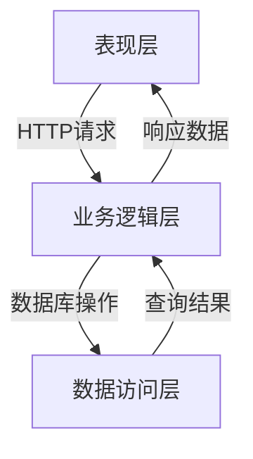

# 企业网上订单系统详细设计与具体代码实现

## 1. 背景介绍

### 1.1 电子商务的兴起与发展

随着互联网技术的快速发展,电子商务(E-commerce)作为一种全新的商业模式,已经深深地融入到我们的日常生活中。通过网络平台,企业可以更加便捷地展示和销售商品,而消费者也可以随时随地浏览、选购所需商品,极大地提高了交易效率。

### 1.2 网上订单系统的重要性

网上订单系统作为电子商务不可或缺的核心组成部分,为企业和客户之间的交易活动提供了高效、安全、可靠的技术支撑。一个优秀的网上订单系统,不仅可以简化订单处理流程,还能够提升客户体验,增强企业竞争力。

## 2. 核心概念与联系

### 2.1 系统架构

网上订单系统通常采用三层或多层架构,包括表现层(前端)、业务逻辑层(后端)和数据访问层。这种分层设计有利于提高系统的可维护性、扩展性和安全性。



### 2.2 核心功能模块

一个典型的网上订单系统通常包括以下核心功能模块:

- **用户管理模块**: 实现用户注册、登录、个人信息管理等功能。
- **商品管理模块**: 实现商品信息的添加、修改、删除、查询等功能。
- **购物车模块**: 允许用户临时存储所选商品,并进行编辑和结算。
- **订单管理模块**: 处理订单的创建、支付、发货、取消等操作。
- **支付模块**: 集成第三方支付平台,实现多种支付方式。
- **物流模块**: 与物流公司对接,实现订单发货和物流跟踪。

### 2.3 关键技术

实现网上订单系统需要综合运用多种技术,包括但不限于:

- **Web开发技术**: HTML、CSS、JavaScript等前端技术,以及Java、Python、Node.js等后端语言和框架。
- **数据库技术**: 关系型数据库(如MySQL)和非关系型数据库(如MongoDB)。
- **安全技术**: 用户认证、数据加密、防御攻击等。
- **缓存技术**: 提高系统响应速度和并发能力。
- **消息队列**: 实现异步处理、应用解耦等。
- **DevOps**: 持续集成、持续交付、容器化等。

## 3. 核心算法原理具体操作步骤

### 3.1 用户认证算法

用户认证是网上订单系统的基础,通常采用密码哈希存储和基于会话的认证机制。具体步骤如下:

1. 用户注册时,将密码使用安全的哈希算法(如bcrypt)进行哈希处理,存储到数据库中。
2. 用户登录时,将输入的密码进行相同的哈希处理,与数据库中的哈希值进行比对。
3. 如果匹配成功,为用户创建一个会话(Session),并将会话ID存储在客户端的Cookie中。
4. 后续的每个请求都需要携带会话ID,服务器验证会话的有效性,以确认用户的身份。
5. 用户退出时,销毁对应的会话。

### 3.2 商品搜索算法

为了提高商品搜索的效率和准确性,可以采用以下算法:

1. **倒排索引**: 建立关键词到商品ID的倒排索引,加快关键词搜索的速度。
2. **分词技术**: 对商品标题、描述等文本进行分词,提高搜索的召回率。
3. **相似度计算**: 计算查询关键词与商品信息的相似度,按分值排序返回结果。
4. **拼音搜索**: 支持基于拼音的模糊搜索,提高用户体验。

### 3.3 推荐算法

为了提高销售额和用户粘性,网上订单系统通常会采用推荐算法,主要包括:

1. **协同过滤算法**: 基于用户的历史行为数据,推荐与目标用户口味相似的其他用户喜欢的商品。
2. **基于内容的推荐**: 根据商品的文本描述、属性等内容信息,推荐与目标商品相似的其他商品。
3. **组合推荐算法**: 将多种算法的结果进行融合,提高推荐的准确性和多样性。

### 3.4 订单处理算法

订单处理是网上订单系统的核心流程,需要保证高效、可靠和事务一致性。典型的处理步骤如下:

1. 用户提交订单请求,系统首先检查商品库存是否足够。
2. 如果库存足够,则冻结相应的库存量,进入下一步处理。
3. 调用第三方支付接口,完成支付流程。如果支付成功,则执行下一步;否则,释放冻结的库存。
4. 创建物流订单,发货给用户,并更新订单状态。
5. 异步执行库存扣减、发送通知等后续操作。

为了保证订单处理的事务一致性,可以采用分布式事务处理方案,如基于二阶段提交协议的XA事务、基于消息队列的最终一致性方案等。

## 4. 数学模型和公式详细讲解举例说明

### 4.1 协同过滤算法

协同过滤算法是推荐系统中一种常用的算法,它根据用户之间的相似性来预测目标用户对商品的喜好程度。常用的相似度计算公式包括:

1. **欧几里得距离**:

$$
sim(u,v)=\frac{1}{\sqrt{\sum_{i\in I}(r_{ui}-r_{vi})^2}}
$$

其中,`$u$`和`$v$`分别表示两个用户,`$I$`是两个用户都评分过的商品集合,`$r_{ui}$`和`$r_{vi}$`分别表示用户`$u$`和`$v$`对商品`$i$`的评分。

2. **皮尔逊相关系数**:

$$
sim(u,v)=\frac{\sum_{i\in I}(r_{ui}-\overline{r_u})(r_{vi}-\overline{r_v})}{\sqrt{\sum_{i\in I}(r_{ui}-\overline{r_u})^2}\sqrt{\sum_{i\in I}(r_{vi}-\overline{r_v})^2}}
$$

其中,`$\overline{r_u}$`和`$\overline{r_v}$`分别表示用户`$u$`和`$v$`的平均评分。

基于计算出的用户相似度,可以预测目标用户`$u$`对商品`$i$`的评分:

$$
p_{ui}=\overline{r_u}+\frac{\sum_{v\in S}sim(u,v)(r_{vi}-\overline{r_v})}{\sum_{v\in S}sim(u,v)}
$$

其中,`$S$`是与目标用户`$u$`相似的用户集合。

### 4.2 基于内容的推荐算法

基于内容的推荐算法通过计算目标商品与用户历史喜好商品的相似度来进行推荐。常用的文本相似度计算公式包括:

1. **余弦相似度**:

$$
sim(d_1,d_2)=\frac{\vec{d_1}\cdot\vec{d_2}}{||\vec{d_1}||\times||\vec{d_2}||}
$$

其中,`$\vec{d_1}$`和`$\vec{d_2}$`分别表示商品文本的向量表示,通常使用TF-IDF等方法计算。

2. **编辑距离**:

编辑距离(如Levenshtein距离)可用于计算两个字符串之间的相似程度,常用于短文本相似度计算。

$$
lev_{a,b}(i,j)=\begin{cases}
\max(i,j) & \text{if } \min(i,j)=0 \\
\min \begin{cases}
lev_{a,b}(i-1,j)+1 \\
lev_{a,b}(i,j-1)+1 \\
lev_{a,b}(i-1,j-1)+1_{(a_i \neq b_j)}
\end{cases} & \text{otherwise}
\end{cases}
$$

其中,`$a$`和`$b$`分别表示两个字符串,`$lev_{a,b}(i,j)$`表示将`$a$`的前`$i$`个字符转换为`$b$`的前`$j$`个字符所需的最小编辑操作次数。

## 4. 项目实践:代码实例和详细解释说明

为了更好地理解网上订单系统的实现细节,我们将以Java语言和Spring框架为例,提供一些核心模块的代码示例和解释。

### 4.1 用户认证模块

```java
// UserController.java
@RestController
@RequestMapping("/users")
public class UserController {
    @Autowired
    private UserService userService;

    @PostMapping("/register")
    public ResponseEntity<?> register(@RequestBody User user) {
        // 对密码进行哈希处理
        String hashedPassword = BCrypt.hashpw(user.getPassword(), BCrypt.gensalt());
        user.setPassword(hashedPassword);

        userService.register(user);
        return ResponseEntity.ok().build();
    }

    @PostMapping("/login")
    public ResponseEntity<?> login(@RequestBody User user, HttpSession session) {
        User dbUser = userService.findByUsername(user.getUsername());
        if (dbUser != null && BCrypt.checkpw(user.getPassword(), dbUser.getPassword())) {
            // 创建会话并存储用户信息
            session.setAttribute("user", dbUser);
            return ResponseEntity.ok().build();
        }
        return ResponseEntity.status(HttpStatus.UNAUTHORIZED).build();
    }

    // 其他方法...
}
```

在注册时,我们使用`BCrypt`算法对用户密码进行哈希处理,存储到数据库中。在登录时,我们从数据库中取出用户的哈希密码,使用`BCrypt.checkpw`方法与用户输入的密码进行比对。如果匹配成功,则在会话中存储用户信息。

### 4.2 商品搜索模块

```java
// ProductService.java
@Service
public class ProductService {
    @Autowired
    private ProductRepository productRepository;

    public List<Product> searchProducts(String keyword) {
        // 分词处理
        List<String> tokens = TokenizerUtil.tokenize(keyword);

        // 构建搜索条件
        BooleanQuery query = new BooleanQuery.Builder()
                .add(new BooleanClause(new TermQuery(new Term("title", tokens.get(0))), Occur.SHOULD))
                .add(new BooleanClause(new TermQuery(new Term("description", tokens.get(0))), Occur.SHOULD))
                .build();

        // 执行搜索
        SearchHits<Product> searchHits = elasticsearchOperations.search(query, Product.class);
        return searchHits.getSearchHits().stream()
                .map(SearchHit::getContent)
                .collect(Collectors.toList());
    }
}
```

在这个示例中,我们使用Elasticsearch作为搜索引擎,通过构建`BooleanQuery`来实现基于标题和描述的关键词搜索。首先,我们使用分词工具(如`TokenizerUtil`)对搜索关键词进行分词处理,然后为每个分词构建`TermQuery`,并将它们组合成`BooleanQuery`。最后,执行搜索并返回结果列表。

### 4.3 订单处理模块

```java
// OrderService.java
@Service
public class OrderService {
    @Autowired
    private OrderRepository orderRepository;
    @Autowired
    private ProductRepository productRepository;
    @Autowired
    private PaymentService paymentService;
    @Autowired
    private LogisticsService logisticsService;

    @Transactional
    public Order placeOrder(Order order) {
        // 检查商品库存
        List<OrderItem> items = order.getItems();
        for (OrderItem item : items) {
            Product product = productRepository.findById(item.getProductId()).orElseThrow();
            if (product.getStock() < item.getQuantity()) {
                throw new InsufficientStockException();
            }
        }

        // 冻结库存
        for (OrderItem item : items) {
            Product product = productRepository.findById(item.getProductId()).orElseThrow();
            product.setStock(product.getStock() - item.getQuantity());
            productRepository.save(product);
        }

        // 处理支付
        boolean paymentSuccess = paymentService.processPayment(order.getTotalAmount());
        if (!paymentSuccess) {
            // 支付失败, 释放冻结的库存
            for (OrderItem item : items) {
                Product product = productRepository.findById(item.getProductId()).orElseThrow();
                product.setStock(product.getStock() + item.getQuantity());
                productRepository.save(product);
            }
            