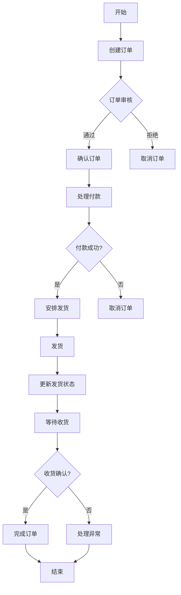

# 企业订单管理系统设计与实现

## 1.背景介绍

### 1.1 订单管理系统的重要性

在当今快节奏的商业环境中，高效的订单管理系统对于企业的成功至关重要。订单管理系统是一个集中式平台,用于管理企业的销售订单、采购订单、库存管理和供应链流程。它可以帮助企业提高运营效率、降低成本、改善客户服务和决策制定。

### 1.2 订单管理系统的挑战

设计和实现一个健壮、可扩展和用户友好的订单管理系统面临着诸多挑战:

- **数据复杂性**:订单数据涉及多个实体,如客户、产品、价格、付款、发货等,需要精心设计数据模型。
- **业务逻辑复杂性**:订单流程包括多个阶段,如下单、审核、付款、发货、收货等,需要处理各种业务规则和例外情况。
- **集成需求**:系统需要与其他系统(如ERP、CRM、仓储管理等)无缝集成,实现数据交换和流程协作。
- **并发性**:在高并发场景下,需要确保数据一致性和系统的可伸缩性。
- **安全性**:订单数据涉及敏感信息,如客户信息、价格等,需要实施严格的访问控制和数据保护措施。

### 1.3 本文概述

本文将全面探讨企业订单管理系统的设计与实现,包括系统架构、数据模型、业务逻辑、集成方案、并发控制、安全性等关键方面。我们将分享实战经验和最佳实践,帮助读者深入了解订单管理系统的核心概念和实现技术。

## 2.核心概念与联系 

### 2.1 订单生命周期

订单生命周期描述了订单从创建到完成的各个阶段,是理解订单管理系统的核心概念。典型的订单生命周期包括:

1. **创建订单**:客户下达新订单,订单进入"已创建"状态。
2. **订单审核**:根据业务规则和风险评估,审核订单是否可以接受。
3. **订单确认**:订单通过审核后,进入"已确认"状态,开始后续流程。
4. **付款处理**:客户完成付款,订单状态更新为"已付款"。
5. **发货安排**:根据库存情况,安排订单发货。
6. **订单发货**:订单商品发货后,订单状态更新为"已发货"。
7. **订单收货**:客户收到商品,订单状态更新为"已完成"。

理解订单生命周期对于设计系统的数据模型、业务流程和状态管理至关重要。

### 2.2 订单数据模型

订单数据模型描述了订单相关数据实体及其关系。一个典型的订单数据模型可能包括以下实体:

- **订单**(Order):包括订单号、订单日期、客户信息、订单状态等。
- **订单项目**(OrderItem):订单中的商品明细,包括产品、数量、价格等。
- **客户**(Customer):客户的详细信息,如姓名、地址、联系方式等。
- **产品**(Product):产品的详细信息,如名称、描述、价格、库存等。
- **付款**(Payment):订单相关的付款信息,如付款方式、金额、状态等。
- **发货**(Shipment):订单相关的发货信息,如发货方式、追踪号、状态等。

数据模型的设计直接影响到系统的性能、可扩展性和维护成本,需要遵循数据库设计规范。

### 2.3 业务规则与业务流程

业务规则定义了订单管理过程中需要遵守的约束和条件,如:

- 订单金额限制:根据客户信用评级设置不同的订单金额上限。
- 审核规则:根据订单金额、客户风险等因素决定是否需要人工审核。
- 定价规则:不同客户群体、产品组合可能有不同的定价策略。
- 库存规则:根据现有库存和安全库存量决定是否可以接受订单。

业务流程则描述了订单在生命周期中各个阶段的处理逻辑,包括状态转换、任务分配、异常处理等。合理设计业务规则和流程可以提高系统的灵活性和可维护性。

## 3.核心算法原理具体操作步骤

### 3.1 订单处理算法

订单处理算法负责协调订单的整个生命周期,是订单管理系统的核心算法。以下是一种常见的订单处理算法流程:

该算法的关键步骤包括:

1. **订单创建**:接收客户订单,进行数据验证和初始化。
2. **订单审核**:根据业务规则(如订单金额、客户信用等)决定是否需要人工审核。
3. **付款处理**:调用支付网关接口,处理客户付款。
4. **发货安排**:检查库存,根据库存情况安排发货。
5. **发货跟踪**:更新订单发货状态,并跟踪物流信息。
6. **收货确认**:接收客户的收货确认,完成订单流程。
7. **异常处理**:处理订单流程中可能出现的各种异常情况。

### 3.2 库存管理算法

库存管理算法负责跟踪产品库存水平,并根据订单需求进行适当的库存分配和补货。以下是一种常见的库存管理算法:

1. **获取产品库存**:查询数据库中产品的当前库存量。
2. **计算安全库存量**:根据历史销售数据和供应周期,计算产品的安全库存量。
3. **分配库存**:
   - 如果当前库存大于订单需求量,则从库存中扣减相应数量。
   - 如果当前库存小于订单需求量,则根据库存策略(如拒绝订单、部分发货或延期发货)作出决策。
4. **触发补货**:如果库存量低于安全库存量,则触发补货流程。

该算法可以根据具体业务需求进行定制和优化,如考虑多仓库场景、批次管理、先进先出(FIFO)等策略。

### 3.3 价格计算算法

价格计算算法负责根据定价规则和促销活动计算订单的实际应付金额。以下是一种常见的价格计算算法:

1. **获取产品基本价格**:从产品数据中获取产品的基本销售价格。
2. **应用客户级别折扣**:根据客户级别(如VIP、普通客户等)给予一定的折扣。
3. **应用产品组合折扣**:如果订单中包含特定的产品组合,给予额外的套餐折扣。
4. **应用活动折扣**:检查是否有适用于该订单的促销活动(如打折季、满减等),并计算相应的折扣。
5. **计算运费**:根据发货地址、重量等因素计算运费。
6. **计算总金额**:将产品金额、折扣和运费汇总,得到订单的应付总金额。

该算法需要与定价规则和促销活动数据紧密集成,并支持动态配置,以适应不断变化的营销策略。

## 4.数学模型和公式详细讲解举例说明

在订单管理系统中,我们可以使用一些数学模型和公式来优化决策和资源分配。

### 4.1 订单需求预测模型

准确预测未来的订单需求对于供应链管理和库存规划至关重要。我们可以使用时间序列分析和机器学习算法来构建订单需求预测模型。

一种常用的时间序列预测模型是**ARIMA(自回归移动平均)**模型,它的基本形式如下:

$$
y_t = c + \phi_1 y_{t-1} + \phi_2 y_{t-2} + ... + \phi_p y_{t-p} + \theta_1 \epsilon_{t-1} + \theta_2 \epsilon_{t-2} + ... + \theta_q \epsilon_{t-q} + \epsilon_t
$$

其中:

- $y_t$ 是时间 $t$ 的观测值
- $c$ 是常数项
- $\phi_1, \phi_2, ..., \phi_p$ 是自回归参数
- $\theta_1, \theta_2, ..., \theta_q$ 是移动平均参数
- $\epsilon_t$ 是时间 $t$ 的残差

通过对历史订单数据进行ARIMA建模,我们可以捕获订单需求的趋势、周期性和随机波动,从而预测未来的订单量。

除了ARIMA模型,我们还可以使用其他机器学习算法,如**神经网络**、**决策树**等,来构建更加复杂的预测模型。

### 4.2 库存优化模型

合理的库存水平对于控制成本和满足客户需求至关重要。我们可以使用**经济订货量(EOQ)模型**来确定最优库存水平。

EOQ模型的基本公式如下:

$$
EOQ = \sqrt{\frac{2DC}{H}}
$$

其中:

- $EOQ$ 是最优订货量
- $D$ 是年度需求量
- $C$ 是每次订货的固定成本
- $H$ 是每单位产品的年度库存持有成本

通过最小化订货成本和库存持有成本的总和,我们可以得到最优的订货量。

在实际应用中,EOQ模型还需要考虑一些其他因素,如:

- 安全库存:为应对需求波动而保留的额外库存
- 批量折扣:大批量订货可能获得折扣
- 约束条件:如最大库存容量等

我们可以构建**整数规划模型**或**非线性优化模型**来解决这些扩展问题,得到更加准确的库存优化方案。

### 4.3 运输路线优化模型

对于需要发运多个订单的情况,合理规划运输路线可以节省运输成本和时间。这可以使用**旅行商问题(TSP)模型**来解决。

TSP模型的目标是找到一条访问所有目的地的最短路径,其数学表达式如下:

$$
\begin{aligned}
\min \quad & \sum_{i=1}^{n} \sum_{j=1}^{n} c_{ij} x_{ij} \\
\text{s.t.} \quad & \sum_{i=1}^{n} x_{ij} = 1, \quad \forall j \in \{1, 2, \ldots, n\} \\
& \sum_{j=1}^{n} x_{ij} = 1, \quad \forall i \in \{1, 2, \ldots, n\} \\
& \sum_{i \in S} \sum_{j \in S} x_{ij} \leq |S| - 1, \quad \forall S \subset \{1, 2, \ldots, n\}, \quad 2 \leq |S| \leq n-1 \\
& x_{ij} \in \{0, 1\}, \quad \forall i, j \in \{1, 2, \ldots, n\}
\end{aligned}
$$

其中:

- $n$ 是目的地的数量
- $c_{ij}$ 是从目的地 $i$ 到目的地 $j$ 的距离或成本
- $x_{ij}$ 是决策变量,表示是否在最优路径中包含从 $i$ 到 $j$ 的路段

TSP是一个NP难问题,对于大规模实例需要使用启发式算法(如模拟退火、遗传算法等)来求解近似最优解。

通过运输路线优化,我们可以减少运输成本,提高订单送达效率,从而提升客户满意度。

## 4.项目实践:代码实例和详细解释说明

在本节中,我们将通过一个实际的项目案例,展示如何设计和实现一个订单管理系统。我们将介绍系统的架构设计、数据模型、关键组件的实现细节,并分享一些实用的代码示例。

### 4.1 系统架构

我们采用了基于微服务的系统