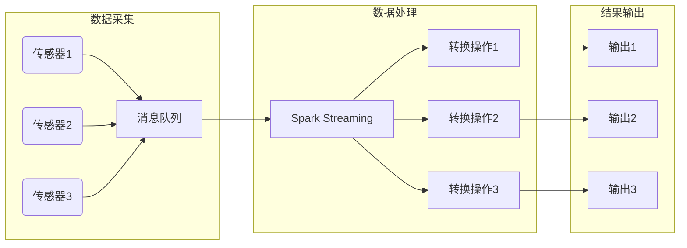
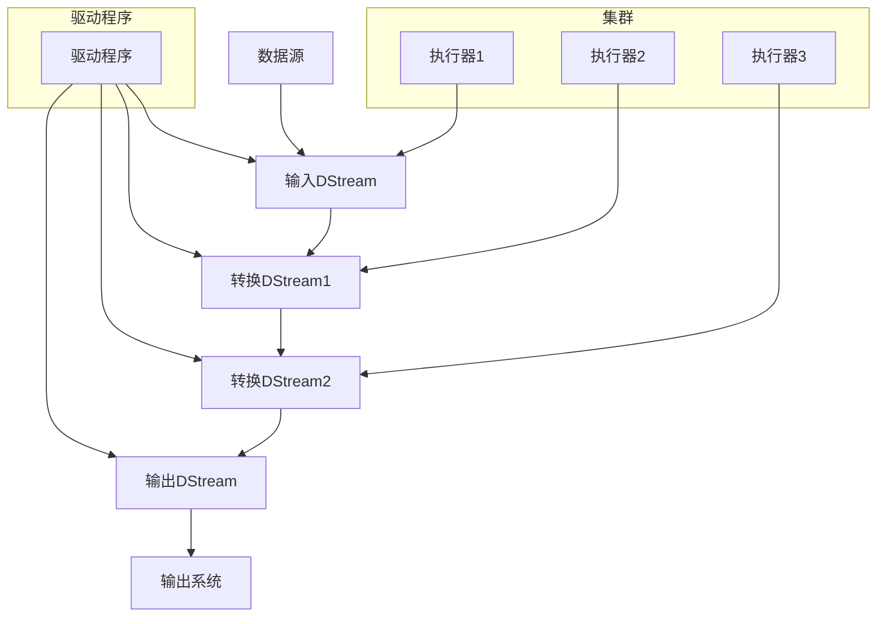

# 使用SparkStreaming进行实时传感器数据分析

## 1.背景介绍

### 1.1 大数据时代的到来

随着物联网、移动互联网和社交网络的迅猛发展,海量的数据正以前所未有的规模和速度不断产生。这些数据蕴含着巨大的商业价值,但也给传统的数据处理系统带来了巨大的挑战。为了有效地处理这些大规模、高速、异构的数据,大数据技术应运而生。

### 1.2 实时数据处理的重要性

在大数据时代,数据不仅规模庞大,而且产生速度极快。能否及时地处理这些实时数据,直接关系到企业的决策效率和市场竞争力。传统的批处理模式已无法满足实时性的要求,因此实时数据处理技术变得越来越重要。

### 1.3 传感器数据实时处理概述

传感器正在各个领域广泛部署,产生了大量实时数据流。这些数据反映了被测对象的实时状态,对监控、预测和决策等任务至关重要。如何高效、可靠地处理这些实时传感器数据,成为一个亟待解决的问题。

## 2.核心概念与联系

### 2.1 流式计算(Stream Computing)

流式计算是一种新兴的计算范式,旨在持续不断地处理实时数据流。它将计算过程视为对持续到来的数据流进行转换的操作。与传统批处理模式不同,流式计算强调实时性、可伸缩性和容错性。

### 2.2 Apache Spark

Apache Spark是一个开源的大数据处理框架,可用于内存计算、流式计算、机器学习和图形处理等多种场景。它具有高度的通用性、容错性和可扩展性,在大数据领域广受欢迎。

### 2.3 Spark Streaming

Spark Streaming是Apache Spark项目中的一个子模块,专门用于流式数据的实时处理。它将实时数据流划分为一系列小批次,利用Spark的并行计算能力对每个批次进行高效处理。Spark Streaming可与HDFS、Flume、Kafka等多种数据源无缝集成,并支持多种输出方式。

### 2.4 实时传感器数据处理流程

实时传感器数据处理的典型流程如下:

1. 传感器设备采集实时数据,并将数据推送到消息队列(如Kafka)或文件系统(如HDFS)等数据源。
2. Spark Streaming从数据源持续不断地拉取数据流。
3. 对数据流执行各种转换和计算操作,如数据清洗、特征提取、模式匹配、统计分析等。
4. 将处理结果输出到数据库、文件系统或消息队列等目标系统,供上层应用使用。



## 3.核心算法原理具体操作步骤

### 3.1 Spark Streaming架构

Spark Streaming的核心是将实时数据流划分为一系列小批次,然后利用Spark的并行计算能力对每个批次进行处理。其基本架构如下:

1. **输入DStream**: 从数据源(如Kafka、Flume、HDFS等)创建初始输入流DStream。
2. **转换DStream**: 对输入DStream执行各种转换操作(如map、flatMap、filter、reduceByKey等),生成新的DStream。
3. **输出操作**: 将最终结果DStream输出到外部系统(如HDFS、数据库等)。
4. **驱动程序(Driver)**: 运行应用的主要流程,监控Spark作业的执行情况。
5. **执行器(Executor)**: 在集群的工作节点上运行,负责实际的数据处理工作。



### 3.2 DStream转换操作

DStream提供了丰富的转换操作,类似于RDD的转换操作,但DStream的操作是基于批次的。常用的转换操作包括:

- **map**: 对DStream中的每个元素执行指定的函数。
- **flatMap**: 对DStream中的每个元素执行指定的函数,并将所有结果拼接为一个新的DStream。
- **filter**: 返回DStream中满足指定条件的元素。
- **reduceByKey**: 对DStream中的键值对进行聚合操作。
- **join**: 根据键值对两个DStream进行内连接操作。
- **window**: 基于滑动窗口对DStream中的数据进行聚合。

```python
# 对DStream中的每个元素执行平方操作
squaredNumbers = inputDStream.map(lambda x: x**2)

# 将DStream中的每个元素拆分为单词,并拼接成新的DStream
words = lines.flatMap(lambda line: line.split(" "))

# 过滤出DStream中的偶数
evens = numbers.filter(lambda x: x % 2 == 0)

# 对DStream中的键值对进行求和操作
wordCounts = words.map(lambda x: (x, 1)).reduceByKey(lambda a, b: a + b)
```

### 3.3 有状态转换操作

除了无状态的基本转换操作外,Spark Streaming还提供了有状态的转换操作,允许跨批次维护状态信息。常用的有状态操作包括:

- **updateStateByKey**: 根据键值对更新状态,并返回新的状态。
- **mapWithState**: 根据键值对和状态数据执行指定的函数。

有状态操作通常用于实现诸如计数、汇总等需要维护状态的操作。

```python
# 实现一个简单的计数器
def updateCount(newValues, runningCount):
    if runningCount is None:
        runningCount = 0
    return sum(newValues, runningCount)

counts = inputDStream.map(lambda x: (x, 1)).updateStateByKey(updateCount)
```

### 3.4 输出操作

Spark Streaming支持多种输出操作,包括:

- **foreachRDD**: 对DStream中的每个RDD执行指定的操作。通常用于将RDD输出到外部系统。
- **saveAsObjectFile**: 将DStream中的数据序列化为对象文件,保存到指定目录。
- **saveAsTextFile**: 将DStream中的数据保存为文本文件。

```python
# 将处理结果输出到HDFS
lines.foreachRDD(lambda rdd: rdd.saveAsTextFile("hdfs://..."))

# 将处理结果输出到数据库
def sendToDB(iter):
    connection = getConnection() 
    for record in iter:
        connection.send(record)
records.foreachRDD(lambda rdd: rdd.foreachPartition(sendToDB))
```

### 3.5 容错机制

Spark Streaming通过将数据流划分为小批次,并利用Spark的容错机制来确保计算的可靠性。当出现故障时,Spark会自动重新计算丢失的批次。此外,Spark Streaming还提供了以下容错策略:

- **启用Write Ahead Logs(预写式日志)**: 将接收到的数据可靠地保存到分布式文件系统,以便故障恢复时重新读取。
- **设置批次间隔**: 增大批次间隔,降低处理延迟,但会增加恢复时间。
- **检查点机制**: 定期将DStream的状态信息保存到可靠的存储系统,以便故障恢复时从检查点处继续执行。

```python
# 启用Write Ahead Logs
sparkConf.set("spark.streaming.receiver.writeAheadLog.enable", "true")

# 设置批次间隔为5秒
ssc = StreamingContext(sparkConf, Seconds(5))

# 设置检查点目录
ssc.checkpoint("/path/to/checkpoint/dir")
```

## 4.数学模型和公式详细讲解举例说明

在实时传感器数据分析中,常常需要使用数学模型和公式进行数据处理和特征提取。下面介绍几个常用的模型和公式。

### 4.1 指数平滑模型

指数平滑模型是一种常用的时间序列预测模型,它通过对历史观测值赋予不同的权重来预测未来值。公式如下:

$$
S_t = \alpha X_t + (1 - \alpha) S_{t-1}
$$

其中:
- $S_t$是时间t的平滑值
- $X_t$是时间t的实际观测值
- $\alpha$是平滑系数,取值范围为0到1
- $S_{t-1}$是前一时间点的平滑值

平滑系数$\alpha$决定了模型对最新数据和历史数据的权重。$\alpha$越大,模型对最新数据的反应越敏感;$\alpha$越小,模型对历史数据的依赖越大。

### 4.2 卡尔曼滤波

卡尔曼滤波是一种常用的状态估计算法,广泛应用于导航、目标跟踪等领域。它通过预测和修正两个步骤,实现对动态系统状态的最优估计。

设系统状态为$x_k$,观测值为$z_k$,则卡尔曼滤波算法如下:

**预测步骤:**
$$
\begin{aligned}
\hat{x}_{k|k-1} &= A\hat{x}_{k-1|k-1} + Bu_k\\
P_{k|k-1} &= AP_{k-1|k-1}A^T + Q
\end{aligned}
$$

**修正步骤:**
$$
\begin{aligned}
K_k &= P_{k|k-1}H^T(HP_{k|k-1}H^T + R)^{-1}\\
\hat{x}_{k|k} &= \hat{x}_{k|k-1} + K_k(z_k - H\hat{x}_{k|k-1})\\
P_{k|k} &= (I - K_kH)P_{k|k-1}
\end{aligned}
$$

其中:
- $\hat{x}_{k|k-1}$是时间k的状态预测值
- $P_{k|k-1}$是状态预测值的协方差矩阵
- $K_k$是卡尔曼增益
- $\hat{x}_{k|k}$是时间k的状态估计值
- $P_{k|k}$是状态估计值的协方差矩阵
- $A,B,H$是系统矩阵
- $Q,R$是噪声协方差矩阵

卡尔曼滤波可以有效地融合系统模型和观测数据,实现对系统状态的最优估计。

### 4.3 小波变换

小波变换是一种时频分析工具,可以有效地提取信号的局部特征。它通过将信号分解为不同尺度的小波基函数的线性组合,实现对信号的多尺度表示。

设$f(t)$为待分析信号,则其小波变换定义为:

$$
W_f(a,b) = \frac{1}{\sqrt{a}}\int_{-\infty}^{\infty}f(t)\psi\left(\frac{t-b}{a}\right)dt
$$

其中:
- $a$是尺度参数,控制小波的伸缩
- $b$是平移参数,控制小波的位移
- $\psi(t)$是小波基函数

通过选择不同的尺度$a$和平移$b$,可以获得信号在不同时间和不同频率下的小波系数$W_f(a,b)$,从而实现对信号的多尺度分析。

小波变换在信号去噪、压缩编码、图像处理等领域有广泛应用。在实时传感器数据分析中,可以利用小波变换提取信号的特征,实现故障诊断、异常检测等功能。

## 4.项目实践:代码实例和详细解释说明

以下是一个使用Spark Streaming处理实时传感器数据的Python代码示例,包括从Kafka接收数据、数据清洗、特征提取和异常检测等功能。

```python