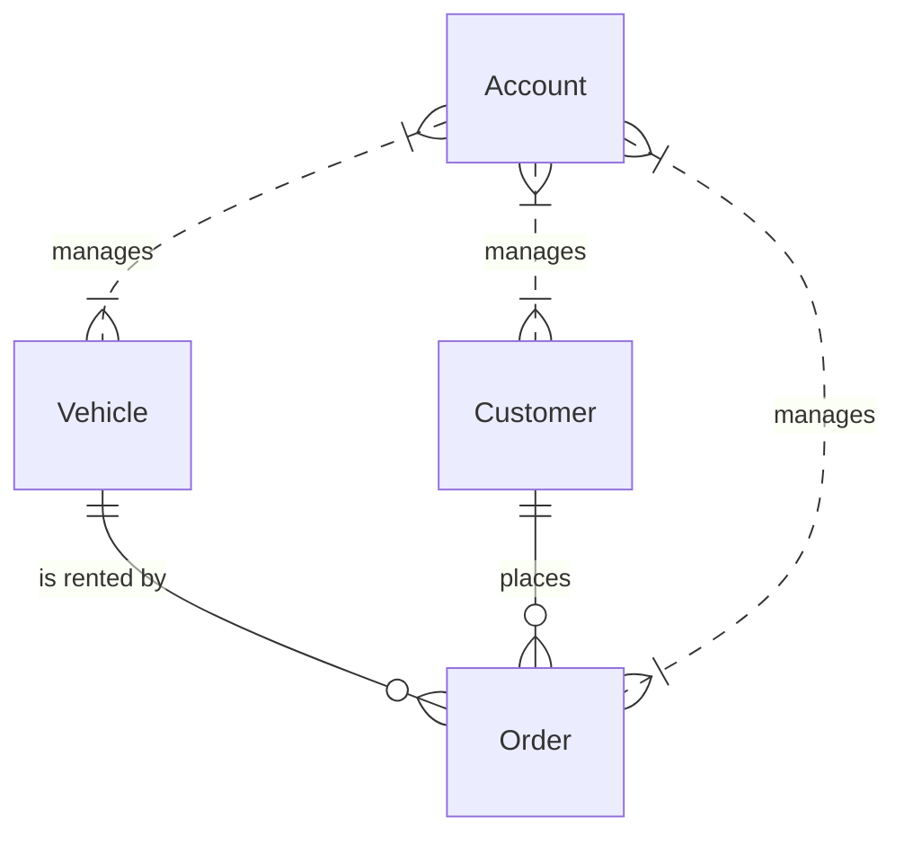

# 出租公司管理系统详细设计与具体代码实现

作者：禅与计算机程序设计艺术

## 1. 背景介绍

### 1.1 出租公司管理系统的必要性

在现代社会中,出租行业发挥着越来越重要的作用。随着出租业务的不断扩大,传统的人工管理模式已经无法满足日益增长的业务需求。因此,开发一套高效、可靠、易用的出租公司管理系统势在必行。

### 1.2 系统目标

出租公司管理系统旨在实现出租业务的信息化、自动化和智能化管理,提高工作效率,减少人为错误,为公司的决策提供数据支持。具体目标包括:

- 实现车辆、客户、订单等信息的电子化管理
- 提供友好的用户界面,简化操作流程
- 支持多角色权限控制,保障数据安全
- 生成各类统计报表,辅助管理决策

### 1.3 系统应用前景

出租公司管理系统不仅能够满足出租公司日常管理的需要,还可以通过二次开发,扩展更多功能,如在线预订、移动端应用等,进一步提升公司的服务质量和竞争力。此外,该系统的设计思路和关键技术也可以推广到其他行业,具有广阔的应用前景。

## 2. 核心概念与关系

### 2.1 车辆(Vehicle)

车辆是出租公司最基本的业务实体,包含车辆编号、品牌、型号、车牌号、购买日期、行驶里程等属性。一辆车可以被多次出租。

### 2.2 客户(Customer) 

客户是租赁车辆的个人或组织,包含客户编号、姓名、身份证号、联系方式等属性。一个客户可以多次租赁车辆。

### 2.3 订单(Order)

订单是客户租赁车辆的记录,包含订单编号、租赁车辆、租赁客户、开始时间、结束时间、租金、支付状态等属性。一个订单对应一辆车和一个客户。

### 2.4 账户(Account)

账户是系统的使用者,包含账户名、密码、角色等属性。不同角色拥有不同的系统权限。

### 2.5 实体关系图



## 3. 核心算法原理与具体步骤

### 3.1 订单调度算法

#### 3.1.1 算法原理

订单调度是根据客户需求,从可用车辆中选择最优车辆的过程。本系统采用改进的KM(Kuhn-Munkres)算法实现订单调度。该算法通过求解二分图的最大权完美匹配,在多个订单和多辆车之间找到总体租金最大的匹配方案。

#### 3.1.2 算法步骤

1. 将订单和车辆看作二分图的两个顶点集,订单与车辆之间的租金作为边权。
2. 对于每个订单顶点,找到与之相连的边权最大的车辆顶点,作为初始匹配。
3. 对于每个车辆顶点,若存在未匹配订单顶点与之相连,且边权大于当前匹配的边权,则更新匹配。
4. 重复步骤3,直到不存在可以更新的匹配。
5. 输出最终的订单车辆匹配结果。

### 3.2 用户认证算法

#### 3.2.1 算法原理

用户认证是验证用户身份,控制用户权限的过程。本系统采用基于角色的访问控制(RBAC)模型,通过用户-角色-权限的映射关系,实现灵活的权限管理。

#### 3.2.2 算法步骤

1. 用户登录时,验证用户名和密码的正确性。
2. 根据用户的角色,获取其拥有的权限列表。
3. 用户请求访问资源时,判断其权限列表中是否包含所需权限。
4. 若包含,则允许访问;否则,拒绝访问。

## 4. 数学模型与公式详解

### 4.1 订单调度模型

设订单集合为$O=\{o_1,o_2,\cdots,o_n\}$,车辆集合为$V=\{v_1,v_2,\cdots,v_m\}$,订单$o_i$与车辆$v_j$之间的租金为$w_{ij}$。订单调度问题可以表示为如下的二分图匹配模型:

$$
\max \sum_{i=1}^n \sum_{j=1}^m w_{ij} x_{ij}
$$

$$
\text{s.t.} \quad \sum_{j=1}^m x_{ij} \le 1, \quad i=1,2,\cdots,n
$$

$$
\sum_{i=1}^n x_{ij} \le 1, \quad j=1,2,\cdots,m
$$

$$
x_{ij} \in \{0,1\}, \quad i=1,2,\cdots,n, \quad j=1,2,\cdots,m
$$

其中,$x_{ij}$为匹配变量,当订单$o_i$匹配车辆$v_j$时取1,否则取0。约束条件确保每个订单至多匹配一辆车,每辆车至多匹配一个订单。

### 4.2 用户认证模型

设用户集合为$U=\{u_1,u_2,\cdots,u_s\}$,角色集合为$R=\{r_1,r_2,\cdots,r_t\}$,权限集合为$P=\{p_1,p_2,\cdots,p_k\}$。用户认证模型可以表示为如下的映射关系:

$$
\begin{aligned}
&\text{UR} \subseteq U \times R \\
&\text{RP} \subseteq R \times P
\end{aligned}
$$

其中,UR为用户-角色映射,RP为角色-权限映射。若$(u,r) \in \text{UR}$,则用户$u$拥有角色$r$;若$(r,p) \in \text{RP}$,则角色$r$拥有权限$p$。用户$u$拥有权限$p$当且仅当存在角色$r$,使得$(u,r) \in \text{UR}$且$(r,p) \in \text{RP}$。

## 5. 项目实践

### 5.1 开发环境

- 编程语言:Java 8
- 开发工具:IntelliJ IDEA
- 构建工具:Maven
- 数据库:MySQL
- 版本控制:Git

### 5.2 系统架构

本系统采用经典的三层架构:

- 表示层:使用JSP和jQuery实现用户界面
- 业务层:使用Spring框架管理业务逻辑组件
- 持久层:使用MyBatis框架实现数据库访问

### 5.3 核心代码

#### 5.3.1 订单调度

```java
public class OrderScheduler {
    public List<Order> scheduleOrders(List<Order> orders, List<Vehicle> vehicles) {
        int n = orders.size();
        int m = vehicles.size();
        int[][] profit = new int[n][m];
        for (int i = 0; i < n; i++) {
            for (int j = 0; j < m; j++) {
                profit[i][j] = calculateProfit(orders.get(i), vehicles.get(j));
            }
        }
        KMAlgorithm kmAlgorithm = new KMAlgorithm(profit);
        int[] matching = kmAlgorithm.getMatching();
        List<Order> scheduledOrders = new ArrayList<>();
        for (int i = 0; i < n; i++) {
            if (matching[i] != -1) {
                Order order = orders.get(i);
                order.setVehicle(vehicles.get(matching[i]));
                scheduledOrders.add(order);
            }
        }
        return scheduledOrders;
    }
    
    private int calculateProfit(Order order, Vehicle vehicle) {
        // 计算订单与车辆匹配的租金
    }
}
```

#### 5.3.2 用户认证

```java
public class AuthorizationInterceptor extends HandlerInterceptorAdapter {
    @Autowired
    private UserService userService;
    
    @Override
    public boolean preHandle(HttpServletRequest request, HttpServletResponse response, Object handler) throws Exception {
        String username = (String) request.getSession().getAttribute("username");
        if (username == null) {
            response.sendRedirect("/login");
            return false;
        }
        User user = userService.getUserByUsername(username);
        String requestURI = request.getRequestURI();
        if (!userService.hasPermission(user, requestURI)) {
            response.sendError(HttpServletResponse.SC_FORBIDDEN);
            return false;
        }
        return true;
    }
}
```

## 6. 实际应用场景

出租公司管理系统可应用于各类汽车、自行车、电动车等租赁业务的管理。以汽车出租为例,系统可以帮助公司实现:

1. 车辆信息管理:登记车辆的详细信息,如车型、车牌号、购买日期等,方便查询和维护。
2. 客户信息管理:登记客户的身份信息和联系方式,建立客户档案,提供个性化服务。
3. 订单处理:根据客户需求,自动匹配最合适的车辆,生成租赁订单,并跟踪订单状态。
4. 财务管理:自动计算租金,生成账单,记录收支明细,实现财务透明化。
5. 数据分析:对车辆使用、客户消费等数据进行统计分析,为经营决策提供数据支持。

除此之外,系统还可以集成GPS定位、远程控制等功能,实现车辆的实时监控和管理,提高运营效率和安全性。

## 7. 工具和资源推荐

### 7.1 设计工具

- Visio:流程图、架构图等的绘制
- PowerDesigner:数据库设计与建模
- Axure:原型设计与交互设计

### 7.2 开发工具

- IntelliJ IDEA:Java IDE
- Eclipse:另一款流行的Java IDE
- Visual Studio Code:轻量级代码编辑器
- Postman:API测试工具

### 7.3 学习资源

- 《Spring实战》:Spring框架的入门与进阶
- 《Java编程思想》:Java语言的经典教材
- 《设计模式》:软件设计的常用模式
- 《算法导论》:算法设计与分析的圣经

## 8. 总结与展望

### 8.1 项目总结

本文详细阐述了出租公司管理系统的设计与实现,涵盖了背景分析、概念建模、算法设计、数学建模、代码实现等各个方面。该系统采用了订单调度、用户认证等核心算法,实现了车辆、客户、订单的自动化管理,有效提升了出租公司的运营效率和服务质量。

### 8.2 未来展望

随着移动互联网的发展,出租行业也面临着新的机遇和挑战。未来的出租公司管理系统应该积极拥抱新技术,不断创新业务模式,为用户提供更加便捷、智能、个性化的服务。具体来说,可以考虑以下几个方向:

1. 移动应用:开发手机APP,实现在线预订、移动支付等功能,让用户随时随地享受出租服务。
2. 大数据分析:利用海量数据,分析用户需求和行为模式,提供精准营销和个性化推荐。
3. 人工智能:引入智能调度、自动驾驶等技术,进一步提高系统的自动化水平和决策能力。
4. 物联网:通过车载传感器和无线通信,实现车辆的实时监控和远程控制,提高安全性和可靠性。

总之,出租公司管理系统还有很大的发展空间,需要我们不断探索和创新,以技术驱动业务,以服务创造价值。

## 9. 附录

### 9.1 常见问题

#### 9.1.1 如何处理订单冲突?

订单冲突是指多个订单同时需要同一辆车的情况。系统采用改进的KM算法,在全局范围内寻找最优的订单车辆匹配,尽可能避免冲突。对于无法调度的订单,系统会及时通知客户,协商调整租赁时间或更换车辆。

#### 9.1.2 如何确保数据安全?

系统采用了多重措施来保障数据安全:

1. 用户认证:采用基于角色的访问控制,确保用户只能访问其权限范围内的数据。
2. 数据加密:对敏感数据如密码、身份证号等进行加密存储,防止泄露。
3. 异地备份:定期将数据备份到异