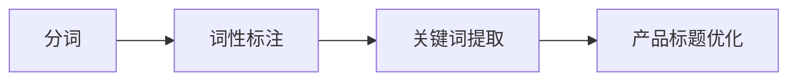

## 分词在电商产品标题优化中的实战分享

作者：禅与计算机程序设计艺术

## 1. 背景介绍

### 1.1 电商平台的竞争与挑战

随着互联网技术的快速发展和普及，电子商务(e-commerce)已经成为人们生活中不可或缺的一部分。电商平台作为连接商家和消费者的桥梁，在近年来得到了迅猛发展，同时也面临着日益激烈的市场竞争。对于电商平台上的商家而言，如何提高产品销量、提升用户购物体验成为了亟待解决的问题。

### 1.2 产品标题优化的重要性

在电商平台中，产品标题是吸引用户点击的第一要素。一个好的产品标题能够准确描述产品特性、突出产品卖点、吸引用户眼球，从而提高产品的点击率和转化率。反之，一个糟糕的产品标题则会降低产品的曝光度，影响产品的销量。

### 1.3 分词技术在产品标题优化中的应用

分词技术作为自然语言处理(NLP)领域的基础技术之一，能够将一段文本切分成多个有意义的词语，帮助计算机理解文本的含义。在电商产品标题优化中，分词技术可以帮助商家将产品标题进行精准的拆解，提取出产品的核心关键词，从而优化产品标题的结构和内容，提高产品的搜索排名和曝光度。

## 2. 核心概念与联系

### 2.1 分词

分词是指将一段文本切分成多个有意义的词语的过程。例如，将“苹果手机13 Pro Max 256GB 金色”这句话进行分词，可以得到以下结果：

```
苹果 / 手机 / 13 / Pro / Max / 256GB / 金色
```

### 2.2 词性标注

词性标注是指为每个词语标注其语法属性的过程。例如，在上面的例子中，"苹果"的词性为名词，"手机"的词性也为名词，"13"的词性为数词，"Pro"的词性为形容词，"Max"的词性也为形容词，"256GB"的词性为名词，"金色"的词性为形容词。

### 2.3 关键词提取

关键词提取是指从一段文本中提取出最能够概括文本主题的词语的过程。例如，在上面的例子中，"苹果手机"、"13 Pro Max"、"256GB"、"金色"都可以作为关键词。

### 2.4 产品标题优化

产品标题优化是指通过对产品标题进行结构和内容的调整，使其更符合电商平台的搜索规则和用户搜索习惯，从而提高产品的搜索排名和曝光度的过程。

### 2.5 概念联系图



## 3. 核心算法原理具体操作步骤

### 3.1 基于规则的分词方法

#### 3.1.1 正向最大匹配法

正向最大匹配法(Forward Maximum Matching, FMM)是一种基于词典的分词方法。其基本思想是从左到右扫描文本，每次匹配词典中最长的词，直到文本扫描完毕。

例如，对于文本“苹果手机13 Pro Max 256GB 金色”，假设词典中包含以下词语：

```
苹果
手机
13
Pro
Max
256GB
金色
```

则正向最大匹配法的分词结果为：

```
苹果 / 手机 / 13 / Pro / Max / 256GB / 金色
```

#### 3.1.2 逆向最大匹配法

逆向最大匹配法(Reverse Maximum Matching, RMM)与正向最大匹配法类似，只是扫描方向相反，从右到左扫描文本。

例如，对于文本“苹果手机13 Pro Max 256GB 金色”，假设词典中包含以下词语：

```
苹果