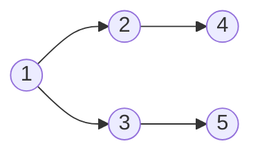

# 半监督模型解释：透视黑盒子的内在机理

作者：禅与计算机程序设计艺术

## 1. 背景介绍

### 1.1 机器学习模型的可解释性问题

近年来，机器学习模型在各个领域取得了显著的成果，但其内部工作机制往往难以理解，如同一个“黑盒子”。这种缺乏透明度的情况引发了人们对模型可解释性的担忧，特别是在涉及重大决策的领域，如医疗诊断、金融风险评估等。

### 1.2 半监督学习的兴起

半监督学习作为一种介于监督学习和无监督学习之间的学习范式，利用少量标记数据和大量未标记数据进行训练，在许多场景下展现出优异的性能。然而，相较于监督学习，半监督模型的可解释性问题更加突出，因为未标记数据的引入增加了模型复杂度和不确定性。

### 1.3 本文研究目的

本文旨在探讨半监督模型解释的方法和技术，揭示其内在机理，增强模型的透明度和可信度。我们将从核心概念、算法原理、数学模型、代码实例、应用场景、工具资源等多个方面进行深入剖析，并展望未来发展趋势与挑战。

## 2. 核心概念与联系

### 2.1 半监督学习

#### 2.1.1 定义

半监督学习利用少量标记数据和大量未标记数据进行训练，旨在提高模型的泛化能力和鲁棒性。

#### 2.1.2 分类

* **Transductive learning:**  仅预测未标记数据的标签，不构建预测模型。
* **Inductive learning:** 构建预测模型，可用于预测新的未见数据。

### 2.2 模型解释

#### 2.2.1 定义

模型解释旨在理解模型的内部工作机制，解释模型的预测结果。

#### 2.2.2 方法

* **特征重要性分析:** 识别对模型预测影响最大的特征。
* **样本影响分析:** 识别对模型训练影响最大的样本。
* **模型简化:** 将复杂模型简化为易于理解的形式。
* **可视化:** 将模型内部状态以图形化方式呈现。

### 2.3 联系

半监督学习模型的可解释性问题可以通过模型解释方法来解决，从而提高模型的透明度和可信度。

## 3. 核心算法原理具体操作步骤

### 3.1 基于图的半监督学习

#### 3.1.1 算法原理

将数据表示为图，节点代表样本，边代表样本之间的相似性。利用标记数据的信息在图上传播，预测未标记数据的标签。

#### 3.1.2 操作步骤

1. 构建数据图。
2. 初始化标记数据的标签。
3. 在图上传播标签信息。
4. 预测未标记数据的标签。

### 3.2 基于自训练的半监督学习

#### 3.2.1 算法原理

利用标记数据训练模型，用该模型预测未标记数据的标签，将高置信度的预测结果加入训练集，迭代训练模型。

#### 3.2.2 操作步骤

1. 利用标记数据训练初始模型。
2. 用模型预测未标记数据的标签。
3. 选择高置信度的预测结果加入训练集。
4. 迭代训练模型，直到收敛。

### 3.3 基于生成模型的半监督学习

#### 3.3.1 算法原理

假设数据由一个潜在的生成模型生成，利用标记数据和未标记数据学习该模型的参数，并用于预测未标记数据的标签。

#### 3.3.2 操作步骤

1. 定义生成模型。
2. 利用标记数据和未标记数据学习模型参数。
3. 利用学习到的模型预测未标记数据的标签。

## 4. 数学模型和公式详细讲解举例说明

### 4.1 基于图的半监督学习

#### 4.1.1 数学模型

$$
L = \sum_{i=1}^{n} \sum_{j=1}^{n} w_{ij} (y_i - y_j)^2 + \lambda \sum_{i=1}^{n} (y_i - f(x_i))^2
$$

其中：

* $w_{ij}$: 样本 $i$ 和 $j$ 之间的相似度。
* $y_i$: 样本 $i$ 的标签。
* $f(x_i)$: 模型对样本 $i$ 的预测值。
* $\lambda$: 正则化参数。

#### 4.1.2 举例说明

假设有 5 个样本，其中 2 个标记为正类，3 个未标记。构建数据图如下：



样本 1 和 2 标记为正类，其余未标记。利用上述数学模型，可以学习到样本 3, 4, 5 的标签。

### 4.2 基于自训练的半监督学习

#### 4.2.1 数学模型

$$
L = \sum_{i=1}^{n} l(y_i, f(x_i)) + \lambda \sum_{j=1}^{m} l(y_j', f(x_j'))
$$

其中：

* $l$: 损失函数。
* $y_i$: 标记数据的标签。
* $f(x_i)$: 模型对标记数据 $i$ 的预测值。
* $y_j'$: 未标记数据的预测标签。
* $f(x_j')$: 模型对未标记数据 $j$ 的预测值。
* $\lambda$: 正则化参数。

#### 4.2.2 举例说明

假设有一个二分类问题，初始有 100 个标记数据，900 个未标记数据。利用标记数据训练一个逻辑回归模型，用该模型预测未标记数据的标签。选择置信度高于 0.9 的预测结果加入训练集，迭代训练模型，直到收敛。

### 4.3 基于生成模型的半监督学习

#### 4.3.1 数学模型

$$
P(x, y) = P(y) P(x|y)
$$

其中：

* $P(x, y)$: 数据的联合概率分布。
* $P(y)$: 标签的先验概率分布。
* $P(x|y)$: 给定标签的条件概率分布。

#### 4.3.2 举例说明

假设数据由一个高斯混合模型生成，利用标记数据和未标记数据学习该模型的参数，并用于预测未标记数据的标签。

## 5. 项目实践：代码实例和详细解释说明

### 5.1 基于图的半监督学习

#### 5.1.1 代码实例

```python
import networkx as nx

# 构建数据图
graph = nx.Graph()
graph.add_edges_from([(1, 2), (1, 3), (2, 4), (3, 5)])

# 初始化标签
labels = {1: 1, 2: 1}

# 传播标签信息
for i in range(1, 6):
    if i not in labels:
        neighbors = list(graph.neighbors(i))
        label_sum = sum([labels.get(j, 0) for j in neighbors])
        labels[i] = 1 if label_sum > 0 else 0

# 打印预测结果
print(labels)
```

#### 5.1.2 解释说明

代码首先构建了一个数据图，然后初始化了标记数据的标签。接着，利用循环遍历所有样本，对于未标记的样本，计算其邻居节点的标签和，如果标签和大于 0，则预测该样本为正类，否则为负类。

### 5.2 基于自训练的半监督学习

#### 5.2.1 代码实例

```python
from sklearn.linear_model import LogisticRegression

# 初始化模型
model = LogisticRegression()

# 训练初始模型
model.fit(X_labeled, y_labeled)

# 预测未标记数据
y_pred = model.predict_proba(X_unlabeled)[:, 1]

# 选择高置信度预测结果
threshold = 0.9
high_confidence_indices = np.where(y_pred > threshold)[0]

# 加入训练集
X_train = np.concatenate((X_labeled, X_unlabeled[high_confidence_indices]))
y_train = np.concatenate((y_labeled, y_pred[high_confidence_indices]))

# 迭代训练模型
while True:
    # 训练模型
    model.fit(X_train, y_train)

    # 预测未标记数据
    y_pred = model.predict_proba(X_unlabeled)[:, 1]

    # 选择高置信度预测结果
    high_confidence_indices = np.where(y_pred > threshold)[0]

    # 判断是否收敛
    if len(high_confidence_indices) == 0:
        break

    # 加入训练集
    X_train = np.concatenate((X_train, X_unlabeled[high_confidence_indices]))
    y_train = np.concatenate((y_train, y_pred[high_confidence_indices]))

# 打印预测结果
print(model.predict(X_unlabeled))
```

#### 5.2.2 解释说明

代码首先初始化了一个逻辑回归模型，并利用标记数据训练初始模型。然后，用该模型预测未标记数据的标签，并选择置信度高于 0.9 的预测结果加入训练集。接着，迭代训练模型，直到没有新的高置信度预测结果加入训练集为止。

### 5.3 基于生成模型的半监督学习

#### 5.3.1 代码实例

```python
from sklearn.mixture import GaussianMixture

# 初始化模型
model = GaussianMixture(n_components=2)

# 学习模型参数
model.fit(np.concatenate((X_labeled, X_unlabeled)))

# 预测未标记数据
y_pred = model.predict(X_unlabeled)

# 打印预测结果
print(y_pred)
```

#### 5.3.2 解释说明

代码首先初始化了一个高斯混合模型，并利用标记数据和未标记数据学习该模型的参数。然后，利用学习到的模型预测未标记数据的标签。

## 6. 实际应用场景

### 6.1 图像分类

#### 6.1.1 场景描述

利用少量标记图像和大量未标记图像训练图像分类模型。

#### 6.1.2 案例

* 利用 ImageNet 数据集中的少量标记图像和大量未标记图像训练图像分类模型。

### 6.2 文本分类

#### 6.2.1 场景描述

利用少量标记文本和大量未标记文本训练文本分类模型。

#### 6.2.2 案例

* 利用 IMDB 电影评论数据集中的少量标记文本和大量未标记文本训练情感分类模型。

### 6.3 欺诈检测

#### 6.3.1 场景描述

利用少量标记交易数据和大量未标记交易数据训练欺诈检测模型。

#### 6.3.2 案例

* 利用信用卡交易数据集中的少量标记交易数据和大量未标记交易数据训练欺诈检测模型。

## 7. 工具和资源推荐

### 7.1 Python 库

* scikit-learn: 提供了丰富的机器学习算法，包括半监督学习算法。
* NetworkX: 用于构建和操作图。

### 7.2 数据集

* ImageNet: 大规模图像数据集。
* IMDB: 电影评论数据集。

## 8. 总结：未来发展趋势与挑战

### 8.1 未来发展趋势

* **深度半监督学习:** 将深度学习技术应用于半监督学习，提高模型性能。
* **主动学习:**  选择最有价值的未标记数据进行标注，提高模型效率。
* **迁移学习:**  将知识从一个领域迁移到另一个领域，提高模型泛化能力。

### 8.2 挑战

* **模型解释的可靠性:**  如何评估模型解释的可靠性和准确性。
* **数据质量:**  未标记数据的质量对模型性能有很大影响。
* **计算效率:**  半监督学习模型的训练成本较高。

## 9. 附录：常见问题与解答

### 9.1 什么是半监督学习？

半监督学习是一种利用少量标记数据和大量未标记数据进行训练的学习范式。

### 9.2 为什么需要模型解释？

模型解释可以提高模型的透明度和可信度，帮助人们理解模型的内部工作机制。

### 9.3 半监督模型解释有哪些方法？

常见的半监督模型解释方法包括特征重要性分析、样本影响分析、模型简化和可视化。

### 9.4 半监督学习有哪些应用场景？

半监督学习的应用场景包括图像分类、文本分类、欺诈检测等。
