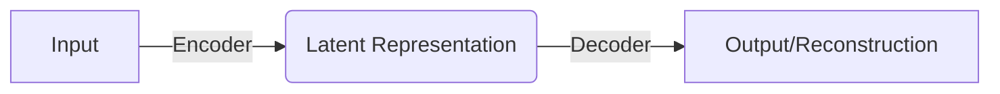

# 变分自编码器VAE原理与代码实例讲解

## 1.背景介绍

### 1.1 生成式模型的兴起

近年来,生成式模型在机器学习领域备受关注,它们能够从数据中学习潜在的分布,并生成新的类似样本。与判别式模型相比,生成式模型不仅可以进行预测和分类,还能捕捉数据的整体统计规律,从而产生更加丰富和多样的输出。

生成式模型的主要挑战在于,如何高效地对复杂数据分布进行建模。传统方法如高斯混合模型(GMM)和隐马尔可夫模型(HMM)在处理简单数据时表现良好,但在面对高维度数据(如图像、语音等)时,由于"维数灾难"问题,它们的性能会急剧下降。

### 1.2 变分自编码器(VAE)的提出

为了更好地处理高维度数据,变分自编码器(Variational Autoencoder, VAE)应运而生。VAE是一种基于神经网络的生成式模型,它结合了变分推理(Variational Inference)和自编码器(Autoencoder)的思想,能够学习数据的隐含表示,并从该隐含表示中生成新样本。

相比于其他生成模型如生成对抗网络(GAN),VAE具有以下优势:

1. 训练过程更加稳定,不容易出现模式崩溃(mode collapse)问题。
2. 可以通过隐含变量的向量空间,对生成样本进行有意义的插值和向量运算。
3. 可以应用于多种任务,如生成、去噪、插值等。

### 1.3 VAE在实际应用中的价值

VAE在计算机视觉、自然语言处理、音频合成等领域有着广泛的应用前景。例如:

1. **图像生成与编辑**: VAE可用于生成逼真的图像,或对现有图像进行编辑(如改变物体形状、颜色等)。
2. **文本生成**: 利用VAE生成自然语言文本,可应用于对话系统、自动文章写作等场景。
3. **语音合成**: VAE可学习语音的潜在分布,用于生成自然、流畅的语音。
4. **异常检测**: VAE的重构误差可用于检测异常样本。

总的来说,VAE作为一种强大的生成式模型,在理解和生成复杂数据方面具有巨大的潜力。

## 2.核心概念与联系

### 2.1 自编码器(Autoencoder)

自编码器是一种无监督学习的神经网络模型,通过将输入数据先编码为隐含表示(编码器),再由隐含表示重构出原始数据(解码器),从而学习数据的紧致表示。

自编码器的结构如下图所示:



编码器将高维输入数据压缩为低维隐含表示,解码器则将隐含表示还原为高维输出数据。在训练过程中,通过最小化输入与重构输出之间的差异(如均方误差),自编码器可以学习到输入数据的紧致表示。

自编码器广泛应用于数据降维、去噪、特征提取等任务。但由于其结构的局限性,无法从隐含表示中生成新样本。

### 2.2 变分推理(Variational Inference)

变分推理是一种近似求解复杂概率分布的方法。对于一个难以直接计算的目标分布 $p(z|x)$,变分推理通过优化一个更简单的变分分布 $q(z|x)$ 来近似目标分布。

具体来说,变分推理最小化变分分布 $q(z|x)$ 与目标分布 $p(z|x)$ 之间的KL散度:

$$\min_{q(z|x)} \text{KL}(q(z|x) \parallel p(z|x))$$

通过优化过程,变分分布 $q(z|x)$ 将逼近目标分布 $p(z|x)$,从而达到近似求解的目的。

变分推理在贝叶斯推断、机器学习等领域有着广泛应用。在VAE中,编码器网络就是学习变分分布 $q(z|x)$ 的过程。

### 2.3 重参数技巧(Reparameterization Trick)

在VAE的训练过程中,我们需要对隐含变量 $z$ 的期望进行反向传播,但是由于 $z$ 是从变分分布 $q(z|x)$ 中采样得到的,其梯度是无法直接计算的。

重参数技巧提供了一种巧妙的方式,将采样过程转化为确定性的变换,从而使梯度可以通过反向传播进行优化。具体来说,对于任意分布 $p(\epsilon)$,我们可以将 $z$ 表示为:

$$z = g_\phi(\epsilon, x)$$

其中 $g_\phi$ 是一个确定性的、可微的变换函数,参数为 $\phi$。通过这种重参数化,梯度 $\frac{\partial z}{\partial \phi}$ 就可以计算了。

在VAE中,编码器网络就是学习这种重参数化变换 $g_\phi$,使得从 $q(z|x)$ 采样的 $z$ 能够近似服从目标分布 $p(z|x)$。

### 2.4 VAE的生成过程

综合上述概念,VAE的生成过程可总结为:

1. 从先验分布 $p(z)$ 中采样隐含变量 $z$。
2. 通过解码器网络 $p(x|z)$,由隐含变量 $z$ 生成观测数据 $x$。

生成过程的伪代码如下:

```python
import torch

# 先验分布
z = torch.randn(batch_size, latent_dim)  

# 通过解码器生成观测数据
x_gen = decoder(z)
```

通过学习到的解码器网络 $p(x|z)$,我们可以从隐含变量空间中采样 $z$,并生成新的观测数据 $x$。这种从低维空间到高维空间的映射,使VAE具有强大的生成能力。

## 3.核心算法原理具体操作步骤 

### 3.1 VAE的目标函数

VAE的训练目标是最大化观测数据 $x$ 的边缘对数似然 $\log p(x)$。根据贝叶斯公式,我们有:

$$\begin{aligned}
\log p(x) &= \mathbb{E}_{q(z|x)}[\log p(x|z)] - \text{KL}(q(z|x) \parallel p(z)) \\
          &\geq \mathbb{E}_{q(z|x)}[\log p(x|z)] - \text{KL}(q(z|x) \parallel p(z))
\end{aligned}$$

上式中的等号成立当且仅当 $q(z|x) = p(z|x)$。由于后验分布 $p(z|x)$ 通常很难直接计算,所以我们优化它的一个下界,即变分下界(ELBO):

$$\mathcal{L}(\theta, \phi; x) = \mathbb{E}_{q_\phi(z|x)}[\log p_\theta(x|z)] - \text{KL}(q_\phi(z|x) \parallel p(z))$$

其中 $\theta$ 是解码器网络的参数, $\phi$ 是编码器网络的参数。最大化变分下界等价于最大化观测数据的边缘对数似然。

### 3.2 重构项与正则项

变分下界由两项组成:

1. **重构项(Reconstruction Term)**: $\mathbb{E}_{q_\phi(z|x)}[\log p_\theta(x|z)]$ 

   这一项最大化了在给定隐含变量 $z$ 时,重构出观测数据 $x$ 的概率。它反映了解码器网络 $p_\theta(x|z)$ 的重构能力。

2. **正则项(Regularization Term)**: $-\text{KL}(q_\phi(z|x) \parallel p(z))$

   这一项最小化了编码器网络 $q_\phi(z|x)$ 与先验分布 $p(z)$ 之间的KL散度,确保隐含变量 $z$ 的分布接近预设的先验分布(通常为标准正态分布)。

通过最大化变分下界,VAE在优化重构质量的同时,也约束了隐含变量的分布,从而提高了模型的生成能力。

### 3.3 模型训练

VAE的训练过程包括以下步骤:

1. **前向传播**:
   - 将观测数据 $x$ 输入编码器网络,得到隐含变量 $z$ 的参数(如均值、方差)。
   - 通过重参数技巧,从编码器网络的输出采样隐含变量 $z$。
   - 将隐含变量 $z$ 输入解码器网络,得到重构数据 $\hat{x}$。

2. **计算损失**:
   - 计算重构项损失,如二值交叉熵损失 $\text{BCE}(x, \hat{x})$。
   - 计算正则项损失,即编码器与先验分布之间的KL散度 $\text{KL}(q_\phi(z|x) \parallel p(z))$。
   - 将两项损失相加,得到总的变分下界损失 $\mathcal{L}(\theta, \phi; x)$。

3. **反向传播与优化**:
   - 计算变分下界损失相对于网络参数的梯度。
   - 使用优化器(如Adam)更新编码器和解码器网络的参数。

4. **生成新样本**:
   - 从先验分布 $p(z)$ 中采样隐含变量 $z$。
   - 通过训练好的解码器网络 $p_\theta(x|z)$,由隐含变量 $z$ 生成新的观测数据 $x$。

通过上述步骤的反复迭代,VAE可以逐步学习到观测数据的隐含表示,并提高生成质量。

## 4.数学模型和公式详细讲解举例说明

### 4.1 变分下界(ELBO)

变分下界是VAE的核心目标函数,它定义为:

$$\begin{aligned}
\mathcal{L}(\theta, \phi; x) &= \mathbb{E}_{q_\phi(z|x)}[\log p_\theta(x|z)] - \text{KL}(q_\phi(z|x) \parallel p(z)) \\
                     &= \mathbb{E}_{q_\phi(z|x)}[\log p_\theta(x|z)] - \mathbb{E}_{q_\phi(z|x)}\left[\log \frac{q_\phi(z|x)}{p(z)}\right]
\end{aligned}$$

让我们分解并解释这个公式:

1. **重构项**: $\mathbb{E}_{q_\phi(z|x)}[\log p_\theta(x|z)]$

   这一项表示在给定隐含变量 $z$ 时,解码器网络 $p_\theta(x|z)$ 重构出观测数据 $x$ 的对数概率的期望。它反映了模型的重构能力。

   对于连续数据(如图像),我们通常假设 $p_\theta(x|z)$ 服从高斯分布或者伯努利分布。对于离散数据(如文本),则假设其服从多项分布。

2. **正则项**: $-\mathbb{E}_{q_\phi(z|x)}\left[\log \frac{q_\phi(z|x)}{p(z)}\right]$

   这一项是编码器网络 $q_\phi(z|x)$ 与先验分布 $p(z)$ 之间的KL散度。它确保了隐含变量 $z$ 的分布接近预设的先验分布(通常为标准正态分布)。

   当 $q_\phi(z|x)$ 与 $p(z)$ 越接近时,KL散度就越小,正则项的值也就越小。这一项起到了约束隐含变量分布的作用,防止了模型对隐含变量的过度拟合。

通过最大化变分下界,VAE在优化重构质量的同时,也约束了隐含变量的分布,从而提高了模型的生成能力。

### 4.2 重参数技巧(Reparameterization Trick)

重参数技巧是VAE中一个关键的技术,它使得隐含变量 $z$ 的采样过程可以被反向传播优化。具体来说,对于任意分布 $p(\epsilon)$,我们可以将 $z$ 表示为:

$$z = g_\phi(\epsilon, x)$$

其中 $g_\phi$ 是一个确定性的、可微的变换函数,参数为 $\phi$。通过这种重参数化,梯度 $\frac{\partial z}{\partial \phi}$ 就可以计