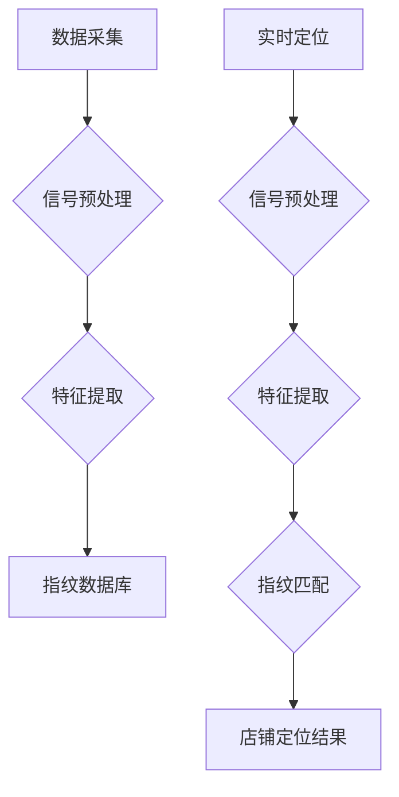

## 1. 背景介绍

### 1.1. 商场室内定位的意义

随着移动互联网和智能手机的普及，人们的购物方式发生了巨大的变化。消费者越来越依赖于手机获取信息、进行购物决策，这也促使商场需要提供更加智能化的服务体验。其中，精确定位用户所在店铺是实现商场智能化服务的基础，它可以带来以下好处：

* **精准营销**: 通过了解用户所在的店铺，商场可以向用户推送更加精准的优惠券、促销信息等，提高营销活动的转化率。
* **个性化推荐**:  根据用户所在的店铺和历史购物记录，商场可以向用户推荐更加个性化的商品和服务，提升用户购物体验。
* **客流分析**: 通过统计用户在不同店铺的停留时间、访问频率等数据，商场可以分析用户行为，优化店铺布局和商品陈列。
* **提升运营效率**:  通过实时掌握用户位置信息，商场可以优化人员调度、商品补货等工作流程，提升运营效率。

### 1.2. 室内定位技术的挑战

与室外定位相比，商场室内定位面临着更大的挑战，主要体现在以下几个方面：

* **信号干扰**: 商场内部环境复杂，存在各种信号干扰，例如金属结构、墙壁、其他电子设备等，这些都会影响定位信号的精度。
* **多路径效应**: 室内环境中，信号会发生多次反射和折射，导致接收到的信号强度变化复杂，难以准确判断信号源的位置。
* **隐私保护**: 用户位置信息属于敏感数据，需要采取有效的措施保护用户隐私。

## 2. 核心概念与联系

### 2.1. 室内定位技术分类

目前常用的室内定位技术主要可以分为以下几类：

* **基于无线信号的定位**: 利用现有的无线网络信号，例如Wi-Fi、蓝牙、蜂窝网络等进行定位。
* **基于惯性传感器的定位**: 利用手机内置的加速度计、陀螺仪等传感器，通过计算用户的步数、方向等信息进行定位。
* **基于视觉的定位**: 利用摄像头采集图像信息，通过图像识别和匹配技术进行定位。
* **基于地磁的定位**: 利用地球磁场作为参考，通过测量磁场强度变化进行定位。

### 2.2. 技术选择

针对商场室内定位的需求，我们需要选择合适的技术方案。考虑到成本、精度、易用性等因素，基于无线信号的定位技术是目前比较主流的选择。其中，Wi-Fi定位技术由于其成本低、部署方便等优势，得到了广泛应用。

## 3. 核心算法原理具体操作步骤

### 3.1. Wi-Fi指纹定位原理

Wi-Fi指纹定位的基本原理是利用每个店铺周围的Wi-Fi信号强度分布作为该店铺的“指纹”。具体操作步骤如下：

1. **数据采集**: 在商场内部各个店铺采集Wi-Fi信号强度数据，构建指纹数据库。
2. **实时定位**: 用户进入商场后，手机会扫描周围的Wi-Fi信号，并将信号强度信息与指纹数据库进行匹配，找到最匹配的店铺指纹，从而确定用户所在的店铺。

### 3.2. 算法流程



## 4. 数学模型和公式详细讲解举例说明

### 4.1. 信号预处理

为了消除噪声和干扰，需要对采集到的Wi-Fi信号进行预处理。常用的预处理方法包括：

* **均值滤波**: 对多个采样点的信号强度取平均值，可以有效降低随机噪声的影响。
* **卡尔曼滤波**: 利用状态空间模型对信号进行预测和更新，可以有效去除系统误差和随机噪声。

### 4.2. 特征提取

为了提高指纹匹配的效率和精度，需要从Wi-Fi信号中提取有效的特征。常用的特征包括：

* **信号强度**: Wi-Fi信号强度是定位的基础信息。
* **信号强度差**: 不同AP(Access Point)之间的信号强度差可以反映用户与AP之间的相对位置关系。

### 4.3. 指纹匹配

指纹匹配是指将用户实时采集到的Wi-Fi信号特征与指纹数据库中的指纹进行比较，找到最匹配的指纹。常用的指纹匹配算法包括：

* **K近邻算法(KNN)**:  找到与用户信号特征最接近的K个指纹，并根据这K个指纹的店铺信息进行加权平均，得到用户所在的店铺。
* **支持向量机(SVM)**:  利用机器学习方法训练一个分类器，将用户信号特征映射到对应的店铺类别。

## 5. 项目实践：代码实例和详细解释说明

### 5.1. 数据采集

```python
import wifi

# 初始化Wi-Fi扫描器
wifi_scanner = wifi.Cell.all('wlan0')

# 循环扫描Wi-Fi信号
while True:
    # 获取所有可用的Wi-Fi信号
    cells = wifi_scanner.get_cells()

    # 遍历每个Wi-Fi信号
    for cell in cells:
        # 获取信号强度
        ssid = cell.ssid
        signal_strength = cell.signal

        # 将数据保存到数据库
        # ...
```

### 5.2. 指纹匹配

```python
from sklearn.neighbors import KNeighborsClassifier

# 加载指纹数据库
fingerprint_database = ...

# 初始化KNN分类器
knn = KNeighborsClassifier(n_neighbors=5)

# 训练KNN分类器
knn.fit(fingerprint_database['features'], fingerprint_database['labels'])

# 实时定位
while True:
    # 获取用户实时Wi-Fi信号特征
    user_features = ...

    # 使用KNN分类器预测用户所在店铺
    predicted_label = knn.predict(user_features)

    # 输出定位结果
    print(f"用户所在店铺: {predicted_label}")
```

## 6. 实际应用场景

### 6.1. 智慧零售

商场可以通过精确定位用户所在店铺，实现精准营销、个性化推荐等服务，提升用户购物体验和商场运营效率。

### 6.2. 仓储物流

利用室内定位技术，可以实时追踪货物位置，优化仓储布局和物流路线，提高仓储物流效率。

### 6.3. 智能家居

通过室内定位技术，可以实现智能家居设备的自动化控制，例如根据用户所在位置自动调节灯光、温度等。

## 7. 工具和资源推荐

### 7.1. Python Wi-Fi库

* `wifi`:  用于扫描和获取Wi-Fi信号信息的Python库。

### 7.2. 机器学习库

* `scikit-learn`:  用于机器学习算法实现的Python库，包括KNN、SVM等算法。

### 7.3. 室内定位数据集

* [UCI Indoor Localization Data Set](https://archive.ics.uci.edu/ml/datasets/Indoor+User+Movement+Prediction+from+RSSI):  包含Wi-Fi信号强度数据和用户位置信息的公开数据集。

## 8. 总结：未来发展趋势与挑战

### 8.1. 未来发展趋势

* **多技术融合**:  未来室内定位技术将朝着多技术融合的方向发展，例如将Wi-Fi定位、蓝牙定位、惯性传感器定位等技术结合起来，提高定位精度和稳定性。
* **人工智能**:  人工智能技术将被广泛应用于室内定位领域，例如利用深度学习算法提高指纹匹配的精度，利用强化学习算法优化定位策略。
* **边缘计算**:  边缘计算技术的应用可以将定位计算任务卸载到边缘设备，降低网络延迟，提高定位效率。

### 8.2. 面临的挑战

* **定位精度**:  提高室内定位精度仍然是一个重要的挑战，需要不断优化算法和硬件设备。
* **隐私保护**:  如何有效保护用户位置信息隐私是一个需要重点关注的问题。
* **成本控制**:  降低室内定位技术的部署和维护成本是实现大规模应用的关键。

## 9. 附录：常见问题与解答

### 9.1. Wi-Fi信号强度波动对定位精度的影响

Wi-Fi信号强度受环境因素影响较大，例如墙壁、金属结构、其他电子设备等，会导致信号强度波动，影响定位精度。为了减少信号强度波动对定位精度的影响，可以采用以下措施：

* **增加采样点数**:  增加每个位置的Wi-Fi信号强度采样点数，可以有效降低随机噪声的影响。
* **选择合适的特征**:  选择对环境因素不敏感的特征，例如信号强度差，可以提高定位精度。
* **采用鲁棒的算法**:  采用对噪声和干扰具有鲁棒性的算法，例如KNN、SVM等算法，可以提高定位精度。

### 9.2. 如何保护用户位置信息隐私

为了保护用户位置信息隐私，可以采取以下措施：

* **数据加密**:  对采集到的用户位置信息进行加密存储和传输，防止数据泄露。
* **匿名化处理**:  对用户位置信息进行匿名化处理，去除用户身份标识信息，防止用户被识别。
* **用户授权**:  在采集和使用用户位置信息之前，需要获得用户的明确授权。

### 9.3. 如何降低室内定位技术的成本

为了降低室内定位技术的成本，可以采取以下措施：

* **利用现有基础设施**:  尽量利用商场现有的Wi-Fi网络等基础设施，减少额外硬件设备的投入。
* **采用开源软件**:  采用开源的室内定位软件，可以降低软件开发成本。
* **云端部署**:  将定位计算任务部署到云端，可以降低硬件设备的维护成本。 
