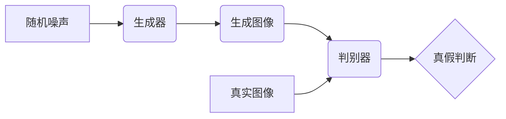

## 1. 背景介绍

### 1.1 图像生成技术的意义

图像生成技术是人工智能领域的一项重要研究方向，其目标是创造出能够自动生成逼真图像的模型。这项技术在许多领域都具有广泛的应用前景，例如：

* **艺术创作**: 艺术家可以使用图像生成模型来辅助创作，探索新的艺术风格，或者生成独特的艺术作品。
* **游戏开发**: 游戏开发者可以使用图像生成模型来生成游戏场景、角色、道具等，从而降低游戏开发成本，提高效率。
* **工业设计**: 工业设计师可以使用图像生成模型来生成产品原型，从而加速产品设计流程。
* **医疗影像**: 医生可以使用图像生成模型来生成医学影像，例如 X 光片、CT 扫描图像等，从而辅助疾病诊断。

### 1.2 生成对抗网络的诞生

生成对抗网络 (Generative Adversarial Networks, GANs) 是由 Ian Goodfellow 等人在 2014 年提出的，它是一种深度学习模型，通过对抗训练的方式来生成逼真的图像。 

GANs 的出现为图像生成技术带来了革命性的突破，其生成的图像质量远超传统的图像生成方法，并且具有很强的可控性和灵活性。

## 2. 核心概念与联系

### 2.1 生成器与判别器

GANs 的核心是两个神经网络模型：**生成器 (Generator)** 和 **判别器 (Discriminator)**。

* **生成器 (Generator)**: 接收随机噪声作为输入，并将其转化为逼真的图像。
* **判别器 (Discriminator)**: 接收真实图像和生成器生成的图像作为输入，并判断图像的真假。

### 2.2 对抗训练

生成器和判别器之间进行对抗训练，生成器试图生成能够欺骗判别器的图像，而判别器则试图区分真实图像和生成器生成的图像。

在训练过程中，生成器和判别器的参数不断更新，最终达到一个平衡状态，此时生成器生成的图像与真实图像难以区分。

### 2.3 核心概念联系图



## 3. 核心算法原理具体操作步骤

### 3.1 训练过程

GANs 的训练过程可以概括为以下几个步骤：

1. **初始化**: 初始化生成器和判别器的参数。
2. **生成样本**: 生成器接收随机噪声作为输入，生成一批图像。
3. **判别样本**: 将生成器生成的图像和真实图像输入判别器，判别器判断图像的真假。
4. **更新参数**: 根据判别器的输出，更新生成器和判别器的参数。
5. **重复步骤 2-4**: 重复上述步骤，直到生成器生成的图像与真实图像难以区分。

### 3.2 损失函数

GANs 的训练过程中，生成器和判别器都使用损失函数来衡量其性能。

* **判别器损失**: 衡量判别器区分真实图像和生成图像的能力。
* **生成器损失**: 衡量生成器生成逼真图像的能力。

### 3.3 具体操作步骤

1. **定义生成器和判别器网络结构**：根据具体应用场景，选择合适的网络结构，例如卷积神经网络、循环神经网络等。
2. **选择损失函数**: 根据应用场景，选择合适的损失函数，例如交叉熵损失、均方误差损失等。
3. **设置训练参数**: 设置学习率、批大小、迭代次数等训练参数。
4. **训练模型**: 使用训练数据训练 GANs 模型，并监控训练过程中的损失函数值。
5. **评估模型**: 使用测试数据评估 GANs 模型的性能，例如图像质量、多样性等指标。

## 4. 数学模型和公式详细讲解举例说明

### 4.1 判别器损失函数

判别器损失函数通常使用二元交叉熵损失函数，其公式如下：

$$
L_D = -\mathbb{E}_{x \sim p_{data}(x)}[\log D(x)] - \mathbb{E}_{z \sim p_z(z)}[\log(1 - D(G(z)))]
$$

其中：

* $D(x)$ 表示判别器对真实图像 $x$ 的判断结果，取值范围为 $[0, 1]$，表示图像为真实的概率。
* $G(z)$ 表示生成器根据随机噪声 $z$ 生成的图像。
* $p_{data}(x)$ 表示真实图像的分布。
* $p_z(z)$ 表示随机噪声的分布。

判别器损失函数的第一项表示判别器对真实图像的判断结果，第二项表示判别器对生成图像的判断结果。判别器的目标是最小化损失函数，即最大化对真实图像的判断结果，最小化对生成图像的判断结果。

### 4.2 生成器损失函数

生成器损失函数通常使用以下公式：

$$
L_G = -\mathbb{E}_{z \sim p_z(z)}[\log D(G(z))]
$$

生成器损失函数表示判别器对生成图像的判断结果。生成器的目标是最小化损失函数，即最大化判别器对生成图像的判断结果，从而生成更逼真的图像。

### 4.3 举例说明

假设我们想要训练一个 GANs 模型来生成手写数字图像。我们可以使用 MNIST 数据集作为训练数据。

* **判别器**: 我们可以使用一个卷积神经网络作为判别器，其输入为一张 $28 \times 28$ 的灰度图像，输出为一个标量，表示图像为真实图像的概率。
* **生成器**: 我们可以使用一个反卷积神经网络作为生成器，其输入为一个 100 维的随机噪声向量，输出为一张 $28 \times 28$ 的灰度图像。

在训练过程中，我们首先从 MNIST 数据集中随机抽取一批真实图像，并将它们输入判别器。然后，我们从随机噪声分布中抽取一批随机噪声向量，并将它们输入生成器，生成一批图像。最后，我们将真实图像和生成图像一起输入判别器，并计算判别器和生成器的损失函数。根据损失函数的值，更新判别器和生成器的参数。

## 5. 项目实践：代码实例和详细解释说明

### 5.1 代码实例

以下是一个使用 TensorFlow 框架实现的简单 GANs 模型的代码示例：

```python
import tensorflow as tf

# 定义生成器网络结构
def generator(z):
    # 定义网络层
    # ...
    # 返回生成图像
    return output

# 定义判别器网络结构
def discriminator(x):
    # 定义网络层
    # ...
    # 返回图像为真实图像的概率
    return output

# 定义损失函数
def discriminator_loss(real_output, fake_output):
    real_loss = tf.keras.losses.BinaryCrossentropy(from_logits=True)(tf.ones_like(real_output), real_output)
    fake_loss = tf.keras.losses.BinaryCrossentropy(from_logits=True)(