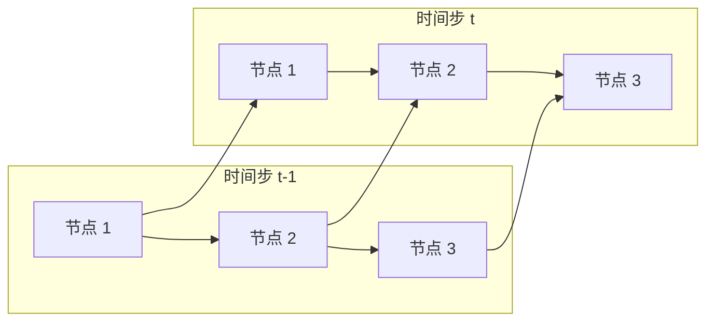

# 图循环神经网络（GRN）：序列建模、时间依赖、应用场景

作者：禅与计算机程序设计艺术

## 1. 背景介绍

### 1.1 序列建模的挑战

在机器学习领域，序列建模一直是一个重要的研究方向。序列数据是指按照时间顺序排列的一系列数据点，例如股票价格、语音信号、自然语言文本等。序列建模的目标是学习序列数据中的模式，并利用这些模式进行预测、分类等任务。

传统的序列建模方法，例如隐马尔科夫模型（HMM）和条件随机场（CRF），在处理简单序列数据时表现出色。然而，随着数据规模和复杂度的增加，这些方法面临着以下挑战：

* **长距离依赖：**序列数据中 often 存在长距离依赖关系，例如一句话中相隔很远的两个词语可能存在语义上的联系。传统的序列建模方法难以捕捉这种长距离依赖关系。
* **非线性关系：**序列数据中 often 存在非线性关系，例如股票价格的波动可能受到多种因素的影响，这些因素之间可能存在复杂的非线性关系。传统的序列建模方法难以建模这种非线性关系。
* **图结构数据：**现实世界中的许多序列数据都具有图结构，例如社交网络、交通网络等。传统的序列建模方法难以处理这种图结构数据。

### 1.2 图神经网络的兴起

近年来，图神经网络（GNN）在处理图结构数据方面取得了显著的成功。GNN能够学习图节点之间的关系，并利用这些关系进行节点分类、图分类等任务。

### 1.3 图循环神经网络的提出

为了解决传统序列建模方法的局限性，研究者提出了图循环神经网络（GRN）。GRN结合了GNN和循环神经网络（RNN）的优势，能够有效地建模序列数据中的长距离依赖、非线性关系和图结构。

## 2. 核心概念与联系

### 2.1 图神经网络（GNN）

GNN是一种专门用于处理图结构数据的神经网络。GNN通过迭代地聚合邻居节点的信息来更新节点的表示，从而学习图节点之间的关系。

#### 2.1.1 图卷积网络（GCN）

GCN是一种常用的GNN模型，它通过聚合邻居节点的特征来更新节点的表示。GCN的数学公式如下：

$$
H^{(l+1)} = \sigma(\tilde{D}^{-1/2}\tilde{A}\tilde{D}^{-1/2}H^{(l)}W^{(l)})
$$

其中：

* $H^{(l)}$ 表示第 $l$ 层的节点表示矩阵。
* $\tilde{A} = A + I$ 表示添加了自环的邻接矩阵。
* $\tilde{D}$ 表示 $\tilde{A}$ 的度矩阵。
* $W^{(l)}$ 表示第 $l$ 层的权重矩阵。
* $\sigma$ 表示激活函数。

#### 2.1.2 图注意力网络（GAT）

GAT是一种改进的GCN模型，它引入了注意力机制来学习邻居节点的不同重要程度。GAT的数学公式如下：

$$
h_i^{(l+1)} = \sigma(\sum_{j \in \mathcal{N}(i)} \alpha_{ij}^{(l)} W^{(l)} h_j^{(l)})
$$

其中：

* $h_i^{(l)}$ 表示第 $l$ 层节点 $i$ 的表示。
* $\mathcal{N}(i)$ 表示节点 $i$ 的邻居节点集合。
* $\alpha_{ij}^{(l)}$ 表示节点 $i$ 对节点 $j$ 的注意力权重。

### 2.2 循环神经网络（RNN）

RNN是一种专门用于处理序列数据的神经网络。RNN通过迭代地更新隐藏状态来学习序列数据中的模式。

#### 2.2.1 简单循环神经网络（SimpleRNN）

SimpleRNN是最简单的RNN模型，它的数学公式如下：

$$
h_t = \sigma(Wx_t + Uh_{t-1} + b)
$$

其中：

* $h_t$ 表示时刻 $t$ 的隐藏状态。
* $x_t$ 表示时刻 $t$ 的输入。
* $W$ 和 $U$ 表示权重矩阵。
* $b$ 表示偏置向量。
* $\sigma$ 表示激活函数。

#### 2.2.2 长短期记忆网络（LSTM）

LSTM是一种改进的RNN模型，它引入了门控机制来解决SimpleRNN的梯度消失问题。LSTM的数学公式如下：

$$
\begin{aligned}
i_t &= \sigma(W_i x_t + U_i h_{t-1} + b_i) \\
f_t &= \sigma(W_f x_t + U_f h_{t-1} + b_f) \\
o_t &= \sigma(W_o x_t + U_o h_{t-1} + b_o) \\
c_t &= f_t c_{t-1} + i_t \tanh(W_c x_t + U_c h_{t-1} + b_c) \\
h_t &= o_t \tanh(c_t)
\end{aligned}
$$

其中：

* $i_t$、$f_t$、$o_t$ 分别表示输入门、遗忘门、输出门。
* $c_t$ 表示时刻 $t$ 的细胞状态。
* $\sigma$ 表示 sigmoid 函数。
* $\tanh$ 表示 tanh 函数。

### 2.3 图循环神经网络（GRN）

GRN结合了GNN和RNN的优势，能够有效地建模序列数据中的长距离依赖、非线性关系和图结构。GRN的结构如下图所示：



在每个时间步，GRN首先使用GNN来学习图节点之间的关系，然后使用RNN来更新节点的表示。

## 3. 核心算法原理具体操作步骤

### 3.1 GRN的输入

GRN的输入是一个图结构的序列数据，其中每个时间步的图结构可以相同也可以不同。

### 3.2 GRN的结构

GRN的结构由多个GNN层和RNN层组成。GNN层用于学习图节点之间的关系，RNN层用于更新节点的表示。

### 3.3 GRN的操作步骤

1. **初始化：**初始化GNN层和RNN层的参数。
2. **迭代更新：**对于每个时间步：
    * 使用GNN层学习图节点之间的关系。
    * 使用RNN层更新节点的表示。
3. **输出：**输出最终的节点表示。

## 4. 数学模型和公式详细讲解举例说明

### 4.1 GRN的数学模型

GRN的数学模型可以表示为：

$$
\begin{aligned}
h_t &= RNN(h_{t-1}, GNN(A_t, X_t))
\end{aligned}
$$

其中：

* $h_t$ 表示时刻 $t$ 的节点表示矩阵。
* $RNN$ 表示RNN层。
* $GNN$ 表示GNN层。
* $A_t$ 表示时刻 $t$ 的邻接矩阵。
* $X_t$ 表示时刻 $t$ 的节点特征矩阵。

### 4.2 举例说明

假设我们有一个社交网络的序列数据，其中每个时间步表示一天。我们希望使用GRN来预测每个用户在下一天是否会转发某个帖子。

* **输入：**每个时间步的输入是一个图，其中节点表示用户，边表示用户之间的关系。节点特征包括用户的年龄、性别、兴趣等。
* **GNN层：**我们可以使用GCN来学习用户之间的关系。
* **RNN层：**我们可以使用LSTM来更新用户的表示。
* **输出：**最终的输出是一个向量，表示每个用户在下一天转发某个帖子的概率。

## 5. 项目实践：代码实例和详细解释说明

### 5.1 代码实例

```python
import torch
import torch.nn as nn

class GRN(nn.Module):
    def __init__(self, input_dim, hidden_dim, output_dim):
        super(GRN, self).__init__()
        # GNN层
        self.gcn = GCN(input_dim, hidden_dim)
        # RNN层
        self.rnn = nn.LSTM(hidden_dim, hidden_dim)
        # 输出层
        self.fc = nn.Linear(hidden_dim, output_dim)

    def forward(self, x, adj):
        # GNN层
        h = self.gcn(x, adj)
        # RNN层
        h, _ = self.rnn(h)
        # 输出层
        out = self.fc(h)
        return out
```

### 5.2 详细解释说明

* **`GRN` 类：**定义了GRN模型。
* **`__init__` 方法：**初始化GNN层、RNN层和输出层。
* **`forward` 方法：**定义了GRN的前向传播过程。
    * 首先使用GNN层学习图节点之间的关系。
    * 然后使用RNN层更新节点的表示。
    * 最后使用输出层输出最终的节点表示。

## 6. 实际应用场景

GRN在许多实际应用场景中都取得了成功，例如：

* **交通预测：**预测交通流量、交通拥堵等。
* **社交网络分析：**预测用户行为、推荐朋友等。
* **金融市场预测：**预测股票价格、汇率等。
* **自然语言处理：**文本分类、机器翻译等。

## 7. 总结：未来发展趋势与挑战

GRN是一种强大的序列建模方法，它结合了GNN和RNN的优势，能够有效地建模序列数据中的长距离依赖、非线性关系和图结构。未来，GRN的研究方向包括：

* **更强大的GNN模型：**探索更强大的GNN模型，例如图 transformer 网络等。
* **更有效的RNN模型：**探索更有效的RNN模型，例如 transformer 等。
* **动态图结构：**研究如何处理动态变化的图结构。

## 8. 附录：常见问题与解答

### 8.1 GRN和GNN的区别是什么？

GNN是一种专门用于处理图结构数据的神经网络，而GRN是一种结合了GNN和RNN的序列建模方法。GRN可以使用GNN来学习图节点之间的关系，并使用RNN来更新节点的表示。

### 8.2 GRN和RNN的区别是什么？

RNN是一种专门用于处理序列数据的神经网络，而GRN是一种结合了GNN和RNN的序列建模方法。GRN可以使用RNN来更新节点的表示，并使用GNN来学习图节点之间的关系。

### 8.3 GRN的应用场景有哪些？

GRN的应用场景非常广泛，例如交通预测、社交网络分析、金融市场预测、自然语言处理等。
