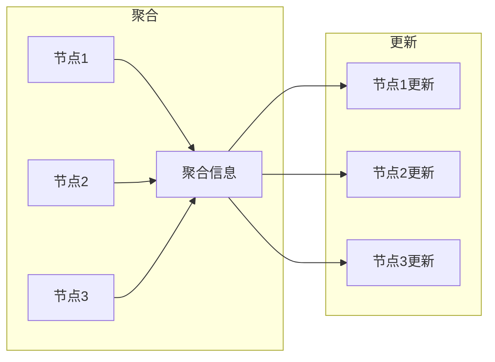

## 1. 背景介绍

### 1.1 图数据与机器学习的兴起

近年来，随着社交网络、知识图谱、生物信息网络等领域的发展，图数据已经成为了一种普遍存在的数据形式。传统的机器学习算法难以有效地处理图数据的非欧几里得结构，而图神经网络 (Graph Neural Networks, GNNs) 作为一种专门针对图数据设计的深度学习模型，近年来受到了广泛关注并取得了显著的成果。

### 1.2 图神经网络的优势

相比于传统的机器学习算法，GNNs 具有以下优势：

* **能够有效地处理图数据的非欧几里得结构：** GNNs 通过节点之间的消息传递机制，能够捕捉到图数据的拓扑结构信息，从而更好地学习节点的特征表示。
* **具有较强的表达能力：** GNNs 可以通过多层网络结构，学习到节点之间复杂的非线性关系，从而具有更强的表达能力。
* **可扩展性强：** GNNs 可以应用于大规模图数据，并且可以通过分布式训练来加速模型的训练过程。

### 1.3 图神经网络的应用领域

GNNs 已经被广泛应用于各个领域，例如：

* **社交网络分析：** 社交网络中用户之间的关系可以用图来表示，GNNs 可以用于用户分类、社区发现、推荐系统等任务。
* **知识图谱推理：** 知识图谱是一种语义网络，GNNs 可以用于知识推理、问答系统、实体识别等任务。
* **生物信息学：** 蛋白质结构、基因调控网络等可以用图来表示，GNNs 可以用于药物发现、疾病诊断等任务。
* **交通预测：** 城市交通网络可以用图来表示，GNNs 可以用于交通流量预测、交通拥堵预测等任务。

## 2. 核心概念与联系

### 2.1 图的表示

图通常用 $G = (V, E)$ 表示，其中：

* $V$ 表示节点集合，每个节点 $v \in V$ 表示图中的一个实体。
* $E$ 表示边集合，每条边 $e = (u, v) \in E$ 表示节点 $u$ 和 $v$ 之间存在关系。

### 2.2 节点特征

每个节点 $v$ 可以用一个特征向量 $x_v \in \mathbb{R}^d$ 表示，其中 $d$ 表示特征维度。

### 2.3 邻接矩阵

邻接矩阵 $A \in \mathbb{R}^{|V| \times |V|}$ 用于表示图中节点之间的连接关系，其中 $A_{uv} = 1$ 表示节点 $u$ 和 $v$ 之间存在边，否则 $A_{uv} = 0$。

### 2.4 度矩阵

度矩阵 $D \in \mathbb{R}^{|V| \times |V|}$ 是一个对角矩阵，其中 $D_{vv}$ 表示节点 $v$ 的度，即与节点 $v$ 相连的边的数量。

### 2.5 拉普拉斯矩阵

拉普拉斯矩阵 $L = D - A$ 是一个对称矩阵，它反映了图的拓扑结构信息。

## 3. 核心算法原理具体操作步骤

### 3.1 消息传递机制

GNNs 的核心思想是通过节点之间的消息传递机制，来学习节点的特征表示。消息传递机制可以分为以下两个步骤：

* **聚合 (Aggregation)：** 每个节点从其邻居节点收集信息，并将其聚合起来。
* **更新 (Update)：** 每个节点根据其聚合的信息，更新自身的特征表示。

### 3.2 图卷积网络 (GCN)

GCN 是一种经典的 GNN 模型，它通过以下公式来更新节点的特征表示：

$$
H^{(l+1)} = \sigma(\tilde{D}^{-\frac{1}{2}}\tilde{A}\tilde{D}^{-\frac{1}{2}}H^{(l)}W^{(l)})
$$

其中：

* $H^{(l)}$ 表示第 $l$ 层的节点特征矩阵，$H^{(0)} = X$。
* $\tilde{A} = A + I$ 表示添加了自环的邻接矩阵。
* $\tilde{D}$ 表示 $\tilde{A}$ 的度矩阵。
* $W^{(l)}$ 表示第 $l$ 层的可学习参数矩阵。
* $\sigma$ 表示激活函数，例如 ReLU。

GCN 的消息传递机制可以理解为：每个节点首先将自身的特征信息传递给其邻居节点，然后每个节点将从其邻居节点接收到的信息进行加权平均，最后将加权平均后的信息作为自身的新特征表示。

### 3.3 图注意力网络 (GAT)

GAT 是一种改进的 GNN 模型，它通过注意力机制来学习节点之间的关系，从而更好地捕捉到图数据的拓扑结构信息。GAT 的公式如下：

$$
h_i^{(l+1)} = \sigma(\sum_{j \in N(i)}\alpha_{ij}^{(l)}W^{(l)}h_j^{(l)})
$$

其中：

* $h_i^{(l)}$ 表示第 $l$ 层节点 $i$ 的特征向量。
* $N(i)$ 表示节点 $i$ 的邻居节点集合。
* $\alpha_{ij}^{(l)}$ 表示节点 $i$ 对节点 $j$ 的注意力权重，它通过以下公式计算：

$$
\alpha_{ij}^{(l)} = \frac{\exp(e_{ij}^{(l)})}{\sum_{k \in N(i)}\exp(e_{ik}^{(l)})}
$$

其中：

* $e_{ij}^{(l)} = a(W^{(l)}h_i^{(l)}, W^{(l)}h_j^{(l)})$ 表示节点 $i$ 和 $j$ 之间的注意力系数，$a$ 表示一个注意力函数，例如单层神经网络。

GAT 的消息传递机制可以理解为：每个节点首先计算其对邻居节点的注意力权重，然后将邻居节点的特征信息按照注意力权重进行加权平均，最后将加权平均后的信息作为自身的新特征表示。

### 3.4  Mermaid流程图



## 4. 数学模型和公式详细讲解举例说明

### 4.1 GCN 的数学模型

GCN 的数学模型可以表示为以下公式：

$$
H^{(l+1)} = \sigma(\tilde{D}^{-\frac{1}{2}}\tilde{A}\tilde{D}^{-\frac{1}{2}}H^{(l)}W^{(l)})
$$

其中：

* $H^{(l)}$ 表示第 $l$ 层的节点特征矩阵，$H^{(0)} = X$。
* $\tilde{A} = A + I$ 表示添加了自环的邻接矩阵。
* $\tilde{D}$ 表示 $\tilde{A}$ 的度矩阵。
* $W^{(l)}$ 表示第 $l$ 层的可学习参数矩阵。
* $\sigma$ 表示激活函数，例如 ReLU。

### 4.2 GCN 的公式讲解

GCN 的公式可以分解为以下几个步骤：

1. **计算归一化邻接矩阵：** $\tilde{D}^{-\frac{1}{2}}\tilde{A}\tilde{D}^{-\frac{1}{2}}$
    * $\tilde{A} = A + I$ 表示添加了自环的邻接矩阵。
    * $\tilde{D}$ 表示 $\tilde{A}$ 的度矩阵。
    * $\tilde{D}^{-\frac{1}{2}}$ 表示 $\tilde{D}$ 的逆平方根。
2. **进行特征传播：** $\tilde{D}^{-\frac{1}{2}}\tilde{A}\tilde{D}^{-\frac{1}{2}}H^{(l)}$
    * 将归一化邻接矩阵与上一层的节点特征矩阵相乘，得到每个节点的邻居节点的特征信息的加权平均。
3. **进行线性变换：** $(\tilde{D}^{-\frac{1}{2}}\tilde{A}\tilde{D}^{-\frac{1}{2}}H^{(l)})W^{(l)}$
    * 将加权平均后的特征信息进行线性变换，得到新的特征表示。
4. **应用激活函数：** $\sigma((\tilde{D}^{-\frac{1}{2}}\tilde{A}\tilde{D}^{-\frac{1}{2}}H^{(l)})W^{(l)})$
    * 将线性变换后的特征信息应用激活函数，得到最终的节点特征表示。

### 4.3 GCN 举例说明

假设有一个简单的图，包含 4 个节点和 5 条边，其邻接矩阵如下：

```
A = [[0, 1, 1, 0],
     [1, 0, 1, 0],
     [1, 1, 0, 1],
     [0, 0, 1, 0]]
```

每个节点的初始特征向量为：

```
X = [[1, 0],
     [0, 1],
     [1, 1],
     [0, 0]]
```

假设 GCN 模型只有一层，可学习参数矩阵为：

```
W = [[1, 1],
     [0, 1]]
```

则 GCN 的计算过程如下：

1. **计算归一化邻接矩阵：**

```
D = [[2, 0, 0, 0],
     [0, 2, 0, 0],
     [0, 0, 3, 0],
     [0, 0, 0, 1]]

D_inv_sqrt = [[