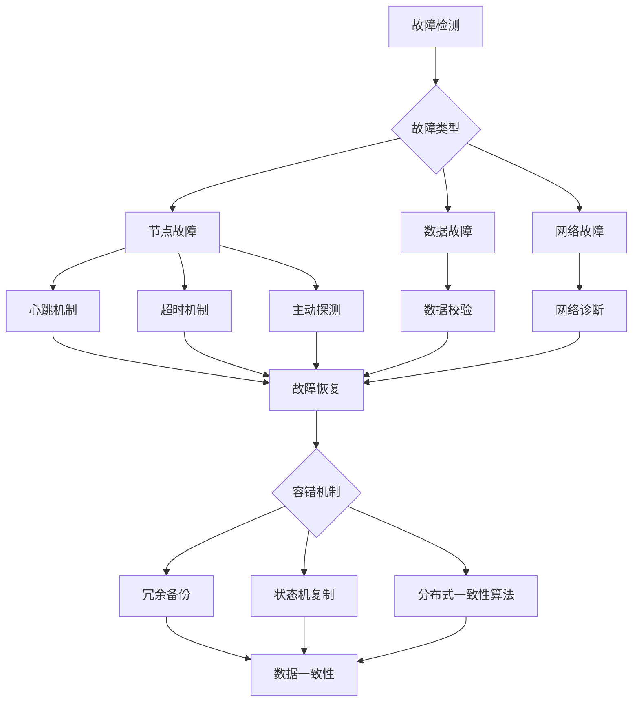

## 1. 背景介绍

### 1.1 图计算的兴起与挑战

近年来，随着大数据时代的到来，图数据结构因其强大的表达能力和广泛的应用场景而备受关注。从社交网络、推荐系统到生物信息、金融风控，图数据无处不在。图计算作为处理和分析图数据的关键技术，也随之蓬勃发展。然而，大规模图数据的存储、管理和计算带来了诸多挑战，其中一个关键问题就是系统的容错性。

### 1.2 分布式图计算的容错需求

为了处理海量图数据，分布式图计算引擎应运而生。这类系统通常将图数据划分到多个计算节点上进行并行处理，以提高计算效率。然而，分布式环境下，节点故障、网络异常等问题时有发生，如何保证系统在故障情况下依然能够正常运行，并保证数据的一致性，成为了亟待解决的关键问题。

### 1.3 本文研究内容概述

本文将深入探讨图计算引擎的容错机制，重点关注故障检测、恢复和数据一致性三大方面。我们将分析不同容错机制的原理、优缺点以及适用场景，并结合实际案例进行深入剖析。此外，我们还将展望图计算引擎容错机制的未来发展趋势，为构建更加健壮、可靠的图计算系统提供参考。

## 2. 核心概念与联系

### 2.1 故障模型

在讨论容错机制之前，我们需要明确故障的类型。常见的故障模型包括：

* **节点故障：** 计算节点宕机、网络中断等。
* **数据故障：** 数据丢失、数据损坏等。
* **网络故障：** 网络拥塞、网络分区等。

不同的故障类型需要采用不同的容错机制进行处理。

### 2.2 容错机制

容错机制是指系统在发生故障时，能够自动采取措施保证系统正常运行，并尽可能减少数据损失和服务中断时间。常见的容错机制包括：

* **冗余备份：** 将数据或计算任务复制到多个节点，即使部分节点发生故障，系统依然可以正常工作。
* **故障检测：** 定期检查节点和网络状态，及时发现故障节点。
* **故障恢复：** 将故障节点上的数据和计算任务迁移到其他节点，恢复系统正常运行。
* **数据一致性：** 确保系统在故障发生后，数据依然保持一致性。

### 2.3 核心概念之间的联系

故障模型、容错机制和数据一致性三者之间密切相关。故障模型决定了需要采取何种容错机制，而容错机制的实现又直接影响着数据的一致性。

## 3. 核心算法原理具体操作步骤

### 3.1 故障检测

#### 3.1.1 心跳机制

心跳机制是一种常用的故障检测方法。每个节点定期向其他节点发送心跳信号，如果某个节点长时间没有收到其他节点的心跳信号，则认为该节点发生了故障。

#### 3.1.2 超时机制

超时机制是指设置一个时间阈值，如果某个操作在指定时间内没有完成，则认为该操作失败。

#### 3.1.3 主动探测

主动探测是指定期向其他节点发送探测消息，检查节点是否存活。

### 3.2 故障恢复

#### 3.2.1 冗余备份恢复

冗余备份恢复是指利用备份数据恢复故障节点上的数据和计算任务。常见的冗余备份方式包括主从复制、多副本复制等。

#### 3.2.2 状态机复制

状态机复制是指将计算任务的状态复制到多个节点，即使部分节点发生故障，其他节点依然可以继续执行计算任务。

#### 3.2.3 分布式一致性算法

分布式一致性算法是指在分布式环境下，保证多个节点之间数据一致性的算法，例如 Paxos、Raft 等。

### 3.3 数据一致性

#### 3.3.1 强一致性

强一致性是指所有节点上的数据始终保持一致。强一致性通常需要较高的成本，但可以保证数据的一致性和可靠性。

#### 3.3.2 弱一致性

弱一致性是指允许数据在一段时间内不一致，但最终会达到一致状态。弱一致性通常可以提高系统的性能，但可能会导致数据丢失或不一致。

#### 3.3.3 最终一致性

最终一致性是指数据最终会达到一致状态，但允许在一段时间内不一致。最终一致性是一种折衷方案，可以兼顾性能和数据一致性。

## 4. 数学模型和公式详细讲解举例说明

### 4.1 故障概率模型

故障概率模型用于描述节点发生故障的概率。常用的故障概率模型包括：

* **指数分布模型：** 假设节点的故障时间服从指数分布。
* **Weibull 分布模型：** 假设节点的故障时间服从 Weibull 分布。

### 4.2 故障恢复时间模型

故障恢复时间模型用于描述故障恢复所需的时间。常用的故障恢复时间模型包括：

* **平均恢复时间 (MTTR)：** 指系统从故障状态恢复到正常状态所需的平均时间。
* **最大恢复时间 (MTTR)：** 指系统从故障状态恢复到正常状态所需的最长时间。

### 4.3 数据一致性模型

数据一致性模型用于描述数据一致性的程度。常用的数据一致性模型包括：

* **线性一致性：** 所有操作都按照全局时间顺序执行，任何时刻所有节点上的数据都保持一致。
* **顺序一致性：** 所有操作都按照程序指定的顺序执行，但不同节点上的操作顺序可能不同。
* **因果一致性：** 因果相关的操作按照因果顺序执行，但无关的操作顺序可能不同。

### 4.4 举例说明

假设一个图计算引擎采用主从复制的冗余备份方式，主节点负责执行计算任务，并将计算结果复制到从节点。假设主节点的故障概率服从指数分布，平均故障时间为 10 小时，从节点的故障概率为 0，故障恢复时间为 1 小时。

**计算系统可用性：**

```
系统可用性 = (1 - 主节点故障概率) * (1 - 从节点故障概率)
           = (1 - 1/10) * (1 - 0)
           = 0.9
```

**计算平均故障恢复时间 (MTTR)：**

```
MTTR = 主节点故障概率 * 主节点故障恢复时间 + 从节点故障概率 * 从节点故障恢复时间
     = 1/10 * 1 + 0 * 1
     = 0.1 小时
```

## 5. 项目实践：代码实例和详细解释说明

### 5.1 分布式图计算框架 Apache Giraph

Apache Giraph 是一个开源的分布式图计算框架，支持大规模图数据的处理和分析。Giraph 提供了丰富的容错机制，包括：

* **Master Failover：** Giraph 支持 Master 节点的故障转移，当 Master 节点发生故障时，系统会自动选举新的 Master 节点，保证系统的正常运行。
* **Worker Failover：** Giraph 支持 Worker 节点的故障转移，当 Worker 节点发生故障时，系统会将该节点上的计算任务迁移到其他节点，保证计算任务的完成。
* **Checkpoint/Recovery：** Giraph 支持定期保存计算任务的检查点，当系统发生故障时，可以从最近的检查点恢复计算任务，减少数据损失。

### 5.2 代码实例

```java
// 设置 Master Failover
conf.set(BspJob.MASTER_FAILOVER_ENABLED, true);

// 设置 Worker Failover
conf.set(BspJob.WORKER_FAILOVER_ENABLED, true);

// 设置 Checkpoint/Recovery
conf.set(BspJob.CHECKPOINT_FREQUENCY, 10);
```

### 5.3 详细解释说明

上述代码片段展示了如何在 Giraph 中配置容错机制。`BspJob.MASTER_FAILOVER_ENABLED` 和 `BspJob.WORKER_FAILOVER_ENABLED` 参数用于启用 Master 和 Worker 节点的故障转移机制。`BspJob.CHECKPOINT_FREQUENCY` 参数用于设置检查点的保存频率，单位为分钟。

## 6. 实际应用场景

### 6.1 社交网络分析

社交网络分析通常需要处理大规模的图数据，例如 Facebook、Twitter 等社交平台的用户关系图。容错机制可以保证社交网络分析平台的稳定性和可靠性，即使部分节点发生故障，依然可以正常提供服务。

### 6.2 推荐系统

推荐系统通常需要根据用户的历史行为和兴趣偏好，推荐相关的商品或服务。容错机制可以保证推荐系统的实时性和准确性，即使部分节点发生故障，依然可以及时更新推荐结果。

### 6.3 金融风控

金融风控通常需要分析大量的交易数据，识别潜在的风险和欺诈行为。容错机制可以保证金融风控系统的稳定性和可靠性，即使部分节点发生故障，依然可以正常运行，防止风险和欺诈行为的发生。

## 7. 总结：未来发展趋势与挑战

### 7.1 未来发展趋势

* **更加智能的容错机制：** 随着人工智能技术的不断发展，未来的容错机制将会更加智能化，能够自动识别故障类型，并采取相应的措施进行处理。
* **更加高效的故障恢复：** 随着硬件技术的不断发展，未来的故障恢复将会更加高效，能够在更短的时间内恢复系统正常运行。
* **更加完善的数据一致性保障：** 随着分布式一致性算法的不断发展，未来的数据一致性保障将会更加完善，能够更好地保证数据的一致性和可靠性。

### 7.2 挑战

* **复杂故障的处理：** 现实世界中的故障往往是复杂的，例如网络分区、数据损坏等，如何处理这些复杂故障是未来容错机制面临的挑战。
* **性能和可靠性的平衡：** 容错机制通常会带来一定的性能损耗，如何平衡性能和可靠性是未来容错机制需要解决的问题。
* **新技术的应用：** 随着新技术的不断涌现，例如云计算、容器化等，如何将这些新技术应用到容错机制中，也是未来需要探索的方向。

## 8. 附录：常见问题与解答

### 8.1 如何选择合适的容错机制？

选择合适的容错机制需要考虑以下因素：

* **系统规模：** 对于小规模系统，可以采用简单的容错机制，例如冗余备份。对于大规模系统，需要采用更加复杂的容错机制，例如分布式一致性算法。
* **故障类型：** 不同的故障类型需要采用不同的容错机制进行处理。
* **性能需求：** 容错机制通常会带来一定的性能损耗，需要根据系统性能需求选择合适的容错机制。

### 8.2 如何测试容错机制？

测试容错机制可以通过以下方法：

* **模拟故障：** 可以通过模拟节点故障、网络故障等，测试系统在故障情况下的行为。
* **压力测试：** 可以通过对系统进行压力测试，测试系统在高负载情况下的稳定性和可靠性。
* **故障注入测试：** 可以通过向系统注入故障，测试系统在故障情况下的恢复能力。


## Mermaid 流程图

