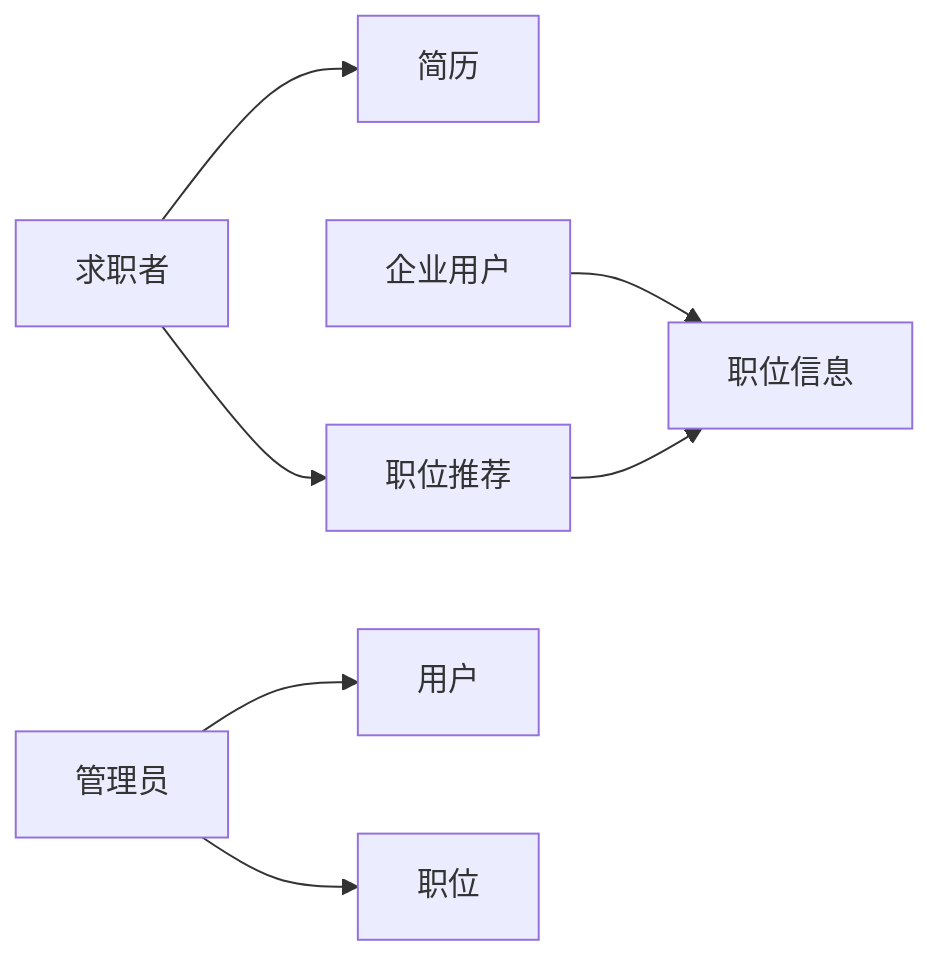

# 在线人才网(招聘网)系统详细设计与具体代码实现

作者：禅与计算机程序设计艺术

## 1. 背景介绍

### 1.1 人才招聘市场的现状与挑战

随着互联网的快速发展，人才招聘市场也发生了翻天覆地的变化。传统的招聘模式已经无法满足企业和求职者的需求，在线人才网(招聘网)系统应运而生。这类系统为企业和求职者搭建了一个高效、便捷的沟通桥梁，极大地提高了人才招聘效率。

然而，在线人才网(招聘网)系统也面临着诸多挑战：

* **海量数据处理:**  系统需要处理大量的用户信息、职位信息、简历信息等，对数据库的性能和可扩展性提出了很高的要求。
* **精准匹配:**  如何将合适的职位推荐给合适的求职者，是系统的一大难点。需要综合考虑求职者的技能、经验、期望薪资等因素，以及职位的要求、薪资待遇、工作地点等因素。
* **用户体验:**  系统需要提供良好的用户体验，方便用户浏览职位、投递简历、查看面试通知等。
* **安全与隐私:**  系统需要保障用户信息和企业信息的安全，防止数据泄露和滥用。

### 1.2 在线人才网(招聘网)系统的意义

在线人才网(招聘网)系统的出现，为人才招聘市场带来了诸多益处：

* **提高招聘效率:**  企业可以通过系统快速发布职位信息，筛选简历，联系求职者，大大缩短了招聘周期。
* **降低招聘成本:**  企业无需再花费大量的时间和精力进行线下招聘，节省了人力成本和物力成本。
* **扩大招聘范围:**  系统可以将职位信息推送给全国乃至全球的求职者，帮助企业找到更优秀的人才。
* **提升求职成功率:**  求职者可以通过系统方便地搜索职位、投递简历，并及时了解面试进度，提高了求职成功率。

## 2. 核心概念与联系

### 2.1 用户

* **求职者:**  注册用户，可以在系统中创建个人简历，搜索职位，投递简历，查看面试通知等。
* **企业用户:**  注册用户，可以在系统中发布职位信息，筛选简历，联系求职者等。
* **管理员:**  负责系统的管理和维护，包括用户管理、职位管理、系统设置等。

### 2.2 职位

* **职位信息:**  包括职位名称、职位描述、薪资待遇、工作地点、学历要求、工作经验要求等。
* **职位分类:**  系统将职位按照行业、职能、地区等进行分类，方便用户查找。
* **职位推荐:**  系统会根据用户的简历信息和搜索记录，推荐符合用户需求的职位。

### 2.3 简历

* **个人信息:**  包括姓名、性别、年龄、联系方式、学历、工作经验等。
* **技能标签:**  用户可以为自己添加技能标签，方便企业筛选简历。
* **项目经验:**  用户可以填写自己的项目经验，展示自己的能力。

### 2.4 关系图



## 3. 核心算法原理具体操作步骤

### 3.1 职位搜索算法

系统采用 Elasticsearch 作为搜索引擎，实现高效的职位搜索功能。

**操作步骤:**

1. 用户输入搜索关键词。
2. 系统将搜索关键词分词，并根据分词结果查询 Elasticsearch 索引。
3. Elasticsearch 返回匹配的职位信息。
4. 系统对搜索结果进行排序，优先展示与用户搜索关键词最相关的职位信息。

### 3.2 职位推荐算法

系统采用协同过滤算法，根据用户的历史行为和兴趣，推荐符合用户需求的职位。

**操作步骤:**

1. 收集用户的历史行为数据，例如浏览过的职位、投递过的简历等。
2. 根据用户的历史行为数据，计算用户之间的相似度。
3. 找到与目标用户相似的其他用户，并获取这些用户感兴趣的职位。
4. 将这些职位推荐给目标用户。

### 3.3 简历匹配算法

系统采用 TF-IDF 算法，计算简历与职位之间的匹配度。

**操作步骤:**

1. 对简历和职位信息进行分词，并统计每个词语出现的频率。
2. 计算每个词语的 TF-IDF 值。
3. 根据 TF-IDF 值，计算简历与职位之间的相似度。

## 4. 数学模型和公式详细讲解举例说明

### 4.1 TF-IDF 算法

TF-IDF (Term Frequency-Inverse Document Frequency) 是一种用于信息检索与数据挖掘的常用加权技术。它是一种统计方法，用以评估一字词对于一个文件集或一个语料库中的其中一份文件的重要程度。字词的重要性随着它在文件中出现的次数成正比增加，但同时会随着它在语料库中出现的频率成反比下降。

**公式:**

```
TF-IDF(t, d) = TF(t, d) * IDF(t)
```

其中:

* **TF(t, d)**:  词语 t 在文档 d 中出现的频率。
* **IDF(t)**:  逆文档频率，用于衡量词语 t 的普遍程度。

**计算 IDF(t) 的公式:**

```
IDF(t) = log(N / df(t))
```

其中:

* **N**:  语料库中的文档总数。
* **df(t)**:  包含词语 t 的文档数量。

**举例说明:**

假设有一个包含 1000 篇文档的语料库，其中 100 篇文档包含词语 "人工智能"，那么 "人工智能" 的 IDF 值为:

```
IDF("人工智能") = log(1000 / 100) = 2.303
```

假设某篇简历中 "人工智能" 出现 5 次，那么 "人工智能" 的 TF 值为:

```
TF("人工智能") = 5
```

因此，"人工智能" 在该简历中的 TF-IDF 值为:

```
TF-IDF("人工智能") = 5 * 2.303 = 11.515
```

### 4.2 协同过滤算法

协同过滤算法是一种常用的推荐算法，它基于用户之间的相似性进行推荐。

**公式:**

```
sim(u, v) = (r_u * r_v) / (||r_u|| * ||r_v||)
```

其中:

* **sim(u, v)**:  用户 u 和用户 v 之间的相似度。
* **r_u**:  用户 u 对所有项目的评分向量。
* **r_v**:  用户 v 对所有项目的评分向量。
* **||r_u||**:  用户 u 评分向量的长度。
* **||r_v||**:  用户 v 评分向量的长度。

**举例说明:**

假设用户 A 对项目 1、2、3 的评分分别为 5、4、3，用户 B 对项目 1、2、3 的评分分别为 4、5、2，那么用户 A 和用户 B 之间的相似度为:

```
sim(A, B) = ((5, 4, 3) * (4, 5, 2)) / (sqrt(5^2 + 4^2 + 3^2) * sqrt(4^2 + 5^2 + 2^2)) = 0.82
```

## 5. 项目实践：代码实例和详细解释说明

### 5.1 技术选型

* **后端:**  Spring Boot
* **数据库:**  MySQL
* **搜索引擎:**  Elasticsearch
* **前端:**  Vue.js

### 5.2 代码实例

**用户注册接口:**

```java
@PostMapping("/register")
public ResponseEntity<User> register(@RequestBody User user) {
    // 校验用户信息
    // 保存用户信息到数据库
    // 返回用户信息
}
```

**职位搜索接口:**

```java
@GetMapping("/search")
public ResponseEntity<List<Job>> search(@RequestParam String keyword) {
    // 调用 Elasticsearch 搜索引擎
    // 返回搜索结果
}
```

**职位推荐接口:**

```java
@GetMapping("/recommend")
public ResponseEntity<List<Job>> recommend(@RequestParam Long userId) {
    // 获取用户的历史行为数据
    // 计算用户之间的相似度
    // 找到与目标用户相似的其他用户
    // 获取这些用户感兴趣的职位
    // 返回推荐结果
}
```

### 5.3 代码解释

* **用户注册接口:**  接收用户提交的注册信息，校验用户信息，将用户信息保存到数据库，并返回用户信息。
* **职位搜索接口:**  接收用户输入的搜索关键词，调用 Elasticsearch 搜索引擎进行搜索，并返回搜索结果。
* **职位推荐接口:**  接收用户 ID，根据用户的历史行为数据，计算用户之间的相似度，找到与目标用户相似的其他用户，获取这些用户感兴趣的职位，并返回推荐结果。

## 6. 实际应用场景

### 6.1 大型企业招聘

大型企业招聘需求量大，对人才质量要求高，在线人才网(招聘网)系统可以帮助企业快速筛选简历，提高招聘效率。

### 6.2 中小型企业招聘

中小型企业招聘预算有限，在线人才网(招聘网)系统可以帮助企业降低招聘成本，扩大招聘范围。

### 6.3 个人求职

个人求职者可以通过在线人才网(招聘网)系统方便地搜索职位、投递简历，并及时了解面试进度。

## 7. 工具和资源推荐

### 7.1 开发工具

* IntelliJ IDEA
* Eclipse
* Visual Studio Code

### 7.2 数据库

* MySQL
* PostgreSQL
* MongoDB

### 7.3 搜索引擎

* Elasticsearch
* Solr
* Lucene

### 7.4 前端框架

* Vue.js
* React
* Angular

### 7.5 学习资源

* Spring Boot 官方文档
* Elasticsearch 官方文档
* Vue.js 官方文档

## 8. 总结：未来发展趋势与挑战

### 8.1 人工智能与大数据

未来，人工智能和大数据技术将更加深入地应用于在线人才网(招聘网)系统，例如：

* **智能简历解析:**  利用自然语言处理技术，自动提取简历中的关键信息，提高简历筛选效率。
* **智能职位匹配:**  利用机器学习算法，根据用户的技能、经验、期望薪资等因素，以及职位的要求、薪资待遇、工作地点等因素，进行精准的职位匹配。
* **个性化推荐:**  根据用户的历史行为和兴趣，推荐符合用户需求的职位。

### 8.2 用户体验

用户体验是影响在线人才网(招聘网)系统发展的重要因素，未来系统需要更加注重用户体验，例如：

* **简化操作流程:**  提供更加简洁、易用的操作界面，方便用户快速完成求职和招聘操作。
* **提升系统性能:**  优化系统架构和算法，提高系统响应速度和稳定性。
* **增强用户互动:**  提供在线咨询、问答社区等功能，增强用户互动，提高用户粘性。

### 8.3 安全与隐私

随着用户信息安全和隐私保护越来越受到重视，在线人才网(招聘网)系统需要加强安全防护措施，例如：

* **数据加密:**  对用户敏感信息进行加密存储，防止数据泄露。
* **访问控制:**  设置严格的用户权限，防止未授权访问敏感信息。
* **安全审计:**  记录用户操作日志，及时发现异常行为，防范安全风险。

## 9. 附录：常见问题与解答

### 9.1 如何注册账号？

用户可以通过系统首页的 "注册" 按钮，填写个人信息进行注册。

### 9.2 如何发布职位信息？

企业用户登录系统后，可以点击 "发布职位" 按钮，填写职位信息进行发布。

### 9.3 如何搜索职位？

用户可以在系统首页的搜索框中输入关键词进行职位搜索。

### 9.4 如何投递简历？

用户找到感兴趣的职位后，可以点击 "投递简历" 按钮，上传个人简历进行投递。

### 9.5 如何查看面试通知？

用户登录系统后，可以在 "我的简历" 页面查看面试通知。
