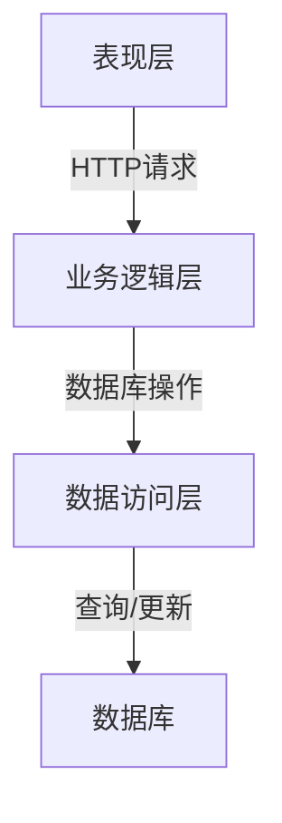
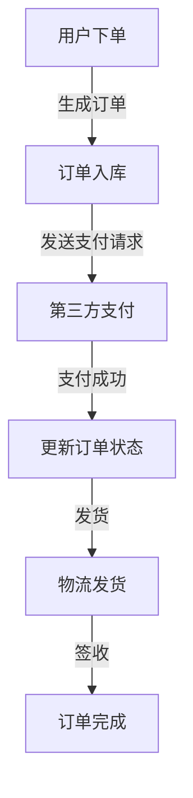

# 在线图书销售系统详细设计与具体代码实现

## 1. 背景介绍

### 1.1 电子商务的兴起

随着互联网技术的不断发展和普及,电子商务(E-Commerce)已经成为现代商业活动的重要组成部分。作为传统零售业的革新,电子商务为消费者提供了更加便利、高效的购物体验,同时也为企业带来了新的商业模式和增长机会。

### 1.2 在线图书销售的需求

图书作为知识和信息的载体,在电子商务领域一直占有重要地位。相比实体书店,在线图书销售平台可以提供更加丰富的选择、更加透明的定价信息,并且不受地理位置的限制。因此,构建一个高效、可靠、用户友好的在线图书销售系统,对于满足读者的需求和促进图书销售至关重要。

## 2. 核心概念与联系

### 2.1 系统架构概览

在线图书销售系统通常采用分层架构设计,包括表现层(Presentation Layer)、业务逻辑层(Business Logic Layer)和数据访问层(Data Access Layer)。这种架构设计可以实现各层之间的松耦合,提高系统的可维护性和可扩展性。



### 2.2 核心功能模块

一个完整的在线图书销售系统通常包括以下核心功能模块:

1. **用户管理模块**: 负责用户注册、登录、个人信息管理等功能。
2. **商品管理模块**: 负责图书信息的维护、分类管理、库存管理等功能。
3. **订单管理模块**: 负责处理用户下单、支付、发货等流程。
4. **购物车模块**: 允许用户临时存储想要购买的图书,方便下单。
5. **搜索模块**: 提供基于关键词、分类等条件的图书搜索功能。
6. **评论模块**: 允许用户对购买的图书进行评论和打分。

### 2.3 关键技术

在线图书销售系统的实现涉及多种技术,包括但不限于:

- **Web开发技术**:HTML,CSS,JavaScript等前端技术,以及Java,Python,Node.js等后端开发语言和框架。
- **数据库技术**:关系型数据库(如MySQL)和NoSQL数据库(如MongoDB)。
- **缓存技术**:如Redis,Memcached等,用于提高系统响应速度。
- **搜索引擎技术**:如Elasticsearch,Solr等,用于实现高效的全文搜索。
- **消息队列技术**:如RabbitMQ,Kafka等,用于实现系统解耦和异步处理。
- **安全技术**:如加密、认证、授权等,保证系统和数据的安全性。

## 3. 核心算法原理具体操作步骤

### 3.1 商品推荐算法

为了提高用户体验和销售转化率,在线图书销售系统通常需要实现个性化的商品推荐功能。常见的推荐算法包括:

#### 3.1.1 协同过滤算法(Collaborative Filtering)

协同过滤算法基于用户之间的相似性,为目标用户推荐与其他相似用户喜欢的商品。该算法分为两种主要类型:

1. **基于用户的协同过滤(User-based Collaborative Filtering,UCF)**

   - 计算用户之间的相似度,通常使用余弦相似度、皮尔逊相关系数等。
   - 根据目标用户与其他用户的相似度,推荐相似用户喜欢的商品。

   算法步骤:

   ```
   1) 构建用户商品评分矩阵
   2) 计算任意两个用户之间的相似度
   3) 取出与目标用户相似度较高的 K 个用户,称为最近邻
   4) 对每个商品,计算目标用户的可能评分,即最近邻对该商品评分的加权平均值
   5) 推荐给目标用户可能评分较高的商品
   ```

2. **基于物品的协同过滤(Item-based Collaborative Filtering,ICF)**

   - 计算物品之间的相似度,通常使用余弦相似度等。
   - 根据目标用户喜欢的物品,推荐与这些物品相似的其他物品。

   算法步骤:

   ```
   1) 构建用户商品评分矩阵
   2) 计算任意两个商品之间的相似度
   3) 对目标用户没有评分的商品,计算可能的评分,即该用户已评分的相似商品评分的加权平均值
   4) 推荐给目标用户可能评分较高的商品
   ```

#### 3.1.2 基于内容的推荐算法(Content-based Recommendation)

基于内容的推荐算法根据用户过去喜欢的商品内容(如书籍类型、主题等),推荐与之相似的商品。

算法步骤:

```
1) 提取商品内容特征,构建商品特征向量
2) 计算任意两个商品特征向量之间的相似度
3) 根据目标用户过去喜欢的商品,推荐与这些商品内容相似的其他商品
```

#### 3.1.3 混合推荐算法

混合推荐算法结合了协同过滤和基于内容的推荐算法,试图克服它们各自的缺陷,提高推荐的准确性和覆盖范围。

### 3.2 全文搜索算法

在线图书销售系统需要支持对图书信息(如书名、作者、出版社等)进行全文搜索。常见的全文搜索算法包括:

#### 3.2.1 倒排索引(Inverted Index)

倒排索引是一种将文档与其包含的词条相关联的数据结构,可以高效地实现全文搜索。

算法步骤:

```
1) 对文档进行分词(Tokenization)和标准化(Normalization)处理
2) 构建词条到文档的映射(Posting List),即倒排索引
3) 搜索时,根据查询词条从倒排索引中获取包含该词条的文档列表
4) 对文档列表进行合并、排序、评分等操作,返回最终结果
```

#### 3.2.2 BM25算法

BM25是一种常用的文本相关性评分算法,可用于对搜索结果进行排序。

BM25公式:

$$
\mathrm{score}(D,Q) = \sum_{q\in Q} \mathrm{IDF}(q)\cdot\frac{f(q,D)\cdot(k_1+1)}{f(q,D)+k_1\cdot(1-b+b\cdot\frac{|D|}{\mathrm{avgdl}})}
$$

其中:

- $D$ 表示文档
- $Q$ 表示查询
- $f(q,D)$ 表示词条 $q$ 在文档 $D$ 中出现的次数
- $|D|$ 表示文档 $D$ 的长度
- $\mathrm{avgdl}$ 表示文档集合的平均长度
- $k_1$ 和 $b$ 是调节因子,用于控制词条频率和文档长度的影响

#### 3.2.3 综合评分

全文搜索结果的最终排序通常需要综合考虑多种因素,如文本相关性评分(BM25)、图书销量、评分等,并对这些因素进行加权求和,得到最终的综合评分。

### 3.3 订单处理流程

在线图书销售系统的订单处理流程通常包括以下步骤:



1. **用户下单**: 用户在购物车中选择图书,提交订单信息。
2. **订单入库**: 系统生成订单记录,并将其存储到数据库中。
3. **发送支付请求**: 系统调用第三方支付平台(如支付宝、微信支付等)的接口,发起支付请求。
4. **第三方支付**: 用户在第三方支付平台完成支付流程。
5. **更新订单状态**: 支付成功后,系统更新订单状态为"待发货"。
6. **发货**: 系统通知仓库发货,并将订单状态更新为"已发货"。
7. **物流发货**: 物流公司安排运输并递送货物。
8. **订单完成**: 用户签收货物后,订单状态更新为"已完成"。

在整个流程中,系统需要及时更新订单状态,并通过消息队列或其他机制通知相关方(如用户、仓库、物流公司等)。

## 4. 数学模型和公式详细讲解举例说明

### 4.1 协同过滤算法中的相似度计算

在协同过滤推荐算法中,计算用户或物品之间的相似度是一个关键步骤。常用的相似度计算方法包括:

#### 4.1.1 余弦相似度(Cosine Similarity)

余弦相似度用于计算两个向量之间的夹角余弦值,范围在 $[-1,1]$ 之间。两个向量越相似,余弦值越接近 $1$。

对于两个向量 $\vec{a}$ 和 $\vec{b}$,余弦相似度计算公式为:

$$
\mathrm{sim}(\vec{a},\vec{b}) = \cos(\theta) = \frac{\vec{a}\cdot\vec{b}}{\|\vec{a}\|\|\vec{b}\|} = \frac{\sum_{i=1}^{n}a_ib_i}{\sqrt{\sum_{i=1}^{n}a_i^2}\sqrt{\sum_{i=1}^{n}b_i^2}}
$$

其中 $n$ 表示向量维度, $\theta$ 为两个向量之间的夹角。

在协同过滤算法中,我们可以将用户对商品的评分表示为一个向量,然后计算任意两个用户(或商品)向量之间的余弦相似度,作为相似度评估标准。

#### 4.1.2 皮尔逊相关系数(Pearson Correlation Coefficient)

皮尔逊相关系数用于衡量两个变量之间的线性相关程度,范围在 $[-1,1]$ 之间。两个变量越相关,绝对值越接近 $1$。

对于两个变量 $X$ 和 $Y$,皮尔逊相关系数计算公式为:

$$
\rho_{X,Y} = \frac{\mathrm{cov}(X,Y)}{\sigma_X\sigma_Y} = \frac{\sum_{i=1}^{n}(x_i-\overline{x})(y_i-\overline{y})}{\sqrt{\sum_{i=1}^{n}(x_i-\overline{x})^2}\sqrt{\sum_{i=1}^{n}(y_i-\overline{y})^2}}
$$

其中 $\mathrm{cov}(X,Y)$ 表示 $X$ 和 $Y$ 的协方差, $\sigma_X$ 和 $\sigma_Y$ 分别表示 $X$ 和 $Y$ 的标准差, $\overline{x}$ 和 $\overline{y}$ 分别表示 $X$ 和 $Y$ 的均值。

在基于用户的协同过滤算法中,我们可以将两个用户对相同商品的评分视为两个变量,计算它们的皮尔逊相关系数作为相似度评估标准。

### 4.2 BM25算法中的文本相关性评分

在全文搜索中,BM25算法用于计算文档与查询之间的相关性评分。BM25公式如下:

$$
\mathrm{score}(D,Q) = \sum_{q\in Q} \mathrm{IDF}(q)\cdot\frac{f(q,D)\cdot(k_1+1)}{f(q,D)+k_1\cdot(1-b+b\cdot\frac{|D|}{\mathrm{avgdl}})}
$$

其中各项含义如下:

- $D$ 表示文档
- $Q$ 表示查询
- $f(q,D)$ 表示词条 $q$ 在文档 $D$ 中出现的次数
- $\mathrm{IDF}(q)$ 表示词条 $q$ 的逆向文档频率(Inverse Document Frequency),计算公式为 $\mathrm{IDF}(q) = \log\frac{N-n_q+0.5}{n_q+0.5}$,其中 $N$ 表示文档总数,  $n_q$ 表示包含词条 $q$ 的文档数
- $|