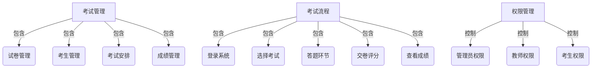

# 在线考试系统详细设计与具体代码实现

## 1. 背景介绍

在当今教育领域中,在线考试系统已经成为一种广泛应用的解决方案。它提供了一种高效、便捷的考试管理和评分方式,可以减轻教师的工作负担,同时为学生提供更加公平、客观的考试环境。传统的纸质考试存在着诸多不足,例如成本高昂、管理复杂、评分耗时等问题。而在线考试系统则可以有效解决这些问题,提高教育质量和效率。

### 1.1 传统考试系统的局限性

传统的纸质考试系统存在以下几个主要缺陷:

- **高成本**: 制作试卷、印刷、分发和回收需要大量的人力和物力成本。
- **管理复杂**: 需要安排专门的人员负责试卷的保管、分发和回收,工作量大。
- **评分耗时**: 教师需要手动阅卷,评分过程冗长且容易出现主观失误。
- **缺乏安全性**: 纸质试卷容易被泄露,无法有效防止作弊行为。
- **环境不友好**: 大量使用纸张,不利于环境保护。

### 1.2 在线考试系统的优势

相比之下,在线考试系统具有以下显著优势:

- **低成本**: 无需印刷和分发试卷,可大幅降低成本。
- **高效管理**: 系统自动管理考试流程,减轻教师工作量。
- **快速评分**: 系统可自动评分,结果即时呈现,提高效率。
- **安全可靠**: 采用加密技术保证试题安全,有效防止作弊。
- **环保节能**: 无纸化操作,减少资源浪费,更加环保。

因此,在线考试系统不仅能够提高教育质量和效率,同时也符合当前的环保理念和可持续发展的要求。

## 2. 核心概念与联系

在线考试系统涉及多个核心概念,它们之间存在着密切的联系。理解这些概念及其关系对于系统的设计和实现至关重要。

### 2.1 考试管理

考试管理是在线考试系统的核心功能之一,包括以下几个主要方面:

- **试卷管理**: 创建、编辑、预览和发布试卷。
- **考生管理**: 维护考生信息,分配考试权限。
- **考试安排**: 设置考试时间、地点和相关规则。
- **成绩管理**: 记录和查询考生成绩,生成成绩报告。

### 2.2 考试流程

考试流程描述了考试的全过程,包括以下几个关键步骤:

1. **登录系统**: 考生使用唯一的身份证明(如学号)登录系统。
2. **选择考试**: 考生从可考试列表中选择指定的考试。
3. **答题环节**: 考生在规定的时间内完成答题。
4. **交卷评分**: 考生交卷后,系统自动评分并记录成绩。
5. **查看成绩**: 考生可查看本次考试的成绩和答案解析。

### 2.3 权限管理

为确保系统安全可靠,需要对不同角色的用户进行权限管理:

- **管理员**: 拥有最高权限,可管理整个系统的所有内容。
- **教师**: 可创建和管理考试,查看考生成绩。
- **考生**: 仅可参加分配的考试,查看个人成绩。

### 2.4 核心关系

上述核心概念之间存在着紧密的关系,如下所示:



## 3. 核心算法原理具体操作步骤

在线考试系统涉及多种算法和技术,其中最核心的是自动评分算法和加密技术。

### 3.1 自动评分算法

自动评分算法是在线考试系统的核心功能之一,它能够根据预设的评分规则和答案,对考生的答卷进行自动评分。这不仅大大提高了评分效率,而且确保了评分结果的客观性和一致性。

自动评分算法的基本原理如下:

1. **答案模板**: 系统事先存储每个题目的标准答案模板。
2. **文本比对**: 将考生的答案与标准答案模板进行文本比对。
3. **打分规则**: 根据预设的打分规则(如扣分项、分值分配等)计算得分。
4. **总分汇总**: 将每个题目的分数累加,得到考生的总分。

对于选择题、判断题等客观题,评分过程相对简单。但对于主观题(如问答题、编程题等),则需要采用更加复杂的算法,例如基于关键词的匹配算法、语义相似度计算算法等。

以下是一个基于关键词匹配的自动评分算法示例:

```python
def auto_grade(student_answer, answer_template, keywords):
    """
    自动评分算法
    :param student_answer: 学生答案
    :param answer_template: 标准答案模板
    :param keywords: 关键词列表
    :return: 得分
    """
    score = 0
    for keyword in keywords:
        if keyword in student_answer:
            score += 1
    return score / len(keywords) * 100
```

该算法的基本思路是:

1. 将标准答案模板中的关键信息提取为关键词列表。
2. 检查学生答案中是否包含这些关键词。
3. 根据匹配的关键词数量,按比例计算得分。

虽然这是一个简化版本的算法,但它展示了自动评分的基本原理。在实际系统中,还需要考虑更多因素,如语序、语义、上下文等,以提高评分的准确性。

### 3.2 加密技术

为确保在线考试系统的安全性,需要采用加密技术来保护试题和考生答案的机密性。常用的加密技术包括对称加密算法(如AES)和非对称加密算法(如RSA)。

以AES对称加密算法为例,其加密和解密过程如下:

**加密过程**:

1. 生成密钥: $$key = generateKey(keySize)$$
2. 初始化向量: $$iv = generateIV(ivSize)$$ 
3. 加密明文: $$ciphertext = encrypt(plaintext, key, iv)$$

**解密过程**:

1. 解密密文: $$plaintext = decrypt(ciphertext, key, iv)$$

其中,`generateKey`和`generateIV`函数用于生成密钥和初始化向量,`encrypt`和`decrypt`函数分别执行加密和解密操作。

在实际应用中,我们可以使用加密库(如PyCrypto)来实现加密和解密功能,示例代码如下:

```python
from Crypto.Cipher import AES

# 加密函数
def encrypt(plaintext, key):
    cipher = AES.new(key, AES.MODE_ECB)
    return cipher.encrypt(pad(plaintext))

# 解密函数
def decrypt(ciphertext, key):
    cipher = AES.new(key, AES.MODE_ECB)
    return unpad(cipher.decrypt(ciphertext))
```

在上述代码中,我们使用了AES的ECB(电子密码本)模式进行加密和解密。`pad`和`unpad`函数用于填充和移除填充数据,以确保明文长度符合算法要求。

通过采用加密技术,我们可以有效防止试题和答案在传输和存储过程中被窃取或篡改,从而保证在线考试系统的安全性和可靠性。

## 4. 数学模型和公式详细讲解举例说明

在自动评分算法中,我们需要量化考生答案与标准答案之间的相似度,以确定得分。这可以通过数学模型和公式来实现。

### 4.1 编辑距离

编辑距离(Edit Distance)是一种常用的文本相似度度量方法,它表示将一个字符串转换为另一个字符串所需的最小编辑操作次数。常见的编辑操作包括插入、删除和替换字符。

编辑距离的计算公式如下:

$$
ED(x, y) = \begin{cases}
0 & \text{if } x = y = \empty \\
|x| & \text{if } y = \empty \\
|y| & \text{if } x = \empty \\
\min\begin{cases}
ED(x[:-1], y) + 1 \\
ED(x, y[:-1]) + 1 \\
ED(x[:-1], y[:-1]) + d(x[-1], y[-1])
\end{cases} & \text{otherwise}
\end{cases}
$$

其中:

- $x$和$y$分别表示两个字符串
- $d(x[-1], y[-1])$是一个指示函数,当$x$的最后一个字符与$y$的最后一个字符不同时,它的值为1,否则为0。

我们可以基于编辑距离计算出两个字符串的相似度得分:

$$
\text{Similarity Score} = 1 - \frac{ED(x, y)}{\max(|x|, |y|)}
$$

相似度得分的取值范围为$[0, 1]$,值越大表示两个字符串越相似。

以下是一个Python实现的编辑距离算法示例:

```python
def edit_distance(s1, s2):
    m, n = len(s1), len(s2)
    dp = [[0] * (n + 1) for _ in range(m + 1)]
    
    for i in range(m + 1):
        dp[i][0] = i
    for j in range(n + 1):
        dp[0][j] = j
    
    for i in range(1, m + 1):
        for j in range(1, n + 1):
            if s1[i - 1] == s2[j - 1]:
                dp[i][j] = dp[i - 1][j - 1]
            else:
                dp[i][j] = 1 + min(dp[i - 1][j], dp[i][j - 1], dp[i - 1][j - 1])
    
    return dp[m][n]
```

在自动评分算法中,我们可以将考生答案与标准答案模板进行比对,计算出编辑距离,并根据相似度得分进行评分。

### 4.2 TF-IDF

TF-IDF(Term Frequency-Inverse Document Frequency)是一种常用的文本特征提取和表示方法,它可以有效地量化一个词对于文本的重要程度。在自动评分算法中,我们可以利用TF-IDF来捕捉考生答案和标准答案之间的语义相关性。

TF-IDF的计算公式如下:

$$
\text{TF-IDF}(t, d, D) = \text{TF}(t, d) \times \text{IDF}(t, D)
$$

其中:

- $\text{TF}(t, d)$表示词$t$在文档$d$中出现的频率,可以使用原始计数或对数计数。
- $\text{IDF}(t, D)$表示词$t$的逆文档频率,用于量化词$t$的重要性,计算公式为:

$$
\text{IDF}(t, D) = \log \frac{|D|}{|\{d \in D: t \in d\}|}
$$

其中$|D|$表示语料库中文档的总数,$|\{d \in D: t \in d\}|$表示包含词$t$的文档数量。

在自动评分算法中,我们可以将考生答案和标准答案模板分别表示为TF-IDF向量,然后计算两个向量之间的余弦相似度,作为评分的依据。

余弦相似度的计算公式如下:

$$
\text{Cosine Similarity}(\vec{a}, \vec{b}) = \frac{\vec{a} \cdot \vec{b}}{||\vec{a}|| \times ||\vec{b}||}
$$

其中$\vec{a}$和$\vec{b}$分别表示两个向量,$\vec{a} \cdot \vec{b}$表示向量点乘,$ ||\vec{a}||$和$||\vec{b}||$分别表示向量的范数。

余弦相似度的取值范围为$[0, 1]$,值越大表示两个向量越相似。我们可以将余弦相似度映射到评分范围内,作为考生答案的得分。

以下是一个Python实现的