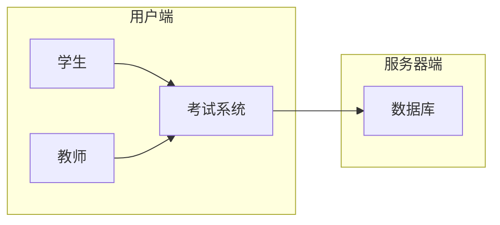

## 基于ASP的计算机组成原理考试系统详细设计与具体代码实现

作者：禅与计算机程序设计艺术

## 1. 背景介绍

### 1.1 计算机组成原理课程的意义

计算机组成原理是计算机科学与技术专业核心课程之一，是研究计算机工作原理和内部逻辑结构的一门学科。它涵盖了计算机硬件系统的各个方面，包括CPU、内存、输入输出设备等，以及它们之间的相互联系和工作机制。学习计算机组成原理，对于理解计算机系统的工作原理、设计和实现计算机系统、提高计算机系统性能等方面具有重要意义。

### 1.2 传统的考试方式的不足

传统的计算机组成原理考试方式主要以笔试为主，存在以下不足：

* **难以全面考察学生的实际操作能力：** 笔试只能考察学生对理论知识的掌握程度，无法考察学生对实际操作的掌握程度，例如汇编语言编程、硬件调试等。
* **出题和阅卷工作量大：** 传统的笔试需要教师花费大量时间和精力进行出题和阅卷，效率低下。
* **难以进行个性化评估：** 传统的笔试难以根据学生的个体差异进行个性化评估，例如针对不同基础的学生设置不同难度的题目。

### 1.3 在线考试系统的优势

为了解决传统考试方式的不足，开发基于ASP的计算机组成原理在线考试系统具有以下优势：

* **全面考察学生的综合能力：** 在线考试系统可以结合多种题型，例如选择题、填空题、编程题、仿真实验等，全面考察学生的理论知识和实际操作能力。
* **提高考试效率：** 在线考试系统可以实现自动出题、阅卷和评分，大大提高考试效率。
* **实现个性化评估：** 在线考试系统可以根据学生的个体差异，例如学习进度、知识掌握程度等，进行个性化评估，例如推荐相应的学习资源、调整考试难度等。

## 2. 核心概念与联系

### 2.1 ASP技术

ASP（Active Server Pages）是微软公司开发的服务器端脚本环境，可以用来创建动态网页。ASP可以使用VBScript或JScript等脚本语言编写，可以访问数据库、文件系统等服务器资源，可以生成HTML、XML等格式的内容。

### 2.2 数据库技术

数据库是用于存储和管理数据的软件系统。本系统采用关系型数据库，例如MySQL、SQL Server等，用于存储用户信息、考试题目、考试成绩等数据。

### 2.3 考试系统功能模块

本系统主要包括以下功能模块：

* **用户管理模块：** 用于管理用户信息，包括学生、教师等。
* **题目管理模块：** 用于管理考试题目，包括添加、删除、修改、查询等操作。
* **考试管理模块：** 用于管理考试信息，包括创建考试、设置考试时间、发布考试等操作。
* **成绩管理模块：** 用于管理考试成绩，包括查询成绩、统计分析等操作。

### 2.4 系统架构图



## 3. 核心算法原理具体操作步骤

### 3.1 用户登录

用户登录时，系统会根据用户输入的用户名和密码，查询数据库中用户信息表，验证用户信息是否正确。

**具体操作步骤：**

1. 用户输入用户名和密码。
2. 系统将用户名和密码发送到服务器端。
3. 服务器端查询数据库中用户信息表，验证用户信息是否正确。
4. 如果用户信息正确，则允许用户登录；否则，提示用户用户名或密码错误。

### 3.2 考试过程

学生登录后，可以选择参加考试。考试过程中，系统会随机抽取题目，并将题目显示给学生。学生完成答题后，可以提交答案。系统会自动批改答案，并记录考试成绩。

**具体操作步骤：**

1. 学生选择参加考试。
2. 系统根据考试设置，随机抽取题目。
3. 系统将题目显示给学生。
4. 学生完成答题后，提交答案。
5. 系统自动批改答案，并记录考试成绩。

### 3.3 成绩查询

学生和教师可以查询考试成绩。学生可以查询自己的考试成绩，教师可以查询所有学生的考试成绩。

**具体操作步骤：**

1. 用户选择查询成绩。
2. 系统根据用户身份，查询数据库中考试成绩表。
3. 系统将考试成绩显示给用户。

## 4. 数学模型和公式详细讲解举例说明

本系统不涉及复杂的数学模型和公式。

## 5. 项目实践：代码实例和详细解释说明

### 5.1 数据库设计

**用户信息表：**

| 字段名 | 数据类型 | 说明 |
|---|---|---|
| UserID | int | 用户ID |
| UserName | varchar(50) | 用户名 |
| Password | varchar(50) | 密码 |
| Role | int | 角色（1：学生，2：教师） |

**题目信息表：**

| 字段名 | 数据类型 | 说明 |
|---|---|---|
| QuestionID | int | 题目ID |
| QuestionType | int | 题目类型（1：选择题，2：填空题，3：编程题） |
| QuestionContent | text | 题目内容 |
| Answer | text | 答案 |

**考试信息表：**

| 字段名 | 数据类型 | 说明 |
|---|---|---|
| ExamID | int | 考试ID |
| ExamName | varchar(50) | 考试名称 |
| StartTime | datetime | 考试开始时间 |
| EndTime | datetime | 考试结束时间 |

**考试成绩表：**

| 字段名 | 数据类型 | 说明 |
|---|---|---|
| ScoreID | int | 成绩ID |
| UserID | int | 用户ID |
| ExamID | int | 考试ID |
| Score | int | 成绩 |

### 5.2 用户登录代码示例

```asp
<%
' 获取用户输入的用户名和密码
UserName = Request.Form("UserName")
Password = Request.Form("Password")

' 连接数据库
Set conn = Server.CreateObject("ADODB.Connection")
conn.Open "Provider=SQLOLEDB;Data Source=localhost;Initial Catalog=ExamSystem;User ID=sa;Password=sa"

' 查询用户信息
sql = "SELECT * FROM UserInfo WHERE UserName='" & UserName & "' AND Password='" & Password & "'"
Set rs = conn.Execute(sql)

' 验证用户信息
If Not rs.EOF Then
    ' 用户信息正确，允许用户登录
    Session("UserID") = rs("UserID")
    Session("UserName") = rs("UserName")
    Session("Role") = rs("Role")
    Response.Redirect "index.asp"
Else
    ' 用户名或密码错误，提示用户
    Response.Write "<script>alert('用户名或密码错误！');</script>"
End If

' 关闭数据库连接
rs.Close
Set rs = Nothing
conn.Close
Set conn = Nothing
%>
```

### 5.3 考试过程代码示例

```asp
<%
' 获取考试ID
ExamID = Request.QueryString("ExamID")

' 连接数据库
Set conn = Server.CreateObject("ADODB.Connection")
conn.Open "Provider=SQLOLEDB;Data Source=localhost;Initial Catalog=ExamSystem;User ID=sa;Password=sa"

' 查询考试信息
sql = "SELECT * FROM ExamInfo WHERE ExamID=" & ExamID
Set rs = conn.Execute(sql)

' 获取考试开始时间和结束时间
StartTime = rs("StartTime")
EndTime = rs("EndTime")

' 检查考试时间
If Now() < StartTime Or Now() > EndTime Then
    ' 考试时间未到或已结束，提示用户
    Response.Write "<script>alert('考试时间未到或已结束！');</script>"
Else
    ' 考试时间有效，继续考试
    ' ...
End If

' 关闭数据库连接
rs.Close
Set rs = Nothing
conn.Close
Set conn = Nothing
%>
```

## 6. 实际应用场景

本系统可以应用于各种计算机组成原理课程的考试，例如：

* 大学计算机科学与技术专业
* 软件工程专业
* 网络工程专业

## 7. 工具和资源推荐

* **ASP.NET:** 微软公司开发的Web开发平台。
* **Visual Studio:** 微软公司开发的集成开发环境。
* **SQL Server:** 微软公司开发的关系型数据库管理系统。
* **MySQL:** 开源的关系型数据库管理系统。

## 8. 总结：未来发展趋势与挑战

### 8.1 未来发展趋势

* **个性化学习和评估：** 随着人工智能技术的不断发展，在线考试系统可以更加智能地根据学生的个体差异进行个性化学习和评估。
* **虚拟仿真实验：** 虚拟仿真技术可以模拟真实的硬件环境，让学生在安全的虚拟环境中进行实验操作，提高学生的实践能力。
* **移动学习：** 随着移动设备的普及，在线考试系统可以支持移动设备访问，方便学生随时随地进行学习和考试。

### 8.2 挑战

* **安全性：** 在线考试系统需要保证考试数据的安全性和可靠性，防止数据泄露和篡改。
* **公平性：** 在线考试系统需要保证考试的公平性，防止作弊行为。
* **用户体验：** 在线考试系统需要提供良好的用户体验，方便学生进行学习和考试。

## 9. 附录：常见问题与解答

### 9.1 如何注册账号？

请联系您的教师，由教师创建您的账号。

### 9.2 如何修改密码？

登录系统后，点击“个人中心”，选择“修改密码”即可。

### 9.3 如何查询考试成绩？

登录系统后，点击“成绩查询”，选择相应的考试即可查询成绩。
