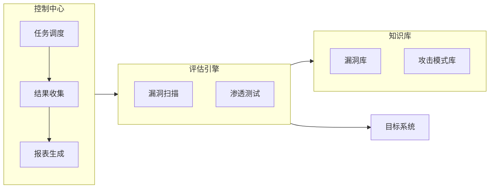

## 1. 背景介绍

### 1.1 信息安全现状与挑战

随着信息技术的飞速发展，信息安全问题日益突出。网络攻击手段不断翻新，攻击目标也从传统的网络设备扩展到服务器、数据库、应用程序等各个层面。企业和组织面临着巨大的安全压力，传统的安全防御手段已经难以应对日益复杂的网络环境。

### 1.2 远程安全评估的必要性

为了有效应对信息安全挑战，远程安全评估系统应运而生。远程安全评估系统可以对目标系统进行全面的安全扫描和漏洞分析，帮助企业及时发现安全隐患并采取相应的防御措施。与传统的安全评估方法相比，远程安全评估系统具有以下优势：

* **高效性:** 可以快速对大量目标系统进行安全评估，节省时间和人力成本。
* **全面性:** 可以覆盖目标系统各个层面，包括网络设备、服务器、数据库、应用程序等。
* **客观性:** 评估结果不受人为因素干扰，更加客观准确。

### 1.3 Java EE平台的优势

Java EE（Enterprise Edition）是Java平台的企业版，提供了一套完整的企业级应用开发解决方案。Java EE平台具有以下优势：

* **成熟稳定:** Java EE平台经过多年的发展和完善，技术成熟稳定，拥有庞大的开发者社区和丰富的技术资源。
* **可扩展性:** Java EE平台采用模块化设计，易于扩展和维护，可以满足不同规模和需求的企业级应用开发。
* **安全性:** Java EE平台提供了一系列安全机制，可以有效保障企业级应用的安全性。

## 2. 核心概念与联系

### 2.1 远程安全评估系统架构

远程安全评估系统通常采用分布式架构，主要包括以下核心组件：

* **控制中心:** 负责管理和调度整个评估过程，包括任务下发、结果收集、报表生成等。
* **评估引擎:** 负责执行具体的安全评估任务，包括漏洞扫描、渗透测试、安全审计等。
* **知识库:** 存储安全评估相关的知识和规则，例如漏洞库、攻击模式库等。
* **目标系统:** 被评估的系统，可以是网络设备、服务器、数据库、应用程序等。

### 2.2  核心概念

* **漏洞:** 指系统中存在的安全缺陷，攻击者可以利用漏洞入侵系统，窃取数据或破坏系统。
* **攻击:** 指攻击者利用系统漏洞进行的恶意行为，例如拒绝服务攻击、SQL注入攻击、跨站脚本攻击等。
* **风险:** 指系统遭受攻击的可能性及其带来的潜在损失。
* **安全策略:** 指为了保护系统安全而制定的一系列规则和措施。

### 2.3 联系

远程安全评估系统通过对目标系统进行漏洞扫描和攻击模拟，识别系统存在的安全风险，并根据安全策略给出相应的修复建议。

## 3. 核心算法原理具体操作步骤

### 3.1 漏洞扫描

漏洞扫描是远程安全评估系统的核心功能之一，其原理是利用已知的漏洞特征对目标系统进行扫描，识别系统中存在的漏洞。漏洞扫描的具体操作步骤如下：

1. **信息收集:** 收集目标系统的相关信息，例如操作系统类型、网络拓扑结构、开放端口等。
2. **漏洞匹配:** 将收集到的信息与漏洞库进行匹配，识别系统中存在的漏洞。
3. **漏洞验证:** 对匹配到的漏洞进行验证，确认漏洞是否真实存在。
4. **漏洞报告:** 生成漏洞扫描报告，列出所有发现的漏洞及其详细信息。

### 3.2 渗透测试

渗透测试是模拟攻击者对目标系统进行攻击，以检验系统的安全防御能力。渗透测试的具体操作步骤如下：

1. **信息收集:** 收集目标系统的相关信息，例如网络拓扑结构、开放端口、应用程序漏洞等。
2. **攻击模拟:** 利用收集到的信息模拟攻击者对目标系统进行攻击，例如SQL注入攻击、跨站脚本攻击等。
3. **结果分析:** 分析攻击结果，评估系统的安全防御能力。
4. **安全建议:** 根据攻击结果给出相应的安全建议，帮助企业提升系统的安全防御能力。

## 4. 数学模型和公式详细讲解举例说明

### 4.1 风险评估模型

风险评估模型用于评估系统遭受攻击的可能性及其带来的潜在损失。常用的风险评估模型有：

* **CVSS (Common Vulnerability Scoring System):** 通用漏洞评分系统，用于评估漏洞的严重程度。
* **DREAD (Damage, Reproducibility, Exploitability, Affected users, Discoverability):** 风险评估模型，用于评估风险的五个方面。

### 4.2 CVSS评分计算

CVSS评分计算公式如下：

```
Base Score = f(Impact, Exploitability)
Temporal Score = Base Score * Exploitability Score * Remediation Level Score
Environmental Score = Temporal Score * (Modified Impact + Modified Exploitability)
```

其中：

* **Impact:** 漏洞对系统的影响程度。
* **Exploitability:** 漏洞利用的难易程度。
* **Exploitability Score:** 漏洞利用评分。
* **Remediation Level Score:** 修复级别评分。
* **Modified Impact:** 修改后的影响程度。
* **Modified Exploitability:** 修改后的利用难易程度。

### 4.3  举例说明

例如，某个漏洞的CVSS评分为7.5，Exploitability Score为0.85，Remediation Level Score为0.90，Modified Impact为0.75，Modified Exploitability为0.80，则该漏洞的Environmental Score为：

```
Environmental Score = 7.5 * 0.85 * 0.90 * (0.75 + 0.80) = 4.67
```

## 5. 项目实践：代码实例和详细解释说明

### 5.1 系统架构

本项目采用Java EE平台开发，系统架构如下：



### 5.2 代码实例

#### 5.2.1 漏洞扫描代码

```java
public class VulnerabilityScanner {

    private VulnerabilityDatabase vulnerabilityDatabase;

    public VulnerabilityScanner(VulnerabilityDatabase vulnerabilityDatabase) {
        this.vulnerabilityDatabase = vulnerabilityDatabase;
    }

    public List<Vulnerability> scan(TargetSystem targetSystem) {
        // 1. 信息收集
        // ...

        // 2. 漏洞匹配
        List<Vulnerability> vulnerabilities = vulnerabilityDatabase.match(targetSystem);

        // 3. 漏洞验证
        // ...

        // 4. 漏洞报告
        // ...

        return vulnerabilities;
    }
}
```

#### 5.2.2 渗透测试代码

```java
public class PenetrationTester {

    private AttackPatternDatabase attackPatternDatabase;

    public PenetrationTester(AttackPatternDatabase attackPatternDatabase) {
        this.attackPatternDatabase = attackPatternDatabase;
    }

    public PenetrationTestResult test(TargetSystem targetSystem) {
        // 1. 信息收集
        // ...

        // 2. 攻击模拟
        List<AttackResult> attackResults = attackPatternDatabase.simulate(targetSystem);

        // 3. 结果分析
        // ...

        // 4. 安全建议
        // ...

        return new PenetrationTestResult(attackResults);
    }
}
```

### 5.3 详细解释说明

* `VulnerabilityScanner` 类负责执行漏洞扫描任务，其构造函数接收一个 `VulnerabilityDatabase` 对象，用于匹配漏洞信息。
* `scan()` 方法接收一个 `TargetSystem` 对象，表示被评估的目标系统，返回一个 `List<Vulnerability>` 对象，表示扫描到的漏洞列表。
* `PenetrationTester` 类负责执行渗透测试任务，其构造函数接收一个 `AttackPatternDatabase` 对象，用于模拟攻击行为。
* `test()` 方法接收一个 `TargetSystem` 对象，表示被评估的目标系统，返回一个 `PenetrationTestResult` 对象，表示渗透测试结果。

## 6. 实际应用场景

### 6.1 企业安全评估

企业可以使用远程安全评估系统对内部网络、服务器、数据库、应用程序等进行安全评估，及时发现安全隐患并采取相应的防御措施。

### 6.2 政府机构安全评估

政府机构可以使用远程安全评估系统对关键信息基础设施进行安全评估，保障国家信息安全。

### 6.3 金融机构安全评估

金融机构可以使用远程安全评估系统对网上银行、支付系统等进行安全评估，保障金融交易安全。

## 7. 工具和资源推荐

### 7.1 漏洞扫描工具

* **Nessus:** 商业漏洞扫描工具，功能强大，支持多种操作系统和网络设备。
* **OpenVAS:** 开源漏洞扫描工具，功能较为全面，支持自定义扫描规则。

### 7.2 渗透测试工具

* **Metasploit:** 开源渗透测试框架，集成了大量的攻击模块，可以模拟各种攻击行为。
* **Burp Suite:** 商业渗透测试工具，功能强大，支持Web应用程序安全测试。

## 8. 总结：未来发展趋势与挑战

### 8.1 未来发展趋势

* **人工智能技术应用:** 将人工智能技术应用于安全评估领域，例如利用机器学习算法进行漏洞预测和攻击检测。
* **云安全评估:** 随着云计算的普及，云安全评估将成为未来的重要发展方向。
* **自动化安全评估:** 自动化安全评估可以提高评估效率，降低人工成本。

### 8.2  挑战

* **零日漏洞:** 零日漏洞是指尚未被公开的漏洞，传统的安全评估方法难以发现零日漏洞。
* **高级持续性威胁 (APT):** APT攻击是指攻击者长期潜伏在目标系统中，窃取敏感数据或破坏系统，传统的安全评估方法难以抵御APT攻击。
* **安全人才缺口:** 安全评估需要专业的技术人才，目前安全人才缺口较大。

## 9. 附录：常见问题与解答

### 9.1 如何选择合适的安全评估工具？

选择安全评估工具需要考虑以下因素：

* **功能:** 工具的功能是否满足评估需求。
* **易用性:** 工具是否易于使用和配置。
* **成本:** 工具的成本是否在预算范围内。
* **支持:** 工具是否提供技术支持。

### 9.2 如何提高安全评估的效率？

提高安全评估效率可以采取以下措施：

* **自动化:** 利用自动化工具进行漏洞扫描和渗透测试。
* **并行化:** 将评估任务分解成多个子任务，并行执行。
* **优化:** 优化评估流程，减少不必要的步骤。

### 9.3 如何应对零日漏洞？

应对零日漏洞可以采取以下措施：

* **及时更新系统补丁:** 及时更新系统补丁可以修复已知的漏洞。
* **加强安全监控:** 加强安全监控可以及时发现异常行为。
* **采用纵深防御策略:** 采用多层次的安全防御措施，可以有效抵御零日漏洞攻击。
