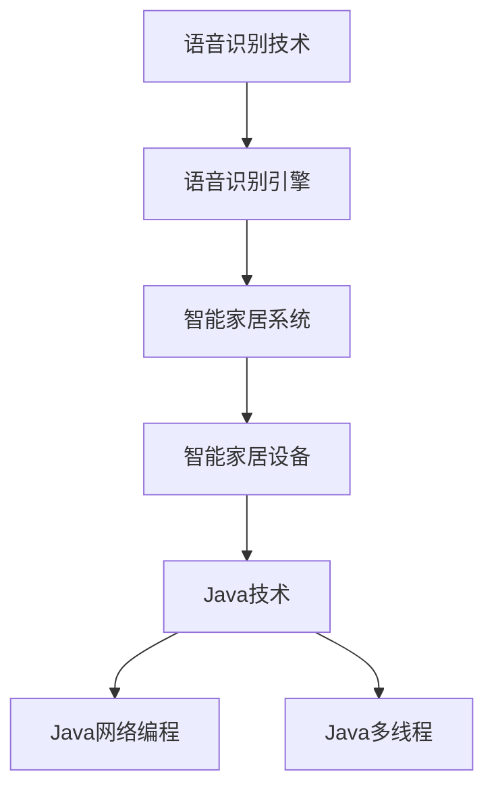
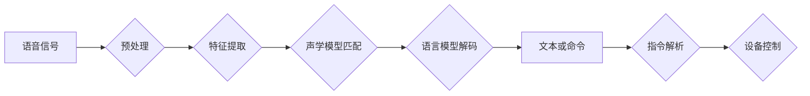

## 1. 背景介绍

### 1.1 智能家居的兴起

近年来，随着物联网、人工智能等技术的快速发展，智能家居的概念逐渐深入人心。智能家居是指利用先进的计算机技术、网络通讯技术、综合布线技术，将与家居生活相关的各种子系统有机地结合在一起，通过统筹管理，让家居生活更加舒适、安全、有效。

### 1.2 语音识别的重要性

语音识别作为人工智能领域的重要分支，近年来取得了显著的进展。将语音识别技术应用于智能家居系统，可以极大地提升用户体验，使用户能够通过自然语言与家居设备进行交互，实现更加便捷、智能的控制方式。

### 1.3 Java在智能家居开发中的优势

Java 作为一种跨平台、面向对象的编程语言，拥有丰富的类库和强大的生态系统，非常适合用于开发复杂的智能家居系统。Java 的多线程特性可以有效地处理来自多个设备的数据流，其网络编程能力可以方便地实现与云端服务器的通信，从而实现远程控制和数据分析等功能。


## 2. 核心概念与联系

### 2.1 语音识别技术

#### 2.1.1 语音识别原理

语音识别技术是指将人类语音信号转换为文本或命令的技术。其基本原理是将语音信号进行特征提取，然后与预先训练好的声学模型进行匹配，最终识别出对应的文本或命令。

#### 2.1.2 语音识别引擎

语音识别引擎是实现语音识别功能的核心组件，常见的语音识别引擎包括：

* Google Cloud Speech-to-Text
* Amazon Transcribe
* Microsoft Azure Speech Service
* 百度语音识别

### 2.2 智能家居系统

#### 2.2.1 智能家居系统架构

智能家居系统通常采用分层架构，包括：

* 感知层：负责采集各种传感器数据，例如温度、湿度、光照等。
* 网络层：负责设备之间的通信和数据传输。
* 应用层：负责处理用户指令、控制家居设备、提供各种智能化服务。

#### 2.2.2 智能家居设备

智能家居设备是指能够与智能家居系统进行交互的设备，例如：

* 智能灯泡
* 智能插座
* 智能音箱
* 智能门锁

### 2.3 Java技术

#### 2.3.1 Java网络编程

Java 提供了丰富的网络编程API，可以方便地实现与云端服务器的通信，例如：

* Socket编程
* HTTP协议
* MQTT协议

#### 2.3.2 Java多线程

Java 的多线程特性可以有效地处理来自多个设备的数据流，例如：

* 线程池
* 并发工具类

### 2.4 核心概念联系图




## 3. 核心算法原理具体操作步骤

### 3.1 语音识别流程

#### 3.1.1 语音信号预处理

对原始语音信号进行降噪、滤波等预处理操作，以提高语音识别的准确率。

#### 3.1.2 特征提取

从预处理后的语音信号中提取特征参数，例如梅尔频率倒谱系数（MFCC）。

#### 3.1.3 声学模型匹配

将提取的特征参数与预先训练好的声学模型进行匹配，识别出对应的音素。

#### 3.1.4 语言模型解码

根据音素序列和语言模型，解码出最终的文本或命令。

### 3.2 智能家居控制流程

#### 3.2.1 语音指令接收

智能家居系统接收用户通过语音助手或智能音箱发出的语音指令。

#### 3.2.2 语音识别

利用语音识别引擎将语音指令转换为文本或命令。

#### 3.2.3 指令解析

对识别出的文本或命令进行解析，提取出关键信息，例如设备名称、操作指令等。

#### 3.2.4 设备控制

根据解析出的指令，控制相应的智能家居设备执行操作。

### 3.3 核心算法流程图




## 4. 数学模型和公式详细讲解举例说明

### 4.1 隐马尔可夫模型 (HMM)

HMM 是一种统计模型，用于描述一个系统在不同状态之间转换的概率，以及在每个状态下观测到不同符号的概率。在语音识别中，HMM 常用于对语音信号进行建模。

#### 4.1.1 HMM 的基本要素

* 状态集合：表示系统可能处于的各种状态。
* 观测符号集合：表示系统可能观测到的各种符号。
* 状态转移概率矩阵：表示系统从一个状态转移到另一个状态的概率。
* 观测概率矩阵：表示在每个状态下观测到不同符号的概率。
* 初始状态概率分布：表示系统初始状态的概率分布。

#### 4.1.2 HMM 的三个基本问题

* 评估问题：给定一个 HMM 和一个观测序列，计算该观测序列出现的概率。
* 解码问题：给定一个 HMM 和一个观测序列，找到最有可能产生该观测序列的状态序列。
* 学习问题：给定一个观测序列，学习 HMM 的参数。

### 4.2 梅尔频率倒谱系数 (MFCC)

MFCC 是一种常用的语音特征参数，它模拟了人耳的听觉特性，能够有效地表征语音信号的频谱信息。

#### 4.2.1 MFCC 的计算步骤

1. 对语音信号进行分帧加窗处理。
2. 对每一帧信号进行快速傅里叶变换 (FFT)。
3. 将 FFT 频谱映射到梅尔频率尺度。
4. 对梅尔频谱进行对数运算。
5. 对对数梅尔频谱进行离散余弦变换 (DCT)。
6. 保留 DCT 系数的前 12-13 维作为 MFCC 特征参数。


## 5. 项目实践：代码实例和详细解释说明

### 5.1 项目环境搭建

#### 5.1.1 Java 开发环境

* JDK 8 或更高版本
* Eclipse 或 IntelliJ IDEA 等集成开发环境

#### 5.1.2 语音识别引擎

* Google Cloud Speech-to-Text
* Amazon Transcribe
* Microsoft Azure Speech Service
* 百度语音识别

#### 5.1.3 智能家居设备

* 智能灯泡
* 智能插座
* 智能音箱
* 智能门锁

### 5.2 代码实例

#### 5.2.1 语音识别代码

```java
import com.google.cloud.speech.v1p1beta1.RecognitionAudio;
import com.google.cloud.speech.v1p1beta1.RecognitionConfig;
import com.google.cloud.speech.v1p1beta1.RecognitionConfig.AudioEncoding;
import com.google.cloud.speech.v1p1beta1.RecognizeRequest;
import com.google.cloud.speech.v1p1beta1.RecognizeResponse;
import com.google.cloud.speech.v1p1beta1.SpeechClient;
import com.google.protobuf.ByteString;

import java.nio.file.Files;
import java.nio.file.Path;
import java.nio.file.Paths;

public class SpeechRecognitionExample {

  public static void main(String[] args) throws Exception {
    // 设置环境变量 GOOGLE_APPLICATION_CREDENTIALS
    // 指向您的 Google Cloud Platform 服务帐号密钥文件

    // 实例化 SpeechClient
    try (SpeechClient speechClient = SpeechClient.create()) {

      // 读取音频文件
      Path path = Paths.get("path/to/audio.raw");
      byte[] data = Files.readAllBytes(path);
      ByteString audioBytes = ByteString.copyFrom(data);

      // 构建 RecognitionAudio
      RecognitionAudio audio = RecognitionAudio.newBuilder()
          .setContent(audioBytes)
          .build();

      // 构建 RecognitionConfig
      RecognitionConfig config = RecognitionConfig.newBuilder()
          .setEncoding(AudioEncoding.LINEAR16)
          .setSampleRateHertz(16000)
          .setLanguageCode("zh-CN")
          .build();

      // 构建 RecognizeRequest
      RecognizeRequest request = RecognizeRequest.newBuilder()
          .setConfig(config)
          .setAudio(audio)
          .build();

      // 执行语音识别
      RecognizeResponse response = speechClient.recognize(request);

      // 打印识别结果
      response.getResultsList().forEach(result ->
          System.out.println("Transcript: " + result.getAlternativesList().get(0).getTranscript())
      );
    }
  }
}
```

#### 5.2.2 智能家居控制代码

```java
public class SmartHomeControl {

  public void controlDevice(String command) {
    // 解析语音指令
    String[] parts = command.split(" ");
    String deviceName = parts[0];
    String action = parts[1];

    // 根据设备名称和操作指令控制设备
    switch (deviceName) {
      case "灯泡":
        if (action.equals("打开")) {
          // 打开灯泡
        } else if (action.equals("关闭")) {
          // 关闭灯泡
        }
        break;
      case "插座":
        if (action.equals("打开")) {
          // 打开插座
        } else if (action.equals("关闭")) {
          // 关闭插座
        }
        break;
      // 其他设备控制逻辑
    }
  }
}
```


## 6. 实际应用场景

### 6.1 家庭自动化

通过语音控制灯光、空调、窗帘等家居设备，实现家庭自动化，提升生活舒适度。

### 6.2 安全监控

通过语音控制门锁、监控摄像头等安防设备，增强家庭安全防范能力。

### 6.3 健康管理

通过语音控制智能血压计、血糖仪等健康设备，实现健康数据的采集和管理。

### 6.4 娱乐休闲

通过语音控制智能音箱、电视等娱乐设备，享受更加便捷的娱乐休闲体验。


## 7. 工具和资源推荐

### 7.1 语音识别引擎

* Google Cloud Speech-to-Text
* Amazon Transcribe
* Microsoft Azure Speech Service
* 百度语音识别

### 7.2 智能家居平台

* Home Assistant
* OpenHAB
* Domoticz

### 7.3 Java 开发工具

* JDK
* Eclipse
* IntelliJ IDEA

### 7.4 学习资源

* Java 官方文档
* 语音识别技术博客
* 智能家居开发教程


## 8. 总结：未来发展趋势与挑战

### 8.1 未来发展趋势

* 语音识别技术的不断进步，将使得语音交互更加自然流畅。
* 智能家居设备的种类和功能将更加丰富多样。
* 智能家居系统将更加注重个性化和定制化服务。

### 8.2 面临的挑战

* 数据安全和隐私保护问题。
* 语音识别技术的鲁棒性和抗噪性问题。
* 智能家居系统的互操作性和兼容性问题。


## 9. 附录：常见问题与解答

### 9.1 如何提高语音识别的准确率？

* 降低环境噪音
* 使用高质量的麦克风
* 选择合适的语音识别引擎
* 对语音信号进行预处理

### 9.2 如何解决智能家居设备的兼容性问题？

* 选择支持标准协议的设备
* 使用智能家居平台进行统一管理
* 开发自定义的设备驱动程序

### 9.3 如何保障智能家居系统的数据安全？

* 使用加密技术保护数据传输
* 定期更新设备固件
* 加强用户身份认证
