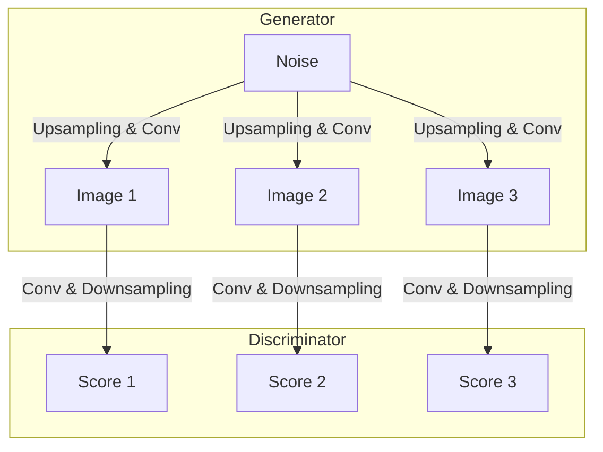
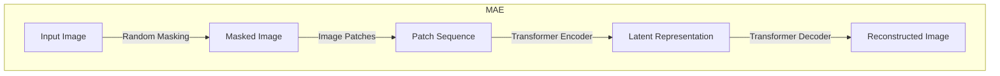

# 基于MAE的生成对抗网络新探索

## 1. 背景介绍

### 1.1 生成对抗网络概述

生成对抗网络(Generative Adversarial Networks, GANs)是一种基于深度学习的生成模型,由两个网络组成:生成器(Generator)和判别器(Discriminator)。生成器的目标是从噪声或随机向量中生成逼真的样本数据,而判别器则旨在区分生成的样本和真实数据。两个网络相互对抗,生成器试图欺骗判别器,而判别器则努力区分真伪样本。通过这种对抗过程,生成器最终能够生成非常逼真的数据。

### 1.2 MAE 模型介绍

MAE(Masked Autoencoders)是一种新型的自编码器模型,由Meta AI提出。与传统的自编码器不同,MAE在输入数据上随机遮挡一部分像素,要求模型从剩余的可见部分重建原始输入。这种遮挡机制迫使模型捕捉数据的高层次结构和语义信息,而不是简单地记忆像素值。MAE在计算机视觉和自然语言处理等领域表现出色。

### 1.3 MAE与GANs结合的动机

GANs虽然能够生成逼真的样本,但存在训练不稳定、模式崩溃等问题。另一方面,MAE展现了强大的自监督学习能力。将MAE与GANs相结合,有望提高GAN的生成质量和训练稳定性。具体来说,MAE可以作为GAN的生成器,从随机噪声生成高质量的初始样本,而判别器则判断样本的真伪并指导生成器优化。

## 2. 核心概念与联系

### 2.1 生成对抗网络(GANs)

#### 2.1.1 GANs工作原理

GANs包含两个对抗网络:生成器G和判别器D。生成器从潜在空间(如高斯噪声)采样,生成逼真的数据样本。判别器接收真实数据和生成数据作为输入,并输出一个标量,表示输入数据为真实数据的概率。

生成器和判别器相互对抗地训练。生成器G的目标是最小化log(1-D(G(z)))以欺骗判别器,而判别器D的目标是最大化log(D(x))+log(1-D(G(z)))以正确识别真伪样本。

该过程可表示为一个两人零和博弈:

$$\underset{G}{\text{min}} \, \underset{D}{\text{max}} \, V(D,G) = \mathbb{E}_{x \sim p_{\text{data}}(x)}\big[\log D(x)\big] + \mathbb{E}_{z \sim p_z(z)}\big[\log(1-D(G(z)))\big]$$

理想情况下,生成器学会模拟真实数据分布,而判别器无法区分真伪样本。

#### 2.1.2 GANs架构示例

以生成图像为例,生成器通常由全卷积网络构建,将噪声映射到图像空间。判别器则使用卷积神经网络从图像提取特征,并输出真伪概率。

### 2.2 MAE(Masked Autoencoders)

#### 2.2.1 MAE 工作原理 

MAE由编码器(Encoder)和解码器(Decoder)组成。编码器将输入数据(如图像)映射到潜在空间,解码器则从潜在表示重建原始输入。

与传统自编码器不同,MAE在输入数据上随机遮挡一部分像素,要求模型从剩余的可见部分重建完整的输入。这种遮挡机制迫使模型捕捉数据的高层次结构和语义信息,而不是简单地记忆像素值。

MAE的损失函数如下:

$$\mathcal{L} = \|x - \hat{x}\|^2$$

其中$x$是原始输入,$\hat{x}$是模型的重建输出。

#### 2.2.2 MAE 架构示例

以ViT(Vision Transformer)为例,MAE的编码器和解码器都使用Transformer结构。编码器将遮挡的图像patch序列映射到潜在空间,而解码器则从潜在表示重建原始图像patch序列。

### 2.3 MAE 与 GANs 结合

将MAE与GANs结合的关键是使用MAE作为GAN的生成器。具体来说:

1. MAE被预训练,学会从随机噪声生成高质量的初始图像。
2. 将预训练的MAE编码器冻结,仅微调解码器作为GAN的生成器。
3. 训练一个新的判别器,与MAE解码器(生成器)对抗训练。

通过这种方式,MAE为GAN提供了良好的初始化,有望提高GAN的生成质量和训练稳定性。

## 3. 核心算法原理具体操作步骤

### 3.1 MAE 预训练

1. **数据预处理**: 对训练数据(如ImageNet)进行标准化,并将图像裁剪为统一尺寸。
2. **遮挡机制**: 对输入图像随机遮挡一部分像素块(如75%)。
3. **编码器前向传播**: 将遮挡后的图像输入到MAE编码器(如ViT),获得潜在表示$z$。
4. **解码器前向传播**: 将潜在表示$z$输入到解码器,生成重建图像$\hat{x}$。
5. **计算重建损失**: 计算重建图像$\hat{x}$与原始图像$x$之间的均方差损失$\mathcal{L} = \|x - \hat{x}\|^2$。
6. **反向传播和优化**: 根据重建损失对编码器和解码器的参数进行反向传播和优化(如Adam优化器)。

通过上述过程,MAE被预训练,学会从遮挡的图像中捕捉高层次结构和语义信息,并从潜在表示重建原始图像。

### 3.2 MAE 与 GAN 对抗训练

1. **冻结MAE编码器**: 将预训练好的MAE编码器冻结,不再更新其参数。
2. **初始化判别器**: 初始化一个新的判别器网络(如卷积网络或Transformer)。
3. **生成器前向传播**: 从随机噪声$z$出发,通过MAE解码器(作为生成器)生成样本图像$G(z)$。
4. **判别器前向传播**: 将生成的样本图像$G(z)$和真实图像$x$输入到判别器,获得对应的真伪分数$D(G(z))$和$D(x)$。
5. **计算判别器损失**: 计算判别器损失$\log(D(x))+\log(1-D(G(z)))$。
6. **计算生成器损失**: 计算生成器损失$\log(1-D(G(z)))$。
7. **反向传播和优化**:
    - 更新判别器参数,最小化判别器损失。
    - 更新生成器参数(即MAE解码器),最小化生成器损失。
8. **重复训练**: 重复步骤3-7,直到模型收敛。

通过上述对抗训练过程,MAE解码器(生成器)学会生成更加逼真的图像样本,而判别器也变得更加强大,能够更好地区分真伪样本。

## 4. 数学模型和公式详细讲解举例说明

### 4.1 生成对抗网络损失函数

GANs的目标是训练一个生成器$G$,使其生成的样本$G(z)$无法与真实数据$x$区分开来。这可以表示为一个两人零和博弈:

$$\underset{G}{\text{min}} \, \underset{D}{\text{max}} \, V(D,G) = \mathbb{E}_{x \sim p_{\text{data}}(x)}\big[\log D(x)\big] + \mathbb{E}_{z \sim p_z(z)}\big[\log(1-D(G(z)))\big]$$

其中:

- $D(x)$表示判别器对真实样本$x$的输出分数(即$x$为真实数据的概率)。
- $D(G(z))$表示判别器对生成器生成的样本$G(z)$的输出分数(即$G(z)$为真实数据的概率)。
- $p_{\text{data}}(x)$是真实数据的分布。
- $p_z(z)$是生成器输入噪声$z$的分布(通常是高斯或均匀分布)。

判别器$D$的目标是最大化上式,即最大化对真实数据的识别概率$\log D(x)$,同时最小化对生成数据的识别概率$\log(1-D(G(z)))$。

生成器$G$的目标则是最小化上式,即最小化$\log(1-D(G(z)))$,使生成的样本$G(z)$能够欺骗判别器,被判别为真实数据。

通过这种对抗训练,生成器和判别器相互提升,直到生成器学会模拟真实数据分布。

### 4.2 MAE 重建损失函数

MAE的目标是从遮挡的输入数据中重建原始完整数据。重建损失函数定义如下:

$$\mathcal{L} = \|x - \hat{x}\|^2$$

其中:

- $x$是原始输入数据(如图像)。
- $\hat{x}$是MAE模型的重建输出。
- $\|\cdot\|^2$表示均方差(Mean Squared Error, MSE)。

MAE模型被训练时,会最小化这个重建损失函数,使重建的输出$\hat{x}$尽可能接近原始输入$x$。

为了计算重建损失,MAE会首先对输入数据$x$进行随机遮挡,获得遮挡后的输入$x_m$。然后,将$x_m$输入到编码器,获得潜在表示$z$;再将$z$输入到解码器,生成重建输出$\hat{x}$。最后,计算$x$和$\hat{x}$之间的均方差作为重建损失。

通过最小化这个重建损失,MAE被训练来从遮挡的输入中捕捉高层次结构和语义信息,而不是简单地记忆像素值。这种自监督预训练方式使MAE能够生成高质量的初始图像,为后续与GAN的结合提供了良好的基础。

### 4.3 实例和公式说明

假设我们有一个32x32的灰度图像作为输入$x$,MAE会随机遮挡其中75%的像素块。假设遮挡后的图像为$x_m$,编码器将其映射到一个128维的潜在表示$z$,解码器则从$z$重建出原始图像$\hat{x}$。

现在,我们来计算重建损失$\mathcal{L}$:

$$\mathcal{L} = \|x - \hat{x}\|^2 = \sum_{i=1}^{32}\sum_{j=1}^{32}(x_{i,j} - \hat{x}_{i,j})^2$$

其中$x_{i,j}$和$\hat{x}_{i,j}$分别表示原始图像和重建图像在$(i,j)$位置的像素值。

假设原始图像$x$和重建图像$\hat{x}$的像素值分布如下:

$$x = \begin{bmatrix}
0.2 & 0.1 & \cdots & 0.3\\
0.4 & 0.5 & \cdots & 0.2\\
\vdots & \vdots & \ddots & \vdots\\
0.1 & 0.3 & \cdots & 0.4
\end{bmatrix}, \quad
\hat{x} = \begin{bmatrix}
0.18 & 0.12 & \cdots & 0.28\\
0.42 & 0.51 & \cdots & 0.23\\
\vdots & \vdots & \ddots & \vdots\\
0.09 & 0.31 & \cdots & 0.38
\end{bmatrix}$$

那么,重建损失$\mathcal{L}$可以计算为:

$$\begin{align*}
\math