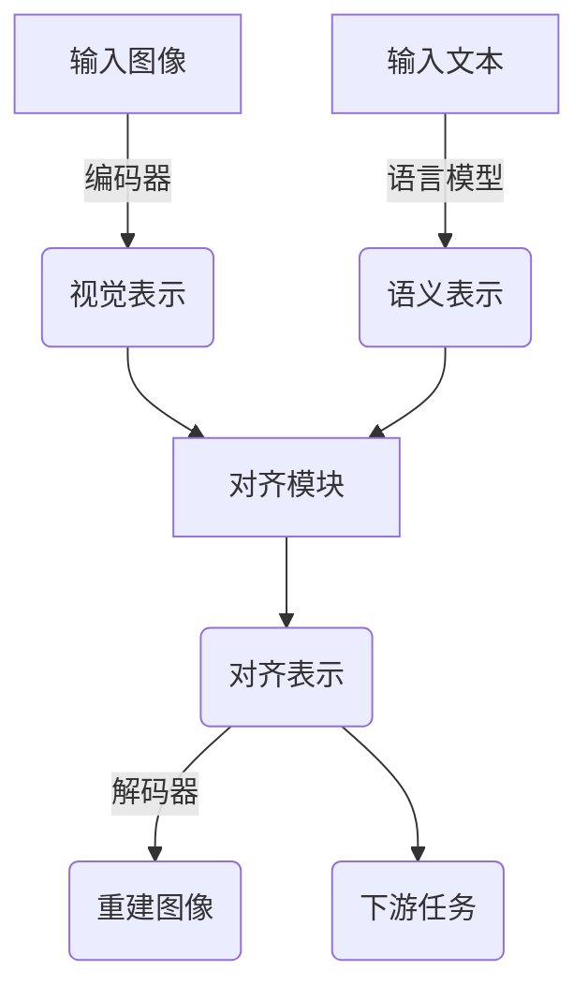

下面是关于"基于MAE的跨模态视觉语义对齐"的技术博客文章正文内容:

## 1. 背景介绍

### 1.1 引言

在当今的人工智能领域,跨模态学习(Cross-Modal Learning)备受关注。它旨在从不同模态(如图像、文本、语音等)的数据中学习统一的表示,从而实现跨模态的理解和推理。视觉语义对齐是跨模态学习的一个关键任务,它探索如何将视觉信息与语义信息对齐,以实现更好的视觉理解和描述。

最近,MAE(Masked Autoencoders)模型在计算机视觉领域取得了巨大成功,展现出强大的表现能力。本文将介绍一种基于MAE的新颖方法,用于跨模态视觉语义对齐,并探讨其原理、实现和应用。

### 1.2 跨模态学习的重要性

在现实世界中,信息通常以多种形式存在,如图像、文本、语音等。跨模态学习旨在从这些异构数据中学习统一的表示,从而实现模态之间的理解和转换。这种能力对于许多应用领域都是至关重要的,例如:

- 视觉问答(Visual Question Answering)
- 图像描述(Image Captioning)
- 视觉导航(Visual Navigation)
- 多模态对话系统(Multimodal Dialogue Systems)

通过跨模态学习,我们可以构建更智能、更通用的人工智能系统,实现人机交互的自然化和智能化。

### 1.3 视觉语义对齐的挑战

视觉语义对齐是跨模态学习中一个具有挑战性的任务。它需要将视觉信息(如图像)与语义信息(如文本描述)对齐,以实现更好的视觉理解和描述。这个过程面临以下几个主要挑战:

1. **模态差异**: 视觉和语义信息属于不同的模态,具有不同的表示形式和特征空间。如何有效地将它们对齐是一个挑战。

2. **语义鸿沟**: 视觉和语义信息之间存在一定的语义鸿沟,需要建立有效的映射关系来实现对齐。

3. **上下文理解**: 视觉理解和语义描述需要考虑上下文信息,如场景、物体关系等,这增加了对齐的复杂性。

4. **数据稀缺**: 高质量的视觉语义对齐数据集通常是稀缺的,这限制了模型的训练和性能。

为了解决这些挑战,研究人员提出了各种视觉语义对齐方法,包括基于注意力机制、对比学习、知识蒸馏等技术。本文将介绍一种基于MAE的新颖方法,展示其在解决这些挑战方面的优势。

## 2. 核心概念与联系

### 2.1 MAE(Masked Autoencoders)

MAE(Masked Autoencoders)是一种最近在计算机视觉领域取得巨大成功的自监督学习模型。它的核心思想是通过对输入图像的一部分进行掩码,然后训练模型重建被掩码的部分,从而学习到有效的视觉表示。

MAE模型由两个主要部分组成:

1. **编码器(Encoder)**: 将输入图像映射到一个压缩的潜在空间表示。

2. **解码器(Decoder)**: 从潜在空间表示重建原始图像,尤其是被掩码的部分。

在训练过程中,模型会随机掩码输入图像的一部分,然后尝试重建被掩码的部分。通过这种自监督的方式,模型可以学习到视觉数据的丰富表示,而无需大量的人工标注数据。

MAE模型在各种计算机视觉任务上表现出色,如图像分类、目标检测、语义分割等。它展现了强大的视觉理解能力,这使得它成为一个很好的候选模型,用于解决视觉语义对齐的挑战。

### 2.2 视觉语义对齐与MAE

将MAE模型应用于视觉语义对齐任务需要解决一个关键问题:如何将视觉表示与语义表示对齐?本文提出的方法是利用MAE模型的编码器和解码器,构建一个统一的框架,实现视觉和语义信息的对齐。

具体来说,我们将图像输入到MAE的编码器中,获得其视觉表示。同时,我们将文本描述输入到一个语言模型中,获得其语义表示。然后,我们设计一个对齐模块,将这两种表示对齐,使它们在同一个潜在空间中具有相似的表示。

在训练过程中,我们不仅优化MAE模型的重建损失,还优化视觉语义对齐的损失函数,以最小化视觉表示和语义表示之间的距离。通过这种联合优化,模型可以学习到跨模态的统一表示,从而实现更好的视觉语义对齐。

该方法的优势在于:

1. **利用MAE的强大视觉表示能力**: MAE模型已经展现出优秀的视觉理解能力,我们可以充分利用这一优势。

2. **统一的跨模态表示空间**: 通过对齐,视觉和语义信息可以在同一个潜在空间中表示,实现跨模态的理解和推理。

3. **端到端的联合训练**: 整个模型可以端到端地联合训练,实现视觉和语义信息的有效融合。

4. **无需大量人工标注数据**: MAE模型的自监督学习特性使其无需大量人工标注数据,这为视觉语义对齐任务提供了一种有效的解决方案。

在接下来的章节中,我们将详细介绍该方法的核心算法原理、数学模型、项目实践、应用场景等内容。

## 3. 核心算法原理具体操作步骤

### 3.1 模型架构

基于MAE的视觉语义对齐模型的整体架构如下所示:

该模型由以下几个主要模块组成:

1. **编码器(Encoder)**: 基于MAE模型的编码器,用于将输入图像编码为视觉表示。

2. **语言模型(Language Model)**: 用于将输入文本编码为语义表示,可以使用预训练的语言模型,如BERT、GPT等。

3. **对齐模块(Alignment Module)**: 将视觉表示和语义表示对齐到同一个潜在空间中,实现跨模态的统一表示。

4. **解码器(Decoder)**: 基于MAE模型的解码器,用于从对齐表示中重建原始图像。

5. **下游任务(Downstream Tasks)**: 利用对齐表示执行各种下游任务,如视觉问答、图像描述等。

在训练过程中,模型会同时优化以下几个损失函数:

1. **重建损失(Reconstruction Loss)**: 衡量解码器重建图像与原始图像之间的差异。

2. **对齐损失(Alignment Loss)**: 衡量视觉表示和语义表示之间的距离,以最小化它们之间的差异。

3. **下游任务损失(Downstream Task Loss)**: 根据具体的下游任务,定义相应的损失函数,如交叉熵损失等。

通过联合优化这些损失函数,模型可以同时学习视觉理解、语义理解和跨模态对齐,从而实现更好的视觉语义对齐能力。

### 3.2 对齐模块

对齐模块是该模型的核心部分,它负责将视觉表示和语义表示对齐到同一个潜在空间中。我们可以使用多种对齐策略,如对比学习、知识蒸馏等。下面以对比学习为例,介绍对齐模块的具体实现。

对比学习是一种自监督学习方法,它通过最大化正样本对之间的相似性,最小化正样本与负样本之间的相似性,来学习有效的表示。在视觉语义对齐任务中,我们可以将视觉表示和语义表示视为一个正样本对,而将其他不相关的视觉语义对视为负样本。

具体地,我们定义一个对比损失函数,如下所示:

$$\mathcal{L}_\text{align} = -\log \frac{\exp(\text{sim}(v, t) / \tau)}{\sum_{v', t'} \exp(\text{sim}(v', t') / \tau)}$$

其中:

- $v$ 和 $t$ 分别表示视觉表示和语义表示
- $\text{sim}(v, t)$ 是视觉表示和语义表示之间的相似性函数,可以使用余弦相似度或点积
- $\tau$ 是一个温度超参数,用于控制相似性分数的缩放
- 分母部分是所有正样本和负样本对的相似性之和,用于归一化

通过最小化该对比损失函数,模型可以学习到一个统一的潜在空间,使得相关的视觉语义对具有高度相似的表示,而不相关的对具有不同的表示。这样就实现了视觉和语义信息的有效对齐。

除了对比学习,我们还可以探索其他对齐策略,如知识蒸馏、对抗训练等,以进一步提高对齐质量和模型性能。

### 3.3 训练过程

基于MAE的视觉语义对齐模型的训练过程如下:

1. **数据准备**: 准备包含图像和文本描述的数据集,如Conceptual Captions、COCO等。

2. **模型初始化**: 初始化编码器、解码器、语言模型和对齐模块的参数。可以使用预训练的MAE模型和语言模型进行初始化。

3. **前向传播**:
   a. 将输入图像通过编码器获得视觉表示。
   b. 将输入文本通过语言模型获得语义表示。
   c. 将视觉表示和语义表示输入对齐模块,获得对齐表示。
   d. 将对齐表示输入解码器,重建原始图像。

4. **损失计算**:
   a. 计算重建损失,衡量重建图像与原始图像之间的差异。
   b. 计算对齐损失,衡量视觉表示和语义表示之间的距离。
   c. 如果有下游任务,计算相应的下游任务损失。

5. **反向传播**:
   a. 计算总损失,将重建损失、对齐损失和下游任务损失加权求和。
   b. 基于总损失,计算模型参数的梯度。
   c. 使用优化器(如Adam)更新模型参数。

6. **迭代训练**:
   a. 重复步骤3-5,遍历整个训练数据集。
   b. 每隔一定epoch,在验证集上评估模型性能。
   c. 根据性能,调整超参数或采用其他优化策略。

通过上述端到端的联合训练过程,模型可以同时优化视觉理解、语义理解和跨模态对齐,从而学习到有效的跨模态表示,实现更好的视觉语义对齐能力。

## 4. 数学模型和公式详细讲解举例说明

在前面的章节中,我们介绍了基于MAE的视觉语义对齐模型的整体架构和核心算法原理。现在,让我们深入探讨该模型中涉及的一些关键数学模型和公式。

### 4.1 MAE模型

MAE(Masked Autoencoders)模型是该方法的基础,它由编码器和解码器组成。编码器将输入图像编码为一个压缩的潜在表示,而解码器则从该潜在表示重建原始图像。

在训练过程中,MAE模型会随机掩码输入图像的一部分,然后尝试重建被掩码的部分。具体地,我们定义一个重建损失函数,如下所示:

$$\mathcal{L}_\text{rec} = \|\mathbf{x} - \hat{\mathbf{x}}\|_2^2$$

其中:

- $\mathbf{x}$ 是原始输入图像
- $\hat{\mathbf{x}}$ 是解码器重建的图像
- $\|\cdot\|_2^2$ 表示平方$L_2$范数,用于衡量两个图像之间的差异

通过最小化该重