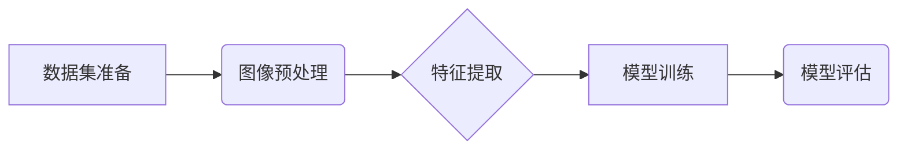

# 基于OpenCV的鲜花的图像分类系统详细设计与具体代码实现

作者：禅与计算机程序设计艺术

## 1. 背景介绍

### 1.1 图像分类问题概述

图像分类是计算机视觉领域的核心任务之一，其目标是将输入图像分配到预定义的类别集合中的一个或多个类别。近年来，随着深度学习技术的快速发展，图像分类技术取得了重大突破，并在许多领域得到广泛应用，例如：

* **安防监控:**  识别可疑人员、车辆和物体。
* **医疗诊断:**  辅助医生进行疾病诊断，例如识别肿瘤细胞。
* **自动驾驶:**  识别道路标识、行人、车辆等。
* **电子商务:**  识别商品种类、品牌、型号等。

### 1.2 鲜花图像分类的意义

鲜花是自然界中最美丽的生物之一，其种类繁多，形态各异。鲜花图像分类可以应用于以下场景：

* **花卉识别软件:**  帮助用户识别不同种类的鲜花。
* **农业自动化:**  识别不同种类的花卉，并进行自动化的种植、管理和采摘。
* **生态保护:**  监测不同种类的花卉的生长情况，并进行生态保护。

### 1.3 OpenCV简介

OpenCV (Open Source Computer Vision Library)是一个开源的计算机视觉库，它提供了丰富的图像处理和计算机视觉算法，广泛应用于图像分类、目标检测、图像分割等领域。OpenCV具有以下优点：

* **跨平台:**  支持 Windows、Linux、macOS、Android 和 iOS 等多个平台。
* **高性能:**  使用 C/C++ 编写，并针对不同的硬件平台进行了优化。
* **易于使用:**  提供 Python、Java、C++ 等多种语言的接口。

## 2. 核心概念与联系

### 2.1 图像特征提取

图像特征提取是指从图像中提取出能够代表图像内容的特征，例如颜色、纹理、形状等。常用的图像特征提取方法包括：

* **颜色直方图:**  统计图像中不同颜色出现的频率。
* **纹理特征:**  描述图像中纹理的特征，例如灰度共生矩阵 (GLCM)。
* **形状特征:**  描述图像中物体的形状，例如边缘检测、轮廓提取。

### 2.2 机器学习分类器

机器学习分类器是指利用机器学习算法训练得到的模型，可以将输入特征映射到对应的类别。常用的机器学习分类器包括：

* **支持向量机 (SVM):**  寻找一个最优超平面来划分不同类别的样本。
* **决策树:**  根据特征进行一系列的判断，最终将样本分类到对应的类别。
* **随机森林:**  由多个决策树组成，通过投票的方式进行分类。

### 2.3 OpenCV与机器学习

OpenCV 提供了丰富的图像特征提取函数，例如 `cv2.calcHist` 用于计算颜色直方图，`cv2.cvtColor` 用于转换颜色空间，`cv2.Canny` 用于边缘检测等。OpenCV 也提供了机器学习模块 `ml`，包含了多种机器学习算法的实现，例如 SVM、决策树等。

## 3. 核心算法原理具体操作步骤

### 3.1 数据集准备

首先，我们需要准备一个包含不同种类鲜花图像的数据集。数据集可以从网上下载，也可以自己拍摄。数据集应该包含足够多的样本，并且样本应该尽可能地涵盖不同种类的鲜花。

### 3.2 图像预处理

在进行特征提取之前，我们需要对图像进行预处理，例如：

* **图像缩放:**  将图像缩放至相同的大小，以便于特征提取。
* **颜色空间转换:**  将图像转换为更适合特征提取的颜色空间，例如 HSV 颜色空间。
* **图像增强:**  提高图像的对比度、亮度等，以便于特征提取。

### 3.3 特征提取

我们可以使用 OpenCV 提供的函数来提取图像特征，例如：

* **颜色直方图:**  使用 `cv2.calcHist` 函数计算颜色直方图。
* **纹理特征:**  使用 `cv2.cvtColor` 函数将图像转换为灰度图像，然后使用 `cv2.GLCM` 函数计算灰度共生矩阵。
* **形状特征:**  使用 `cv2.Canny` 函数进行边缘检测，然后使用 `cv2.findContours` 函数提取轮廓。

### 3.4 模型训练

我们将提取到的图像特征作为输入，使用机器学习算法训练分类器。我们可以使用 OpenCV 提供的 `ml` 模块来训练分类器，例如：

* **SVM:**  使用 `cv2.ml.SVM_create` 函数创建 SVM 分类器，然后使用 `train` 方法进行训练。
* **决策树:**  使用 `cv2.ml.DTrees_create` 函数创建决策树分类器，然后使用 `train` 方法进行训练。

### 3.5 模型评估

在模型训练完成后，我们需要评估模型的性能。我们可以使用测试集来评估模型的准确率、精确率、召回率等指标。

## 4. 数学模型和公式详细讲解举例说明

### 4.1 颜色直方图

颜色直方图是一种统计图像中不同颜色出现频率的方法。我们可以将颜色空间划分为若干个区间，然后统计每个区间内像素的数量。颜色直方图可以表示为：

```
h(i) = n_i / N
```

其中，`h(i)` 表示颜色区间 `i` 的像素比例，`n_i` 表示颜色区间 `i` 内的像素数量，`N` 表示图像的总像素数量。

**举例说明:**

假设我们将 RGB 颜色空间划分为 8 个区间，每个区间的大小为 32。对于一张 256x256 的图像，其颜色直方图可以表示为一个 8 维向量，每个元素表示对应颜色区间内像素的比例。

### 4.2 灰度共生矩阵

灰度共生矩阵 (GLCM) 是一种统计图像中纹理特征的方法。GLCM 是一个二维矩阵，其中每个元素表示具有特定灰度值和空间关系的像素对出现的频率。GLCM 可以表示为：

```
P(i, j | d, θ)
```

其中，`i` 和 `j` 表示像素的灰度值，`d` 表示像素之间的距离，`θ` 表示像素之间的方向。

**举例说明:**

假设我们计算距离为 1，方向为 0 度的 GLCM。对于一张 256x256 的灰度图像，其 GLCM 可以表示为一个 256x256 的矩阵，每个元素表示具有特定灰度值和空间关系的像素对出现的频率。

## 5. 项目实践：代码实例和详细解释说明

### 5.1 导入必要的库

```python
import cv2
import numpy as np
from sklearn.model_selection import train_test_split
from sklearn.svm import SVC
```

### 5.2 加载数据集

```python
# 定义数据集路径
dataset_path = 'path/to/dataset'

# 创建一个列表来存储图像数据和标签
images = []
labels = []

# 遍历数据集中的所有图像
for filename in os.listdir(dataset_path):
    # 加载图像
    img = cv2.imread(os.path.join(dataset_path, filename))

    # 提取图像标签
    label = filename.split('_')[0]

    # 将图像数据和标签添加到列表中
    images.append(img)
    labels.append(label)
```

### 5.3 图像预处理

```python
# 定义图像大小
img_size = (128, 128)

# 创建一个列表来存储预处理后的图像数据
processed_images = []

# 遍历所有图像
for img in images:
    # 缩放图像
    resized_img = cv2.resize(img, img_size)

    # 转换为 HSV 颜色空间
    hsv_img = cv2.cvtColor(resized_img, cv2.COLOR_BGR2HSV)

    # 添加到列表中
    processed_images.append(hsv_img)
```

### 5.4 特征提取

```python
# 创建一个列表来存储图像特征
features = []

# 遍历所有图像
for img in processed_images:
    # 计算颜色直方图
    hist = cv2.calcHist([img], [0, 1, 2], None, [8, 8, 8], [0, 256, 0, 256, 0, 256])
    hist = cv2.normalize(hist, hist).flatten()

    # 计算灰度共生矩阵
    gray_img = cv2.cvtColor(img, cv2.COLOR_BGR2GRAY)
    glcm = cv2.GLCM(gray_img, 1, [0], 256, symmetric=True, normed=True)
    glcm = glcm.flatten()

    # 合并特征
    feature = np.concatenate((hist, glcm))

    # 添加到列表中
    features.append(feature)
```

### 5.5 模型训练

```python
# 将数据集划分为训练集和测试集
X_train, X_test, y_train, y_test = train_test_split(features, labels, test_size=0.2, random_state=42)

# 创建 SVM 分类器
svm = SVC(kernel='linear', C=1.0)

# 训练 SVM 分类器
svm.fit(X_train, y_train)
```

### 5.6 模型评估

```python
# 使用测试集评估模型
accuracy = svm.score(X_test, y_test)

# 打印准确率
print('Accuracy:', accuracy)
```

## 6. 实际应用场景

### 6.1 花卉识别软件

我们可以将训练好的模型集成到花卉识别软件中，用户可以使用手机拍摄鲜花的图片，软件可以自动识别鲜花的种类。

### 6.2 农业自动化

在农业自动化中，我们可以使用鲜花图像分类技术来识别不同种类的花卉，并进行自动化的种植、管理和采摘。

### 6.3 生态保护

我们可以使用鲜花图像分类技术来监测不同种类的花卉的生长情况，并进行生态保护。

## 7. 工具和资源推荐

### 7.1 OpenCV

OpenCV 是一个开源的计算机视觉库，提供了丰富的图像处理和计算机视觉算法。

* **官网:**  https://opencv.org/
* **文档:**  https://docs.opencv.org/

### 7.2 scikit-learn

scikit-learn 是一个开源的机器学习库，提供了多种机器学习算法的实现。

* **官网:**  https://scikit-learn.org/
* **文档:**  https://scikit-learn.org/stable/documentation.html

## 8. 总结：未来发展趋势与挑战

### 8.1 未来发展趋势

* **深度学习:**  深度学习技术在图像分类领域取得了重大突破，未来将会得到更广泛的应用。
* **迁移学习:**  迁移学习可以将预训练的模型应用于新的任务，可以有效地提高模型的性能。
* **边缘计算:**  边缘计算可以将图像分类任务部署到边缘设备，例如手机、无人机等，可以提高实时性。

### 8.2 挑战

* **数据质量:**  图像分类模型的性能依赖于数据的质量，高质量的数据集的获取仍然是一个挑战。
* **模型泛化能力:**  图像分类模型的泛化能力仍然是一个挑战，需要不断地提高模型的鲁棒性和泛化能力。
* **计算资源:**  深度学习模型的训练需要大量的计算资源，如何降低计算成本是一个挑战。

## 9. 附录：常见问题与解答

### 9.1 如何选择合适的特征？

特征的选择取决于具体的应用场景。一般来说，颜色直方图、纹理特征和形状特征都是常用的图像特征。

### 9.2 如何选择合适的分类器？

分类器的选择取决于数据集的特点和应用场景。SVM、决策树和随机森林都是常用的分类器。

### 9.3 如何提高模型的性能？

可以通过以下方法来提高模型的性能：

* 使用更多的数据进行训练。
* 使用更复杂的模型，例如深度学习模型。
* 使用迁移学习技术。
* 对数据进行更精细的预处理。
* 对模型进行参数调优。


## 10. Mermaid流程图


