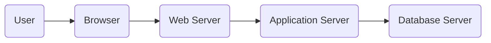

## 1. 背景介绍

### 1.1 会务管理的现状与挑战

随着社会经济的快速发展，各种类型的会议活动日益增多，会议规模也越来越大。传统的会务管理方式主要依靠人工操作，效率低下，容易出错，难以满足现代社会对会议管理的高效、便捷、安全等方面的需求。

**传统会务管理方式存在以下问题:**

* **信息管理分散:** 会议信息分散在不同的部门和人员手中，难以整合和共享。
* **人工操作效率低:** 会议报名、签到、资料发放等环节需要大量的人工操作，效率低下，容易出错。
* **数据统计分析困难:** 会议数据难以进行有效的统计和分析，无法为会议组织者提供决策支持。

### 1.2 Web技术的优势

Web技术具有跨平台、易于部署、易于维护等优势，近年来在信息管理系统中的应用越来越广泛。基于Web的会务管理系统可以有效解决传统会务管理方式存在的问题，提高会务管理效率，降低管理成本。

**Web技术在会务管理中的优势:**

* **信息集中管理:** 会议信息集中存储在服务器上，方便管理和共享。
* **自动化流程:** 会议报名、签到、资料发放等环节可以实现自动化，提高效率，减少错误。
* **数据可视化分析:** 会议数据可以进行可视化分析，为会议组织者提供决策支持。

### 1.3 系统设计目标

基于Web的会务管理系统的设计目标是构建一个高效、便捷、安全的会议管理平台，实现会议信息的集中管理、自动化流程处理、数据可视化分析等功能，为会议组织者提供全方位的服务。

## 2. 核心概念与联系

### 2.1 会务管理系统架构

基于Web的会务管理系统采用B/S架构，系统架构图如下所示：



**系统架构说明:**

* **用户:** 通过浏览器访问系统。
* **浏览器:**  负责展示系统界面，与用户交互。
* **Web服务器:** 负责接收用户请求，并将请求转发给应用服务器。
* **应用服务器:** 负责处理业务逻辑，与数据库服务器交互。
* **数据库服务器:** 负责存储系统数据。

### 2.2 核心功能模块

基于Web的会务管理系统主要包括以下功能模块：

* **会议管理:** 会议信息发布、会议报名、会议签到、会议资料管理等。
* **用户管理:** 用户注册、用户信息管理、用户权限管理等。
* **统计分析:** 会议数据统计、图表展示等。
* **系统管理:** 系统参数设置、日志管理等。

### 2.3 关键技术

基于Web的会务管理系统采用以下关键技术：

* **Java EE:** Java EE是一种企业级Java平台，提供了一系列用于开发Web应用程序的API和工具。
* **Spring Framework:** Spring Framework是一个轻量级Java开发框架，提供依赖注入、面向切面编程等功能，简化了Java EE应用程序的开发。
* **Hibernate:** Hibernate是一个对象关系映射框架，简化了Java应用程序与数据库的交互。
* **MySQL:** MySQL是一个开源的关系型数据库管理系统，用于存储系统数据。
* **HTML、CSS、JavaScript:** 用于构建系统界面和实现用户交互。

## 3. 核心算法原理具体操作步骤

### 3.1 会议报名流程

**会议报名流程如下：**

1. 用户访问系统，浏览会议信息。
2. 用户选择要报名的会议，填写报名信息。
3. 系统验证报名信息，并将报名信息保存到数据库。
4. 系统向用户发送报名成功通知。

**算法原理：**

会议报名流程采用表单提交的方式实现，用户填写报名信息后，系统会对报名信息进行验证，例如检查用户是否已经报名该会议、报名信息是否完整等。验证通过后，系统会将报名信息保存到数据库，并向用户发送报名成功通知。

**具体操作步骤：**

1. 用户在浏览器中打开会议报名页面。
2. 用户填写报名信息，包括姓名、联系方式、所属单位等。
3. 用户点击“提交”按钮。
4. 系统接收用户提交的报名信息。
5. 系统验证报名信息，例如检查用户是否已经报名该会议、报名信息是否完整等。
6. 验证通过后，系统将报名信息保存到数据库。
7. 系统向用户发送报名成功通知。

### 3.2 会议签到流程

**会议签到流程如下：**

1. 用户到场后，使用手机或电脑扫描会议二维码。
2. 系统识别用户身份，并将签到信息保存到数据库。
3. 系统向用户发送签到成功通知。

**算法原理：**

会议签到流程采用二维码扫描的方式实现，用户扫描会议二维码后，系统会根据二维码信息识别用户身份，并将签到信息保存到数据库。

**具体操作步骤：**

1. 用户到场后，使用手机或电脑扫描会议二维码。
2. 系统根据二维码信息识别用户身份。
3. 系统将签到信息保存到数据库。
4. 系统向用户发送签到成功通知。

## 4. 数学模型和公式详细讲解举例说明

本节主要介绍会务管理系统中常用的数学模型和公式，并结合实际案例进行讲解说明。

### 4.1 会议室利用率

**会议室利用率**是指会议室实际使用时间占可使用时间的比例。

**公式：**

```
会议室利用率 = 会议室实际使用时间 / 会议室可使用时间
```

**举例说明：**

某会议室每天可使用时间为8小时，某天该会议室被使用了6小时，则该会议室的利用率为：

```
会议室利用率 = 6小时 / 8小时 = 75%
```

### 4.2 会议参与率

**会议参与率**是指实际参会人数占应参会人数的比例。

**公式：**

```
会议参与率 = 实际参会人数 / 应参会人数
```

**举例说明：**

某会议应参会人数为100人，实际参会人数为80人，则该会议的参与率为：

```
会议参与率 = 80人 / 100人 = 80%
```

### 4.3 会议成本效益分析

**会议成本效益分析**是指对会议成本和效益进行分析，评估会议的经济效益。

**公式：**

```
会议效益 = 会议收益 - 会议成本
```

**举例说明：**

某会议的收益为10万元，成本为5万元，则该会议的效益为：

```
会议效益 = 10万元 - 5万元 = 5万元
```

## 5. 项目实践：代码实例和详细解释说明

本节将通过代码实例，详细解释说明会务管理系统的核心功能实现。

### 5.1 会议管理

#### 5.1.1 添加会议

**代码实例：**

```java
@Controller
public class MeetingController {

    @Autowired
    private MeetingService meetingService;

    @PostMapping("/meetings")
    public ResponseEntity<Meeting> addMeeting(@RequestBody Meeting meeting) {
        Meeting savedMeeting = meetingService.addMeeting(meeting);
        return ResponseEntity.ok(savedMeeting);
    }
}
```

**代码解释：**

* `@Controller` 注解表示这是一个控制器类，负责处理用户请求。
* `@Autowired` 注解用于自动注入 `MeetingService` 对象。
* `@PostMapping("/meetings")` 注解表示处理 POST 请求，请求路径为 `/meetings`。
* `@RequestBody Meeting meeting` 表示将请求体中的 JSON 数据转换为 `Meeting` 对象。
* `meetingService.addMeeting(meeting)` 调用 `MeetingService` 的 `addMeeting()` 方法添加会议信息。
* `ResponseEntity.ok(savedMeeting)` 返回 HTTP 状态码 200 和添加成功的会议信息。

#### 5.1.2 查询会议列表

**代码实例：**

```java
@Controller
public class MeetingController {

    @Autowired
    private MeetingService meetingService;

    @GetMapping("/meetings")
    public ResponseEntity<List<Meeting>> getMeetings() {
        List<Meeting> meetings = meetingService.getMeetings();
        return ResponseEntity.ok(meetings);
    }
}
```

**代码解释：**

* `@GetMapping("/meetings")` 注解表示处理 GET 请求，请求路径为 `/meetings`。
* `meetingService.getMeetings()` 调用 `MeetingService` 的 `getMeetings()` 方法查询所有会议信息。
* `ResponseEntity.ok(meetings)` 返回 HTTP 状态码 200 和查询到的会议列表。

### 5.2 用户管理

#### 5.2.1 用户注册

**代码实例：**

```java
@Controller
public class UserController {

    @Autowired
    private UserService userService;

    @PostMapping("/users")
    public ResponseEntity<User> addUser(@RequestBody User user) {
        User savedUser = userService.addUser(user);
        return ResponseEntity.ok(savedUser);
    }
}
```

**代码解释：**

* `@PostMapping("/users")` 注解表示处理 POST 请求，请求路径为 `/users`。
* `@RequestBody User user` 表示将请求体中的 JSON 数据转换为 `User` 对象。
* `userService.addUser(user)` 调用 `UserService` 的 `addUser()` 方法添加用户信息。
* `ResponseEntity.ok(savedUser)` 返回 HTTP 状态码 200 和添加成功的用户信息。

#### 5.2.2 用户登录

**代码实例：**

```java
@Controller
public class UserController {

    @Autowired
    private UserService userService;

    @PostMapping("/login")
    public ResponseEntity<String> login(@RequestParam String username, @RequestParam String password) {
        String token = userService.login(username, password);
        return ResponseEntity.ok(token);
    }
}
```

**代码解释：**

* `@PostMapping("/login")` 注解表示处理 POST 请求，请求路径为 `/login`。
* `@RequestParam String username, @RequestParam String password` 表示接收请求参数 `username` 和 `password`。
* `userService.login(username, password)` 调用 `UserService` 的 `login()` 方法验证用户身份，并生成 JWT token。
* `ResponseEntity.ok(token)` 返回 HTTP 状态码 200 和生成的 JWT token。

## 6. 实际应用场景

基于Web的会务管理系统可以应用于各种类型的会议活动，例如：

* **企业年会:** 用于管理企业年会的报名、签到、资料发放等环节。
* **学术会议:** 用于管理学术会议的投稿、评审、日程安排等环节。
* **培训研讨会:** 用于管理培训研讨会的报名、签到、资料下载等环节。
* **产品发布会:** 用于管理产品发布会的报名、签到、直播观看等环节。

## 7. 工具和资源推荐

### 7.1 开发工具

* **Eclipse:** 一款功能强大的 Java 集成开发环境 (IDE)。
* **IntelliJ IDEA:** 一款功能丰富的 Java IDE，提供智能代码补全、代码分析等功能。
* **Visual Studio Code:** 一款轻量级代码编辑器，支持多种编程语言，包括 Java。

### 7.2 数据库

* **MySQL:** 一款开源的关系型数据库管理系统，性能稳定，易于使用。
* **PostgreSQL:** 一款功能强大的开源关系型数据库管理系统，支持更复杂的数据类型和查询。

### 7.3 Web服务器

* **Apache Tomcat:** 一款流行的开源 Web 服务器，支持 Java Servlet 和 JavaServer Pages (JSP)。
* **Nginx:** 一款高性能 Web 服务器，常用于反向代理和负载均衡。

## 8. 总结：未来发展趋势与挑战

### 8.1 未来发展趋势

* **移动化:** 随着移动互联网的普及，会务管理系统将更加注重移动端的体验，提供移动端报名、签到、资料下载等功能。
* **智能化:** 人工智能技术将越来越多地应用于会务管理系统，例如人脸识别签到、智能客服等。
* **数据化:** 会议数据将得到更有效的利用，为会议组织者提供更精准的决策支持。

### 8.2 面临的挑战

* **数据安全:** 会议数据涉及到用户的隐私信息，如何保障数据安全是一个重要的挑战。
* **系统性能:** 随着会议规模的扩大，系统性能将面临更大的挑战。
* **用户体验:** 如何提升用户体验，让用户更方便地使用系统是一个持续的挑战。

## 9. 附录：常见问题与解答

### 9.1 如何解决会议报名人数过多导致系统崩溃的问题？

**解决方案：**

* 采用负载均衡技术，将用户请求分发到多台服务器上处理，提高系统并发处理能力。
* 优化数据库性能，例如使用缓存、索引等技术，提高数据查询效率。
* 限制报名时间段，避免短时间内大量用户同时报名。

### 9.2 如何防止用户重复报名？

**解决方案：**

* 在报名时验证用户身份，例如使用手机号或邮箱地址进行验证。
* 在数据库中设置唯一约束，防止用户重复报名。

### 9.3 如何提高会议签到效率？

**解决方案：**

* 采用二维码扫描签到方式，简化签到流程。
* 使用人脸识别技术进行签到，提高签到效率。
* 设置多个签到通道，避免排队拥堵。