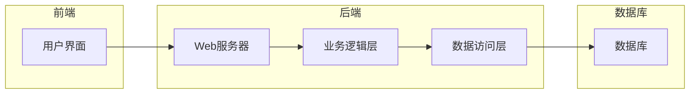

## 1. 背景介绍

### 1.1 电力管理系统的现状与挑战

随着社会经济的快速发展，电力需求不断增长，电力系统的规模和复杂性也日益增加。传统的电力管理系统面临着诸多挑战，例如：

* **数据采集和处理能力不足：** 传统的电力管理系统主要依赖人工抄表和统计，效率低下且容易出错。
* **信息孤岛现象严重：** 各个电力设备和子系统之间缺乏有效的信息交互，难以实现全局优化和协同控制。
* **缺乏智能化分析和决策支持：** 传统的电力管理系统主要依靠人工经验进行分析和决策，缺乏智能化手段的支持。

### 1.2 Web技术的优势与应用

Web技术具有开放性、跨平台性、易于集成等优势，为构建新一代电力管理系统提供了良好的技术基础。基于Web的电力管理系统可以实现：

* **实时数据采集和监控：** 通过部署传感器和智能仪表，实现对电力设备运行状态的实时监控。
* **信息共享和协同控制：** 通过Web平台，实现各个子系统之间的数据共享和协同控制。
* **智能化分析和决策支持：** 利用大数据分析、机器学习等技术，对电力数据进行深度挖掘和分析，为决策提供科学依据。

### 1.3 本文的意义和目的

本文旨在介绍基于Web的电力管理系统的详细设计和具体代码实现，为电力行业的数字化转型提供参考和借鉴。

## 2. 核心概念与联系

### 2.1 电力系统基本概念

* **发电：** 将其他形式的能源转换为电能的过程。
* **输电：** 将电能从发电厂输送到负荷中心的過程。
* **变电：** 改变电压等级的过程。
* **配电：** 将电能分配给最终用户的过程。
* **用电：** 最终用户使用电能的过程。

### 2.2 Web系统架构

* **前端：** 负责用户界面展示和交互逻辑。
* **后端：** 负责数据处理、业务逻辑和系统安全。
* **数据库：** 负责存储电力系统数据。

### 2.3 系统功能模块

* **数据采集模块：** 负责采集电力设备的运行数据。
* **数据处理模块：** 负责对采集到的数据进行清洗、转换和存储。
* **监控展示模块：** 负责将电力系统的运行状态以图形化方式展示给用户。
* **告警管理模块：** 负责监测电力系统的异常情况，并及时发出告警信息。
* **报表统计模块：** 负责生成各种电力报表，为决策提供数据支持。

## 3. 核心算法原理具体操作步骤

### 3.1 数据采集

* **传感器数据采集：** 通过部署各种传感器，实时采集电力设备的电压、电流、功率、温度等数据。
* **智能仪表数据采集：** 通过部署智能电表，采集用户的用电数据。
* **数据传输协议：** 采用标准的通信协议，例如Modbus、DNP3等，实现数据传输的可靠性和安全性。

### 3.2 数据处理

* **数据清洗：** 对采集到的数据进行去噪、校验和异常值处理。
* **数据转换：** 将不同格式的数据转换为统一的格式，方便后续处理和分析。
* **数据存储：** 将处理后的数据存储到数据库中，以便后续查询和分析。

### 3.3 监控展示

* **实时数据展示：** 通过图表、曲线等方式，实时展示电力设备的运行状态。
* **历史数据查询：** 提供历史数据查询功能，方便用户回顾和分析电力系统的运行情况。
* **地图展示：** 将电力设备的位置信息在地图上进行展示，方便用户直观地了解电力系统的地理分布。

### 3.4 告警管理

* **阈值设置：** 根据电力设备的运行特性，设置相应的告警阈值。
* **告警触发：** 当电力设备的运行参数超出阈值时，触发告警信息。
* **告警通知：** 通过短信、邮件等方式，将告警信息及时通知给相关人员。

## 4. 数学模型和公式详细讲解举例说明

### 4.1 电力负荷预测模型

电力负荷预测是指根据历史数据和相关因素，预测未来一段时间内的电力负荷。常用的电力负荷预测模型包括：

* **时间序列分析模型：** 利用历史负荷数据的时间序列特征，预测未来负荷。
* **回归分析模型：** 建立负荷与相关因素之间的回归关系，预测未来负荷。
* **神经网络模型：** 利用神经网络的学习能力，建立负荷预测模型。

### 4.2 电力系统潮流计算

电力系统潮流计算是指计算电力系统在稳态运行状态下的各节点电压、电流和功率。常用的潮流计算方法包括：

* **牛顿-拉夫逊法：** 一种迭代求解非线性方程组的方法。
* **快速解耦法：** 一种将潮流方程分解为有功功率和无功功率方程的方法。

## 5. 项目实践：代码实例和详细解释说明

### 5.1 系统架构图



### 5.2 代码示例

```python
# 数据采集模块
import serial

# 串口配置
port = "COM1"
baudrate = 9600

# 创建串口对象
ser = serial.Serial(port, baudrate)

# 读取数据
data = ser.readline()

# 关闭串口
ser.close()

# 数据处理模块
import pandas as pd

# 读取数据
df = pd.read_csv("data.csv")

# 数据清洗
df = df.dropna()

# 数据转换
df["timestamp"] = pd.to_datetime(df["timestamp"])

# 数据存储
df.to_csv("processed_data.csv", index=False)

# 监控展示模块
import matplotlib.pyplot as plt

# 读取数据
df = pd.read_csv("processed_data.csv")

# 绘制曲线图
plt.plot(df["timestamp"], df["voltage"])
plt.xlabel("时间")
plt.ylabel("电压")
plt.show()
```

## 6. 实际应用场景

### 6.1 电力公司

* **负荷预测：** 预测未来电力负荷，优化电力调度，提高电力供应的可靠性。
* **设备运维：** 实时监控电力设备运行状态，及时发现和处理故障，提高设备运行效率。
* **电力营销：** 分析用户用电数据，制定精准的营销策略，提高电力销售收入。

### 6.2 工厂企业

* **能源管理：** 监控企业内部的电力消耗，优化能源使用，降低生产成本。
* **设备监控：** 实时监控关键设备的运行状态，预防设备故障，保证生产安全。

## 7. 总结：未来发展趋势与挑战

### 7.1 未来发展趋势

* **智能化：** 利用人工智能技术，实现电力系统的智能化运维和管理。
* **数字化：** 推进电力系统数字化转型，实现数据驱动决策。
* **一体化：** 打破信息孤岛，实现电力系统各个环节的协同优化。

### 7.2 面临的挑战

* **数据安全：** 保障电力系统数据的安全性和可靠性。
* **技术标准：** 建立统一的技术标准，促进电力系统互联互通。
* **人才培养：** 加强电力系统数字化人才培养，满足行业发展需求。

## 8. 附录：常见问题与解答

### 8.1 如何选择合适的传感器？

选择传感器需要考虑以下因素：

* **测量参数：** 需要测量的参数类型，例如电压、电流、功率、温度等。
* **精度要求：** 测量精度要求，例如±0.1%、±1%等。
* **环境条件：** 传感器的工作环境，例如温度、湿度、振动等。

### 8.2 如何保证数据传输的安全性？

可以采用以下措施保证数据传输的安全性：

* **加密传输：** 对传输的数据进行加密，防止数据泄露。
* **身份认证：** 对数据发送和接收方进行身份认证，防止非法访问。
* **数据备份：** 定期备份数据，防止数据丢失。